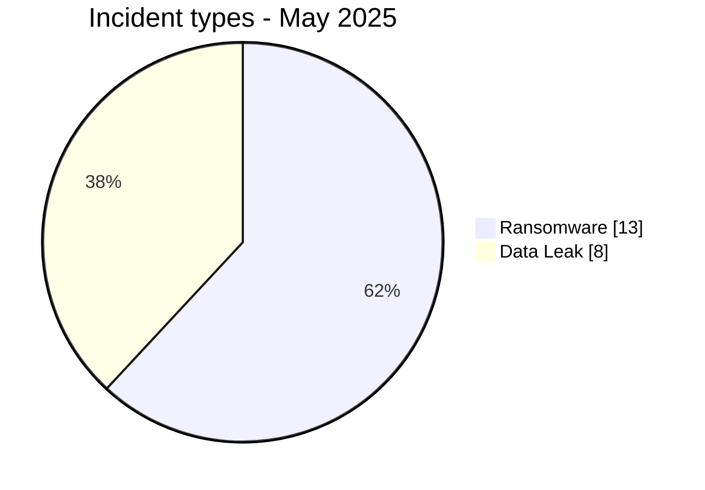
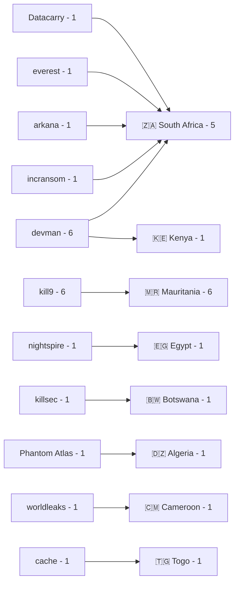
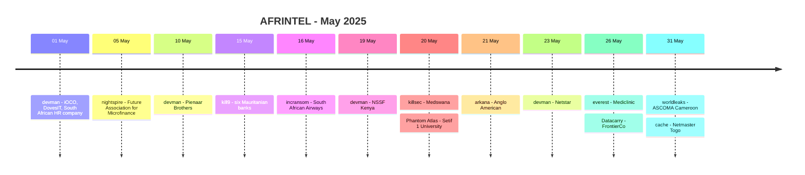

# CTI Report - Cyberattacks in Africa - May 2025

👉🏾 [**French version available here**](./README_FR.md)

## 1. Executive summary

May 2025 contains **21 documented incidents across 8 African countries**: **13 Ransomware** and **8 Data Leak**. No Access Sale, DDoS, Defacement or Operational Fraud is recorded.

- **South Africa**: 9 incidents, all classified as Ransomware.
- **Mauritania**: 6 Data Leak records attributed to kill9 in one coordinated publication targeting six banks.
- **devman** and **kill9**: 6 records each.
- **Finance / Banking**: 8 incidents, the leading sector.
- **Technology / IT**: 4 incidents.
- **NSSF Kenya**: 2.5 TB and $4.5 million are actor-claimed values and are not independently validated.
- **FrontierCo**: approximately 120,000 customer records in reviewed exports.
- **Netmaster Togo**: Data Fully Published, with a full WHMCS database and `.tg` EPP codes in the reviewed material.

### 📋 Victim list

👉🏾 [View the full victim list](./victims.md)

### 1.1 Month-over-month comparison

> Comparison based on validated AFRINTEL monthly corpora. A change in documented records does not, by itself, prove a change in the real number of compromises.

| Indicator | April 2025 | May 2025 | Observed change |
|---|---:|---:|---:|
| Total incidents | 17 | 21 | **+4 (+23.5%)** |
| Ransomware | 7 | 13 | **+6 (+85.7%)** |
| Data Leak | 9 | 8 | **-1 (-11.1%)** |
| Access Sale | 1 | 0 | **-1 (-100.0%)** |
| DDoS | 0 | 0 | **0 (stable)** |
| Defacement | 0 | 0 | **0 (stable)** |
| Operational Fraud | 0 | 0 | **0 (stable)** |

## 2. Methodology

- **Scope**: 54 African countries.
- **Period**: 1-31 May 2025.
- **Sources**: OSINT, leak sites, underground forums, actor publications and available samples.
- **Source of truth**: validated bilingual pair [`victims_FR.md`](./victims_FR.md) / [`victims.md`](./victims.md), with French editorial review before English synchronization.
- **Counting**: one card equals one unique incident.
- **Qualification**: claim, sample, full publication and technical confirmation remain distinct evidence levels.
- **GitHub visualization**: tables, text bars, simple Mermaid diagrams and timelines.

## 3. Global overview

### 3.1 Incident-type distribution

| Incident type | Count | Share |
|---|---:|---:|
| Ransomware | 13 | 61.9% |
| Data Leak | 8 | 38.1% |
| Access Sale | 0 | 0.0% |
| DDoS | 0 | 0.0% |
| Defacement | 0 | 0.0% |
| Operational Fraud | 0 | 0.0% |
| **Total** | **21** | **100%** |

**Color convention:** 🟧 Ransomware | 🟦 Data Leak | 🟪 Access Sale | 🟥 DDoS | 🟨 Defacement | 🟩 Operational Fraud.

### 3.2 Country distribution

| Country | Ransomware | Data Leak | Total | Distribution |
|---|---:|---:|---:|---|
| 🇿🇦 South Africa | 9 | 0 | 9 | 🟧🟧🟧🟧🟧🟧🟧🟧🟧 |
| 🇲🇷 Mauritania | 0 | 6 | 6 | 🟦🟦🟦🟦🟦🟦 |
| 🇪🇬 Egypt | 1 | 0 | 1 | 🟧 |
| 🇰🇪 Kenya | 1 | 0 | 1 | 🟧 |
| 🇧🇼 Botswana | 1 | 0 | 1 | 🟧 |
| 🇩🇿 Algeria | 0 | 1 | 1 | 🟦 |
| 🇨🇲 Cameroon | 1 | 0 | 1 | 🟧 |
| 🇹🇬 Togo | 0 | 1 | 1 | 🟦 |
| **Total** | **13** | **8** | **21** | |

### 3.3 Geographic distribution by region

| Region | Incidents | Share | Activity |
|---|---:|---:|---|
| North Africa | 8 | 38.1% | ████████ |
| Southern Africa | 10 | 47.6% | ██████████ |
| West Africa | 1 | 4.8% | █ |
| Central Africa | 1 | 4.8% | █ |
| East Africa | 1 | 4.8% | █ |
| **Total** | **21** | **100%** | |

### 3.4 Sector distribution

| Normalized sector | Incidents | Share | Activity |
|---|---:|---:|---|
| Finance / Banking | 8 | 38.1% | ██████████ |
| Technology / IT | 4 | 19.0% | █████ |
| Healthcare / Medical | 2 | 9.5% | ██ |
| Education / University | 1 | 4.8% | █ |
| Government / Administration | 1 | 4.8% | █ |
| Manufacturing / Industry | 1 | 4.8% | █ |
| Mining / Extractive | 1 | 4.8% | █ |
| Professional / HR Services | 1 | 4.8% | █ |
| Retail / Distribution | 1 | 4.8% | █ |
| Transport / Aviation | 1 | 4.8% | █ |
| **Total** | **21** | **100%** | |

### 3.5 Actors / groups

| Actor / Group | Incidents | Activity |
|---|---:|---|
| devman | 6 | ██████████ |
| kill9 | 6 | ██████████ |
| Datacarry | 1 | ██ |
| Phantom Atlas | 1 | ██ |
| arkana | 1 | ██ |
| cache | 1 | ██ |
| everest | 1 | ██ |
| incransom | 1 | ██ |
| killsec | 1 | ██ |
| nightspire | 1 | ██ |
| worldleaks | 1 | ██ |
| **Total** | **21** | |

### 3.6 Actor -> country mapping

## 4. Detailed analysis by incident type

### 4.1 Ransomware - 13 incidents

The 13 Ransomware records involve devman (6), followed by nightspire, incransom, killsec, arkana, everest, Datacarry and worldleaks with one record each.

The strongest technical evidence appears in Future Association for Microfinance, Pienaar Brothers, NSSF Kenya, South African Airways, FrontierCo and ASCOMA Cameroon. Depending on the case, the material documents write access, structured exports, lateral movement, ransom notes, archives prepared for exfiltration or internal network access.

### 4.2 Data Leak - 8 incidents

The eight Data Leak records concern the six Mauritanian banks attributed to kill9, Setif 1 University in Algeria and Netmaster in Togo.

For the kill9 campaign, BAMIS, Banque Mauritanienne pour le Commerce International, BCI and Orabank have bank-specific card samples. BIM Bank and GBM are named but do not have dedicated samples in the reviewed publication.

Netmaster is the month's most complete publication from an availability perspective: the reviewed export corresponds to a full WHMCS database and an associated file contains EPP codes for several hundred `.tg` domains.

## 5. Sectoral impact

**Finance / Banking** accounts for **8 of 21 incidents (38.1%)**. **Technology / IT** follows with 4 and **Healthcare / Medical** with 2.

All remaining normalized categories contain one record. Anglo American remains classified as **Mining / Extractive**, consistent with its victim card.

## 6. Threat actor profile

devman and kill9 each dominate with **6 records**, or **28.6%** of the corpus per actor. The other nine labels appear once.

devman concentrates five incidents in South Africa and one in Kenya. kill9 concentrates all six Mauritanian banking Data Leak records in one coordinated publication.

## 7. Key trends and intelligence gaps

### 7.1 Observed trends

1. **Monthly corpus increase**: 17 incidents in April versus 21 in May.
2. **Ransomware majority**: 13 of 21 records, versus 7 of 17 in April.
3. **Data Leak slightly lower**: 8 in May versus 9 in April.
4. **No Access Sale**: 1 in April, 0 in May.
5. **Geographic concentration**: South Africa and Mauritania account for 15 of 21 incidents.
6. **Actor concentration**: devman and kill9 account for 12 of 21 records.

### 7.2 Intelligence gaps

- Several ransomware claims lack detailed samples in the supplied cards.
- The overall volume of the kill9 campaign is not stated.
- The claimed 2.5 TB for NSSF Kenya is not independently measured.
- The Setif 1 University claim announces 3.5 GB without a sample.
- The complete scope of several compromises remains unknown despite strong local evidence.

### 7.3 Monthly evolution

| Type | April 2025 | May 2025 | Change |
|---|---:|---:|---:|
| Total | 17 | 21 | **+4 (+23.5%)** |
| Ransomware | 7 | 13 | **+6 (+85.7%)** |
| Data Leak | 9 | 8 | **-1 (-11.1%)** |
| Access Sale | 1 | 0 | **-1 (-100.0%)** |

## 8. Summary timeline

## 9. MITRE ATT&CK mapping - contextual

| Phase | Technique | Analytical scope |
|---|---|---|
| Lateral movement | T1021.002 - SMB/Windows Admin Shares | Relevant to FrontierCo, where SMB enumeration with administrator authentication is observed. |
| Remote access / Movement | T1021 - Remote Services | Defensive context for observed internal access without generalizing the initial vector. |
| Collection | T1005 - Data from Local System | Relevant to observed archives, exports and internal files. |
| Collection | T1213 - Data from Information Repositories | Relevant to database exports, loan systems, WHMCS and structured data. |
| Exfiltration | T1567.002 - Exfiltration to Cloud Storage | Relevant to Pienaar Brothers, where an archive is prepared for upload to cloud storage. |

## 10. Recommendations

- **Finance / Banking**: strengthen logging, MFA, bulk-export detection and payment-card data controls.
- **Technology / MSP**: segment client environments, protect service accounts and monitor backup tooling.
- **Healthcare / Insurance**: control file shares, sensitive data and internal network access.
- **Government / Social**: strengthen PAM, segmentation and production-server monitoring.
- **Registrars / Hosting**: protect EPP codes and require MFA for transfer operations.

## 11. SOC and tactical recommendations

### Observed

The corpus contains administrative access, structured exports, lateral movement, ransom notes, archives prepared for exfiltration and fully published data.

### Assumptions

Initial access remains unknown for several incidents. It should not automatically be attributed to phishing, a CVE or credential theft without case-specific evidence.

### Preventive

Monitor service accounts, administrative sessions, database exports, SMB commands, backup access, cloud transfers, large archive creation and abnormal application changes. Maintain MFA, PAM, EDR, segmentation, immutable backups and secret rotation.

## 12. Conclusion

May 2025 contains **21 incidents across 8 countries**, split into **13 Ransomware and 8 Data Leak**. The total rises by **23.5%** compared with April.

South Africa accounts for 9 incidents and Mauritania 6. devman and kill9 each dominate with 6 records. The month combines strong ransomware activity, several compromises supported by substantial technical evidence and a Mauritanian banking campaign based on one coordinated publication but counted across six distinct victims.

**AFRINTEL** - Open African CTI Monitoring Initiative
