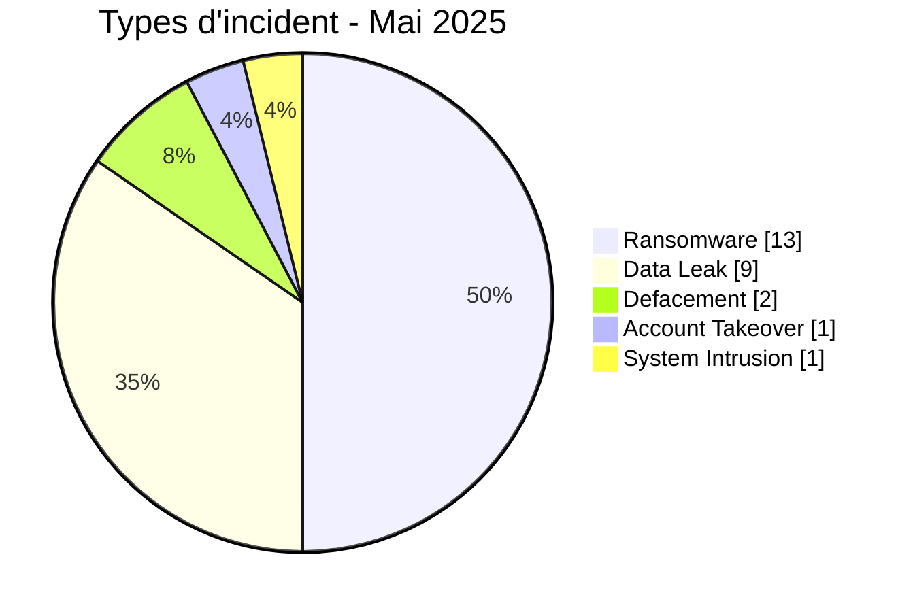

# Rapport CTI AFRINTEL - Cybermenaces en Afrique - Mai 2025

👉🏾 [English version](./README.md)

   

## 1. Synthèse exécutive

En Mai 2025, AFRINTEL documente **26 cyberincidents** affectant des organisations et services numériques dans **11 pays africains**.

Le paysage est dominé par **Ransomware avec 13 fiches (50,0 %)**, suivi de **Data Leak avec 9 (34,6 %)**. Les autres types observés sont Defacement 2, Account Takeover 1, System Intrusion 1.

La concentration géographique est marquée : **Afrique du Sud (11)**, **Mauritanie (6)**, **Égypte (1)** représentent ensemble **18 fiches, soit 69,2 % du mois**. Cette concentration doit être interprétée comme la visibilité du corpus AFRINTEL et non comme un taux national exhaustif de compromission.

Sur le plan sectoriel, les catégories les plus représentées sont **Finance / Banque (9)**, **Technologie / IT (5)**, **Gouvernement / Administration (2)**. Les labels d'acteurs les plus fréquents sont `devman` (6), `kill9` (6), `Unknown` (3). `Unknown`, lorsqu'il apparaît, désigne une absence d'attribution et non un groupe cybercriminel.

La maturité des preuves reste variable : **20 fiches** relèvent de claims non vérifiés ou accompagnés d'échantillons. AFRINTEL conserve une séparation stricte entre **faits observés, revendications, corroborations, confirmations officielles et inconnues techniques**.

Par rapport à Avril, le volume mensuel **augmente de 6 fiches**. Les variations les plus visibles concernent Ransomware 7->13 (+6), Defacement 0->2 (+2), Access Sale 2->0 (-2).

> **Note de lecture :** les chiffres AFRINTEL décrivent les incidents documentés et la visibilité des menaces observées. Ils ne constituent pas une mesure exhaustive de toutes les cyberattaques réellement survenues en Afrique.

### 1.1 Comparaison avec le mois précédent

| Indicateur | Avril 2025 | Mai 2025 | Évolution |
|---|---:|---:|---:|
| Total incidents | 20 | 26 | **+6 (+30,0 %)** |
| Ransomware | 7 | 13 | **+6 (+85,7 %)** |
| Data Leak | 10 | 9 | **-1 (-10,0 %)** |
| Access Sale | 2 | 0 | **-2 (-100,0 %)** |
| DDoS | 1 | 0 | **-1 (-100,0 %)** |
| Defacement | 0 | 2 | **+2 (nouveau)** |
| Account Takeover | 0 | 1 | **+1 (nouveau)** |
| System Intrusion | 0 | 1 | **+1 (nouveau)** |
| Malware | 0 | 0 | **Stable** |
| Operational Fraud | 0 | 0 | **Stable** |

## 2. Méthodologie

- **Périmètre :** 54 pays africains ; période de référence : Mai 2025.
- **Source de vérité :** couple validé `victims_FR.md` / `victims.md`.
- **Classification :** Ransomware, Data Leak, Access Sale, DDoS, Defacement, Account Takeover, System Intrusion, Malware et Operational Fraud.
- **Comptage :** une fiche canonique correspond à un cyberincident documenté ; les dossiers en investigation restent hors statistiques.
- **Chronologie :** `Date de l'incident` et `Date de publication initiale` sont séparées. Une publication ultérieure ne déplace pas artificiellement un incident vers un autre mois lorsque la chronologie est suffisamment établie.
- **Dates incertaines :** lorsqu'un jour exact n'est pas connu, le mois ou la fenêtre soutenue par les preuves est conservé.
- **Sources :** les liens publics sont conservés pour les incidents complémentaires identifiés par recherche OSINT/web ; ils ne sont pas imposés rétroactivement aux observations historiques ou Dark Web directes.
- **Preuve :** type d'incident, statut, confiance, impact et provenance restent des dimensions distinctes.
- **Secteurs :** normalisation calculée une seule fois à partir du corpus structuré, puis utilisée à l'identique en FR et EN.
- **Limite :** les fréquences reflètent la visibilité AFRINTEL et non l'ensemble des compromissions réelles sur le continent.

## 3. Vue d'ensemble et types d'incident

| Indicateur | Valeur |
|---|---:|
| Incidents documentés | **26** |
| Pays représentés | **11** |
| Régions représentées | **5** |
| Premier pays | **Afrique du Sud (11)** |
| Premier secteur | **Finance / Banque (9)** |
| Premier label acteur | **devman (6)** |

| Type d'incident | Fiches | Part |
|---|---:|---:|
| Ransomware | 13 | 50,0 % |
| Data Leak | 9 | 34,6 % |
| Access Sale | 0 | 0,0 % |
| DDoS | 0 | 0,0 % |
| Defacement | 2 | 7,7 % |
| Account Takeover | 1 | 3,8 % |
| System Intrusion | 1 | 3,8 % |
| Malware | 0 | 0,0 % |
| Operational Fraud | 0 | 0,0 % |
| **Total** | **26** | **100 %** |

## 4. Répartition géographique

| Pays | Total | Ransomware | Data Leak | Access Sale | DDoS | Defacement | Account Takeover | System Intrusion | Malware |
|---|---:|---:|---:|---:|---:|---:|---:|---:|---:|
| Afrique du Sud | **11** | 9 | 1 | 0 | 0 | 1 | 0 | 0 | 0 |
| Mauritanie | **6** | 0 | 6 | 0 | 0 | 0 | 0 | 0 | 0 |
| Égypte | **1** | 1 | 0 | 0 | 0 | 0 | 0 | 0 | 0 |
| Kenya | **1** | 1 | 0 | 0 | 0 | 0 | 0 | 0 | 0 |
| Côte d'Ivoire | **1** | 0 | 0 | 0 | 0 | 1 | 0 | 0 | 0 |
| Botswana | **1** | 1 | 0 | 0 | 0 | 0 | 0 | 0 | 0 |
| Algérie | **1** | 0 | 1 | 0 | 0 | 0 | 0 | 0 | 0 |
| Tanzanie | **1** | 0 | 0 | 0 | 0 | 0 | 1 | 0 | 0 |
| Cameroun | **1** | 1 | 0 | 0 | 0 | 0 | 0 | 0 | 0 |
| Togo | **1** | 0 | 1 | 0 | 0 | 0 | 0 | 0 | 0 |
| Nigeria | **1** | 0 | 0 | 0 | 0 | 0 | 0 | 1 | 0 |
| **Total** | **26** | **13** | **9** | **0** | **0** | **2** | **1** | **1** | **0** |

> `Operational Fraud = 0` ce mois-ci ; la colonne est omise pour préserver la lisibilité.

## 5. Répartition régionale

| Région | Fiches | Part |
|---|---:|---:|
| Afrique australe | 12 | 46,2 % |
| Afrique de l'Ouest | 9 | 34,6 % |
| Afrique du Nord | 2 | 7,7 % |
| Afrique de l'Est | 2 | 7,7 % |
| Afrique centrale | 1 | 3,8 % |
| **Total** | **26** | **100 %** |

La région la plus représentée est **Afrique australe avec 12 fiches (46,2 %)**.

## 6. Impact sectoriel

| Secteur | Fiches | Part | Activité |
|---|---:|---:|---|
| Finance / Banque | 9 | 34,6 % | █████████ |
| Technologie / IT | 5 | 19,2 % | █████ |
| Gouvernement / Administration | 2 | 7,7 % | ██ |
| Santé / Médical | 2 | 7,7 % | ██ |
| Mines | 2 | 7,7 % | ██ |
| Services professionnels / Business | 1 | 3,8 % | █ |
| Industrie / Fabrication | 1 | 3,8 % | █ |
| Transport / Logistique | 1 | 3,8 % | █ |
| Non précisé | 1 | 3,8 % | █ |
| Éducation / Université | 1 | 3,8 % | █ |
| Commerce / E-commerce | 1 | 3,8 % | █ |
| **Total** | **26** | **100 %** | |

## 7. Acteurs / groupes

`Unknown` correspond à une absence d'attribution, pas à un acteur.

| Acteur / Groupe | Fiches | Activité |
|---|---:|---|
| devman | 6 | ██████ |
| kill9 | 6 | ██████ |
| Unknown | 3 | ███ |
| nightspire | 1 | █ |
| incransom | 1 | █ |
| Team 1722 (claim) | 1 | █ |
| killsec | 1 | █ |
| Phantom Atlas | 1 | █ |
| arkana | 1 | █ |
| everest | 1 | █ |
| Datacarry | 1 | █ |
| worldleaks | 1 | █ |
| cache | 1 | █ |
| Criminal syndicate - identities not attributed | 1 | █ |

## 8. Maturité des preuves

| Maturité de preuve | Fiches | Part |
|---|---:|---:|
| Claim - Unverified | 8 | 30,8 % |
| Claim - Data Sample Published | 12 | 46,2 % |
| Data Fully Published | 1 | 3,8 % |
| Confirmation victime / gouvernement / autorité | 2 | 7,7 % |
| Corroboré / preuve secondaire | 2 | 7,7 % |
| Tentative | 1 | 3,8 % |
| **Total** | **26** | **100 %** |

Les statuts de preuve décrivent le niveau de validation disponible ; ils ne changent pas le type technique de l'incident.

## 9. Chronologie

```mermaid
timeline
    title AFRINTEL - Mai 2025
    01 Mai 2025 : South African IT firm - iOCO (Filiale de EOH)
    01 Mai 2025 : DovesIT
    01 Mai 2025 : South African Hr company
    05 Mai 2025 : Future Association for Microfinance
    10 Mai 2025 : Pienaar Brothers
    15 Mai 2025 : Banque Al-Wava Mauritanienne Islamique (BAMIS)
    15 Mai 2025 : Banque Mauritanienne pour le Commerce International
    15 Mai 2025 : Banque pour le Commerce et l'Industrie (BCI)
    15 Mai 2025 : Orabank Mauritanie-SA
    15 Mai 2025 : Banque Islamique de Mauritanie (BIM Bank)
    15 Mai 2025 : General Bank of Mauritania (GBM)
    16 Mai 2025 : south african airways (SAA)
    17 Mai 2025 : vOffice.co.za
    19 Mai 2025 : NSSF(National Social Security Fund) KENYA
    19 Mai 2025 : igp.ci
    20 Mai 2025 : Medswana
    20 Mai 2025 : Université Sétif 1 - Ferhat Abbas (univ-setif.dz)
    20 Mai 2025 : Tanzania Police Force / Tanzania Revenue Authority official social-media accounts
    21 Mai 2025 : Anglo American plc
    23 Mai 2025 : netstar
    26 Mai 2025 : Mediclinic Group
    26 Mai 2025 : FrontierCo
    27 Mai 2025 : Eastern Platinum Limited (Eastplats)
    31 Mai 2025 : ASCOMA Cameroon
    31 Mai 2025 : Netmaster (netmaster.tg)
    Mai 2025 - date exacte de la tentative non communiquée publiquement : PremiumTrust Bank
```

## 10. Analyse CTI mensuelle

### Ransomware

**13 fiches** sont classées Ransomware. Principaux pays : Afrique du Sud (9), Égypte (1), Kenya (1). Une publication sur un leak site ne prouve pas, à elle seule, le chiffrement ou l'exfiltration complète.

### Data Leak

**9 fiches** sont classées Data Leak. Principaux pays : Mauritanie (6), Algérie (1), Afrique du Sud (1). AFRINTEL distingue les données effectivement observées des volumes globaux revendiqués.

### Defacement

**2 Defacement** sont documentés. Répartition : Afrique du Sud (1), Côte d'Ivoire (1). Un défacement n'est pas reclassé en fuite de données sans preuve distincte.

### Account Takeover

**1 Account Takeover** sont documentés. Répartition : Tanzanie (1). Cette catégorie conserve séparément les compromissions de comptes institutionnels.

### System Intrusion

**1 System Intrusion** sont documentées. Répartition : Nigeria (1). Ce type est utilisé lorsqu'un accès ou une tentative d'accès système est établi sans preuve suffisante pour une catégorie plus spécifique.

## 11. Incidents notables

| Pays | Organisation | Type | Statut | Impact | Confiance |
|---|---|---|---|---|---|
| Égypte | Future Association for Microfinance | Ransomware | Claim - Data Sample Published | Level 4 | Very High |
| Kenya | NSSF(National Social Security Fund) KENYA | Ransomware | Claim - Data Sample Published | Level 4 | Very High |
| Afrique du Sud | FrontierCo | Ransomware | Claim - Data Sample Published | Level 4 | Very High |
| Tanzanie | Tanzania Police Force / Tanzania Revenue Authority official social-media accounts | Account Takeover | Government / Institution Confirmed | Level 3 | Very High |
| Afrique du Sud | Eastern Platinum Limited (Eastplats) | Data Leak | Victim Confirmed | Level 3 | Very High |

> Ce tableau met en avant jusqu'à cinq fiches selon le niveau d'impact, la confirmation et la confiance structurés. Il ne constitue pas un classement absolu de gravité.

## 12. Principaux enseignements et lacunes de renseignement

- **Concentration géographique :** Afrique du Sud représente 11 fiches (42,3 %), devant Mauritanie (6) et Égypte (1).
- **Structure de menace :** Ransomware est le premier type avec 13 fiches, suivi de Data Leak (9).
- **Secteurs :** Finance / Banque (9) et Technologie / IT (5) concentrent la plus forte visibilité.
- **Acteurs :** les labels les plus fréquents sont devman (6), kill9 (6) et Unknown (3).
- **Preuve :** 20 fiches reposent sur des claims non vérifiés ou accompagnés d'un échantillon ; ces statuts ne valent pas confirmation technique complète.

### Intelligence gaps

- vecteur d'accès initial souvent non public ;
- date technique exacte de compromission parfois inconnue ;
- volumes revendiqués rarement vérifiables intégralement ;
- attribution technique souvent limitée au pseudonyme ou label de publication ;
- informations publiques sur remédiation, cause racine et conclusions DFIR encore limitées.

Ces lacunes doivent guider la collecte sans être remplacées par des hypothèses.

## 13. Recommandations

### Organisations

- imposer MFA résistante au phishing sur les comptes privilégiés, VPN, messagerie, réseaux sociaux et consoles d'administration ;
- appliquer PAM, moindre privilège, segmentation et rotation des secrets ;
- maintenir des sauvegardes immuables et tester la restauration ;
- renforcer les applications publiques, API et interfaces administratives ;
- formaliser réponse à incident et notification des violations de données.

### SOC et détection

- surveiller les authentifications anormales, changements MFA, créations de comptes privilégiés et élévations de rôles ;
- détecter lectures massives de bases, exports inhabituels, créations d'archives et transferts sortants volumineux ;
- corréler EDR, IAM, VPN, WAF, proxy, DNS, cloud et journaux applicatifs ;
- distinguer DDoS, intrusion interne, compromission de compte et fuite de données pour éviter les conclusions non étayées.

### CTI

- conserver séparément date d'incident, publication initiale, première observation, échantillon, divulgation et confirmation ;
- suivre republications et reventes sans les compter automatiquement comme nouvelles compromissions ;
- maintenir la hiérarchie de preuve entre claim, corroboration et confirmation ;
- valider la parité FR/EN avant toute génération de statistiques.

## 14. Conclusion

Le mois de **Mai 2025** compte **26 cyberincidents documentés** dans **11 pays africains**. La lecture mensuelle montre que la valeur CTI ne réside pas seulement dans le volume, mais dans la distinction entre **type d'incident, chronologie, niveau de preuve, géographie, secteur et acteur**.

Le rapport conserve ainsi une photographie structurée de la menace observable tout en maintenant les revendications, corroborations, confirmations et inconnues à leur niveau de preuve réel.

👉🏾 [Voir les victimes du mois](./victims_FR.md)

**AFRINTEL** - TLP:CLEAR
