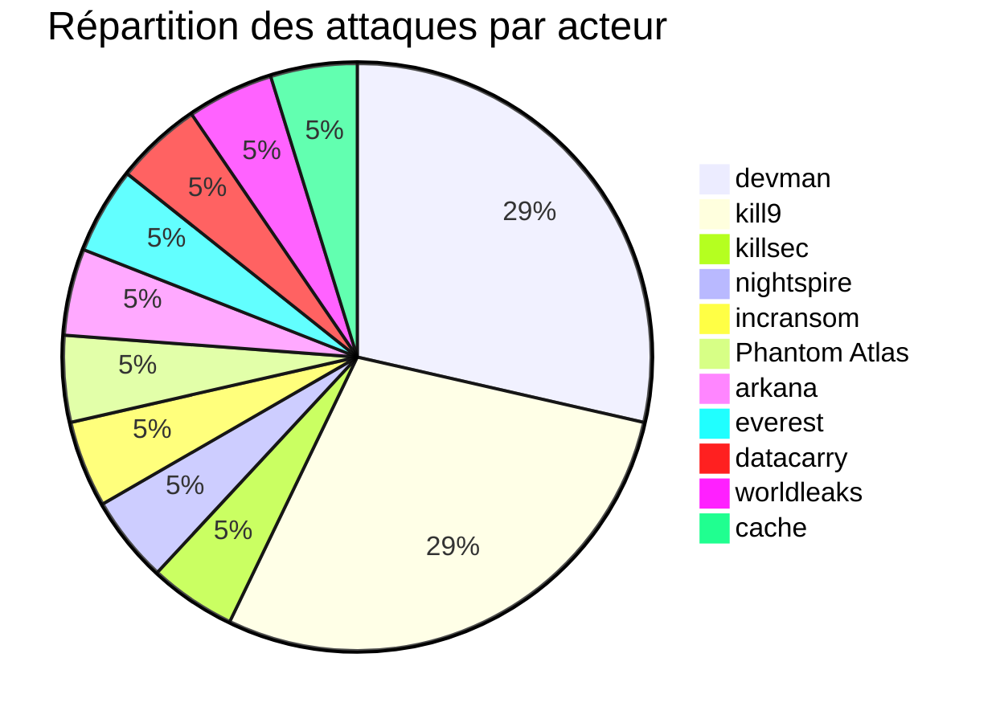
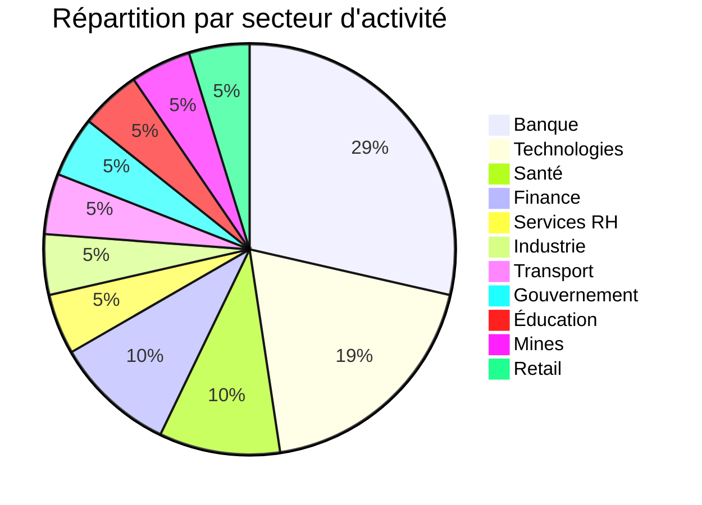
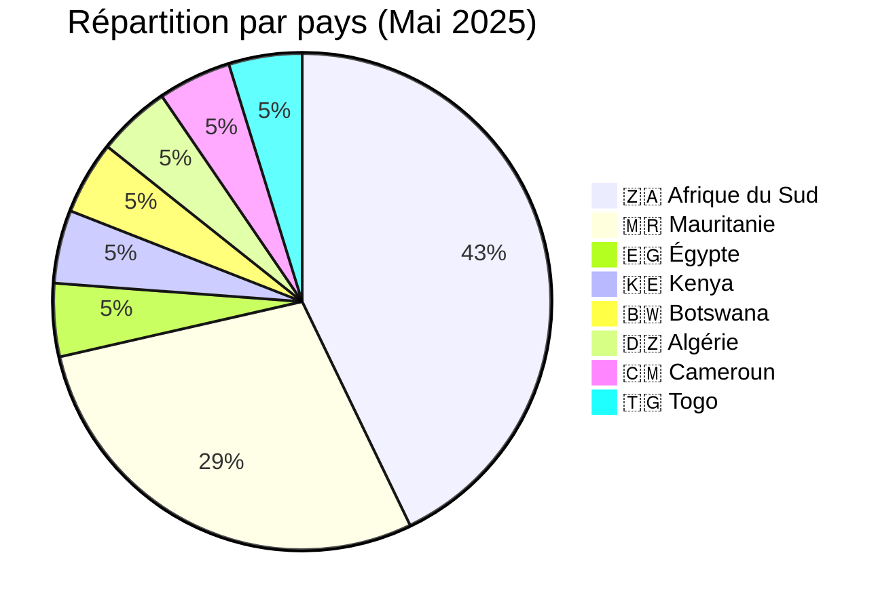
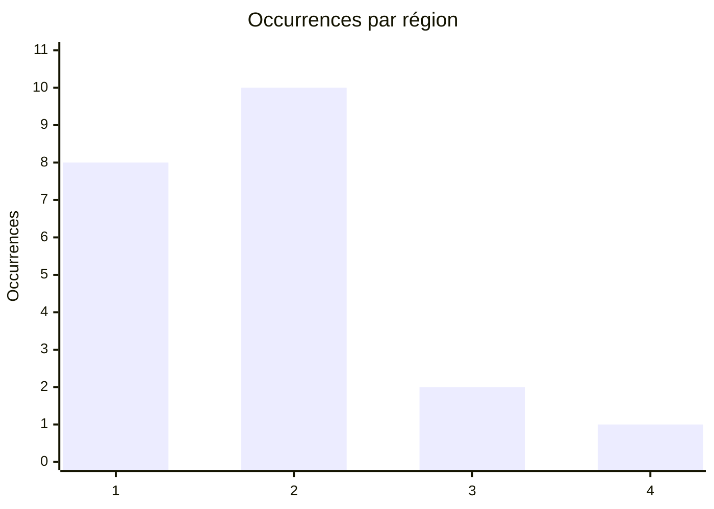
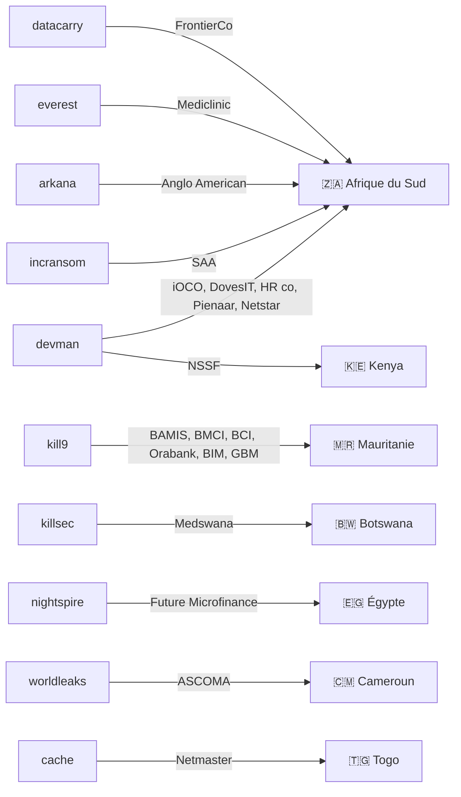

[](https://github.com/Hatchepsoute/AFRINTEL)


# Rapport CTI : Cyberattaques en Afrique - Mai 2025
👉🏾 [**English version available here**](./README.md)
## 1. Introduction
Ce rapport de Cyber Threat Intelligence (CTI) présente une analyse détaillée des cyberattaques survenues en Afrique durant le mois de mai 2025. Les informations sont issues de sources OSINT et de sites de fuites de groupes ransomware, compilées dans le cadre du projet AFRINTEL. L'objectif est de fournir une vision claire des tendances, des acteurs menaçants, des secteurs ciblés et des indicateurs de compromission associés.

## 2. Résumé exécutif
- **Nombre total d'attaques recensées** : 21
- **Acteurs les plus actifs** : devman (6 attaques), kill9 (6), killsec (1), nightspire (1), incransom (1), Phantom Atlas (1), arkana (1), everest (1), datacarry (1), worldleaks (1), cache (1).
- **Secteurs les plus ciblés** : Banque / Services financiers (6), Technologies (4), Santé (2), Finance / Assurance (2), Services aux entreprises (1), Industrie (1), Transport (1), Gouvernement (1), Éducation (1), Mines (1), Retail (1).
- **Pays les plus touchés** : Afrique du Sud (9), Mauritanie (6), Égypte (1), Kenya (1), Botswana (1), Algérie (1), Cameroun (1), Togo (1).
- **Volume de données exfiltrées** : 2,5 To pour NSSF Kenya, 1 Go pour Netmaster Togo. La revendication bancaire mauritanienne (kill9) a publié des échantillons clients et de cartes bancaires sans volume total précisé ; les autres volumes ne sont pas précisés.

## 3. Statistiques clés

### 3.1 Répartition par acteur malveillant
| Acteur | Nombre d'attaques |
|-------------------|-------------------|
| devman            | 6                 |
| kill9             | 6                 |
| killsec           | 1                 |
| nightspire        | 1                 |
| incransom         | 1                 |
| Phantom Atlas     | 1                 |
| arkana            | 1                 |
| everest           | 1                 |
| datacarry         | 1                 |
| worldleaks        | 1                 |
| cache             | 1                 |
| **Total**         | **21**            |



### 3.2 Répartition par secteur d'activité
| Secteur | Nombre d'attaques |
|---------|-------------------|
| Banque / Services financiers | 6 |
| Technologies | 4 |
| Santé / Pharmacie | 2 |
| Finance / Assurance | 2 |
| Services aux entreprises (RH) | 1 |
| Industrie (EPI) | 1 |
| Transport aérien | 1 |
| Gouvernement / Social | 1 |
| Éducation | 1 |
| Mines | 1 |
| Retail / Distribution | 1 |
| **Total** | **21** |



### 3.3 Répartition par pays
| Pays | Nombre d'attaques |
|------|-------------------|
| 🇿🇦 Afrique du Sud | 9 |
| 🇲🇷 Mauritanie | 6 |
| 🇪🇬 Égypte | 1 |
| 🇰🇪 Kenya | 1 |
| 🇧🇼 Botswana | 1 |
| 🇩🇿 Algérie | 1 |
| 🇨🇲 Cameroun | 1 |
| 🇹🇬 Togo | 1 |
| **Total** | **21** |



<!-- AFRINTEL_CURRENT_MODEL_START -->
### 3.4 Vue globale standardisée

| Pays | Ransomware | Fuites / accès | Total | Distribution |
| :--- | ---: | ---: | ---: | :--- |
| 🇿🇦 Afrique du Sud | 9 | 0 | 9 | 🟧🟧🟧🟧🟧🟧🟧🟧🟧 |
| 🇲🇷 Mauritanie | 0 | 6 | 6 |  🟦🟦🟦🟦🟦🟦 |
| 🇩🇿 Algérie | 0 | 1 | 1 |  🟦 |
| 🇧🇼 Botswana | 1 | 0 | 1 | 🟧 |
| 🇨🇲 Cameroun | 1 | 0 | 1 | 🟧 |
| 🇪🇬 Égypte | 1 | 0 | 1 | 🟧 |
| 🇰🇪 Kenya | 1 | 0 | 1 | 🟧 |
| 🇹🇬 Togo | 0 | 1 | 1 |  🟦 |

```pie showData
    title Types d’incidents
    "Ransomware" : 13
    "Fuites et accès" : 8
```

### Répartition géographique par région

| Région | Occurrences | Ransomware | Fuites / accès | Distribution |
| :--- | ---: | ---: | ---: | :--- |
| Afrique du Nord | 8 | 1 | 7 | 🟧 🟦🟦🟦🟦🟦🟦🟦 |
| Afrique australe | 10 | 10 | 0 | 🟧🟧🟧🟧🟧🟧🟧🟧🟧🟧 |
| Afrique de l’Ouest et centrale | 2 | 1 | 1 | 🟧 🟦 |
| Afrique de l’Est | 1 | 1 | 0 | 🟧 |


Légende : 1 = Afrique du Nord; 2 = Afrique australe; 3 = Afrique de l’Ouest et centrale; 4 = Afrique de l’Est

### Répartition sectorielle

| Secteur | Fiches | Part | Activité |
| :--- | ---: | ---: | :--- |
| Finance / banque | 8 | 38,1% | ██████████ |
| Technologies / informatique | 4 | 19,0% | █████ |
| Santé / médical | 2 | 9,5% | ██ |
| Éducation / universités | 1 | 4,8% | █ |
| Énergie / services publics | 1 | 4,8% | █ |
| Gouvernement / administration | 1 | 4,8% | █ |
| Industrie / fabrication | 1 | 4,8% | █ |
| Services professionnels | 1 | 4,8% | █ |
| Commerce / e-commerce | 1 | 4,8% | █ |
| Transport / logistique | 1 | 4,8% | █ |

### Acteurs / groupes les plus présents

| Acteur / Groupe | Fiches | Activité |
| :--- | ---: | :--- |
| devman | 6 | ██████████ |
| kill9 | 6 | ██████████ |
| Datacarry | 1 | ██ |
| Phantom Atlas | 1 | ██ |
| arkana | 1 | ██ |
| cache | 1 | ██ |
| everest | 1 | ██ |
| incransom | 1 | ██ |
| killsec | 1 | ██ |
| nightspire | 1 | ██ |
<!-- AFRINTEL_CURRENT_MODEL_END -->
## 4. Détail des attaques par acteur malveillant
### 4.1 devman (6 attaques)
- **01/05/2025** : iOCO (Afrique du Sud, technologies)
- **01/05/2025** : DovesIT (Afrique du Sud, technologies)
- **01/05/2025** : South African HR company (Afrique du Sud, services RH)
- **10/05/2025** : Pienaar Brothers (Afrique du Sud, industrie EPI)
- **19/05/2025** : NSSF Kenya (Kenya, gouvernement) – 2,5 To exfiltrés, rançon 4,5 M$
- **23/05/2025** : Netstar (Afrique du Sud, technologies)

*Remarque* : devman a concentré ses attaques sur l'Afrique du Sud (5) et le Kenya (1), avec une diversification sectorielle (technologies, RH, industrie, gouvernement). L'attaque contre la NSSF kenyane est la plus volumineuse du mois.

### 4.2 kill9 (6 attaques)
- **15/05/2025** : Banque Al-Wava Mauritanienne Islamique - BAMIS (Mauritanie, banque) – échantillon de carte publié
- **15/05/2025** : Banque Mauritanienne pour le Commerce International (Mauritanie, banque) – échantillon de carte publié
- **15/05/2025** : Banque pour le Commerce et l'Industrie - BCI (Mauritanie, banque) – échantillon de carte publié
- **15/05/2025** : Orabank Mauritanie-SA (Mauritanie, banque) – échantillon de carte publié
- **15/05/2025** : Banque Islamique de Mauritanie - BIM Bank (Mauritanie, banque) – citée dans la revendication, aucun échantillon dédié
- **15/05/2025** : General Bank of Mauritania - GBM (Mauritanie, banque) – citée dans la revendication, aucun échantillon dédié

*Remarque* : kill9 a publié un unique post DarkForums revendiquant une intrusion coordonnée dans six banques mauritaniennes, avec une fenêtre de vente de 48 heures annoncée pour l'ensemble des données via Telegram. Quatre des six établissements (BAMIS, Banque Mauritanienne pour le Commerce International, BCI, Orabank) sont associés à des échantillons de cartes bancaires spécifiquement attribués dans le post ; les deux restants (BIM Bank, GBM) ne sont cités que dans la liste des cibles de l'acteur sans échantillon dédié, et sont donc enregistrés avec un niveau de confiance plus faible. Le post montrait également un échantillon de carte attribué à un septième établissement non listé (Banque El Amana), qu'AFRINTEL ne peut pas rattacher au périmètre annoncé de six banques.

### 4.3 killsec (1 attaque)
- **20/05/2025** : Medswana (Botswana, pharmacie/santé)

### 4.4 nightspire (1 attaque)
- **05/05/2025** : Future Association for Microfinance (Égypte, finance)

### 4.5 incransom (1 attaque)
- **16/05/2025** : South African Airways (Afrique du Sud, transport aérien)

### 4.6 arkana (1 attaque)
- **21/05/2025** : Anglo American plc (Afrique du Sud, mines)

### 4.7 everest (1 attaque)
- **26/05/2025** : Mediclinic Group (Afrique du Sud, santé)

### 4.8 datacarry (1 attaque)
- **26/05/2025** : FrontierCo (Afrique du Sud, retail/distribution)

### 4.9 worldleaks (1 attaque)
- **31/05/2025** : ASCOMA Cameroon (Cameroun, assurance)

### 4.10 cache (1 attaque)
- **31/05/2025** : Netmaster (Togo, technologies/hébergement) – 1 Go exfiltré (fuite de données)
### 4.11 Graphe acteur → victime → pays

## 5. Analyse sectorielle
- **Banque / Services financiers** : 6 attaques, toutes revendiquées par kill9 contre des banques mauritaniennes (BAMIS, Banque Mauritanienne pour le Commerce International, BCI, Orabank Mauritanie-SA, BIM Bank, GBM) dans un unique post coordonné. Des échantillons de cartes spécifiquement attribués soutiennent quatre des six revendications avec un niveau de confiance moyen ; les deux autres restent non vérifiées.
- **Technologies** : 4 attaques (iOCO, DovesIT, Netstar, Netmaster). devman domine, avec une fuite de données touchant un registrar togolais revendiquée par le cybercriminel cache.
- **Santé / Pharmacie** : 2 attaques (Medswana, Mediclinic). killsec et everest ciblent des acteurs de la santé au Botswana et en Afrique du Sud.
- **Finance / Assurance** : 2 attaques (Future Microfinance, ASCOMA). nightspire et worldleaks visent une ONG égyptienne et un courtier camerounais.
- **Services aux entreprises (RH)** : 1 attaque (South African HR company) par devman, montrant l'intérêt pour les données personnelles.
- **Industrie (EPI)** : 1 attaque (Pienaar Brothers) par devman, dans le secteur minier.
- **Transport aérien** : 1 attaque (SAA) par incransom, touchant la compagnie nationale sud-africaine.
- **Gouvernement / Social** : 1 attaque (NSSF Kenya) par devman, avec exfiltration massive.
- **Mines** : 1 attaque (Anglo American) par arkana, visant un géant minier.
- **Retail / Distribution** : 1 attaque (FrontierCo) par datacarry.

## 6. Analyse géographique
- **Afrique du Sud** : 9 attaques, dont 6 de devman. Tous les secteurs sont représentés, avec une forte concentration sur les technologies et les infrastructures critiques.
- **Mauritanie** : 6 attaques, toutes revendiquées par kill9 dans un unique post ciblant le secteur bancaire du pays ; la deuxième campagne mono-acteur/mono-pays la plus importante du mois après celle de devman en Afrique du Sud.
- **Égypte** : 1 attaque (microfinance) par nightspire.
- **Kenya** : 1 attaque majeure (NSSF) par devman, avec 2,5 To de données exfiltrées.
- **Botswana** : 1 attaque (pharmacie) par killsec.
- **Cameroun** : 1 attaque (assurance) par worldleaks.
- **Togo** : 1 attaque (hébergement web) revendiquée par le cybercriminel cache.

L'Afrique du Sud reste le pays le plus touché en volume, confirmant sa position de hub économique régional et de cible privilégiée, mais le secteur bancaire mauritanien a fait l'objet de la deuxième campagne revendiquée du mois.

## 7. TTPs observées
- **Exfiltration massive** : NSSF Kenya (2,5 To) et Netmaster (1 Go) illustrent la collecte de grands volumes de données.
- **Ciblage coordonné multi-établissements** : kill9 a revendiqué six banques mauritaniennes en un seul post, avec des échantillons de cartes bancaires étayant quatre des six revendications.
- **Ciblage d'infrastructures critiques** : transport aérien (SAA), mines (Anglo American), santé (Mediclinic), gouvernement (NSSF), secteur bancaire (Mauritanie).
- **Domination de deux acteurs** : devman et kill9 sont chacun responsables de 6 des 20 incidents recensés (30 % chacun), traduisant deux campagnes actives en parallèle.
- **Diversité des victimes** : grands groupes (Anglo, SAA, Mediclinic) et PME (DovesIT, Pienaar) sont également visés.
- **Double extorsion / modèle de vente** : revendications avec échantillons de données publiés, dont un compte à rebours de vente de 48 heures dans le cas mauritanien.

## 8. Recommandations
- **Afrique du Sud** : renforcer la cybersécurité dans tous les secteurs, en particulier les technologies et les infrastructures critiques.
- **Secteur bancaire mauritanien** : les établissements cités doivent revoir en urgence la segmentation de leurs réseaux, faire tourner les identifiants exposés et surveiller les transactions frauduleuses sur les plages BIN mentionnées dans la revendication.
- **Secteur public** : les organismes comme la NSSF doivent mettre en place des sauvegardes hors ligne et une segmentation réseau.
- **Entreprises de technologies** : les MSP (iOCO, DovesIT, Netstar) sont des cibles privilégiées ; elles doivent sécuriser leurs accès et surveiller les activités anormales.
- **Secteur minier** : Anglo American doit protéger ses données sensibles et ses systèmes industriels.
- **Tous secteurs** : former les employés à la détection des phishing, authentification multi-facteurs, et audits réguliers.

## 9. Conclusion
Mai 2025 a été marqué par deux campagnes parallèles d'ampleur comparable : l'activité soutenue de devman contre l'Afrique du Sud et le Kenya, avec une attaque massive sur la NSSF (2,5 To), et la revendication coordonnée de kill9 contre six banques mauritaniennes, publiée comme une offre de vente avec un compte à rebours de 48 heures. La diversité sectorielle (technologies, santé, mines, transport, banque) montre que les attaquants ciblent aussi bien les infrastructures critiques que les entreprises de services. L'Afrique du Sud reste le pays le plus touché en volume, mais la revendication bancaire mauritanienne illustre un glissement vers un ciblage coordonné à l'échelle d'un secteur entier. La coopération régionale et le partage d'information sont plus que jamais nécessaires.

## ✍🏿 Auteur
*Adama ASSIONGBON*  
*Consultant SOC & Cyber Threat Intelligence*  
[LinkedIn Profile](https://www.linkedin.com/in/adama-assiongbon-9029893a/)

---
*AFRINTEL - Initiative ouverte de veille CTI sur l’Afrique*
