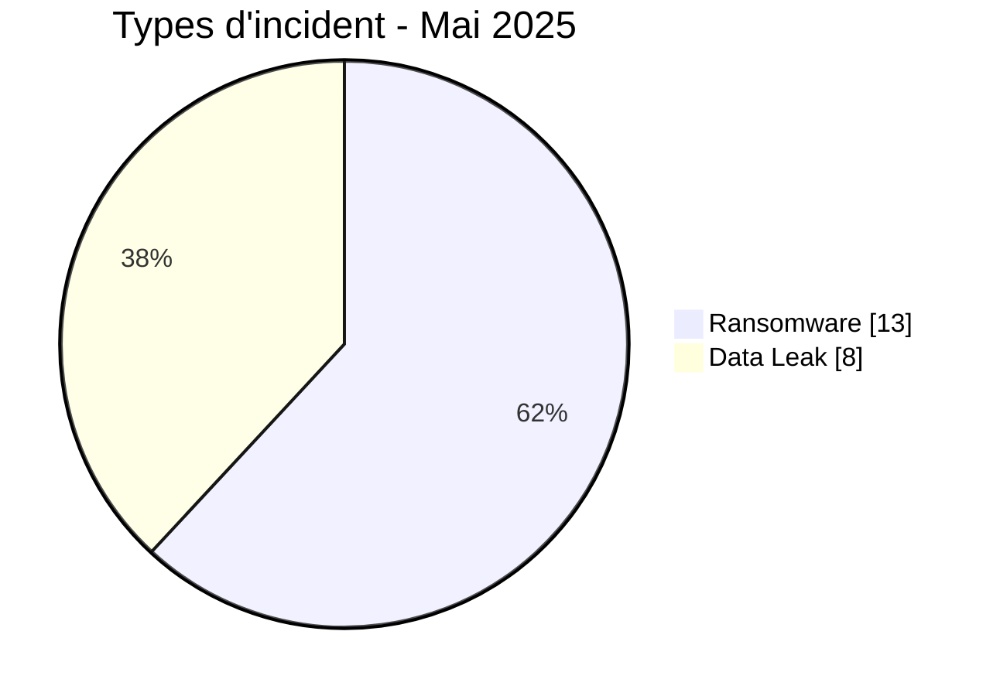
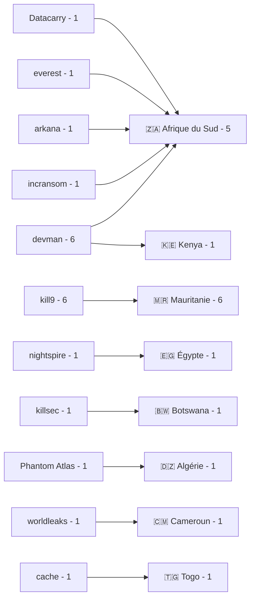
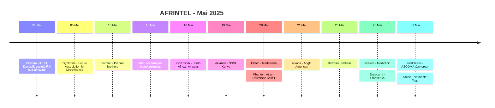

# Rapport CTI - Cyberattaques en Afrique - Mai 2025

👉🏾 [**English version available here**](./README.md)

## 1. Synthèse exécutive

Mai 2025 compte **21 incidents documentés dans 8 pays africains** : **13 Ransomware** et **8 Data Leak**. Aucun Access Sale, DDoS, Defacement ou Operational Fraud n'est enregistré.

- **Afrique du Sud** : 9 incidents, tous classés Ransomware.
- **Mauritanie** : 6 Data Leak attribués à kill9 dans une publication coordonnée visant six banques.
- **devman** et **kill9** : 6 fiches chacun.
- **Finance / Banque** : 8 incidents, premier secteur du mois.
- **Technologie / IT** : 4 incidents.
- **NSSF Kenya** : 2,5 To et 4,5 millions USD sont revendiqués par l'acteur, sans validation indépendante du volume ou du montant.
- **FrontierCo** : environ 120 000 fiches clients dans les exports examinés.
- **Netmaster Togo** : statut Data Fully Published, avec une base WHMCS complète et des codes EPP de domaines `.tg` dans le matériel examiné.

### 📋 Liste des victimes

👉🏾 [Voir la liste complète des victimes](./victims_FR.md)

### 1.1 Comparaison avec le mois précédent

> Comparaison fondée sur les corpus mensuels AFRINTEL validés. Une variation du nombre de fiches documentées ne prouve pas, à elle seule, une variation du nombre réel de compromissions.

| Indicateur | Avril 2025 | Mai 2025 | Évolution observée |
|---|---:|---:|---:|
| Total incidents | 17 | 21 | **+4 (+23,5 %)** |
| Ransomware | 7 | 13 | **+6 (+85,7 %)** |
| Data Leak | 9 | 8 | **-1 (-11,1 %)** |
| Access Sale | 1 | 0 | **-1 (-100,0 %)** |
| DDoS | 0 | 0 | **0 (stable)** |
| Defacement | 0 | 0 | **0 (stable)** |
| Operational Fraud | 0 | 0 | **0 (stable)** |

## 2. Méthodologie

- **Périmètre** : 54 pays africains.
- **Période** : 1er au 31 mai 2025.
- **Sources** : OSINT, leak sites, forums underground, publications d'acteurs et échantillons disponibles.
- **Source de vérité** : couple validé [`victims_FR.md`](./victims_FR.md) / [`victims.md`](./victims.md), avec contrôle éditorial en français avant synchronisation anglaise.
- **Comptage** : une fiche correspond à un incident unique.
- **Qualification** : revendication, échantillon, publication complète et confirmation technique restent des niveaux distincts.
- **Visualisation GitHub** : tableaux, barres textuelles, diagrammes Mermaid simples et chronologies.

## 3. Vue d'ensemble

### 3.1 Répartition par type d'incident

| Type d'incident | Nombre | Part |
|---|---:|---:|
| Ransomware | 13 | 61,9 % |
| Data Leak | 8 | 38,1 % |
| Access Sale | 0 | 0,0 % |
| DDoS | 0 | 0,0 % |
| Defacement | 0 | 0,0 % |
| Operational Fraud | 0 | 0,0 % |
| **Total** | **21** | **100 %** |

**Convention couleur :** 🟧 Ransomware | 🟦 Data Leak | 🟪 Access Sale | 🟥 DDoS | 🟨 Defacement | 🟩 Operational Fraud.

### 3.2 Répartition par pays

| Pays | Ransomware | Data Leak | Total | Distribution |
|---|---:|---:|---:|---|
| 🇿🇦 Afrique du Sud | 9 | 0 | 9 | 🟧🟧🟧🟧🟧🟧🟧🟧🟧 |
| 🇲🇷 Mauritanie | 0 | 6 | 6 | 🟦🟦🟦🟦🟦🟦 |
| 🇪🇬 Égypte | 1 | 0 | 1 | 🟧 |
| 🇰🇪 Kenya | 1 | 0 | 1 | 🟧 |
| 🇧🇼 Botswana | 1 | 0 | 1 | 🟧 |
| 🇩🇿 Algérie | 0 | 1 | 1 | 🟦 |
| 🇨🇲 Cameroun | 1 | 0 | 1 | 🟧 |
| 🇹🇬 Togo | 0 | 1 | 1 | 🟦 |
| **Total** | **13** | **8** | **21** | |

### 3.3 Répartition géographique par région

| Région | Incidents | Part | Activité |
|---|---:|---:|---|
| Afrique du Nord | 8 | 38,1 % | ████████ |
| Afrique australe | 10 | 47,6 % | ██████████ |
| Afrique de l'Ouest | 1 | 4,8 % | █ |
| Afrique centrale | 1 | 4,8 % | █ |
| Afrique de l'Est | 1 | 4,8 % | █ |
| **Total** | **21** | **100 %** | |

### 3.4 Répartition sectorielle

| Secteur normalisé | Incidents | Part | Activité |
|---|---:|---:|---|
| Finance / Banque | 8 | 38,1 % | ██████████ |
| Technologie / IT | 4 | 19,0 % | █████ |
| Santé / Médical | 2 | 9,5 % | ██ |
| Éducation / Université | 1 | 4,8 % | █ |
| Gouvernement / Administration | 1 | 4,8 % | █ |
| Industrie / Fabrication | 1 | 4,8 % | █ |
| Mines / Extraction | 1 | 4,8 % | █ |
| Services professionnels / RH | 1 | 4,8 % | █ |
| Commerce / Distribution | 1 | 4,8 % | █ |
| Transport / Aviation | 1 | 4,8 % | █ |
| **Total** | **21** | **100 %** | |

### 3.5 Acteurs / groupes

| Acteur / Groupe | Incidents | Activité |
|---|---:|---|
| devman | 6 | ██████████ |
| kill9 | 6 | ██████████ |
| Datacarry | 1 | ██ |
| Phantom Atlas | 1 | ██ |
| arkana | 1 | ██ |
| cache | 1 | ██ |
| everest | 1 | ██ |
| incransom | 1 | ██ |
| killsec | 1 | ██ |
| nightspire | 1 | ██ |
| worldleaks | 1 | ██ |
| **Total** | **21** | |

### 3.6 Cartographie acteurs -> pays

## 4. Analyse détaillée par type d'incident

### 4.1 Ransomware - 13 incidents

Les 13 fiches Ransomware concernent devman (6), puis nightspire, incransom, killsec, arkana, everest, Datacarry et worldleaks avec une fiche chacun.

Les éléments techniques les plus significatifs concernent Future Association for Microfinance, Pienaar Brothers, NSSF Kenya, South African Airways, FrontierCo et ASCOMA Cameroon. Ils documentent selon les cas un accès en écriture, des exports structurés, du mouvement latéral, des notes de rançon, des archives préparées pour exfiltration ou des accès réseau internes.

### 4.2 Data Leak - 8 incidents

Les huit Data Leak concernent les six banques mauritaniennes attribuées à kill9, l'Université Sétif 1 en Algérie et Netmaster au Togo.

Pour la campagne kill9, BAMIS, Banque Mauritanienne pour le Commerce International, BCI et Orabank disposent d'échantillons de cartes spécifiquement attribués. BIM Bank et GBM sont nommées mais ne disposent pas d'échantillon propre dans la publication examinée.

Netmaster constitue la publication la plus aboutie du mois sur le plan de la disponibilité des données : l'export examiné correspond à une base WHMCS complète et un fichier associé contient des codes EPP pour plusieurs centaines de domaines `.tg`.

## 5. Impact sectoriel

**Finance / Banque** concentre **8 incidents sur 21 (38,1 %)**. **Technologie / IT** suit avec 4 incidents et **Santé / Médical** avec 2.

Les autres catégories normalisées comptent une fiche chacune. Anglo American reste classé **Mines / Extraction**, conformément au secteur indiqué dans la fiche victime.

## 6. Profil des acteurs

devman et kill9 dominent chacun avec **6 fiches**, soit **28,6 %** du corpus par acteur. Les neuf autres labels apparaissent une seule fois.

devman concentre cinq incidents en Afrique du Sud et un au Kenya. kill9 concentre les six Data Leak bancaires mauritaniens dans une publication coordonnée.

## 7. Tendances et lacunes de renseignement

### 7.1 Tendances observées

1. **Hausse du corpus** : 17 incidents en avril contre 21 en mai.
2. **Ransomware majoritaire** : 13 fiches sur 21, contre 7 sur 17 en avril.
3. **Data Leak en léger recul** : 8 en mai contre 9 en avril.
4. **Access Sale absent** : 1 en avril, 0 en mai.
5. **Concentration géographique** : Afrique du Sud et Mauritanie totalisent 15 incidents sur 21.
6. **Concentration par acteur** : devman et kill9 totalisent 12 fiches sur 21.

### 7.2 Lacunes de renseignement

- Plusieurs revendications ransomware ne disposent pas d'échantillon détaillé dans les fiches fournies.
- Le volume global de la campagne kill9 n'est pas précisé.
- Les 2,5 To revendiqués pour NSSF Kenya ne sont pas mesurés indépendamment.
- L'Université Sétif 1 fait l'objet d'une revendication de 3,5 Go sans échantillon.
- Le périmètre complet de plusieurs compromissions reste inconnu malgré des preuves locales solides.

### 7.3 Évolution mensuelle

| Type | Avril 2025 | Mai 2025 | Évolution |
|---|---:|---:|---:|
| Total | 17 | 21 | **+4 (+23,5 %)** |
| Ransomware | 7 | 13 | **+6 (+85,7 %)** |
| Data Leak | 9 | 8 | **-1 (-11,1 %)** |
| Access Sale | 1 | 0 | **-1 (-100,0 %)** |

## 8. Chronologie synthétique

## 9. Cartographie MITRE ATT&CK contextuelle

| Phase | Technique | Portée analytique |
|---|---|---|
| Mouvement latéral | T1021.002 - SMB/Windows Admin Shares | Pertinent pour FrontierCo, où une énumération SMB avec authentification administrateur est observée. |
| Accès distant / Mouvement | T1021 - Remote Services | Contexte défensif pour les accès internes observés, sans généraliser le vecteur initial. |
| Collecte | T1005 - Data from Local System | Pertinent pour les archives, exports et fichiers internes observés. |
| Collecte | T1213 - Data from Information Repositories | Pertinent pour les exports de bases, systèmes de prêts, WHMCS et données structurées. |
| Exfiltration | T1567.002 - Exfiltration to Cloud Storage | Pertinent pour Pienaar Brothers, où une archive est préparée pour envoi vers un stockage cloud. |

## 10. Recommandations

- **Finance / Banque** : renforcer la journalisation, MFA, détection d'exports massifs et contrôle des données de cartes.
- **Technologie / MSP** : segmenter les environnements clients, protéger les comptes de service et surveiller les outils de sauvegarde.
- **Santé / Assurance** : contrôler les partages de fichiers, les données sensibles et les accès réseau internes.
- **Gouvernement / Social** : renforcer PAM, segmentation et supervision des serveurs de production.
- **Registrars / Hébergeurs** : protéger les codes EPP et imposer MFA sur les opérations de transfert.

## 11. Recommandations SOC et tactiques

### Observé

Le corpus contient des accès administratifs, exports structurés, mouvements latéraux, notes de rançon, archives préparées pour exfiltration et données totalement publiées.

### Hypothèses

Le vecteur initial reste inconnu pour plusieurs incidents. Il ne doit pas être attribué automatiquement au phishing, à une CVE ou au vol d'identifiants sans preuve propre au cas.

### Préventif

Surveiller les comptes de service, sessions administratives, exports de bases, commandes SMB, accès aux sauvegardes, transferts cloud, créations d'archives volumineuses et modifications anormales d'applications. Maintenir MFA, PAM, EDR, segmentation, sauvegardes immuables et rotation des secrets.

## 12. Conclusion

Mai 2025 compte **21 incidents dans 8 pays**, répartis entre **13 Ransomware et 8 Data Leak**. Le total augmente de **23,5 %** par rapport à avril.

L'Afrique du Sud concentre 9 incidents et la Mauritanie 6. devman et kill9 dominent chacun avec 6 fiches. Le mois combine une forte activité ransomware, plusieurs compromissions étayées par des preuves techniques et une campagne bancaire mauritanienne issue d'une publication unique mais comptabilisée sur six victimes distinctes.

**AFRINTEL** - Initiative ouverte de veille CTI sur l'Afrique
