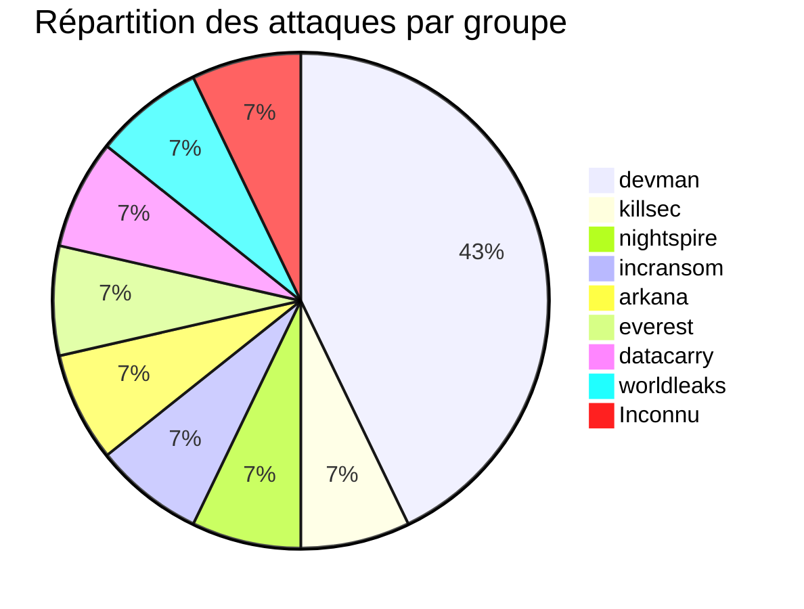
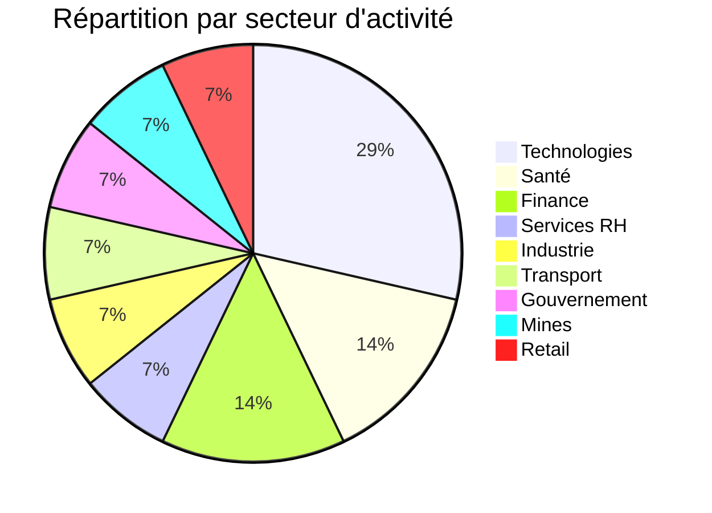
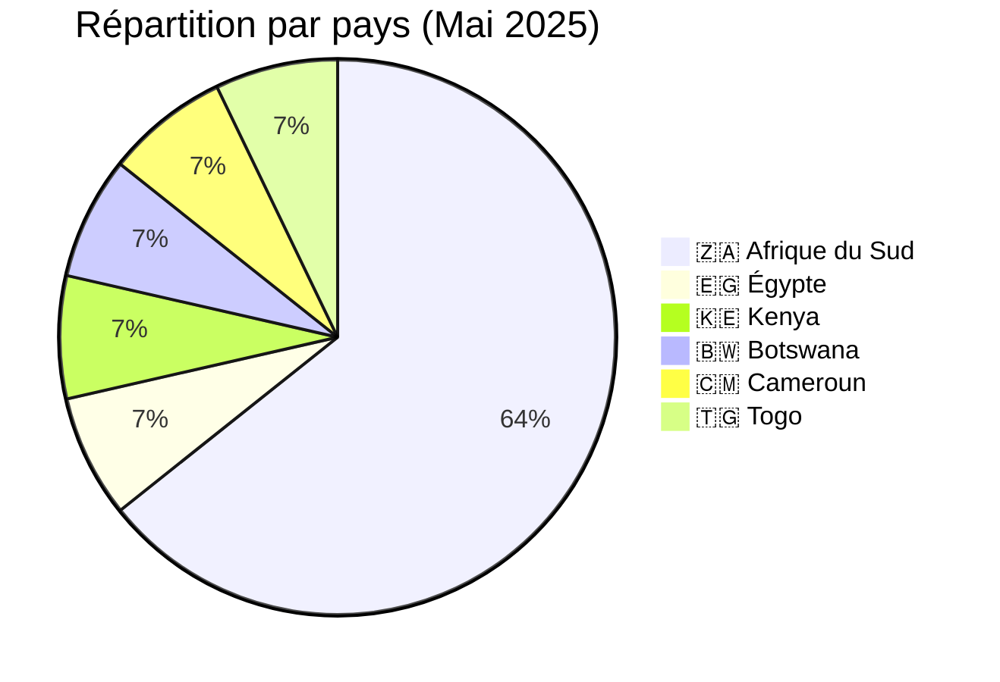
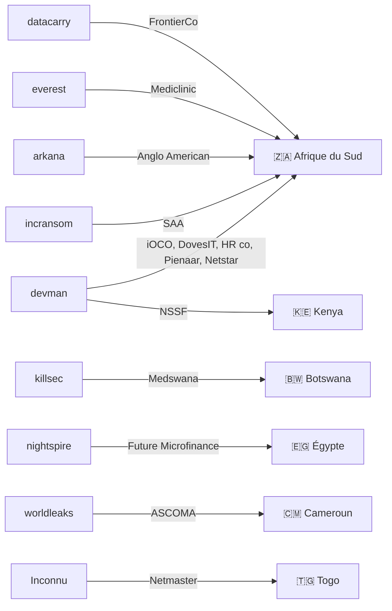

# Rapport CTI : Cyberattaques en Afrique - Mai 2025
👉🏾 [**English version available here**](./README.md)
## 1. Introduction
Ce rapport de Cyber Threat Intelligence (CTI) présente une analyse détaillée des cyberattaques survenues en Afrique durant le mois de mai 2025. Les informations sont issues de sources OSINT et de sites de fuites de groupes ransomware, compilées dans le cadre du projet AFRINTEL. L'objectif est de fournir une vision claire des tendances, des acteurs menaçants, des secteurs ciblés et des indicateurs de compromission associés.

## 2. Résumé exécutif
- **Nombre total d'attaques recensées** : 14
- **Groupes ransomware les plus actifs** : devman (6 attaques), killsec (1), nightspire (1), incransom (1), arkana (1), everest (1), datacarry (1), worldleaks (1), inconnu (1).
- **Secteurs les plus ciblés** : Technologies (4), Santé (2), Finance (2), Services aux entreprises (1), Industrie (1), Transport (1), Gouvernement (1), Mines (1), Retail (1).
- **Pays les plus touchés** : Afrique du Sud (9), Égypte (1), Kenya (1), Botswana (1), Cameroun (1), Togo (1).
- **Volume de données exfiltrées** : 2,5 To pour NSSF Kenya, 1 Go pour Netmaster Togo. Les autres volumes ne sont pas précisés.

## 3. Statistiques clés

### 3.1 Répartition par groupe ransomware
| Groupe ransomware | Nombre d'attaques |
|-------------------|-------------------|
| devman            | 6                 |
| killsec           | 1                 |
| nightspire        | 1                 |
| incransom         | 1                 |
| arkana            | 1                 |
| everest           | 1                 |
| datacarry         | 1                 |
| worldleaks        | 1                 |
| Inconnu           | 1                 |
| **Total**         | **14**            |

### 3.2 Répartition par secteur d'activité
| Secteur | Nombre d'attaques |
|---------|-------------------|
| Technologies | 4 |
| Santé / Pharmacie | 2 |
| Finance / Assurance | 2 |
| Services aux entreprises (RH) | 1 |
| Industrie (EPI) | 1 |
| Transport aérien | 1 |
| Gouvernement / Social | 1 |
| Mines | 1 |
| Retail / Distribution | 1 |
| **Total** | **14** |

### 3.3 Répartition par pays
| Pays | Nombre d'attaques |
|------|-------------------|
| 🇿🇦 Afrique du Sud | 9 |
| 🇪🇬 Égypte | 1 |
| 🇰🇪 Kenya | 1 |
| 🇧🇼 Botswana | 1 |
| 🇨🇲 Cameroun | 1 |
| 🇹🇬 Togo | 1 |
| **Total** | **14** |

## 4. Détail des attaques par groupe ransomware
### 4.1 devman (6 attaques)
- **01/05/2025** : iOCO (Afrique du Sud, technologies)
- **01/05/2025** : DovesIT (Afrique du Sud, technologies)
- **01/05/2025** : South African HR company (Afrique du Sud, services RH)
- **10/05/2025** : Pienaar Brothers (Afrique du Sud, industrie EPI)
- **19/05/2025** : NSSF Kenya (Kenya, gouvernement) – 2,5 To exfiltrés, rançon 4,5 M$
- **23/05/2025** : Netstar (Afrique du Sud, technologies)

*Remarque* : devman a concentré ses attaques sur l'Afrique du Sud (5) et le Kenya (1), avec une diversification sectorielle (technologies, RH, industrie, gouvernement). L'attaque contre la NSSF kenyane est la plus volumineuse du mois.

### 4.2 killsec (1 attaque)
- **20/05/2025** : Medswana (Botswana, pharmacie/santé)

### 4.3 nightspire (1 attaque)
- **05/05/2025** : Future Association for Microfinance (Égypte, finance)

### 4.4 incransom (1 attaque)
- **16/05/2025** : South African Airways (Afrique du Sud, transport aérien)

### 4.5 arkana (1 attaque)
- **21/05/2025** : Anglo American plc (Afrique du Sud, mines)

### 4.6 everest (1 attaque)
- **26/05/2025** : Mediclinic Group (Afrique du Sud, santé)

### 4.7 datacarry (1 attaque)
- **26/05/2025** : FrontierCo (Afrique du Sud, retail/distribution)

### 4.8 worldleaks (1 attaque)
- **31/05/2025** : ASCOMA Cameroon (Cameroun, assurance)

### 4.9 Inconnu (1 attaque)
- **31/05/2025** : Netmaster (Togo, technologies/hébergement) – 1 Go exfiltré
### 4.10 Graphe acteur → victime → pays

## 5. Analyse sectorielle
- **Technologies** : 4 attaques (iOCO, DovesIT, Netstar, Netmaster). devman domine, avec une attaque sur un registrar togolais par un groupe inconnu.
- **Santé / Pharmacie** : 2 attaques (Medswana, Mediclinic). killsec et everest ciblent des acteurs de la santé au Botswana et en Afrique du Sud.
- **Finance / Assurance** : 2 attaques (Future Microfinance, ASCOMA). nightspire et worldleaks visent une ONG égyptienne et un courtier camerounais.
- **Services aux entreprises (RH)** : 1 attaque (South African HR company) par devman, montrant l'intérêt pour les données personnelles.
- **Industrie (EPI)** : 1 attaque (Pienaar Brothers) par devman, dans le secteur minier.
- **Transport aérien** : 1 attaque (SAA) par incransom, touchant la compagnie nationale sud-africaine.
- **Gouvernement / Social** : 1 attaque (NSSF Kenya) par devman, avec exfiltration massive.
- **Mines** : 1 attaque (Anglo American) par arkana, visant un géant minier.
- **Retail / Distribution** : 1 attaque (FrontierCo) par datacarry.

## 6. Analyse géographique
- **Afrique du Sud** : 9 attaques, dont 6 de devman. Tous les secteurs sont représentés, avec une forte concentration sur les technologies et les infrastructures critiques.
- **Égypte** : 1 attaque (microfinance) par nightspire.
- **Kenya** : 1 attaque majeure (NSSF) par devman, avec 2,5 To de données exfiltrées.
- **Botswana** : 1 attaque (pharmacie) par killsec.
- **Cameroun** : 1 attaque (assurance) par worldleaks.
- **Togo** : 1 attaque (hébergement web) par un groupe inconnu.

L'Afrique du Sud est de loin le pays le plus touché, confirmant sa position de hub économique régional et de cible privilégiée.

## 7. TTPs observées
- **Exfiltration massive** : NSSF Kenya (2,5 To) et Netmaster (1 Go) illustrent la collecte de grands volumes de données.
- **Ciblage d'infrastructures critiques** : transport aérien (SAA), mines (Anglo American), santé (Mediclinic), gouvernement (NSSF).
- **Domination d'un acteur** : devman est responsable de près de la moitié des attaques (6/14), montrant une campagne active.
- **Diversité des victimes** : grands groupes (Anglo, SAA, Mediclinic) et PME (DovesIT, Pienaar) sont également visés.
- **Double extorsion** : revendications avec échantillons de données publiés.

## 8. Recommandations
- **Afrique du Sud** : renforcer la cybersécurité dans tous les secteurs, en particulier les technologies et les infrastructures critiques.
- **Secteur public** : les organismes comme la NSSF doivent mettre en place des sauvegardes hors ligne et une segmentation réseau.
- **Entreprises de technologies** : les MSP (iOCO, DovesIT, Netstar) sont des cibles privilégiées ; elles doivent sécuriser leurs accès et surveiller les activités anormales.
- **Secteur minier** : Anglo American doit protéger ses données sensibles et ses systèmes industriels.
- **Tous secteurs** : former les employés à la détection des phishing, authentification multi-facteurs, et audits réguliers.

## 9. Conclusion
Mai 2025 a été marqué par une activité soutenue du groupe devman, qui a frappé l'Afrique du Sud et le Kenya avec une attaque massive sur la NSSF (2,5 To). La diversité sectorielle (technologies, santé, mines, transport) montre que les attaquants ciblent aussi bien les infrastructures critiques que les entreprises de services. L'Afrique du Sud reste le pays le plus touché, avec 9 attaques. La coopération régionale et le partage d'information sont plus que jamais nécessaires.

## ✍🏿 Auteur
*Adama ASSIONGBON*  
*Consultant SOC & Cyber Threat Intelligence*  
[LinkedIn Profile](https://www.linkedin.com/in/adama-assiongbon-9029893a/)

---
*AFRINTEL - Initiative ouverte de veille CTI sur l’Afrique*
