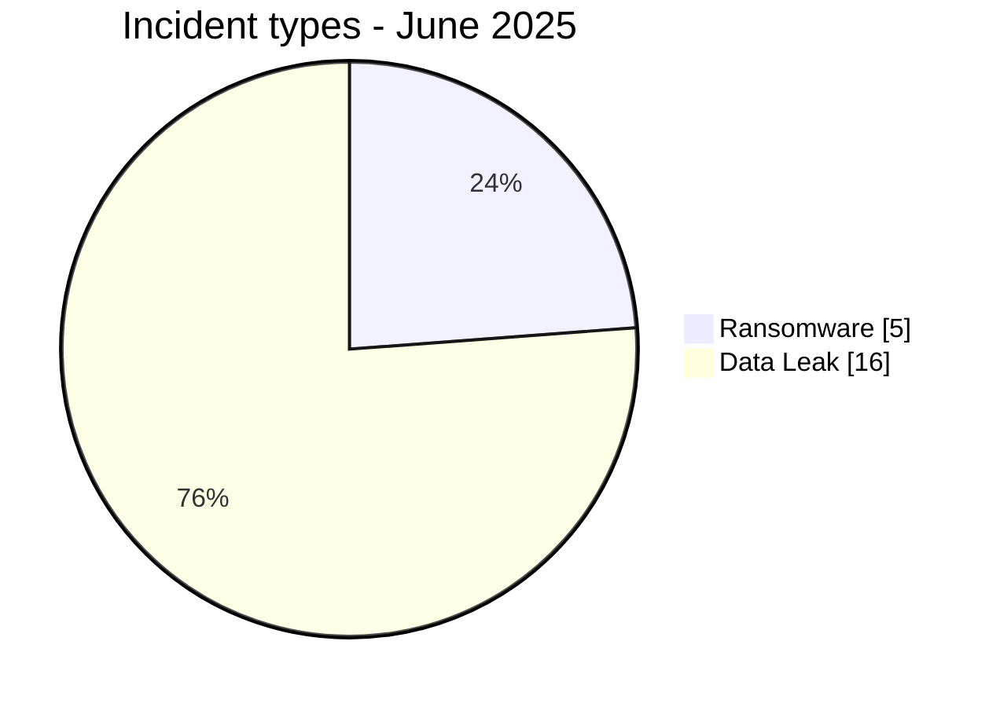
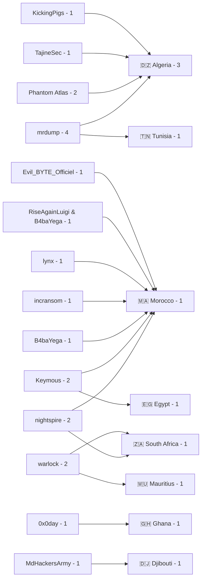
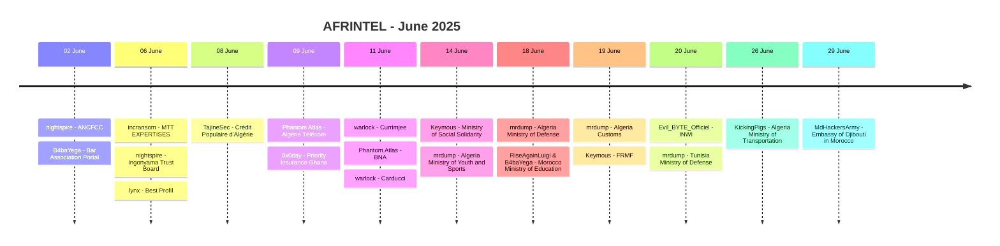

# CTI Report - Cyberattacks in Africa - June 2025

👉🏾 [**French version available here**](./README_FR.md)

## 1. Executive summary

June 2025 contains **21 documented incidents across 8 African countries**: **5 Ransomware** and **16 Data Leak**. No Access Sale, DDoS, Defacement or Operational Fraud is recorded.

- **Morocco**: 7 incidents, including 2 Ransomware and 5 Data Leak.
- **Algeria**: 7 incidents, all classified as Data Leak.
- **South Africa**: 2 Ransomware.
- **Ghana**: 1 Data Leak, omitted from several tables in the previous report.
- **mrdump** is the most visible actor with 4 records.
- **nightspire, Phantom Atlas, warlock and Keymous** each account for 2 records.
- **Government / Administration** accounts for 11 incidents after sector normalization.
- Notable evidence includes ANCFCC archives, Priority Insurance Ghana data, Algérie Télécom network maps, Egyptian Ministry of Social Solidarity data, FRMF records and multiple publications involving Algerian public institutions.

### 📋 Victim list

👉🏾 [View the full victim list](./victims.md)

### 1.1 Month-over-month comparison

> Comparison based on validated AFRINTEL monthly corpora. A change in documented records does not, by itself, prove a change in the real number of compromises.

| Indicator | May 2025 | June 2025 | Observed change |
|---|---:|---:|---:|
| Total incidents | 21 | 21 | **0 (+0.0%)** |
| Ransomware | 13 | 5 | **-8 (-61.5%)** |
| Data Leak | 8 | 16 | **+8 (+100.0%)** |
| Access Sale | 0 | 0 | **0 (stable)** |
| DDoS | 0 | 0 | **0 (stable)** |
| Defacement | 0 | 0 | **0 (stable)** |
| Operational Fraud | 0 | 0 | **0 (stable)** |

## 2. Methodology

- **Scope**: 54 African countries.
- **Period**: 1-30 June 2025.
- **Sources**: OSINT, leak sites, underground forums, actor channels and available samples.
- **Source of truth**: validated bilingual pair [`victims_FR.md`](./victims_FR.md) / [`victims.md`](./victims.md), with French editorial review before English synchronization.
- **Counting**: one card equals one unique incident.
- **Qualification**: claim, sample, full publication and technical confirmation remain separate evidence levels.
- **Visualization**: tables, text bars, simple Mermaid diagrams and a timeline.

## 3. Global overview

### 3.1 Incident-type distribution

| Incident type | Count | Share |
|---|---:|---:|
| Ransomware | 5 | 23.8% |
| Data Leak | 16 | 76.2% |
| Access Sale | 0 | 0.0% |
| DDoS | 0 | 0.0% |
| Defacement | 0 | 0.0% |
| Operational Fraud | 0 | 0.0% |
| **Total** | **21** | **100%** |

**Color convention:** 🟧 Ransomware | 🟦 Data Leak | 🟪 Access Sale | 🟥 DDoS | 🟨 Defacement | 🟩 Operational Fraud.

### 3.2 Country distribution

| Country | Ransomware | Data Leak | Total | Distribution |
|---|---:|---:|---:|---|
| 🇲🇦 Morocco | 2 | 5 | 7 | 🟧🟧🟦🟦🟦🟦🟦 |
| 🇩🇿 Algeria | 0 | 7 | 7 | 🟦🟦🟦🟦🟦🟦🟦 |
| 🇿🇦 South Africa | 2 | 0 | 2 | 🟧🟧 |
| 🇲🇺 Mauritius | 1 | 0 | 1 | 🟧 |
| 🇪🇬 Egypt | 0 | 1 | 1 | 🟦 |
| 🇬🇭 Ghana | 0 | 1 | 1 | 🟦 |
| 🇹🇳 Tunisia | 0 | 1 | 1 | 🟦 |
| 🇩🇯 Djibouti | 0 | 1 | 1 | 🟦 |
| **Total** | **5** | **16** | **21** | |

### 3.3 Geographic distribution by region

| Region | Incidents | Share | Activity |
|---|---:|---:|---|
| North Africa | 16 | 76.2% | ██████████ |
| Southern Africa | 3 | 14.3% | ██ |
| West Africa | 1 | 4.8% | █ |
| East Africa | 1 | 4.8% | █ |
| Central Africa | 0 | 0.0% |  |
| **Total** | **21** | **100%** | |

### 3.4 Sector distribution

| Normalized sector | Incidents | Share | Activity |
|---|---:|---:|---|
| Government / Administration | 11 | 52.4% | ██████████ |
| Finance / Banking | 3 | 14.3% | ███ |
| Professional / HR / Legal Services | 3 | 14.3% | ███ |
| Telecommunications | 2 | 9.5% | ██ |
| Conglomerate / Multi-sectoral | 1 | 4.8% | █ |
| Retail / Distribution | 1 | 4.8% | █ |
| **Total** | **21** | **100%** | |

### 3.5 Actors / groups

| Actor / Group | Incidents | Activity |
|---|---:|---|
| mrdump | 4 | ██████████ |
| nightspire | 2 | █████ |
| Phantom Atlas | 2 | █████ |
| warlock | 2 | █████ |
| Keymous | 2 | █████ |
| B4baYega | 1 | ██ |
| incransom | 1 | ██ |
| lynx | 1 | ██ |
| TajineSec / Tajinesec_MA | 1 | ██ |
| 0x0day | 1 | ██ |
| RiseAgainLuigi & B4baYega | 1 | ██ |
| Evil_BYTE_Officiel | 1 | ██ |
| KickingPigs | 1 | ██ |
| MdHackersArmy | 1 | ██ |
| **Total** | **21** | |

### 3.6 Actor -> country mapping

## 4. Detailed analysis by incident type

### 4.1 Ransomware - 5 incidents

The five Ransomware records concern **MTT EXPERTISES**, **Ingonyama Trust Board**, **Best Profil**, **Currimjee Jeewanjee & Co** and **Carducci**.

MTT EXPERTISES and Best Profil contain reviewed documentary evidence. Best Profil is classified as **Data Fully Published** and includes internal HR, payroll, billing and internal-tool material. Ingonyama, Currimjee and Carducci remain primarily documented through observed actor claims.

### 4.2 Data Leak - 16 incidents

The 16 Data Leak records form the majority of the monthly corpus.

Significant cases include:

- **ANCFCC**: initial NightSpire publication followed by reviewed supplementary material; the later publication is not counted as a separate incident.
- **Algérie Télécom**: network maps and monitoring interfaces consistent with internal access.
- **Priority Insurance Ghana**: a previously reviewed dataset of 349,288 records now tied to a dated source publication on 9 June.
- **Egyptian Ministry of Social Solidarity**: 237 claimed elements and a reviewed 26-record CSV sample.
- **FRMF**: more than 4,289 claimed records with FIFA Connect / CAF Pro samples and coherent spreadsheets.
- **BNA Algeria**: 90 GB claimed, without an archive collected or verified by AFRINTEL.
- **CPA Algeria**: more than 30 GB claimed, with an announced sample not visible in the supplied evidence.
- **Embassy of Djibouti in Morocco**: unverified claim with no data description or volume.

## 5. Sectoral impact

**Government / Administration** accounts for **11 of 21 incidents (52.4%)**. This normalized category includes land administrations, ministries, customs, defense, public sports administration and the diplomatic representation.

**Finance / Banking** accounts for 3 incidents: CPA, BNA and Priority Insurance. **Professional / HR / Legal Services** accounts for 3: the Bar Association Portal, MTT EXPERTISES and Best Profil. **Telecommunications** accounts for 2: Algérie Télécom and INWI.

## 6. Threat actor profile

**mrdump** is the most visible label with **4 records**. **nightspire, Phantom Atlas, warlock and Keymous** each account for **2 records**. The other nine labels appear once.

`Actor / Group` fields were normalized to contain only the actor name. Forum, Telegram-channel and post-author details remain analytical context rather than part of the actor name.

## 7. Key trends and intelligence gaps

### 7.1 Observed trends

1. **Stable monthly volume**: 21 incidents in both May and June.
2. **Shift toward Data Leak**: 8 in May versus 16 in June.
3. **Ransomware decline**: 13 in May versus 5 in June.
4. **North African concentration**: 16 of 21 incidents.
5. **Strong public-sector exposure**: 11 Government / Administration incidents.
6. **Morocco and Algeria lead**: 7 incidents each.
7. **Ghana restored**: Priority Insurance raises the country count to 8.

### 7.2 Intelligence gaps

- Several volumes remain actor claims and are not independently measured.
- The announced BNA archives are no longer available in the reviewed material.
- The CPA volume and announced 500 MB sample are not confirmed.
- The Djibouti Embassy case has no sample or data description.
- Initial-access vectors remain unknown for most incidents.

### 7.3 Monthly evolution

| Type | May 2025 | June 2025 | Change |
|---|---:|---:|---:|
| Total | 21 | 21 | **0 (stable)** |
| Ransomware | 13 | 5 | **-8 (-61.5%)** |
| Data Leak | 8 | 16 | **+8 (+100.0%)** |
| Access Sale | 0 | 0 | **0 (stable)** |

## 8. Summary timeline

## 9. MITRE ATT&CK mapping - contextual

| Phase | Technique | Analytical scope |
|---|---|---|
| Collection | T1005 - Data from Local System | Relevant to described or reviewed files, documents and archives. |
| Collection | T1213 - Data from Information Repositories | Relevant to databases, administrative repositories and structured exports. |
| Network discovery | T1016 - System Network Configuration Discovery | Defensive context relevant to exposed Algérie Télécom network maps and information; the acquisition method is not confirmed. |

> These mappings are contextual and should not be interpreted as proof that each actor used the listed techniques.

## 10. Recommendations

- **Public sector**: strengthen MFA, PAM, export logging and exposed-application monitoring.
- **Banking / Insurance**: monitor customer exports, protect identity data and control administrative access.
- **Telecommunications**: protect monitoring systems, restrict access to network maps and monitor anomalous access.
- **HR / Legal**: restrict SQL backups, payroll data and client documents to strictly necessary accounts.
- **Defense / Diplomacy**: strengthen document classification, segmentation and transfer monitoring.

## 11. SOC and tactical recommendations

### Observed

The corpus includes structured exports, internal documents, network maps, identity data, financial information, database publications and several claims without samples.

### Assumptions

Initial access, persistence mechanisms and complete exfiltration paths are not established for most incidents.

### Preventive

Monitor bulk exports, SQL backups, administrative-portal access, privileged accounts, unusual downloads, network-monitoring systems and large outbound transfers. Maintain MFA, PAM, EDR, segmentation, immutable backups and exposed-secret rotation.

## 12. Conclusion

June 2025 contains **21 incidents across 8 countries**, split into **5 Ransomware and 16 Data Leak**. The total is unchanged from May, but the corpus structure changes sharply: Ransomware falls by 61.5% while Data Leak doubles.

Morocco and Algeria each account for 7 incidents. Ghana is now correctly included through the Priority Insurance Company Limited record. mrdump is the most visible actor with 4 records.

**AFRINTEL** - Open African CTI Monitoring Initiative
