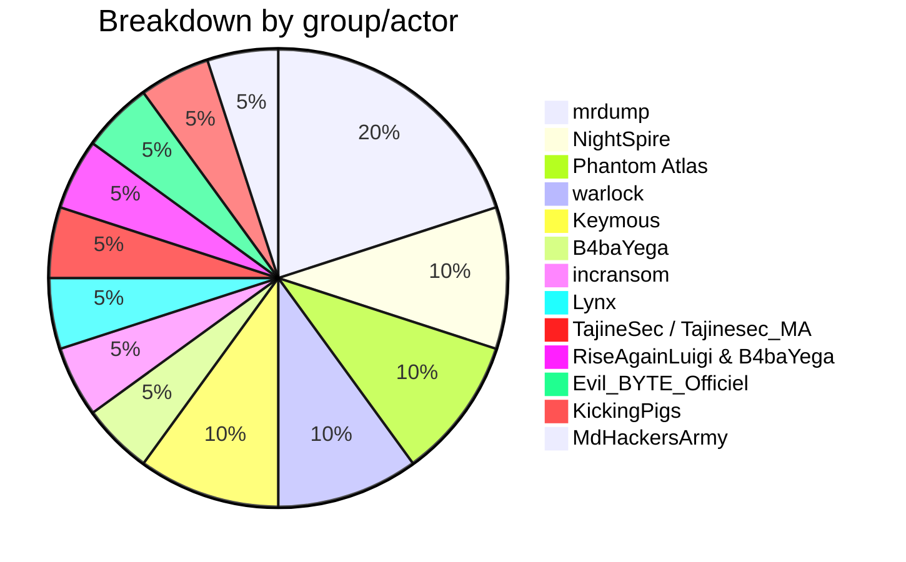
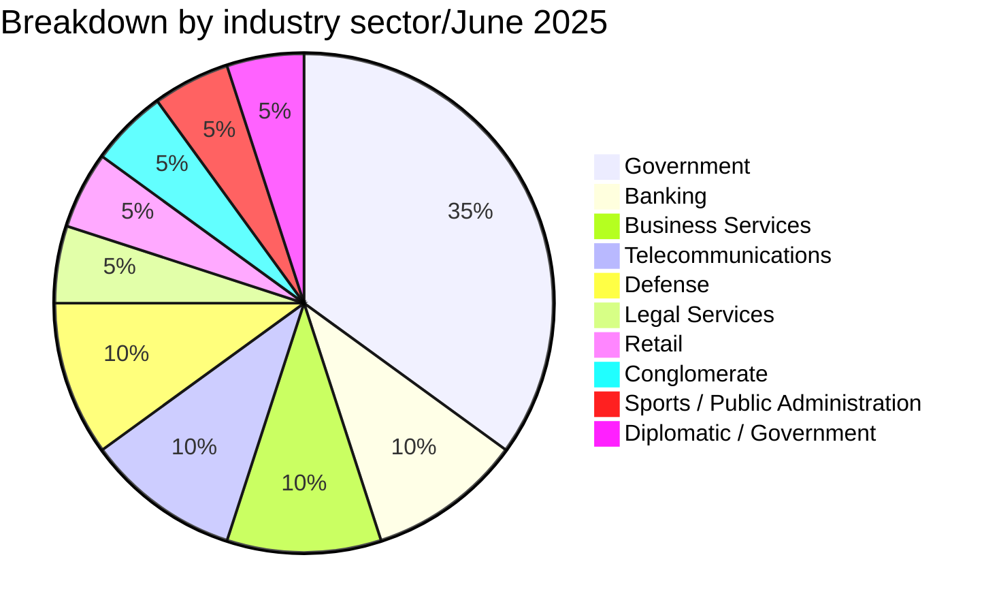
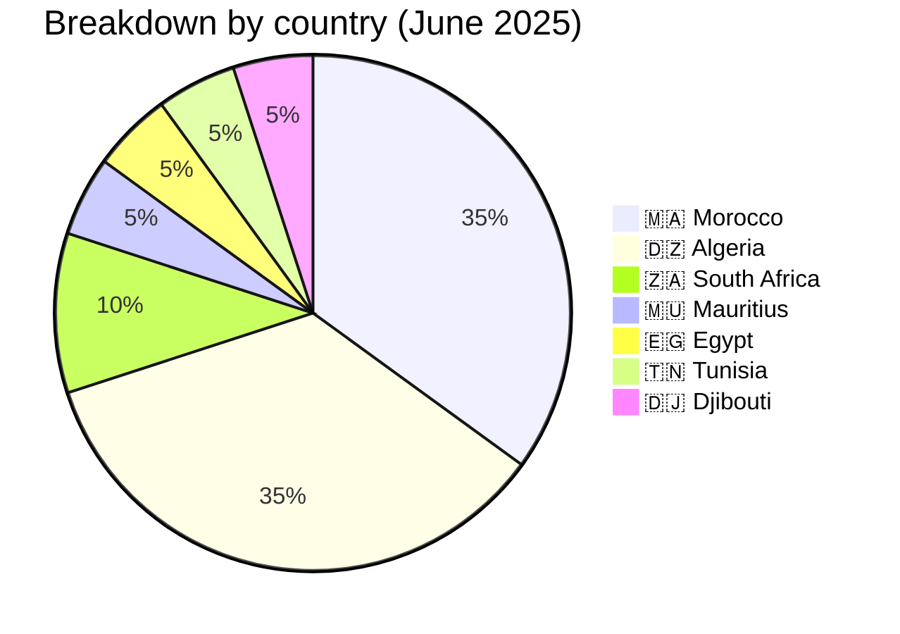
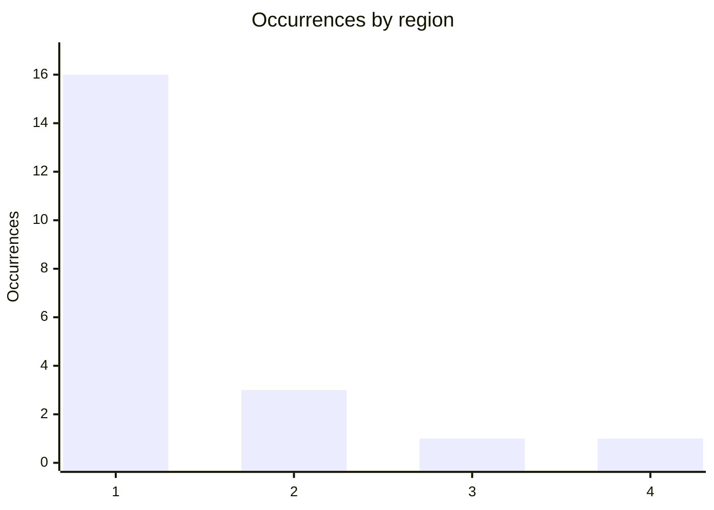
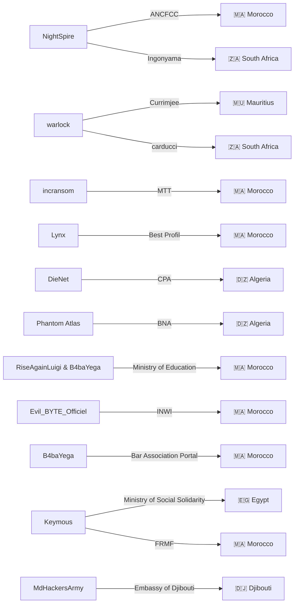
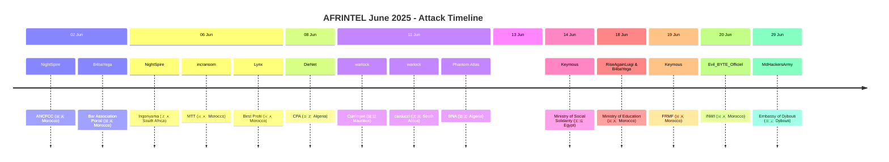

[](https://github.com/Hatchepsoute/AFRINTEL)


 
# CTI Report: Cyber attacks in Africa - June 2025
👉🏾 [**French version available here**](./README_FR.md)

## 1. Introduction
This Cyber Threat Intelligence (CTI) report provides a detailed analysis of cyber attacks that occurred in Africa during June 2025. The information is derived from OSINT sources and ransomware group leak sites, compiled as part of the *AFRINTEL* project. The objective is to provide a clear overview of trends, threat actors, targeted sectors, and associated indicators of compromise.

## 2. Executive summary
- **Total number of recorded attacks:** 21
- **Most active actors:** mrdump (4 attacks), NightSpire (2), Phantom Atlas (2), warlock (2), Keymous (2), B4baYega (1), incransom (1), Lynx (1), TajineSec / Tajinesec_MA (1), RiseAgainLuigi & B4baYega (1), Evil_BYTE_Officiel (1), KickingPigs (1), MdHackersArmy (1).
- **Most targeted sectors:** Government / Administrations (7), Banking / Finance (2), Business Services (2), Telecommunications (2), Defense (2), Legal Services (1), Retail (1), Conglomerate (1), Sports / Public Administration (1), Diplomatic / Government (1).
- **Most affected countries:** Morocco (7), Algeria (7), South Africa (2), Mauritius (1), Egypt (1), Tunisia (1), Djibouti (1).
- **Notable exfiltrated data volumes:** 90 GB (BNA Algeria), 26 GB (Best Profil Morocco), 3.1 GB (ANCFCC Morocco), 237 claimed elements / 26 sample records (Ministry of Social Solidarity, Egypt), 4,289 claimed records / roughly three dozen sample records (FRMF, Morocco). Embassy of Djibouti in Morocco: unverified claim with no data description or volume disclosed.

## 3. Key statistics

### 3.1 Breakdown by group/actor
| Group/Actor | Number of Attacks |
|---------------|-------------------|
| mrdump        | 4                 |
| NightSpire    | 2                 |
| Phantom Atlas | 2                 |
| warlock       | 2                 |
| Keymous       | 2                 |
| B4baYega      | 1                 |
| incransom     | 1                 |
| Lynx          | 1                 |
| TajineSec / Tajinesec_MA | 1      |
| RiseAgainLuigi & B4baYega | 1 |
| Evil_BYTE_Officiel | 1          |
| KickingPigs   | 1                 |
| MdHackersArmy | 1                 |
| **Total**     | **20**            |



### 3.2 Breakdown by sector
| Sector | Number of attacks |
|---------|-------------------|
| Government / Administrations | 7 |
| Banking / Finance | 2 |
| Business Services | 2 |
| Telecommunications | 2 |
| Defense | 2 |
| Legal Services | 1 |
| Retail | 1 |
| Conglomerate | 1 |
| Sports / Public Administration | 1 |
| Diplomatic / Government | 1 |
| **Total** | **20** |



### 3.3 Breakdown by country
| Country | Number of attacks |
|------|-------------------|
| 🇲🇦 Morocco | 7 |
| 🇩🇿 Algeria | 7 |
| 🇿🇦 South Africa | 2 |
| 🇲🇺 Mauritius | 1 |
| 🇪🇬 Egypt | 1 |
| 🇹🇳 Tunisia | 1 |
| 🇩🇯 Djibouti | 1 |
| **Total** | **20** |




<!-- AFRINTEL_CURRENT_MODEL_START -->
### 3.4 Standard global overview

| Country | Ransomware | Leaks / access | Total | Distribution |
| :--- | ---: | ---: | ---: | :--- |
| 🇩🇿 Algeria | 0 | 7 | 7 |  🟦🟦🟦🟦🟦🟦🟦 |
| 🇲🇦 Morocco | 2 | 5 | 7 | 🟧🟧 🟦🟦🟦🟦🟦 |
| 🇿🇦 South Africa | 2 | 0 | 2 | 🟧🟧 |
| 🇩🇯 Djibouti | 0 | 1 | 1 |  🟦 |
| 🇪🇬 Egypt | 0 | 1 | 1 |  🟦 |
| 🇬🇭 Ghana | 0 | 1 | 1 |  🟦 |
| 🇲🇺 Mauritius | 1 | 0 | 1 | 🟧 |
| 🇹🇳 Tunisia | 0 | 1 | 1 |  🟦 |

```pie
    title Incident types
    "Ransomware" : 5
    "Leaks and access" : 16
```

### Geographic distribution by region

| Region | Occurrences | Ransomware | Leaks / access | Distribution |
| :--- | ---: | ---: | ---: | :--- |
| North Africa | 16 | 2 | 14 | 🟧🟧 🟦🟦🟦🟦🟦🟦🟦🟦🟦🟦🟦🟦🟦🟦 |
| Southern Africa | 3 | 3 | 0 | 🟧🟧🟧 |
| West and Central Africa | 1 | 0 | 1 |  🟦 |
| East Africa | 1 | 0 | 1 |  🟦 |


Legend: 1 = North Africa; 2 = Southern Africa; 3 = West and Central Africa; 4 = East Africa

### Sector distribution

| Sector | Records | Share | Activity |
| :--- | ---: | ---: | :--- |
| Government / Administration | 11 | 52.4% | ██████████ |
| Finance / Banking | 3 | 14.3% | ███ |
| Professional / Business Services | 3 | 14.3% | ███ |
| Technology / IT | 3 | 14.3% | ███ |
| Retail / E-commerce | 1 | 4.8% | █ |

### Most visible actors

| Actor / Group | Records | Activity |
| :--- | ---: | :--- |
| Keymous | 2 | ██████████ |
| Phantom Atlas | 2 | ██████████ |
| mrdump, post published on a cybercriminal forum (DarkForums) | 2 | ██████████ |
| nightspire | 2 | ██████████ |
| warlock | 2 | ██████████ |
| 0x0day, post published on the cybercriminal forum DarkForums | 1 | █████ |
| B4baYega | 1 | █████ |
| Evil_BYTE_Officiel | 1 | █████ |
| KickingPigs | 1 | █████ |
| MdHackersArmy (post published by Doxeur23azi on a cybercriminal forum, DarkForums) | 1 | █████ |
<!-- AFRINTEL_CURRENT_MODEL_END -->
## 4. Detailed attacks by group/actor

### 4.1 NightSpire (2 attacks)
- **02/06/2025:** ANCFCC (Morocco, government) - 3.1 GB of data exfiltrated (10,080 land certificates).
- **06/06/2025:** Ingonyama Trust Board (South Africa, land administration).

*Note:* NightSpire targeted two land management bodies in two different countries, with significant volumes of sensitive data.

### 4.2 warlock (2 attacks)
- **11/06/2025:** Currimjee (Mauritius, conglomerate)
- **11/06/2025:** carducci (South Africa, retail)

*Note:* warlock struck two companies in different sectors on the same day, demonstrating the ability to conduct simultaneous operations.

### 4.3 incransom (1 attack)
- **06/06/2025:** MTT EXPERTISES (Morocco, business services)

### 4.4 Lynx (1 attack)
- **06/06/2025:** Best Profil (Morocco, human resources) - 26 GB exfiltrated, data published after ransom negotiations failed.

### 4.5 DieNet (hacktivism) (1 attack)
- **08/06/2025:** Crédit Populaire d'Algérie (Algeria, banking) - leak of data samples.

### 4.6 Phantom Atlas (1 attack)
- **11/06/2025:** Banque Nationale d'Algérie (Algeria, banking) - 90 GB exfiltrated, partial publication of 7 GB.

### 4.7 RiseAgainLuigi & B4baYega (1 attack)
- **18/06/2025:** Ministry of National Education (Morocco, government) - leak of over 6 million student records (Massar platform).

### 4.8 Evil_BYTE_Officiel (1 attack)
- **20/06/2025:** INWI (Morocco, telecommunications) - massive leak of personal data (PII, password hashes).

### 4.9 B4baYega (1 attack)
- **02/06/2025:** Bar Association Portal - avocatsmaroc.com / mossaada.ma (Morocco, legal services) - compromise of a legal case-management application; source code and SQL backups distributed alongside a password-protected archive.


### 4.11 Keymous (2 attacks)
- **14/06/2025:** Ministry of Social Solidarity (Egypt, government) - forum post claiming 237 elements of confidential documents and personal information on ministers, government officials and institutional representatives from several African, Arab and Asian countries; a 26-record CSV sample was reviewed by AFRINTEL.
- **19/06/2025:** FRMF (Morocco, sports / public administration) - DarkForums post claiming a database of FRMF players and staff covering more than 4,289 named records; AFRINTEL reviewed a local sample of FIFA Connect and CAF Pro registration documents and spreadsheet extracts matching the claimed field structure.

*Note:* Keymous was active twice in June, targeting a government ministry and a national sports federation in two different countries.

### 4.12 MdHackersArmy (1 attack)
- **29/06/2025:** Embassy of Djibouti in Morocco (Djibouti, diplomatic/government) – Claim - Unverified. Post published by Doxeur23azi on DarkForums, credited to MdHackersArmy; no data description, sample or volume disclosed.

### 4.13 Actor → victim → country graph


## 5. Sectoral analysis
- **Government / Administrations:** 4 attacks (ANCFCC, Ingonyama, Ministry of Education, Ministry of Social Solidarity). Actors NightSpire, the duo RiseAgainLuigi/B4baYega and Keymous targeted key institutions, with leaks of sensitive data (land certificates, student records, personal data on government/institutional officials).
- **Banking / Finance:** 2 attacks (CPA, BNA) by DieNet and Phantom Atlas, two hacktivist groups, with significant volumes (90 GB for BNA).
- **Business Services:** 2 attacks (MTT EXPERTISES, Best Profil) by incransom and Lynx, the latter publishing 26 GB of HR data.
- **Legal Services:** 1 attack (Bar Association Portal) by B4baYega, exposing source code and SQL backups of a case-management application used by Moroccan lawyers.
- **Telecommunications:** 1 attack (INWI) by Evil_BYTE_Officiel, exposing subscriber personal data.
- **Retail:** 1 attack (carducci) by warlock.
- **Conglomerate:** 1 attack (Currimjee) by warlock.
- **Sports / Public Administration:** 1 attack (FRMF) by Keymous, exposing samples of federation player and staff registration and licensing records.
- **Diplomatic / Government:** 1 unverified claim (Embassy of Djibouti in Morocco) credited to MdHackersArmy, involving an African state's diplomatic mission in another African country.

## 6. Geographic analysis
- **Morocco:** 7 attacks, affecting various sectors: government (ANCFCC, Ministry of Education), services (MTT, Best Profil), legal services (Bar Association Portal), telecoms (INWI), sports federation (FRMF). Morocco is by far the most targeted country of the month.
- **Algeria:** 2 attacks targeting the banking sector (CPA, BNA), with very large data volumes.
- **South Africa:** 2 attacks (Ingonyama, carducci) in land administration and retail.
- **Mauritius:** 1 attack on a historic conglomerate (Currimjee).
- **Egypt:** 1 forum post claiming data from a social-affairs ministry, involving personal information on government and institutional officials from several countries; AFRINTEL reviewed a 26-record sample.
- **Djibouti:** 1 unverified claim (Embassy of Djibouti in Morocco) credited to MdHackersArmy, targeting a Djiboutian diplomatic mission located in Morocco rather than a domestic entity.

North Africa (Morocco, Algeria, Egypt) concentrates 10 out of 13 attacks, confirming persistent pressure on this region.
### 6.2 Attack timeline


## 7. Observed TTPs
- **Massive exfiltration:** significant volumes for BNA (90 GB), Best Profil (26 GB), ANCFCC (3.1 GB).

- **Use of hacktivism:** DieNet and Phantom Atlas claim politically motivated leaks (e.g., "retaliation").
- **Double extortion / publication:** Lynx published Best Profil's data after negotiation failure.

- **Diversity of actors:** traditional ransomware (incransom, Lynx, warlock) and hacktivist groups.

## 8. Recommendations
- **Morocco:** strengthen security of government infrastructures (ANCFCC, Ministry of Education) and telecom operators (INWI). Implement data leak monitoring.
- **Algeria:** banks (CPA, BNA) must review their security protocols and segment networks to limit massive exfiltration.
- **South Africa:** protect land data (Ingonyama) and customer databases (carducci).
- **All sectors:** train employees on phishing risks, implement multi-factor authentication and offline backups.

## 9. Conclusion
June 2025 was marked by high activity in Morocco, with attacks targeting government institutions and strategic companies. The presence of hacktivist groups (DieNet, Phantom Atlas) alongside traditional ransomware shows a diversification of threats. Massive data leaks (BNA, Best Profil) and breaches of Nigerian defense underscore the urgency of regional cybersecurity cooperation. A largely undocumented claim targeting the Embassy of Djibouti in Morocco also illustrates that African diplomatic missions abroad remain exposed to opportunistic claims, even absent verifiable data.

## ✍🏿 Author
*Adama ASSIONGBON*  
*SOC & Cyber Threat Intelligence Consultant*  
[LinkedIn Profile](https://www.linkedin.com/in/adama-assiongbon-9029893a/)

---
*AFRINTEL - Open CTI Monitoring Initiative on Africa*
