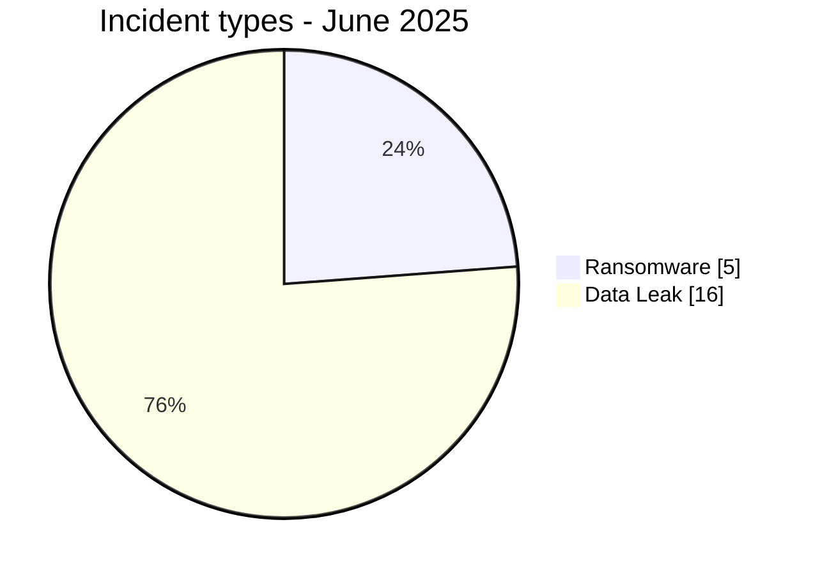

# AFRINTEL CTI Report - Cyber Threats in Africa - June 2025

👉🏾 [Version française](./README_FR.md)

   

## 1. Executive summary

In June 2025, AFRINTEL documents **21 cyber incidents** affecting organizations and digital services across **8 African countries**.

The landscape is dominated by **Data Leak with 16 records (76.2%)**, followed by **Ransomware with 5 (23.8%)**.

Geographic concentration is significant: **Morocco (7)**, **Algeria (7)**, **South Africa (2)** together account for **16 records, or 76.2% of the month**. This concentration reflects AFRINTEL corpus visibility rather than an exhaustive national compromise rate.

At sector level, the most represented categories are **Government / Administration (9)**, **Professional / Business Services (3)**, **Finance / Banking (3)**. The most frequent actor labels are `mrdump` (4), `nightspire` (2), `Phantom Atlas` (2). `Unknown`, when present, denotes missing attribution rather than a threat actor.

Evidence maturity remains variable: **19 records** are unverified claims or claims accompanied by samples. AFRINTEL maintains a strict separation between **observed facts, claims, corroboration, official confirmation, and technical unknowns**.

Compared with May, monthly volume **decreases by 5 records**. The most visible changes are Ransomware 13->5 (-8), Data Leak 9->16 (+7), Defacement 2->0 (-2).

> **Reading note:** AFRINTEL figures describe documented incidents and the visibility of observed threats. They are not an exhaustive measurement of every cyberattack that actually occurred across Africa.

### 1.1 Month-over-month comparison

| Indicator | May 2025 | June 2025 | Change |
|---|---:|---:|---:|
| Total incidents | 26 | 21 | **-5 (-19.2%)** |
| Ransomware | 13 | 5 | **-8 (-61.5%)** |
| Data Leak | 9 | 16 | **+7 (+77.8%)** |
| Access Sale | 0 | 0 | **Stable** |
| DDoS | 0 | 0 | **Stable** |
| Defacement | 2 | 0 | **-2 (-100.0%)** |
| Account Takeover | 1 | 0 | **-1 (-100.0%)** |
| System Intrusion | 1 | 0 | **-1 (-100.0%)** |
| Malware | 0 | 0 | **Stable** |
| Operational Fraud | 0 | 0 | **Stable** |

## 2. Methodology

- **Scope:** 54 African countries; reference period: June 2025.
- **Source of truth:** validated `victims_FR.md` / `victims.md` pair.
- **Classification:** Ransomware, Data Leak, Access Sale, DDoS, Defacement, Account Takeover, System Intrusion, Malware, and Operational Fraud.
- **Counting:** one canonical record equals one documented cyber incident; cases under investigation remain outside statistics.
- **Timeline:** `Incident date` and `Initial publication date` remain separate. A later disclosure does not artificially move an incident into another month when chronology is sufficiently supported.
- **Uncertain dates:** when no exact day is known, the evidence-supported month or time window is retained.
- **Sources:** public links are retained for supplementary incidents found through OSINT/web research; they are not retroactively imposed on historical or direct Dark Web observations.
- **Evidence:** incident type, status, confidence, impact, and provenance remain separate dimensions.
- **Sectors:** normalization is calculated once from the structured corpus and used identically in FR and EN.
- **Limitation:** frequencies reflect AFRINTEL visibility rather than every real compromise on the continent.

## 3. Overview and incident types

| Indicator | Value |
|---|---:|
| Documented incidents | **21** |
| Countries represented | **8** |
| Regions represented | **5** |
| Leading country | **Morocco (7)** |
| Leading sector | **Government / Administration (9)** |
| Leading actor label | **mrdump (4)** |

| Incident type | Records | Share |
|---|---:|---:|
| Ransomware | 5 | 23.8% |
| Data Leak | 16 | 76.2% |
| Access Sale | 0 | 0.0% |
| DDoS | 0 | 0.0% |
| Defacement | 0 | 0.0% |
| Account Takeover | 0 | 0.0% |
| System Intrusion | 0 | 0.0% |
| Malware | 0 | 0.0% |
| Operational Fraud | 0 | 0.0% |
| **Total** | **21** | **100%** |

## 4. Geographic distribution

| Country | Total | Ransomware | Data Leak | Access Sale | DDoS | Defacement | Account Takeover | System Intrusion | Malware |
|---|---:|---:|---:|---:|---:|---:|---:|---:|---:|
| Morocco | **7** | 2 | 5 | 0 | 0 | 0 | 0 | 0 | 0 |
| Algeria | **7** | 0 | 7 | 0 | 0 | 0 | 0 | 0 | 0 |
| South Africa | **2** | 2 | 0 | 0 | 0 | 0 | 0 | 0 | 0 |
| Ghana | **1** | 0 | 1 | 0 | 0 | 0 | 0 | 0 | 0 |
| Mauritius | **1** | 1 | 0 | 0 | 0 | 0 | 0 | 0 | 0 |
| Egypt | **1** | 0 | 1 | 0 | 0 | 0 | 0 | 0 | 0 |
| Tunisia | **1** | 0 | 1 | 0 | 0 | 0 | 0 | 0 | 0 |
| Djibouti | **1** | 0 | 1 | 0 | 0 | 0 | 0 | 0 | 0 |
| **Total** | **21** | **5** | **16** | **0** | **0** | **0** | **0** | **0** | **0** |

> `Operational Fraud = 0` this month; the column is omitted for readability.

## 5. Regional distribution

| Region | Records | Share |
|---|---:|---:|
| North Africa | 16 | 76.2% |
| Southern Africa | 2 | 9.5% |
| West Africa | 1 | 4.8% |
| Indian Ocean | 1 | 4.8% |
| East Africa | 1 | 4.8% |
| **Total** | **21** | **100%** |

The leading region is **North Africa with 16 records (76.2%)**.

## 6. Sector impact

| Sector | Records | Share | Activity |
|---|---:|---:|---|
| Government / Administration | 9 | 42.9% | █████████ |
| Professional / Business Services | 3 | 14.3% | ███ |
| Finance / Banking | 3 | 14.3% | ███ |
| Telecommunications | 2 | 9.5% | ██ |
| Defense / Security | 2 | 9.5% | ██ |
| Not specified | 1 | 4.8% | █ |
| Retail / E-commerce | 1 | 4.8% | █ |
| **Total** | **21** | **100%** | |

## 7. Actors / groups

`Unknown` denotes missing attribution, not a threat actor.

| Actor / Group | Records | Activity |
|---|---:|---|
| mrdump | 4 | ████ |
| nightspire | 2 | ██ |
| Phantom Atlas | 2 | ██ |
| warlock | 2 | ██ |
| Keymous | 2 | ██ |
| B4baYega | 1 | █ |
| incransom | 1 | █ |
| lynx | 1 | █ |
| TajineSec / Tajinesec_MA | 1 | █ |
| 0x0day | 1 | █ |
| RiseAgainLuigi & B4baYega | 1 | █ |
| Evil_BYTE_Officiel | 1 | █ |
| KickingPigs | 1 | █ |
| MdHackersArmy | 1 | █ |

## 8. Evidence maturity

| Evidence maturity | Records | Share |
|---|---:|---:|
| Claim - Unverified | 9 | 42.9% |
| Claim - Data Sample Published | 10 | 47.6% |
| Data Fully Published | 2 | 9.5% |
| **Total** | **21** | **100%** |

Evidence statuses describe the available validation level; they do not change the technical incident type.

## 9. Timeline

```mermaid
timeline
    title AFRINTEL - June 2025
    02 June 2025 : ANCFCC (Agence Nationale de la Conservation Foncière)
    02 June 2025 : Bar Association Portal (avocatsmaroc.com / mossaada.ma)
    06 June 2025 : MTT EXPERTISES
    06 June 2025 : Ingonyama Trust Board
    06 June 2025 : Best Profil (bestprofil.ma)
    08 June 2025 : Crédit Populaire d'Algérie (cpa-bank.dz)
    09 June 2025 : Algérie Télécom (algerietelecom.dz)
    09 June 2025 : Priority Insurance Company Limited
    11 June 2025 : Currimjee Jeewanjee & Co
    11 June 2025 : Banque Nationale d'Algérie (bna.dz)
    11 June 2025 : carducci
    14 June 2025 : Ministry of Social Solidarity
    14 June 2025 : Ministry of Youth and Sports (MJS) / Directorates of Youth and Sports (DJS)
    18 June 2025 : Ministry of National Defense (MDN)
    18 June 2025 : Ministry of National Education (men.gov.ma / massar.men.gov.ma)
    19 June 2025 : General Directorate of Customs (DGD) / Export and Import Control Service
    19 June 2025 : Royal Moroccan Football Federation (FRMF)
    20 June 2025 : INWI (inwi.ma)
    20 June 2025 : Ministry of National Defense / Armed Forces
    26 June 2025 : Ministry of Transportation
    29 June 2025 : Embassy of Djibouti in Morocco
```

## 10. Monthly CTI analysis

### Ransomware

**5 records** are classified as Ransomware. Leading countries: Morocco (2), South Africa (2), Mauritius (1). A leak-site listing does not itself prove encryption or complete exfiltration.

### Data Leak

**16 records** are classified as Data Leak. Leading countries: Algeria (7), Morocco (5), Ghana (1). AFRINTEL distinguishes actually observed data from aggregate volumes claimed by actors.

## 11. Notable incidents

| Country | Organization | Type | Status | Impact | Confidence |
|---|---|---|---|---|---|
| Morocco | MTT EXPERTISES | Ransomware | Claim - Data Sample Published | Level 3 | Medium |
| Morocco | ANCFCC (Agence Nationale de la Conservation Foncière) | Data Leak | Claim - Data Sample Published | N/A | N/A |
| Morocco | Bar Association Portal (avocatsmaroc.com / mossaada.ma) | Data Leak | Claim - Data Sample Published | N/A | N/A |
| South Africa | Ingonyama Trust Board | Ransomware | Claim - Unverified | N/A | N/A |
| Morocco | Best Profil (bestprofil.ma) | Ransomware | Data Fully Published | N/A | N/A |

> This table highlights up to five records using structured impact, confirmation, and confidence fields. It is not an absolute severity ranking.

## 12. Key findings and intelligence gaps

- **Geographic concentration:** Morocco accounts for 7 records (33.3%), followed by Algeria (7) and South Africa (2).
- **Threat structure:** Data Leak is the leading type with 16 records, followed by Ransomware (5).
- **Sectors:** Government / Administration (9) and Professional / Business Services (3) have the highest visibility.
- **Actors:** the most frequent labels are mrdump (4), nightspire (2), and Phantom Atlas (2).
- **Evidence:** 19 records rely on unverified claims or claims with a published sample; these statuses do not equal complete technical confirmation.

### Intelligence gaps

- initial-access vector often not public;
- exact technical compromise date sometimes unknown;
- claimed volumes rarely fully verifiable;
- technical attribution often limited to a publication handle or label;
- public remediation, root-cause, and DFIR conclusions remain limited.

These gaps should guide collection rather than be replaced with assumptions.

## 13. Recommendations

### Organizations

- enforce phishing-resistant MFA on privileged accounts, VPN, email, social media, and administration consoles;
- apply PAM, least privilege, segmentation, and secret rotation;
- maintain immutable backups and test restoration;
- strengthen public applications, APIs, and administration interfaces;
- formalize incident response and data-breach notification.

### SOC and detection

- monitor abnormal authentication, MFA changes, privileged-account creation, and role elevation;
- detect mass database reads, unusual exports, archive creation, and large outbound transfers;
- correlate EDR, IAM, VPN, WAF, proxy, DNS, cloud, and application logs;
- distinguish DDoS, internal intrusion, account compromise, and data exposure to avoid unsupported conclusions.

### CTI

- keep incident date, initial publication, first observation, sample, disclosure, and confirmation separate;
- track republication and resale without automatically counting them as new compromise;
- preserve the evidence hierarchy between claim, corroboration, and confirmation;
- validate FR/EN parity before generating statistics.

## 14. Conclusion

**June 2025** contains **21 documented cyber incidents** across **8 African countries**. The monthly CTI value lies not only in volume but in separating **incident type, timeline, evidence level, geography, sector, and actor**.

The report therefore preserves a structured picture of the observable threat environment while keeping claims, corroboration, confirmations, and unknowns at their actual evidence level.

👉🏾 [See monthly victims](./victims.md)

**AFRINTEL** - TLP:CLEAR
