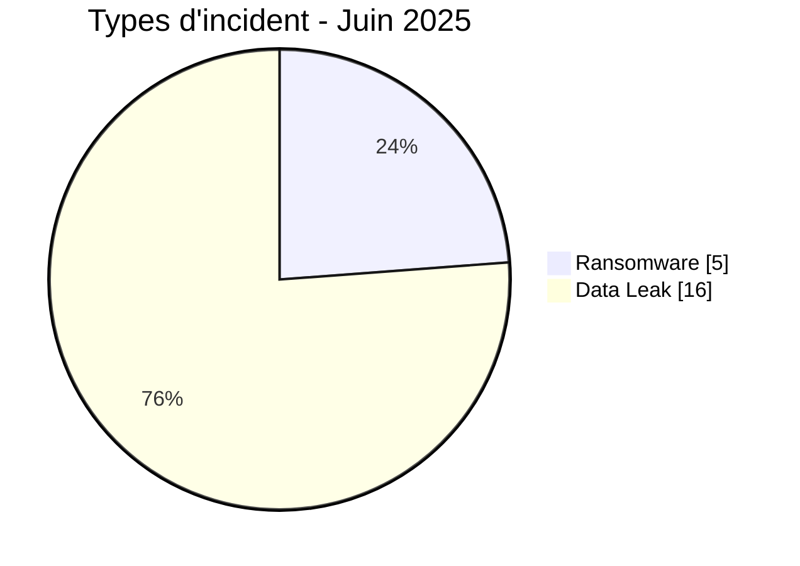
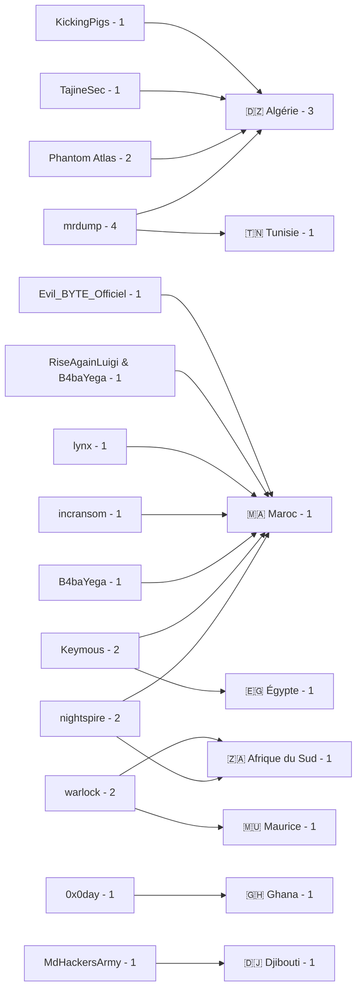
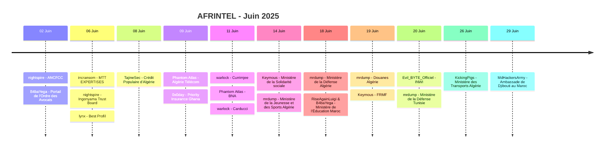

# Rapport CTI - Cyberattaques en Afrique - Juin 2025

👉🏾 [**English version available here**](./README.md)

## 1. Synthèse exécutive

Juin 2025 compte **21 incidents documentés dans 8 pays africains** : **5 Ransomware** et **16 Data Leak**. Aucun Access Sale, DDoS, Defacement ou Operational Fraud n'est enregistré.

- **Maroc** : 7 incidents, dont 2 Ransomware et 5 Data Leak.
- **Algérie** : 7 incidents, tous classés Data Leak.
- **Afrique du Sud** : 2 Ransomware.
- **Ghana** : 1 Data Leak, absent de plusieurs tableaux de l'ancien rapport.
- **mrdump** est l'acteur le plus présent avec 4 fiches.
- **nightspire, Phantom Atlas, warlock et Keymous** comptent 2 fiches chacun.
- **Gouvernement / Administration** représente 11 incidents après normalisation sectorielle.
- Les éléments notables incluent les archives ANCFCC, les données de Priority Insurance Ghana, les cartographies réseau d'Algérie Télécom, les données du ministère égyptien de la Solidarité sociale, la base FRMF et plusieurs publications visant des administrations algériennes.

### 📋 Liste des victimes

👉🏾 [Voir la liste complète des victimes](./victims_FR.md)

### 1.1 Comparaison avec le mois précédent

> Comparaison fondée sur les corpus mensuels AFRINTEL validés. Une variation du nombre de fiches documentées ne prouve pas, à elle seule, une variation du nombre réel de compromissions.

| Indicateur | Mai 2025 | Juin 2025 | Évolution observée |
|---|---:|---:|---:|
| Total incidents | 21 | 21 | **0 (+0,0 %)** |
| Ransomware | 13 | 5 | **-8 (-61,5 %)** |
| Data Leak | 8 | 16 | **+8 (+100,0 %)** |
| Access Sale | 0 | 0 | **0 (stable)** |
| DDoS | 0 | 0 | **0 (stable)** |
| Defacement | 0 | 0 | **0 (stable)** |
| Operational Fraud | 0 | 0 | **0 (stable)** |

## 2. Méthodologie

- **Périmètre** : 54 pays africains.
- **Période** : 1er au 30 juin 2025.
- **Sources** : OSINT, leak sites, forums underground, canaux d'acteurs et échantillons disponibles.
- **Source de vérité** : couple validé [`victims_FR.md`](./victims_FR.md) / [`victims.md`](./victims.md), avec contrôle éditorial en français avant synchronisation anglaise.
- **Comptage** : une fiche correspond à un incident unique.
- **Qualification** : revendication, échantillon, publication complète et confirmation technique restent des niveaux distincts.
- **Visualisation** : tableaux, barres textuelles, diagrammes Mermaid simples et chronologie.

## 3. Vue d'ensemble

### 3.1 Répartition par type d'incident

| Type d'incident | Nombre | Part |
|---|---:|---:|
| Ransomware | 5 | 23,8 % |
| Data Leak | 16 | 76,2 % |
| Access Sale | 0 | 0,0 % |
| DDoS | 0 | 0,0 % |
| Defacement | 0 | 0,0 % |
| Operational Fraud | 0 | 0,0 % |
| **Total** | **21** | **100 %** |

**Convention couleur :** 🟧 Ransomware | 🟦 Data Leak | 🟪 Access Sale | 🟥 DDoS | 🟨 Defacement | 🟩 Operational Fraud.

### 3.2 Répartition par pays

| Pays | Ransomware | Data Leak | Total | Distribution |
|---|---:|---:|---:|---|
| 🇲🇦 Maroc | 2 | 5 | 7 | 🟧🟧🟦🟦🟦🟦🟦 |
| 🇩🇿 Algérie | 0 | 7 | 7 | 🟦🟦🟦🟦🟦🟦🟦 |
| 🇿🇦 Afrique du Sud | 2 | 0 | 2 | 🟧🟧 |
| 🇲🇺 Maurice | 1 | 0 | 1 | 🟧 |
| 🇪🇬 Égypte | 0 | 1 | 1 | 🟦 |
| 🇬🇭 Ghana | 0 | 1 | 1 | 🟦 |
| 🇹🇳 Tunisie | 0 | 1 | 1 | 🟦 |
| 🇩🇯 Djibouti | 0 | 1 | 1 | 🟦 |
| **Total** | **5** | **16** | **21** | |

### 3.3 Répartition géographique par région

| Région | Incidents | Part | Activité |
|---|---:|---:|---|
| Afrique du Nord | 16 | 76,2 % | ██████████ |
| Afrique australe | 3 | 14,3 % | ██ |
| Afrique de l'Ouest | 1 | 4,8 % | █ |
| Afrique de l'Est | 1 | 4,8 % | █ |
| Afrique centrale | 0 | 0,0 % |  |
| **Total** | **21** | **100 %** | |

### 3.4 Répartition sectorielle

| Secteur normalisé | Incidents | Part | Activité |
|---|---:|---:|---|
| Gouvernement / Administration | 11 | 52,4 % | ██████████ |
| Finance / Banque | 3 | 14,3 % | ███ |
| Services professionnels / RH / Juridique | 3 | 14,3 % | ███ |
| Télécommunications | 2 | 9,5 % | ██ |
| Conglomérat / Multi-sectoriel | 1 | 4,8 % | █ |
| Commerce / Distribution | 1 | 4,8 % | █ |
| **Total** | **21** | **100 %** | |

### 3.5 Acteurs / groupes

| Acteur / Groupe | Incidents | Activité |
|---|---:|---|
| mrdump | 4 | ██████████ |
| nightspire | 2 | █████ |
| Phantom Atlas | 2 | █████ |
| warlock | 2 | █████ |
| Keymous | 2 | █████ |
| B4baYega | 1 | ██ |
| incransom | 1 | ██ |
| lynx | 1 | ██ |
| TajineSec / Tajinesec_MA | 1 | ██ |
| 0x0day | 1 | ██ |
| RiseAgainLuigi & B4baYega | 1 | ██ |
| Evil_BYTE_Officiel | 1 | ██ |
| KickingPigs | 1 | ██ |
| MdHackersArmy | 1 | ██ |
| **Total** | **21** | |

### 3.6 Cartographie acteurs -> pays

## 4. Analyse détaillée par type d'incident

### 4.1 Ransomware - 5 incidents

Les cinq fiches Ransomware concernent **MTT EXPERTISES**, **Ingonyama Trust Board**, **Best Profil**, **Currimjee Jeewanjee & Co** et **Carducci**.

MTT EXPERTISES et Best Profil disposent d'éléments documentaires analysés. Best Profil est classé **Data Fully Published** et comprend des documents internes liés aux RH, à la paie, à la facturation et à un outil interne. Ingonyama, Currimjee et Carducci restent principalement documentés par la revendication observée.

### 4.2 Data Leak - 16 incidents

Les 16 Data Leak constituent la majorité du mois.

Les dossiers les plus significatifs incluent :

- **ANCFCC** : publication initiale NightSpire puis matériel complémentaire examiné ; la publication ultérieure n'est pas comptée comme incident distinct.
- **Algérie Télécom** : cartographies et interfaces de supervision réseau cohérentes avec un accès interne.
- **Priority Insurance Ghana** : base précédemment examinée de 349 288 enregistrements, désormais rattachée à une publication source datée du 9 juin.
- **Ministère égyptien de la Solidarité sociale** : 237 éléments revendiqués et échantillon CSV de 26 enregistrements.
- **FRMF** : plus de 4 289 enregistrements revendiqués, avec échantillons FIFA Connect / CAF Pro et tableurs cohérents.
- **BNA Algérie** : 90 Go revendiqués, sans archive collectée ou vérifiée par AFRINTEL.
- **CPA Algérie** : plus de 30 Go revendiqués, avec échantillon annoncé mais non visible dans les éléments fournis.
- **Ambassade de Djibouti au Maroc** : revendication non vérifiée, sans description ni volume de données.

## 5. Impact sectoriel

**Gouvernement / Administration** concentre **11 incidents sur 21 (52,4 %)**. Cette catégorie normalisée inclut administrations foncières, ministères, douanes, défense, sport public et représentation diplomatique.

**Finance / Banque** compte 3 incidents : CPA, BNA et Priority Insurance. **Services professionnels / RH / Juridique** en compte 3 : Portail des Avocats, MTT EXPERTISES et Best Profil. Les **Télécommunications** comptent 2 incidents : Algérie Télécom et INWI.

## 6. Profil des acteurs

**mrdump** est le label le plus visible avec **4 fiches**. **nightspire, Phantom Atlas, warlock et Keymous** comptent chacun **2 fiches**. Les neuf autres labels apparaissent une fois.

Les champs `Acteur / Groupe` ont été normalisés pour conserver uniquement le nom de l'acteur. Les mentions de forum, canal Telegram ou auteur du post restent du contexte analytique et ne sont plus intégrées dans le nom de l'acteur.

## 7. Tendances et lacunes de renseignement

### 7.1 Tendances observées

1. **Volume mensuel stable** : 21 incidents en mai et 21 en juin.
2. **Basculement vers les Data Leak** : 8 en mai contre 16 en juin.
3. **Recul du Ransomware** : 13 en mai contre 5 en juin.
4. **Concentration nord-africaine** : 16 des 21 incidents.
5. **Forte exposition du secteur public** : 11 incidents Gouvernement / Administration.
6. **Maroc et Algérie en tête** : 7 incidents chacun.
7. **Ghana réintégré** : Priority Insurance porte le nombre de pays à 8.

### 7.2 Lacunes de renseignement

- Plusieurs volumes restent des revendications d'acteurs non mesurées indépendamment.
- Les archives BNA annoncées ne sont plus accessibles dans les éléments examinés.
- Le volume CPA et l'échantillon de 500 Mo annoncé ne sont pas confirmés.
- Le cas Ambassade de Djibouti reste sans échantillon ni description de données.
- Les vecteurs d'accès initiaux restent inconnus pour la majorité des incidents.

### 7.3 Évolution mensuelle

| Type | Mai 2025 | Juin 2025 | Évolution |
|---|---:|---:|---:|
| Total | 21 | 21 | **0 (stable)** |
| Ransomware | 13 | 5 | **-8 (-61,5 %)** |
| Data Leak | 8 | 16 | **+8 (+100,0 %)** |
| Access Sale | 0 | 0 | **0 (stable)** |

## 8. Chronologie synthétique

## 9. Cartographie MITRE ATT&CK contextuelle

| Phase | Technique | Portée analytique |
|---|---|---|
| Collecte | T1005 - Data from Local System | Pertinent pour les fichiers, documents et archives décrits ou examinés. |
| Collecte | T1213 - Data from Information Repositories | Pertinent pour les bases, référentiels administratifs et exports structurés. |
| Découverte réseau | T1016 - System Network Configuration Discovery | Contexte défensif pertinent pour l'exposition de cartographies et informations réseau d'Algérie Télécom ; la méthode d'obtention n'est pas confirmée. |

> Les mappings sont contextuels. Ils ne doivent pas être interprétés comme une preuve que chaque acteur a utilisé ces techniques.

## 10. Recommandations

- **Secteur public** : renforcer MFA, PAM, journalisation des exports et supervision des applications exposées.
- **Banque / Assurance** : surveiller les exports clients, protéger les données d'identité et contrôler les accès administratifs.
- **Télécommunications** : protéger les systèmes de supervision, limiter l'accès aux cartographies réseau et surveiller les accès inhabituels.
- **RH / Juridique** : restreindre les sauvegardes SQL, données de paie et documents clients aux comptes strictement nécessaires.
- **Défense / Diplomatie** : renforcer la classification documentaire, la segmentation et la surveillance des transferts.

## 11. Recommandations SOC et tactiques

### Observé

Le corpus contient des exports structurés, documents internes, cartes réseau, données d'identité, informations financières, publications de bases et plusieurs revendications sans échantillon.

### Hypothèses

Les vecteurs initiaux, mécanismes de persistance et chemins complets d'exfiltration ne sont pas établis pour la majorité des incidents.

### Préventif

Surveiller les exports massifs, sauvegardes SQL, accès aux portails administratifs, comptes privilégiés, téléchargements inhabituels, accès aux systèmes de supervision réseau et transferts sortants volumineux. Maintenir MFA, PAM, EDR, segmentation, sauvegardes immuables et rotation des secrets exposés.

## 12. Conclusion

Juin 2025 compte **21 incidents dans 8 pays**, répartis entre **5 Ransomware et 16 Data Leak**. Le total reste identique à mai, mais la structure du corpus change fortement : le Ransomware recule de 61,5 % tandis que les Data Leak doublent.

Le Maroc et l'Algérie concentrent chacun 7 incidents. Le Ghana est désormais correctement intégré grâce à la fiche Priority Insurance Company Limited. mrdump est l'acteur le plus présent avec 4 fiches.

**AFRINTEL** - Initiative ouverte de veille CTI sur l'Afrique
