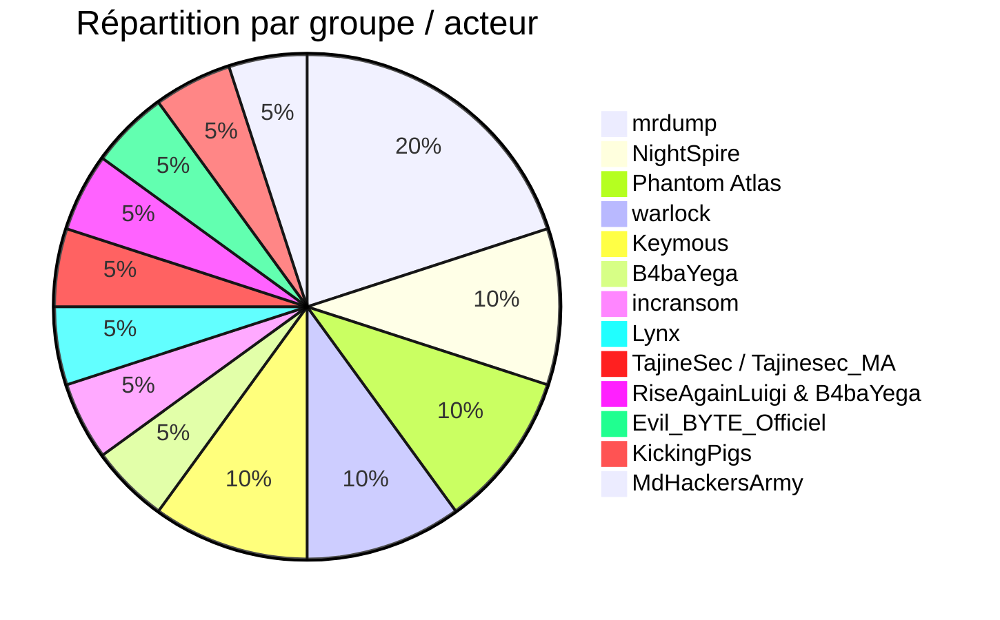
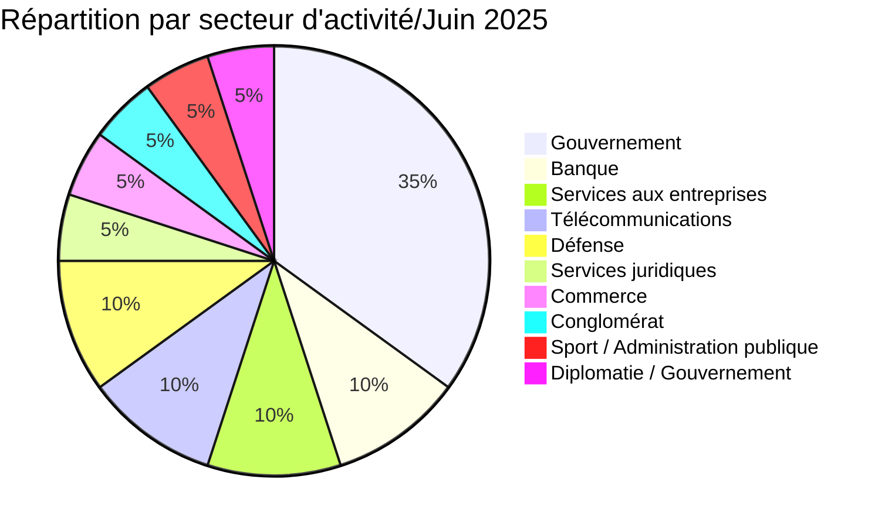
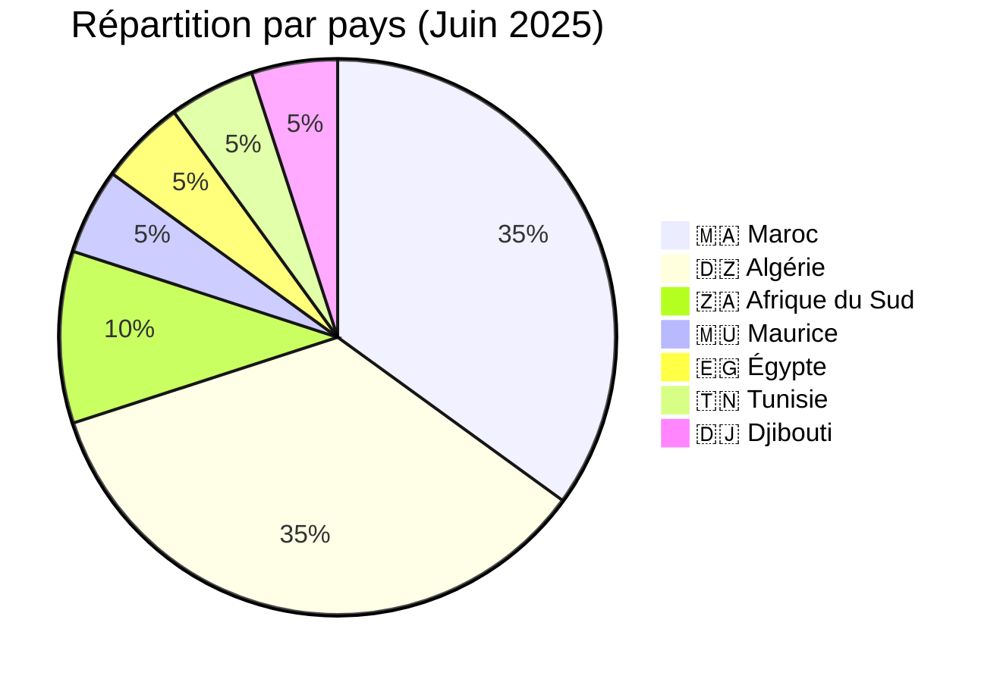
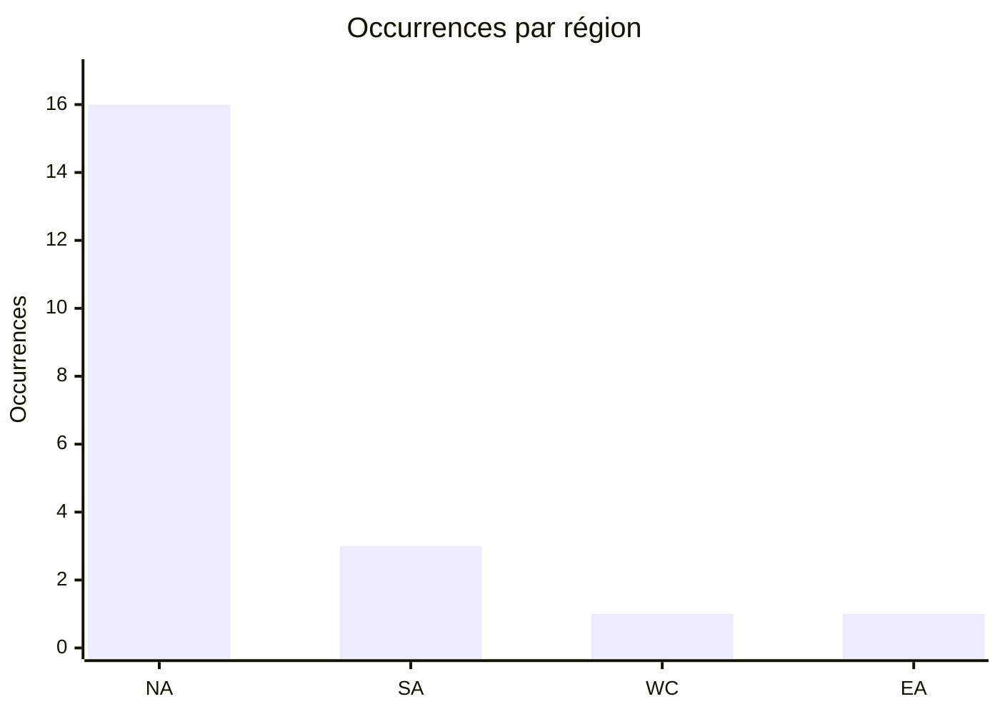
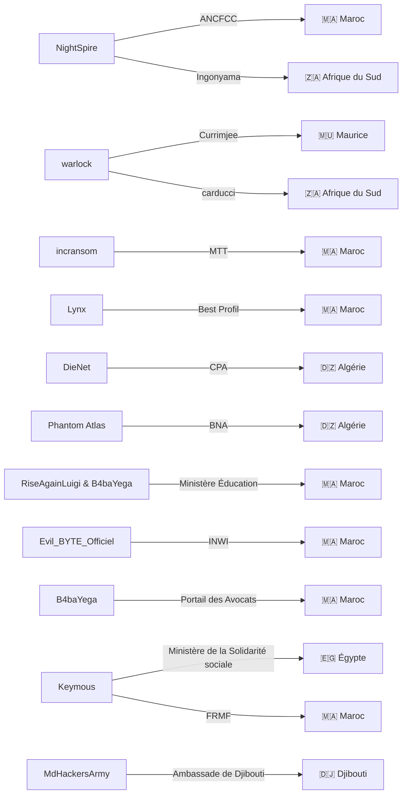
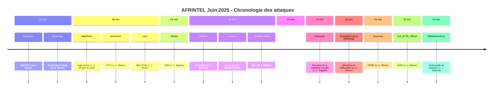

[](https://github.com/Hatchepsoute/AFRINTEL)


 
# Rapport CTI : Cyberattaques en Afrique - Juin 2025
👉🏾 [**English version available here**](./README.md)

## 1. Introduction
Ce rapport de Cyber Threat Intelligence (CTI) présente une analyse détaillée des cyberattaques survenues en Afrique durant le mois de juin 2025. Les informations sont issues de sources OSINT et de sites de fuites de groupes ransomware, compilées dans le cadre du projet *AFRINTEL*. L'objectif est de fournir une vision claire des tendances, des acteurs menaçants, des secteurs ciblés et des indicateurs de compromission associés.

## 2. Résumé exécutif
- **Nombre total d'attaques recensées** : 21
- **Acteurs les plus actifs** : mrdump (4 attaques), NightSpire (2), Phantom Atlas (2), warlock (2), Keymous (2), B4baYega (1), incransom (1), Lynx (1), TajineSec / Tajinesec_MA (1), RiseAgainLuigi & B4baYega (1), Evil_BYTE_Officiel (1), KickingPigs (1), MdHackersArmy (1).
- **Secteurs les plus ciblés** : Gouvernement / Administrations (7), Banque / Finance (2), Services aux entreprises (2), Télécommunications (2), Défense (2), Services juridiques (1), Commerce de détail (1), Conglomérat (1), Sport / Administration publique (1), Diplomatie / Gouvernement (1).
- **Pays les plus touchés** : Maroc (7), Algérie (7), Afrique du Sud (2), Maurice (1), Égypte (1), Tunisie (1), Djibouti (1).
- **Volumes de données exfiltrés notables** : 90 Go (BNA Algérie), 26 Go (Best Profil Maroc), 3,1 Go (ANCFCC Maroc), 237 éléments revendiqués / 26 enregistrements échantillon (Ministère de la Solidarité sociale, Égypte), 4 289 enregistrements revendiqués / une trentaine d'enregistrements échantillon (FRMF, Maroc). Ambassade de Djibouti au Maroc : revendication non vérifiée, sans description ni volume de données divulgués.

## 3. Statistiques clés

### 3.1 Répartition par groupe/acteur
| Groupe/Acteur | Nombre d'attaques |
|---------------|-------------------|
| mrdump        | 4                 |
| NightSpire    | 2                 |
| Phantom Atlas | 2                 |
| warlock       | 2                 |
| Keymous       | 2                 |
| B4baYega      | 1                 |
| incransom     | 1                 |
| Lynx          | 1                 |
| TajineSec / Tajinesec_MA | 1      |
| RiseAgainLuigi & B4baYega | 1 |
| Evil_BYTE_Officiel | 1          |
| KickingPigs   | 1                 |
| MdHackersArmy | 1                 |
| **Total**     | **20**            |


### 3.2 Répartition par secteur d'activité
| Secteur | Nombre d'attaques |
|---------|-------------------|
| Gouvernement / Administrations | 7 |
| Banque / Finance | 2 |
| Services aux entreprises | 2 |
| Télécommunications | 2 |
| Défense | 2 |
| Services juridiques | 1 |
| Commerce de détail | 1 |
| Conglomérat | 1 |
| Sport / Administration publique | 1 |
| Diplomatie / Gouvernement | 1 |
| **Total** | **20** |


### 3.3 Répartition par pays
| Pays | Nombre d'attaques |
|------|-------------------|
| 🇲🇦 Maroc | 7 |
| 🇩🇿 Algérie | 7 |
| 🇿🇦 Afrique du Sud | 2 |
| 🇲🇺 Maurice | 1 |
| 🇪🇬 Égypte | 1 |
| 🇹🇳 Tunisie | 1 |
| 🇩🇯 Djibouti | 1 |
| **Total** | **20** |



<!-- AFRINTEL_CURRENT_MODEL_START -->
### 3.4 Vue globale standardisée

| Pays | Ransomware | Exposition des données (fuites + accès) | Total | Distribution |
| :--- | ---: | ---: | ---: | :--- |
| 🇩🇿 Algérie | 0 | 7 | 7 |  🟦🟦🟦🟦🟦🟦🟦 |
| 🇲🇦 Maroc | 2 | 5 | 7 | 🟧🟧 🟦🟦🟦🟦🟦 |
| 🇿🇦 Afrique du Sud | 2 | 0 | 2 | 🟧🟧 |
| 🇩🇯 Djibouti | 0 | 1 | 1 |  🟦 |
| 🇪🇬 Égypte | 0 | 1 | 1 |  🟦 |
| 🇬🇭 Ghana | 0 | 1 | 1 |  🟦 |
| 🇲🇺 Maurice | 1 | 0 | 1 | 🟧 |
| 🇹🇳 Tunisie | 0 | 1 | 1 |  🟦 |

```pie
    title Types d’incidents
    "Ransomware" : 5
    "Fuites de données + ventes d’accès" : 16
```

### Vue agrégée mensuelle de l’exposition

La vue CTI mensuelle regroupe les fuites de données et les ventes d’accès sous **exposition des données** : **16 fiches** (76,2% du corpus mensuel). Les fiches sources restent la référence ; une vente d’accès ne prouve pas à elle seule l’exfiltration de données.


### Répartition géographique par région

| Région | Occurrences | Ransomware | Exposition des données (fuites + accès) | Distribution |
| :--- | ---: | ---: | ---: | :--- |
| Afrique du Nord | 16 | 2 | 14 | 🟧🟧 🟦🟦🟦🟦🟦🟦🟦🟦🟦🟦🟦🟦🟦🟦 |
| Afrique australe | 3 | 3 | 0 | 🟧🟧🟧 |
| Afrique de l’Ouest et centrale | 1 | 0 | 1 |  🟦 |
| Afrique de l’Est | 1 | 0 | 1 |  🟦 |


Légende : NA = Afrique du Nord ; SA = Afrique australe ; WC = Afrique de l’Ouest et centrale ; EA = Afrique de l’Est

### Répartition sectorielle

| Secteur | Fiches | Part | Activité |
| :--- | ---: | ---: | :--- |
| Gouvernement / administration | 11 | 52,4% | ██████████ |
| Finance / banque | 3 | 14,3% | ███ |
| Services professionnels | 3 | 14,3% | ███ |
| Technologies / informatique | 3 | 14,3% | ███ |
| Commerce / e-commerce | 1 | 4,8% | █ |

### Acteurs / groupes les plus présents

| Acteur / Groupe | Fiches | Activité |
| :--- | ---: | :--- |
| Keymous | 2 | ██████████ |
| Phantom Atlas | 2 | ██████████ |
| mrdump, post published on a cybercriminal forum (DarkForums) | 2 | ██████████ |
| nightspire | 2 | ██████████ |
| warlock | 2 | ██████████ |
| 0x0day, post published on the cybercriminal forum DarkForums | 1 | █████ |
| B4baYega | 1 | █████ |
| Evil_BYTE_Officiel | 1 | █████ |
| KickingPigs | 1 | █████ |
| MdHackersArmy (post published by Doxeur23azi on a cybercriminal forum, DarkForums) | 1 | █████ |
<!-- AFRINTEL_CURRENT_MODEL_END -->
## 4. Détail des attaques par groupe/acteur
### 4.1 NightSpire (2 attaques)
- **02/06/2025** : ANCFCC (Maroc, gouvernement) – 3,1 Go de données exfiltrées (10 080 certificats fonciers).
- **06/06/2025** : Ingonyama Trust Board (Afrique du Sud, administration foncière).

*Remarque* : NightSpire a ciblé deux organismes de gestion foncière dans deux pays différents, avec des volumes de données sensibles importants.

### 4.2 warlock (2 attaques)
- **11/06/2025** : Currimjee (Maurice, conglomérat)
- **11/06/2025** : carducci (Afrique du Sud, commerce de détail)

*Remarque* : warlock a frappé le même jour deux entreprises dans des secteurs différents, montrant une capacité d'opérations simultanées.

### 4.3 incransom (1 attaque)
- **06/06/2025** : MTT EXPERTISES (Maroc, services aux entreprises)

### 4.4 Lynx (1 attaque)
- **06/06/2025** : Best Profil (Maroc, ressources humaines) – 26 Go exfiltrés, données publiées après échec des négociations.

### 4.5 DieNet (hacktivisme) (1 attaque)
- **08/06/2025** : Crédit Populaire d'Algérie (Algérie, banque) – fuite d'échantillons de données.

### 4.6 Phantom Atlas (1 attaque)
- **11/06/2025** : Banque Nationale d'Algérie (Algérie, banque) – 90 Go exfiltrés, publication partielle de 7 Go.

### 4.7 RiseAgainLuigi & B4baYega (1 attaque)
- **18/06/2025** : Ministère de l'Éducation Nationale (Maroc, gouvernement) – fuite de plus de 6 millions de dossiers d'élèves (plateforme Massar).

### 4.8 Evil_BYTE_Officiel (1 attaque)
- **20/06/2025** : INWI (Maroc, télécommunications) – fuite massive de données personnelles (PII, hashs de mots de passe).

### 4.9 B4baYega (1 attaque)
- **02/06/2025** : Portail de l'Ordre des Avocats - avocatsmaroc.com / mossaada.ma (Maroc, services juridiques) – compromission d'une application de gestion de dossiers juridiques ; code source et sauvegardes SQL diffusés aux côtés d'une archive protégée par mot de passe.

- **13/06/2025** :  (Nigeria, défense) – exfiltration et mise en vente de plus de 200 documents sensibles.

### 4.11 Keymous (2 attaques)
- **14/06/2025** : Ministère de la Solidarité sociale (Égypte, gouvernement) – publication de forum revendiquant 237 éléments de documents confidentiels et d'informations personnelles sur des ministres, responsables gouvernementaux et représentants institutionnels de plusieurs pays africains, arabes et asiatiques ; un échantillon CSV de 26 enregistrements a été examiné par AFRINTEL.
- **19/06/2025** : FRMF (Maroc, sport / administration publique) – publication DarkForums revendiquant une base de données de joueurs et de personnel de la FRMF couvrant plus de 4 289 enregistrements nominatifs ; AFRINTEL a examiné un échantillon local de documents d'enregistrement FIFA Connect et de licence CAF Pro, ainsi que des extraits de tableur correspondant à la structure de champs revendiquée.

*Remarque* : Keymous a été actif à deux reprises en juin, ciblant un ministère gouvernemental et une fédération sportive nationale dans deux pays différents.

### 4.12 MdHackersArmy (1 attaque)
- **29/06/2025** : Ambassade de Djibouti au Maroc (Djibouti, diplomatie/gouvernement) – Claim - Unverified. Publication postée par Doxeur23azi sur DarkForums, attribuée à MdHackersArmy ; aucune description de données, échantillon ni volume divulgués.

### 4.13 Graphe acteur → victime → pays

## 5. Analyse sectorielle
- **Gouvernement / Administrations** : 4 attaques (ANCFCC, Ingonyama, Ministère Éducation, Ministère de la Solidarité sociale). Les acteurs NightSpire, le duo RiseAgainLuigi/B4baYega et Keymous ont ciblé des institutions clés, avec des fuites de données sensibles (certificats fonciers, dossiers scolaires, données personnelles de responsables gouvernementaux/institutionnels).
- **Banque / Finance** : 2 attaques (CPA, BNA) par DieNet et Phantom Atlas, deux groupes hacktivistes, avec des volumes importants (90 Go pour la BNA).
- **Services aux entreprises** : 2 attaques (MTT EXPERTISES, Best Profil) par incransom et Lynx, ce dernier ayant publié 26 Go de données RH.
- **Services juridiques** : 1 attaque (Portail de l'Ordre des Avocats) par B4baYega, exposant le code source et les sauvegardes SQL d'une application de gestion de dossiers utilisée par des avocats marocains.
- **Télécommunications** : 1 attaque (INWI) par Evil_BYTE_Officiel, exposant des données personnelles d'abonnés.
- **Commerce de détail** : 1 attaque (carducci) par warlock.
- **Conglomérat** : 1 attaque (Currimjee) par warlock.
- **Défense** : , avec mise en vente de documents sensibles.
- **Sport / Administration publique** : 1 attaque (FRMF) par Keymous, exposant des échantillons de dossiers d'enregistrement et de licence de joueurs et de personnel de la fédération.
- **Diplomatie / Gouvernement** : 1 revendication non vérifiée (Ambassade de Djibouti au Maroc) attribuée à MdHackersArmy, concernant la représentation diplomatique d'un État africain dans un autre pays africain.

## 6. Analyse géographique
- **Maroc** : 7 attaques, touchant des secteurs variés : gouvernement (ANCFCC, Ministère Éducation), services (MTT, Best Profil), services juridiques (Portail des Avocats), télécoms (INWI), fédération sportive (FRMF). Le Maroc est de loin le pays le plus ciblé du mois.
- **Algérie** : 2 attaques visant le secteur bancaire (CPA, BNA), avec des volumes de données très importants.
- **Afrique du Sud** : 2 attaques (Ingonyama, carducci) dans l'administration foncière et le commerce.
- **Maurice** : 1 attaque sur un conglomérat historique (Currimjee).
- **Égypte** : 1 publication de forum revendiquant des données d'un ministère des affaires sociales, impliquant des informations personnelles de responsables gouvernementaux et institutionnels de plusieurs pays ; AFRINTEL a examiné un échantillon de 26 enregistrements.
- **Djibouti** : 1 revendication non vérifiée (Ambassade de Djibouti au Maroc) attribuée à MdHackersArmy, visant une représentation diplomatique djiboutienne implantée au Maroc plutôt qu'une entité domestique.

L'Afrique du Nord (Maroc, Algérie, Égypte) concentre 10 attaques sur 14, confirmant la pression persistante sur cette région.
### 6.2 Chronologie des attaques

## 7. TTPs observées
- **Exfiltration massive** : volumes importants pour la BNA (90 Go), Best Profil (26 Go), ANCFCC (3,1 Go).
- **Ciblage d'institutions gouvernementales** : ANCFCC, Ingonyama, Ministère Éducation, .
- **Utilisation de l'hacktivisme** : DieNet et Phantom Atlas revendiquent des fuites à caractère politique (ex: "représailles").
- **Double extorsion / publication** : Lynx a publié les données de Best Profil après échec des négociations.
- **Exploitation de données personnelles** : fuite de PII (INWI, Massar) et de documents sensibles ().
- **Diversité des acteurs** : ransomwares traditionnels (incransom, Lynx, warlock) et groupes hacktivistes.

## 8. Recommandations
- **Maroc** : renforcer la sécurité des infrastructures gouvernementales (ANCFCC, Ministère Éducation) et des opérateurs télécoms (INWI). Mettre en place une surveillance des fuites de données.
- **Algérie** : les banques (CPA, BNA) doivent revoir leurs protocoles de sécurité et segmenter leurs réseaux pour limiter l'exfiltration massive.
- **Afrique du Sud** : protéger les données foncières (Ingonyama) et les bases de données clients (carducci).
- **Secteur de la défense** : la  doit enquêter sur la fuite de documents classifiés et renforcer les contrôles d'accès.
- **Tous secteurs** : sensibiliser les employés aux risques de phishing, mettre en place l'authentification multi-facteurs et des sauvegardes hors ligne.

## 9. Conclusion
Juin 2025 a été marqué par une forte activité au Maroc, avec des attaques visant des institutions gouvernementales et des entreprises stratégiques. La présence de groupes hacktivistes (DieNet, Phantom Atlas) à côté de ransomwares traditionnels montre une diversification des menaces. Les fuites massives de données (BNA, Best Profil) et les atteintes à la défense nigériane soulignent l'urgence d'une coopération régionale en matière de cybersécurité. Une revendication très peu documentée visant l'ambassade de Djibouti au Maroc illustre par ailleurs que les représentations diplomatiques africaines à l'étranger restent exposées à des revendications opportunistes, même en l'absence de données vérifiables.

## ✍🏿 Auteur
*Adama ASSIONGBON*  
*Consultant SOC & Cyber Threat Intelligence*  
[LinkedIn Profile](https://www.linkedin.com/in/adama-assiongbon-9029893a/)

---
*AFRINTEL - Initiative ouverte de veille CTI sur l’Afrique*
