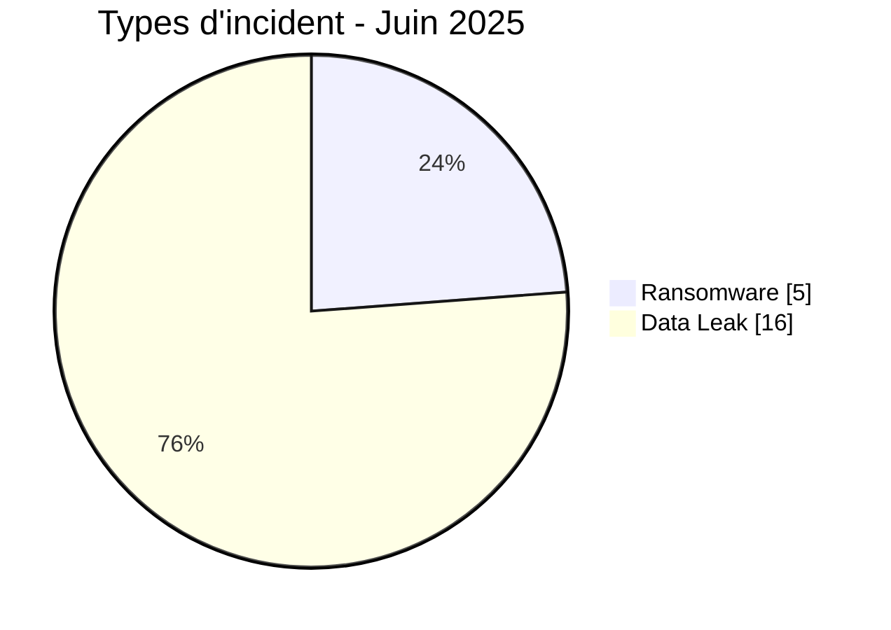

# Rapport CTI AFRINTEL - Cybermenaces en Afrique - Juin 2025

👉🏾 [English version](./README.md)

   

## 1. Synthèse exécutive

En Juin 2025, AFRINTEL documente **21 cyberincidents** affectant des organisations et services numériques dans **8 pays africains**.

Le paysage est dominé par **Data Leak avec 16 fiches (76,2 %)**, suivi de **Ransomware avec 5 (23,8 %)**.

La concentration géographique est marquée : **Maroc (7)**, **Algérie (7)**, **Afrique du Sud (2)** représentent ensemble **16 fiches, soit 76,2 % du mois**. Cette concentration doit être interprétée comme la visibilité du corpus AFRINTEL et non comme un taux national exhaustif de compromission.

Sur le plan sectoriel, les catégories les plus représentées sont **Gouvernement / Administration (9)**, **Services professionnels / Business (3)**, **Finance / Banque (3)**. Les labels d'acteurs les plus fréquents sont `mrdump` (4), `nightspire` (2), `Phantom Atlas` (2). `Unknown`, lorsqu'il apparaît, désigne une absence d'attribution et non un groupe cybercriminel.

La maturité des preuves reste variable : **19 fiches** relèvent de claims non vérifiés ou accompagnés d'échantillons. AFRINTEL conserve une séparation stricte entre **faits observés, revendications, corroborations, confirmations officielles et inconnues techniques**.

Par rapport à Mai, le volume mensuel **diminue de 5 fiches**. Les variations les plus visibles concernent Ransomware 13->5 (-8), Data Leak 9->16 (+7), Defacement 2->0 (-2).

> **Note de lecture :** les chiffres AFRINTEL décrivent les incidents documentés et la visibilité des menaces observées. Ils ne constituent pas une mesure exhaustive de toutes les cyberattaques réellement survenues en Afrique.

### 1.1 Comparaison avec le mois précédent

| Indicateur | Mai 2025 | Juin 2025 | Évolution |
|---|---:|---:|---:|
| Total incidents | 26 | 21 | **-5 (-19,2 %)** |
| Ransomware | 13 | 5 | **-8 (-61,5 %)** |
| Data Leak | 9 | 16 | **+7 (+77,8 %)** |
| Access Sale | 0 | 0 | **Stable** |
| DDoS | 0 | 0 | **Stable** |
| Defacement | 2 | 0 | **-2 (-100,0 %)** |
| Account Takeover | 1 | 0 | **-1 (-100,0 %)** |
| System Intrusion | 1 | 0 | **-1 (-100,0 %)** |
| Malware | 0 | 0 | **Stable** |
| Operational Fraud | 0 | 0 | **Stable** |

## 2. Méthodologie

- **Périmètre :** 54 pays africains ; période de référence : Juin 2025.
- **Source de vérité :** couple validé `victims_FR.md` / `victims.md`.
- **Classification :** Ransomware, Data Leak, Access Sale, DDoS, Defacement, Account Takeover, System Intrusion, Malware et Operational Fraud.
- **Comptage :** une fiche canonique correspond à un cyberincident documenté ; les dossiers en investigation restent hors statistiques.
- **Chronologie :** `Date de l'incident` et `Date de publication initiale` sont séparées. Une publication ultérieure ne déplace pas artificiellement un incident vers un autre mois lorsque la chronologie est suffisamment établie.
- **Dates incertaines :** lorsqu'un jour exact n'est pas connu, le mois ou la fenêtre soutenue par les preuves est conservé.
- **Sources :** les liens publics sont conservés pour les incidents complémentaires identifiés par recherche OSINT/web ; ils ne sont pas imposés rétroactivement aux observations historiques ou Dark Web directes.
- **Preuve :** type d'incident, statut, confiance, impact et provenance restent des dimensions distinctes.
- **Secteurs :** normalisation calculée une seule fois à partir du corpus structuré, puis utilisée à l'identique en FR et EN.
- **Limite :** les fréquences reflètent la visibilité AFRINTEL et non l'ensemble des compromissions réelles sur le continent.

## 3. Vue d'ensemble et types d'incident

| Indicateur | Valeur |
|---|---:|
| Incidents documentés | **21** |
| Pays représentés | **8** |
| Régions représentées | **5** |
| Premier pays | **Maroc (7)** |
| Premier secteur | **Gouvernement / Administration (9)** |
| Premier label acteur | **mrdump (4)** |

| Type d'incident | Fiches | Part |
|---|---:|---:|
| Ransomware | 5 | 23,8 % |
| Data Leak | 16 | 76,2 % |
| Access Sale | 0 | 0,0 % |
| DDoS | 0 | 0,0 % |
| Defacement | 0 | 0,0 % |
| Account Takeover | 0 | 0,0 % |
| System Intrusion | 0 | 0,0 % |
| Malware | 0 | 0,0 % |
| Operational Fraud | 0 | 0,0 % |
| **Total** | **21** | **100 %** |

## 4. Répartition géographique

| Pays | Total | Ransomware | Data Leak | Access Sale | DDoS | Defacement | Account Takeover | System Intrusion | Malware |
|---|---:|---:|---:|---:|---:|---:|---:|---:|---:|
| Maroc | **7** | 2 | 5 | 0 | 0 | 0 | 0 | 0 | 0 |
| Algérie | **7** | 0 | 7 | 0 | 0 | 0 | 0 | 0 | 0 |
| Afrique du Sud | **2** | 2 | 0 | 0 | 0 | 0 | 0 | 0 | 0 |
| Ghana | **1** | 0 | 1 | 0 | 0 | 0 | 0 | 0 | 0 |
| Maurice | **1** | 1 | 0 | 0 | 0 | 0 | 0 | 0 | 0 |
| Égypte | **1** | 0 | 1 | 0 | 0 | 0 | 0 | 0 | 0 |
| Tunisie | **1** | 0 | 1 | 0 | 0 | 0 | 0 | 0 | 0 |
| Djibouti | **1** | 0 | 1 | 0 | 0 | 0 | 0 | 0 | 0 |
| **Total** | **21** | **5** | **16** | **0** | **0** | **0** | **0** | **0** | **0** |

> `Operational Fraud = 0` ce mois-ci ; la colonne est omise pour préserver la lisibilité.

## 5. Répartition régionale

| Région | Fiches | Part |
|---|---:|---:|
| Afrique du Nord | 16 | 76,2 % |
| Afrique australe | 2 | 9,5 % |
| Afrique de l'Ouest | 1 | 4,8 % |
| Océan Indien | 1 | 4,8 % |
| Afrique de l'Est | 1 | 4,8 % |
| **Total** | **21** | **100 %** |

La région la plus représentée est **Afrique du Nord avec 16 fiches (76,2 %)**.

## 6. Impact sectoriel

| Secteur | Fiches | Part | Activité |
|---|---:|---:|---|
| Gouvernement / Administration | 9 | 42,9 % | █████████ |
| Services professionnels / Business | 3 | 14,3 % | ███ |
| Finance / Banque | 3 | 14,3 % | ███ |
| Télécommunications | 2 | 9,5 % | ██ |
| Défense / Sécurité | 2 | 9,5 % | ██ |
| Non précisé | 1 | 4,8 % | █ |
| Commerce / E-commerce | 1 | 4,8 % | █ |
| **Total** | **21** | **100 %** | |

## 7. Acteurs / groupes

`Unknown` correspond à une absence d'attribution, pas à un acteur.

| Acteur / Groupe | Fiches | Activité |
|---|---:|---|
| mrdump | 4 | ████ |
| nightspire | 2 | ██ |
| Phantom Atlas | 2 | ██ |
| warlock | 2 | ██ |
| Keymous | 2 | ██ |
| B4baYega | 1 | █ |
| incransom | 1 | █ |
| lynx | 1 | █ |
| TajineSec / Tajinesec_MA | 1 | █ |
| 0x0day | 1 | █ |
| RiseAgainLuigi & B4baYega | 1 | █ |
| Evil_BYTE_Officiel | 1 | █ |
| KickingPigs | 1 | █ |
| MdHackersArmy | 1 | █ |

## 8. Maturité des preuves

| Maturité de preuve | Fiches | Part |
|---|---:|---:|
| Claim - Unverified | 9 | 42,9 % |
| Claim - Data Sample Published | 10 | 47,6 % |
| Data Fully Published | 2 | 9,5 % |
| **Total** | **21** | **100 %** |

Les statuts de preuve décrivent le niveau de validation disponible ; ils ne changent pas le type technique de l'incident.

## 9. Chronologie

```mermaid
timeline
    title AFRINTEL - Juin 2025
    02 Juin 2025 : ANCFCC (Agence Nationale de la Conservation Foncière)
    02 Juin 2025 : Portail de l'Ordre des Avocats (avocatsmaroc.com / mossaada.ma)
    06 Juin 2025 : MTT EXPERTISES
    06 Juin 2025 : Ingonyama Trust Board
    06 Juin 2025 : Best Profil (bestprofil.ma)
    08 Juin 2025 : Crédit Populaire d’Algérie (cpa-bank.dz)
    09 Juin 2025 : Algérie Télécom (algerietelecom.dz)
    09 Juin 2025 : Priority Insurance Company Limited
    11 Juin 2025 : Currimjee Jeewanjee & Co
    11 Juin 2025 : Banque Nationale d’Algérie (bna.dz)
    11 Juin 2025 : carducci
    14 Juin 2025 : Ministère de la Solidarité sociale
    14 Juin 2025 : Ministère de la Jeunesse et des Sports (MJS) / Directions de la Jeunesse et des Sports (DJS)
    18 Juin 2025 : Ministère de la Défense Nationale (MDN)
    18 Juin 2025 : Ministère de l'Éducation Nationale (men.gov.ma / massar.men.gov.ma)
    19 Juin 2025 : Direction Générale des Douanes (DGD) / Service de contrôle des exportations et importations
    19 Juin 2025 : Fédération Royale Marocaine de Football (FRMF)
    20 Juin 2025 : INWI (inwi.ma)
    20 Juin 2025 : Ministère de la Défense Nationale / Forces armées
    26 Juin 2025 : Ministère des Transports
    29 Juin 2025 : Ambassade de Djibouti au Maroc
```

## 10. Analyse CTI mensuelle

### Ransomware

**5 fiches** sont classées Ransomware. Principaux pays : Maroc (2), Afrique du Sud (2), Maurice (1). Une publication sur un leak site ne prouve pas, à elle seule, le chiffrement ou l'exfiltration complète.

### Data Leak

**16 fiches** sont classées Data Leak. Principaux pays : Algérie (7), Maroc (5), Ghana (1). AFRINTEL distingue les données effectivement observées des volumes globaux revendiqués.

## 11. Incidents notables

| Pays | Organisation | Type | Statut | Impact | Confiance |
|---|---|---|---|---|---|
| Maroc | MTT EXPERTISES | Ransomware | Claim - Data Sample Published | Level 3 | Medium |
| Maroc | ANCFCC (Agence Nationale de la Conservation Foncière) | Data Leak | Claim - Data Sample Published | N/A | N/A |
| Maroc | Portail de l'Ordre des Avocats (avocatsmaroc.com / mossaada.ma) | Data Leak | Claim - Data Sample Published | N/A | N/A |
| Afrique du Sud | Ingonyama Trust Board | Ransomware | Claim - Unverified | N/A | N/A |
| Maroc | Best Profil (bestprofil.ma) | Ransomware | Data Fully Published | N/A | N/A |

> Ce tableau met en avant jusqu'à cinq fiches selon le niveau d'impact, la confirmation et la confiance structurés. Il ne constitue pas un classement absolu de gravité.

## 12. Principaux enseignements et lacunes de renseignement

- **Concentration géographique :** Maroc représente 7 fiches (33,3 %), devant Algérie (7) et Afrique du Sud (2).
- **Structure de menace :** Data Leak est le premier type avec 16 fiches, suivi de Ransomware (5).
- **Secteurs :** Gouvernement / Administration (9) et Services professionnels / Business (3) concentrent la plus forte visibilité.
- **Acteurs :** les labels les plus fréquents sont mrdump (4), nightspire (2) et Phantom Atlas (2).
- **Preuve :** 19 fiches reposent sur des claims non vérifiés ou accompagnés d'un échantillon ; ces statuts ne valent pas confirmation technique complète.

### Intelligence gaps

- vecteur d'accès initial souvent non public ;
- date technique exacte de compromission parfois inconnue ;
- volumes revendiqués rarement vérifiables intégralement ;
- attribution technique souvent limitée au pseudonyme ou label de publication ;
- informations publiques sur remédiation, cause racine et conclusions DFIR encore limitées.

Ces lacunes doivent guider la collecte sans être remplacées par des hypothèses.

## 13. Recommandations

### Organisations

- imposer MFA résistante au phishing sur les comptes privilégiés, VPN, messagerie, réseaux sociaux et consoles d'administration ;
- appliquer PAM, moindre privilège, segmentation et rotation des secrets ;
- maintenir des sauvegardes immuables et tester la restauration ;
- renforcer les applications publiques, API et interfaces administratives ;
- formaliser réponse à incident et notification des violations de données.

### SOC et détection

- surveiller les authentifications anormales, changements MFA, créations de comptes privilégiés et élévations de rôles ;
- détecter lectures massives de bases, exports inhabituels, créations d'archives et transferts sortants volumineux ;
- corréler EDR, IAM, VPN, WAF, proxy, DNS, cloud et journaux applicatifs ;
- distinguer DDoS, intrusion interne, compromission de compte et fuite de données pour éviter les conclusions non étayées.

### CTI

- conserver séparément date d'incident, publication initiale, première observation, échantillon, divulgation et confirmation ;
- suivre republications et reventes sans les compter automatiquement comme nouvelles compromissions ;
- maintenir la hiérarchie de preuve entre claim, corroboration et confirmation ;
- valider la parité FR/EN avant toute génération de statistiques.

## 14. Conclusion

Le mois de **Juin 2025** compte **21 cyberincidents documentés** dans **8 pays africains**. La lecture mensuelle montre que la valeur CTI ne réside pas seulement dans le volume, mais dans la distinction entre **type d'incident, chronologie, niveau de preuve, géographie, secteur et acteur**.

Le rapport conserve ainsi une photographie structurée de la menace observable tout en maintenant les revendications, corroborations, confirmations et inconnues à leur niveau de preuve réel.

👉🏾 [Voir les victimes du mois](./victims_FR.md)

**AFRINTEL** - TLP:CLEAR
