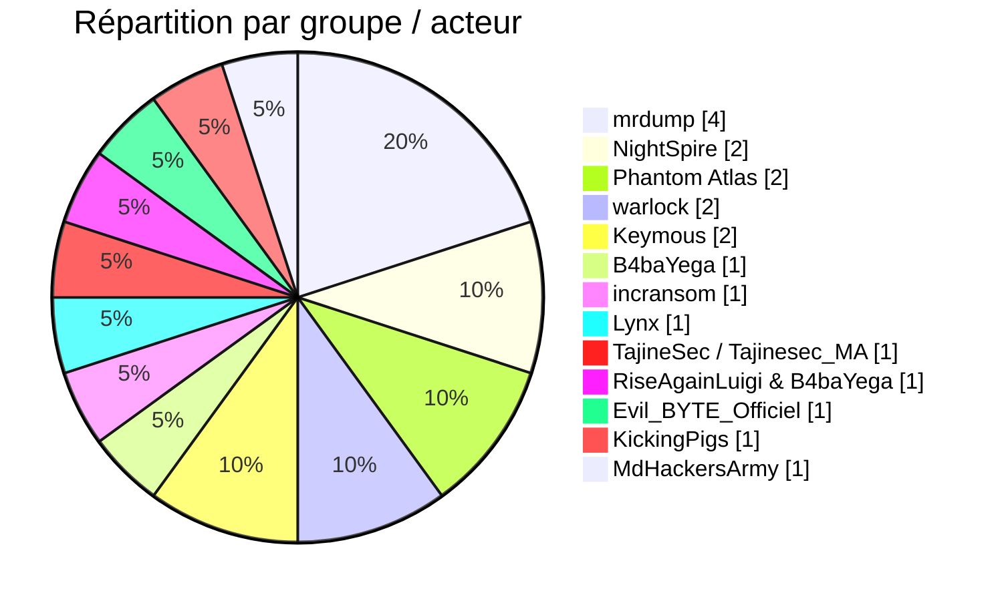
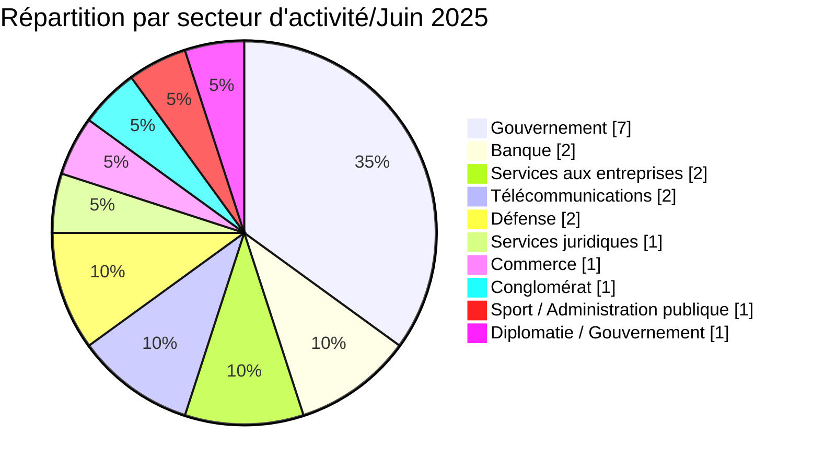
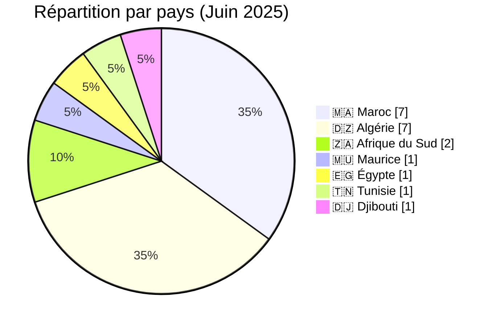
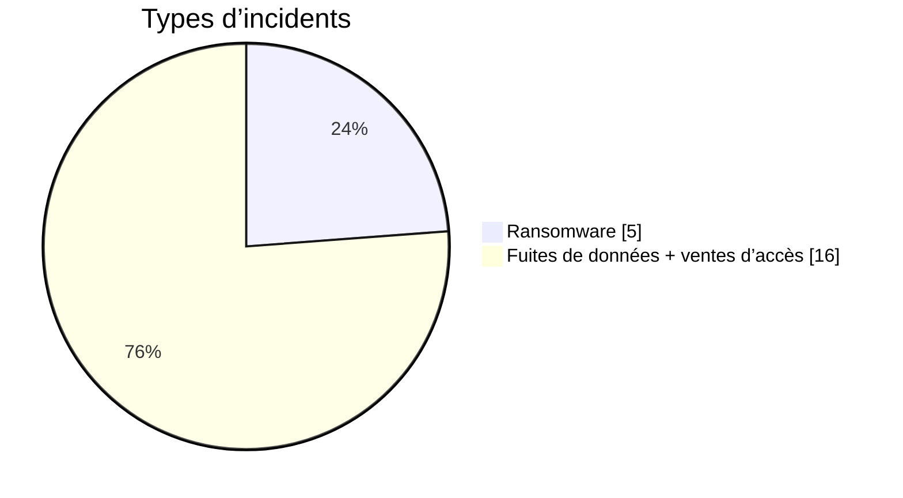
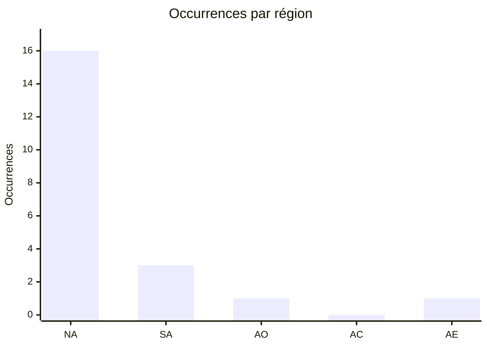
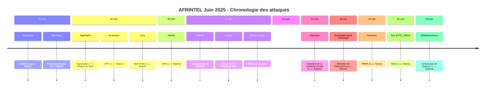

 
# Rapport CTI : Cyberattaques en Afrique - Juin 2025
👉🏾 [**English version available here**](./README.md)

## 1. Résumé exécutif
- **Nombre total d'attaques recensées** : 21
- **Acteurs les plus actifs** : mrdump (4 attaques), NightSpire (2), Phantom Atlas (2), warlock (2), Keymous (2), B4baYega (1), incransom (1), Lynx (1), TajineSec / Tajinesec_MA (1), RiseAgainLuigi & B4baYega (1), Evil_BYTE_Officiel (1), KickingPigs (1), MdHackersArmy (1).
- **Secteurs les plus ciblés** : Gouvernement / Administrations (7), Banque / Finance (2), Services aux entreprises (2), Télécommunications (2), Défense (2), Services juridiques (1), Commerce de détail (1), Conglomérat (1), Sport / Administration publique (1), Diplomatie / Gouvernement (1).
- **Pays les plus touchés** : Maroc (7), Algérie (7), Afrique du Sud (2), Maurice (1), Égypte (1), Tunisie (1), Djibouti (1).
- **Volumes de données exfiltrés notables** : 90 Go (BNA Algérie), 26 Go (Best Profil Maroc), 3,1 Go (ANCFCC Maroc), 237 éléments revendiqués / 26 enregistrements échantillon (Ministère de la Solidarité sociale, Égypte), 4 289 enregistrements revendiqués / une trentaine d'enregistrements échantillon (FRMF, Maroc). Ambassade de Djibouti au Maroc : revendication non vérifiée, sans description ni volume de données divulgués.

## 2. Méthodologie
Ce rapport de Cyber Threat Intelligence (CTI) présente une analyse détaillée des cyberattaques survenues en Afrique durant le mois de juin 2025. Les informations sont issues de sources OSINT et de sites de fuites de groupes ransomware, compilées dans le cadre du projet *AFRINTEL*. L'objectif est de fournir une vision claire des tendances, des acteurs menaçants, des secteurs ciblés et des indicateurs de compromission associés.

## 3. Vue d'ensemble

### 3.1 Répartition par groupe/acteur
| Groupe/Acteur | Nombre d'attaques |
|---------------|-------------------|
| mrdump        | 4                 |
| NightSpire    | 2                 |
| Phantom Atlas | 2                 |
| warlock       | 2                 |
| Keymous       | 2                 |
| B4baYega      | 1                 |
| incransom     | 1                 |
| Lynx          | 1                 |
| TajineSec / Tajinesec_MA | 1      |
| RiseAgainLuigi & B4baYega | 1 |
| Evil_BYTE_Officiel | 1          |
| KickingPigs   | 1                 |
| MdHackersArmy | 1                 |
| **Total**     | **20**            |

### 3.2 Répartition par secteur d'activité
| Secteur | Nombre d'attaques |
|---------|-------------------|
| Gouvernement / Administrations | 7 |
| Banque / Finance | 2 |
| Services aux entreprises | 2 |
| Télécommunications | 2 |
| Défense | 2 |
| Services juridiques | 1 |
| Commerce de détail | 1 |
| Conglomérat | 1 |
| Sport / Administration publique | 1 |
| Diplomatie / Gouvernement | 1 |
| **Total** | **20** |

### 3.3 Répartition par pays
| Pays | Nombre d'attaques |
|------|-------------------|
| 🇲🇦 Maroc | 7 |
| 🇩🇿 Algérie | 7 |
| 🇿🇦 Afrique du Sud | 2 |
| 🇲🇺 Maurice | 1 |
| 🇪🇬 Égypte | 1 |
| 🇹🇳 Tunisie | 1 |
| 🇩🇯 Djibouti | 1 |
| **Total** | **20** |

<!-- AFRINTEL_CURRENT_MODEL_START -->
### 3.4 Vue globale standardisée

| Pays | Ransomware | Exposition des données (fuites + accès) | Total | Distribution |
| :--- | ---: | ---: | ---: | :--- |
| 🇩🇿 Algérie | 0 | 7 | 7 |  🟦🟦🟦🟦🟦🟦🟦 |
| 🇲🇦 Maroc | 2 | 5 | 7 | 🟧🟧 🟦🟦🟦🟦🟦 |
| 🇿🇦 Afrique du Sud | 2 | 0 | 2 | 🟧🟧 |
| 🇩🇯 Djibouti | 0 | 1 | 1 |  🟦 |
| 🇪🇬 Égypte | 0 | 1 | 1 |  🟦 |
| 🇬🇭 Ghana | 0 | 1 | 1 |  🟦 |
| 🇲🇺 Maurice | 1 | 0 | 1 | 🟧 |
| 🇹🇳 Tunisie | 0 | 1 | 1 |  🟦 |

### Vue agrégée mensuelle de l’exposition

La vue CTI mensuelle regroupe les fuites de données et les ventes d’accès sous **exposition des données** : **16 fiches** (76,2% du corpus mensuel). Les fiches sources restent la référence ; une vente d’accès ne prouve pas à elle seule l’exfiltration de données.

### Répartition géographique par région

| Région | Occurrences | Ransomware | Exposition des données (fuites + accès) | Distribution |
| :--- | ---: | ---: | ---: | :--- |
| Afrique du Nord | 16 | 2 | 14 | 🟧🟧 🟦🟦🟦🟦🟦🟦🟦🟦🟦🟦🟦🟦🟦🟦 |
| Afrique australe | 3 | 3 | 0 | 🟧🟧🟧 |
| Afrique de l’Ouest | 1 | 0 | 1 |  🟦 |
| Afrique centrale | 0 | 0 | 0 |  |
| Afrique de l’Est | 1 | 0 | 1 |  🟦 |

Légende : NA = Afrique du Nord ; SA = Afrique australe ; AO = Afrique de l’Ouest ; AC = Afrique centrale ; AE = Afrique de l’Est

### Répartition sectorielle

| Secteur | Fiches | Part | Activité |
| :--- | ---: | ---: | :--- |
| Gouvernement / administration | 11 | 52,4% | ██████████ |
| Finance / banque | 3 | 14,3% | ███ |
| Services professionnels | 3 | 14,3% | ███ |
| Technologies / informatique | 3 | 14,3% | ███ |
| Commerce / e-commerce | 1 | 4,8% | █ |

### Acteurs / groupes les plus présents

| Acteur / Groupe | Fiches | Activité |
| :--- | ---: | :--- |
| Keymous | 2 | ██████████ |
| Phantom Atlas | 2 | ██████████ |
| mrdump, post published on a cybercriminal forum (DarkForums) | 2 | ██████████ |
| nightspire | 2 | ██████████ |
| warlock | 2 | ██████████ |
| 0x0day, post published on the cybercriminal forum DarkForums | 1 | █████ |
| B4baYega | 1 | █████ |
| Evil_BYTE_Officiel | 1 | █████ |
| KickingPigs | 1 | █████ |
| MdHackersArmy (post published by Doxeur23azi on a cybercriminal forum, DarkForums) | 1 | █████ |
<!-- AFRINTEL_CURRENT_MODEL_END -->

### Comparaison avec le mois précédent

À partir des fiches incidents validées comme source de comptage, juin 2025 compte **21** incidents contre **21** le mois précédent (aucune variation de **0** ; **+0.0%**). Cette comparaison décrit les publications enregistrées par AFRINTEL et ne prouve pas à elle seule une évolution de l'activité des attaquants ni un impact confirmé sur les victimes.

| Indicateur | Mois précédent | Mois en cours | Variation |
|---|---:|---:|---:|
| Fiches incidents enregistrées | 21 | 21 | 0 (+0.0%) |

## 4. Analyse détaillée par type d'incident

## 5. Impact sectoriel
- **Gouvernement / Administrations** : 4 attaques (ANCFCC, Ingonyama, Ministère Éducation, Ministère de la Solidarité sociale). Les acteurs NightSpire, le duo RiseAgainLuigi/B4baYega et Keymous ont ciblé des institutions clés, avec des fuites de données sensibles (certificats fonciers, dossiers scolaires, données personnelles de responsables gouvernementaux/institutionnels).
- **Banque / Finance** : 2 attaques (CPA, BNA) par DieNet et Phantom Atlas, deux groupes hacktivistes, avec des volumes importants (90 Go pour la BNA).
- **Services aux entreprises** : 2 attaques (MTT EXPERTISES, Best Profil) par incransom et Lynx, ce dernier ayant publié 26 Go de données RH.
- **Services juridiques** : 1 attaque (Portail de l'Ordre des Avocats) par B4baYega, exposant le code source et les sauvegardes SQL d'une application de gestion de dossiers utilisée par des avocats marocains.
- **Télécommunications** : 1 attaque (INWI) par Evil_BYTE_Officiel, exposant des données personnelles d'abonnés.
- **Commerce de détail** : 1 attaque (carducci) par warlock.
- **Conglomérat** : 1 attaque (Currimjee) par warlock.
- **Défense** : , avec mise en vente de documents sensibles.
- **Sport / Administration publique** : 1 attaque (FRMF) par Keymous, exposant des échantillons de dossiers d'enregistrement et de licence de joueurs et de personnel de la fédération.
- **Diplomatie / Gouvernement** : 1 revendication non vérifiée (Ambassade de Djibouti au Maroc) attribuée à MdHackersArmy, concernant la représentation diplomatique d'un État africain dans un autre pays africain.

## 6. Profil des acteurs
### 6.1 Profil des acteurs

Les comptages d'acteurs et de sources restent ceux documentés en section 3 et dans les fiches victimes sources. L'attribution est conservée uniquement au niveau étayé par les éléments publics.

### 6.2 Évaluation du risque

Les pays et secteurs présentant plusieurs fiches ou des fonctions publiques, éducatives, sanitaires, financières ou critiques doivent faire l'objet d'une validation prioritaire. Il s'agit d'un signal de priorisation OSINT, et non d'une confirmation de compromission ou d'impact.

- **Maroc** : 7 attaques, touchant des secteurs variés : gouvernement (ANCFCC, Ministère Éducation), services (MTT, Best Profil), services juridiques (Portail des Avocats), télécoms (INWI), fédération sportive (FRMF). Le Maroc est de loin le pays le plus ciblé du mois.
- **Algérie** : 2 attaques visant le secteur bancaire (CPA, BNA), avec des volumes de données très importants.
- **Afrique du Sud** : 2 attaques (Ingonyama, carducci) dans l'administration foncière et le commerce.
- **Maurice** : 1 attaque sur un conglomérat historique (Currimjee).
- **Égypte** : 1 publication de forum revendiquant des données d'un ministère des affaires sociales, impliquant des informations personnelles de responsables gouvernementaux et institutionnels de plusieurs pays ; AFRINTEL a examiné un échantillon de 26 enregistrements.
- **Djibouti** : 1 revendication non vérifiée (Ambassade de Djibouti au Maroc) attribuée à MdHackersArmy, visant une représentation diplomatique djiboutienne implantée au Maroc plutôt qu'une entité domestique.

L'Afrique du Nord (Maroc, Algérie, Égypte) concentre 10 attaques sur 14, confirmant la pression persistante sur cette région.
### 6.2 Chronologie des attaques

## 7. Tendances et lacunes de renseignement
### 7.1 Tendances observées

Les répartitions par pays, secteur, acteur et type d'incident présentées ci-dessus constituent les tendances traçables du mois. Elles décrivent le corpus surveillé et n'établissent pas une campagne plus large sans éléments indépendants.

### 7.2 Lacunes de renseignement

Les rapports disponibles ne permettent pas d'établir pour chaque revendication le vecteur d'accès initial, l'exfiltration complète, la confirmation par la victime, la chronologie de remédiation ou l'impact opérationnel. Aucun détail DFIR public n'est inclus dans le corpus consulté pour cette fiche mensuelle ; cette absence est limitée aux sources examinées.

## 8. Cartographie MITRE ATT&CK (contextuelle)
| Phase | ID technique | Nom | Association à l'incident |
|---|---|---|---|
| Collecte | T1005 | Data from Local System | Correspondance contextuelle pour une collecte ou exposition revendiquée ; la méthode n'est pas confirmée. |
| Collecte | T1213 | Data from Information Repositories | Correspondance contextuelle pour les dossiers ou référentiels décrits publiquement ; la méthode n'est pas confirmée. |

Ces correspondances ATT&CK sont contextuelles et défensives. Elles ne prouvent pas qu'un acteur donné a utilisé la technique.

### Contextual observations
- **Exfiltration massive** : volumes importants pour la BNA (90 Go), Best Profil (26 Go), ANCFCC (3,1 Go).
- **Ciblage d'institutions gouvernementales** : ANCFCC, Ingonyama, Ministère Éducation, .
- **Utilisation de l'hacktivisme** : DieNet et Phantom Atlas revendiquent des fuites à caractère politique (ex: "représailles").
- **Double extorsion / publication** : Lynx a publié les données de Best Profil après échec des négociations.
- **Exploitation de données personnelles** : fuite de PII (INWI, Massar) et de documents sensibles ().
- **Diversité des acteurs** : ransomwares traditionnels (incransom, Lynx, warlock) et groupes hacktivistes.

## 9. Recommandations
- **Maroc** : renforcer la sécurité des infrastructures gouvernementales (ANCFCC, Ministère Éducation) et des opérateurs télécoms (INWI). Mettre en place une surveillance des fuites de données.
- **Algérie** : les banques (CPA, BNA) doivent revoir leurs protocoles de sécurité et segmenter leurs réseaux pour limiter l'exfiltration massive.
- **Afrique du Sud** : protéger les données foncières (Ingonyama) et les bases de données clients (carducci).
- **Secteur de la défense** : la  doit enquêter sur la fuite de documents classifiés et renforcer les contrôles d'accès.
- **Tous secteurs** : sensibiliser les employés aux risques de phishing, mettre en place l'authentification multi-facteurs et des sauvegardes hors ligne.

## 10. Recommandations SOC et tactiques
### Observé

Les sources publiques documentent des revendications, des publications ou du matériel exposé. Elles ne fournissent pas à elles seules une télémétrie prouvant une technique ou une compromission active.

### Hypothèses

L'abus d'identifiants, un stockage exposé, des contrôles d'accès faibles ou des privilèges d'export excessifs peuvent expliquer certaines expositions, mais chaque hypothèse doit être vérifiée par l'organisation concernée.

### Préventif

Surveiller les journaux d'identité, VPN, cloud, bases de données, messagerie et transferts sortants. Imposer une MFA résistante au phishing, le moindre privilège, la segmentation, des sauvegardes testées et la révocation rapide des jetons ou identifiants.

## 11. Recommandations stratégiques
1. **Risques observés :** prioriser la validation des organisations, secteurs et types de données documentés dans le corpus mensuel.
2. **Hypothèses :** tester les chemins possibles liés aux identifiants, au stockage cloud et aux exports excessifs sans les présenter comme des faits établis.
3. **Socle préventif :** maintenir l'inventaire des actifs, la classification des données, les exercices de réponse, les plans de reprise et les procédures coordonnées de sécurité, de droit et de protection des données.

## 12. Conclusion
Juin 2025 a été marqué par une forte activité au Maroc, avec des attaques visant des institutions gouvernementales et des entreprises stratégiques. La présence de groupes hacktivistes (DieNet, Phantom Atlas) à côté de ransomwares traditionnels montre une diversification des menaces. Les fuites massives de données (BNA, Best Profil) et les atteintes à la défense nigériane soulignent l'urgence d'une coopération régionale en matière de cybersécurité. Une revendication très peu documentée visant l'ambassade de Djibouti au Maroc illustre par ailleurs que les représentations diplomatiques africaines à l'étranger restent exposées à des revendications opportunistes, même en l'absence de données vérifiables.

### Auteur
*Adama ASSIONGBON*  
*Consultant SOC & Cyber Threat Intelligence*  
[LinkedIn Profile](https://www.linkedin.com/in/adama-assiongbon-9029893a/)

---
*AFRINTEL - Initiative ouverte de veille CTI sur l’Afrique*
