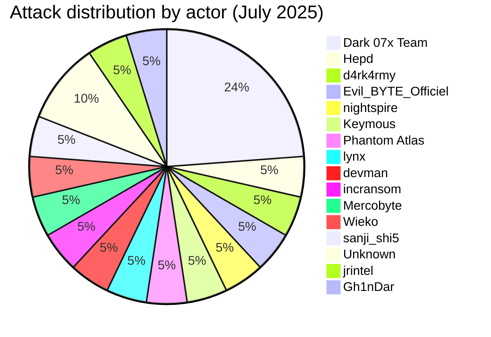
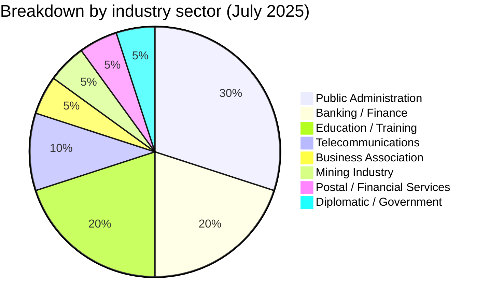
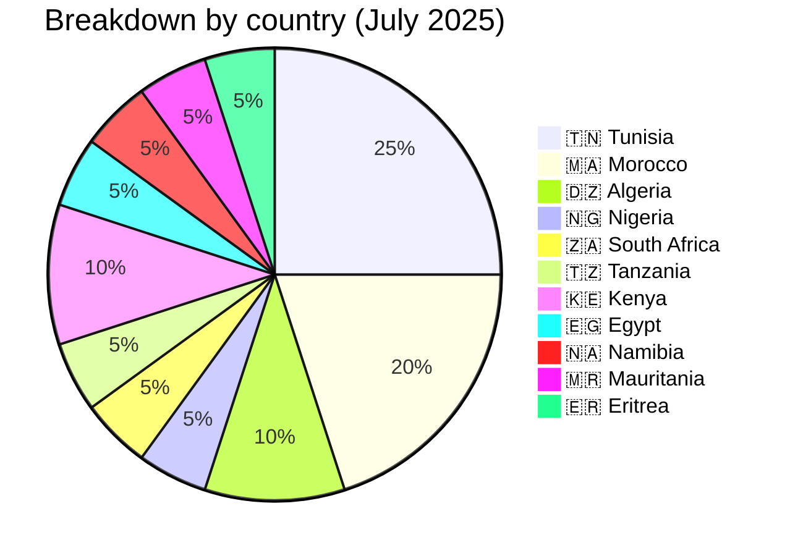
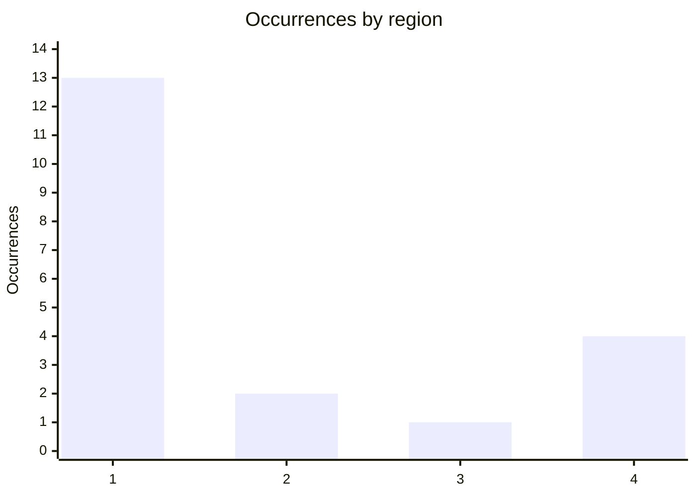
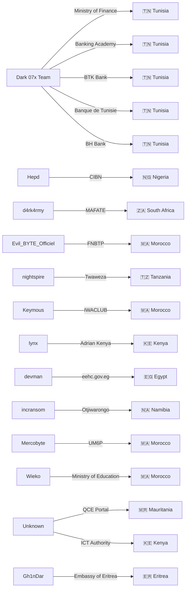
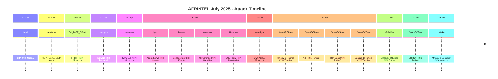

[](https://github.com/Hatchepsoute/AFRINTEL)


 
# CTI Report: Cyber attacks in Africa - July 2025 (20 victims)
👉🏾 [**French version available here**](./README_FR.md)

## 1. Introduction
This Cyber Threat Intelligence (CTI) report provides a detailed analysis of cyber attacks that occurred in Africa during July 2025. The information is derived from OSINT sources and ransomware group leak sites, compiled as part of the AFRINTEL project. The objective is to provide a clear overview of trends, threat actors, targeted sectors, and associated indicators of compromise.

## 2. Executive summary
- **Total number of recorded attacks:** 20
- **Most active actors:** Dark 07x Team (5 attacks), Hepd (1), d4rk4rmy (1), Evil_BYTE_Officiel (1), nightspire (1), Keymous (1), Phantom Atlas (1), lynx (1), devman (1), incransom (1), Mercobyte (1), Wieko (1), sanji_shi5 (1), Unknown (2), jrintel (1), Gh1nDar (1).
- **Most targeted sectors:** Public Administrations (6), Banking/Finance (4), Education/Training (4), Telecommunications (2), Business Association/Construction (1), Mining (1), Postal / Financial Services (1), Diplomatic / Government (1).
- **Most affected countries:** Tunisia (5), Morocco (4), Algeria (3), Nigeria (1), South Africa (1), Tanzania (1), Kenya (1), Egypt (1), Namibia (1), Mauritania (1), Eritrea (1).
- **Notable exfiltrated data volumes:** Ransom demand of $2.27M for eehc.gov.eg (Egypt). FNBTP (Morocco): 180-row / 14-column company database published for free. Embassy of Eritrea in the United States: unverified claim of approximately 5,000 citizen records. Other volumes not specified.

## 3. Key statistics

### 3.1 Breakdown by group/actor
| Group/Actor | Number of Attacks |
|-------------|-------------------|
| Dark 07x Team | 5 |
| Hepd | 1 |
| d4rk4rmy | 1 |
| Evil_BYTE_Officiel | 1 |
| nightspire | 1 |
| Keymous | 1 |
| Phantom Atlas | 1 |
| lynx | 1 |
| devman | 1 |
| incransom | 1 |
| Mercobyte | 1 |
| Wieko | 1 |
| sanji_shi5 | 1 |
| Unknown | 2 |
| jrintel | 1 |
| Gh1nDar | 1 |
| **Total** | **20** |



### 3.2 Breakdown by sector
| Sector | Number of Attacks |
|--------|-------------------|
| Public Administrations | 6 |
| Banking / Finance | 4 |
| Education / Training | 4 |
| Telecommunications | 2 |
| Business Association / Construction | 1 |
| Mining | 1 |
| Postal / Financial Services | 1 |
| Diplomatic / Government | 1 |
| **Total** | **20** |


### 3.3 Breakdown by country
| Country | Number of attacks |
|---------|-------------------|
| 🇹🇳 Tunisia | 5 |
| 🇲🇦 Morocco | 4 |
| 🇩🇿 Algeria | 2 |
| 🇳🇬 Nigeria | 1 |
| 🇿🇦 South Africa | 1 |
| 🇹🇿 Tanzania | 1 |
| 🇰🇪 Kenya | 2 |
| 🇪🇬 Egypt | 1 |
| 🇳🇦 Namibia | 1 |
| 🇲🇷 Mauritania | 1 |
| 🇪🇷 Eritrea | 1 |
| **Total** | **20** |




<!-- AFRINTEL_CURRENT_MODEL_START -->
### 3.4 Standard global overview

| Country | Ransomware | Leaks / access | Total | Distribution |
| :--- | ---: | ---: | ---: | :--- |
| 🇹🇳 Tunisia | 0 | 5 | 5 |  🟦🟦🟦🟦🟦 |
| 🇲🇦 Morocco | 1 | 3 | 4 | 🟧 🟦🟦🟦 |
| 🇩🇿 Algeria | 0 | 2 | 2 |  🟦🟦 |
| 🇰🇪 Kenya | 1 | 1 | 2 | 🟧 🟦 |
| 🇪🇬 Egypt | 1 | 0 | 1 | 🟧 |
| 🇪🇷 Eritrea | 0 | 1 | 1 |  🟦 |
| 🇲🇷 Mauritania | 0 | 1 | 1 |  🟦 |
| 🇳🇦 Namibia | 1 | 0 | 1 | 🟧 |
| 🇳🇬 Nigeria | 0 | 1 | 1 |  🟦 |
| 🇿🇦 South Africa | 1 | 0 | 1 | 🟧 |
| 🇹🇿 Tanzania | 1 | 0 | 1 | 🟧 |

```pie showData
    title Incident types
    "Ransomware" : 6
    "Leaks and access" : 14
```

### Geographic distribution by region

| Region | Occurrences | Ransomware | Leaks / access | Distribution |
| :--- | ---: | ---: | ---: | :--- |
| North Africa | 13 | 2 | 11 | 🟧🟧 🟦🟦🟦🟦🟦🟦🟦🟦🟦🟦🟦 |
| Southern Africa | 2 | 2 | 0 | 🟧🟧 |
| West and Central Africa | 1 | 0 | 1 |  🟦 |
| East Africa | 4 | 2 | 2 | 🟧🟧 🟦🟦 |


Legend: 1 = North Africa; 2 = Southern Africa; 3 = West and Central Africa; 4 = East Africa

### Sector distribution

| Sector | Records | Share | Activity |
| :--- | ---: | ---: | :--- |
| Government / Administration | 9 | 45.0% | ██████████ |
| Finance / Banking | 6 | 30.0% | ███████ |
| Education / University | 2 | 10.0% | ██ |
| Technology / IT | 2 | 10.0% | ██ |
| Energy / Utilities | 1 | 5.0% | █ |

### Most visible actors

| Actor / Group | Records | Activity |
| :--- | ---: | :--- |
| Dark 07x Team | 5 | ██████████ |
| Unknown | 2 | ████ |
| Evil_BYTE_Officiel | 1 | ██ |
| Gh1nDar | 1 | ██ |
| Hepd | 1 | ██ |
| Keymous | 1 | ██ |
| Mercobyte | 1 | ██ |
| Phantom Atlas | 1 | ██ |
| Wieko | 1 | ██ |
| d4rk4rmy | 1 | ██ |
<!-- AFRINTEL_CURRENT_MODEL_END -->
## 4. Detailed attacks by group/actor
### 4.1 Dark 07x Team (5 attacks)
- **25/07/2025:** Ministry of Finance (Tunisia, government) – "Full Access" claim.
- **25/07/2025:** Academy of Banks and Finance (Tunisia, training) – Admin interface compromise.
- **25/07/2025:** BTK Bank (Tunisia, bank) – Account compromise (ATO) and sale listing.
- **25/07/2025:** Banque de Tunisie (Tunisia, bank) – Exfiltration of financial data and identities.
- **28/07/2025:** BH Bank (Tunisia, bank) – Major compromise and account takeover (ATO).

*Note:* Dark 07x Team conducted a coordinated campaign against the Tunisian financial and government sector, with five attacks in a few days, demonstrating high operational capability.

### 4.2 Hepd (1 attack)
- **01/07/2025:** Chartered Institute of Bankers of Nigeria (CIBN) (Nigeria, banking regulation) – Data leak on the country's banking elite.

### 4.3 d4rk4rmy (1 attack)
- **08/07/2025:** MAFATE BUSINESS ENTERPRISE (South Africa, mining services) – Claim & data leak.

### 4.4 Evil_BYTE_Officiel (1 attack)
- **09/07/2025:** Fédération Nationale du Bâtiment et des Travaux Publics - FNBTP (Morocco, business association/construction) – Claim - Data Fully Published. 180-row / 14-column company membership database (`societe` table) published for free on an underground forum; no price or ransom demand.

### 4.5 nightspire (1 attack)
- **13/07/2025:** Twaweza (Tanzania, educational NGO) – Claim & data leak.

### 4.6 Keymous (1 attack)
- **14/07/2025:** IWACLUB (Morocco, telecommunications/distribution) – Data leak.

### 4.7 lynx (1 attack)
- **15/07/2025:** Adrian Kenya (Kenya, telecommunications/engineering) – Claim & data leak.

### 4.8 devman (1 attack)
- **15/07/2025:** eehc.gov.eg (Egypt, government) – Ransom demand of $2.27M.

### 4.9 incransom (1 attack)
- **15/07/2025:** Otjiwarongo Municipality (Namibia, local government) – Claim & data leak.

### 4.10 Mercobyte (1 attack)
- **18/07/2025:** Mohammed VI Polytechnic University (Morocco, education) – Targeted data leak and influence operation.
### 4.11 Wieko (1 attack)
- **29/07/2025:** Ministry of National Education, Preschool and Sports (Morocco, education) – credential combo-list claim supported by a visible sample; no direct compromise of the ministry’s central systems is established.

### 4.12 Unknown (2 attacks)
- **14/07/2025:** ICT Authority (Kenya, government/digital infrastructure) – no claiming actor identified; supplied CSV sample contains 1,697 directory-style rows, reviewed without reproducing personal data.
- **15/07/2025:** QCE Portal - qce.gov.mr (Mauritania, government/public procurement) – no claiming actor identified; local sample of personnel qualification dossiers (CVs, national ID cards, diplomas, notarized employment contracts) dated from file metadata in the absence of a publication date.

### 4.13 Gh1nDar (1 attack)
- **27/07/2025:** Embassy of Eritrea in the United States (Eritrea, diplomatic/government) – Claim - Unverified. Unverified claim of a leak affecting approximately 5,000 citizen records; no sample was accessible.

### 4.14 Graph: Actor → victim → country


## 5. Sectoral analysis
- **Banking/Finance:** 4 attacks (CIBN, BTK, Banque de Tunisie, BH Bank). Dark 07x Team targeted three Tunisian banks and Hepd targeted the Nigerian regulatory body, showing sustained attention to the financial sector.
- **Public Administrations:** 4 attacks (eehc.gov.eg, Otjiwarongo Municipality, Tunisian Ministry of Finance, QCE Portal Mauritania).
- **Education/Training:** 4 attacks (Twaweza, ABF, UM6P, Ministry of Education). The Wieko publication advertises a multi-institution credential combo list and does not establish compromise of the ministry’s central systems.
- **Telecommunications:** 2 attacks (IWACLUB, Adrian Kenya). Keymous and lynx targeted companies in this sector in Morocco and Kenya.
- **Business Association/Construction:** 1 attack (FNBTP) by Evil_BYTE_Officiel, exposing a 180-row company membership database published for free.
- **Mining:** 1 attack (MAFATE) by d4rk4rmy in South Africa.
- **Diplomatic/Government:** 1 unverified claim (Embassy of Eritrea in the United States) by Gh1nDar, involving an African state's diplomatic mission abroad.

## 6. Geographic analysis
- **Tunisia:** 5 attacks, all by Dark 07x Team, targeting the government and banking sector. Tunisia is the most affected country of the month, with a coordinated campaign.
- **Morocco:** 4 claims (FNBTP, IWACLUB, UM6P, Ministry of Education) involving Evil_BYTE_Officiel, Keymous, Mercobyte and Wieko.
- **Nigeria:** 1 attack (CIBN) by Hepd, targeting the banking regulatory body.
- **South Africa:** 1 attack (MAFATE) by d4rk4rmy in the mining sector.
- **Tanzania:** 1 attack (Twaweza) by nightspire, hitting an educational NGO.
- **Kenya:** 1 attack (Adrian Kenya) by lynx in telecoms.
- **Egypt:** 1 attack (eehc.gov.eg) by devman, with a high ransom demand.
- **Namibia:** 1 attack (Otjiwarongo Municipality) by incransom, targeting a local administration.
- **Mauritania:** 1 unattributed claim (QCE Portal), a public-sector personnel/enterprise qualification platform, with a locally reviewed sample of CVs, national ID cards, diplomas and notarized employment contracts.
- **Eritrea:** 1 unverified claim (Embassy of Eritrea in the United States) by Gh1nDar, targeting an Eritrean diplomatic mission rather than a domestic entity.

North Africa (Tunisia, Morocco, Egypt) concentrates 10 out of 17 claims, confirming pressure on this region. Tunisia is particularly hit by a massive campaign.
### 6.1 Attack timeline

## 7. Observed TTPs
- **Coordinated campaigns:** Dark 07x Team conducted multiple simultaneous attacks against Tunisian targets, showing advanced planning.
- **Account compromise (ATO):** observed on BTK Bank and BH Bank, with access for sale.
- **Exfiltration of sensitive data:** financial data, identities, information on banking elite (CIBN).
- **Ransom demand:** devman demanded $2.27M for eehc.gov.eg.
- **Influence operations:** Mercobyte published student ID photos with a political message, going beyond classic extortion.
- **Hacktivism:** Dark 07x Team appears to have multiple motivations (financial and political).
- **Free publication / reputation-building disclosure:** Evil_BYTE_Officiel published the FNBTP company database for free rather than selling it, consistent with a reputation-building rather than purely financial motive.
- **Unattributed dataset circulation:** the QCE Portal (Mauritania) case involved a sample of personnel qualification documents circulating without an identified claiming actor or forum post.

## 8. Recommendations
- **Tunisia:** financial and government institutions must urgently strengthen their cybersecurity in the face of coordinated campaigns. Establish a monitoring and incident response cell.
- **Banking sector:** banks (CIBN, BTK, BT, BH) must review their authentication protocols and segment their networks to limit account compromises.
- **Education:** universities (UM6P), academies (ABF) and educational NGOs (Twaweza) must protect personal data and train staff on risks.
- **Public administrations:** strengthen security of government websites and portals (eehc.gov.eg, Otjiwarongo, QCE Portal Mauritania), enforce strict access controls on platforms handling national ID documents, and implement offline backups.
- **All sectors:** train employees on phishing risks, implement multi-factor authentication and regular security audits.

## 9. Conclusion
July 2025 was marked by a major campaign by the **Dark 07x Team** against Tunisia, with five attacks targeting the government and banking sector. The diversity of actors (traditional ransomware, hacktivists) and targets (banks, administrations, education, telecoms, and one diplomatic mission) shows a multifaceted threat. The $2.27M ransom demand in Egypt and sensitive data leaks in Nigeria and Tunisia underscore the urgency of strengthened regional cybersecurity cooperation. The Eritrea case remains an unverified claim targeting an African state's diplomatic representation abroad.

## ✍🏿 Author
*Adama ASSIONGBON*  
*SOC & Cyber Threat Intelligence Consultant*  
[LinkedIn Profile](https://www.linkedin.com/in/adama-assiongbon-9029893a/)
