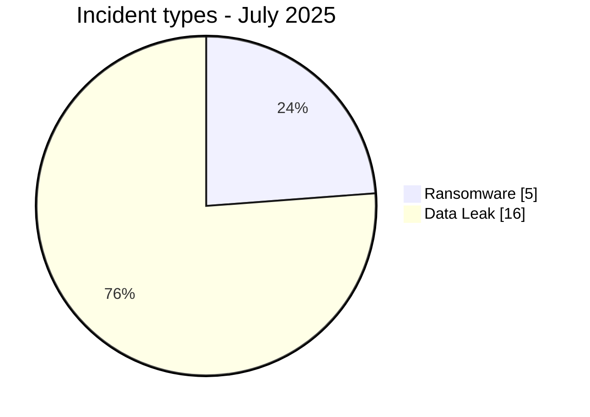
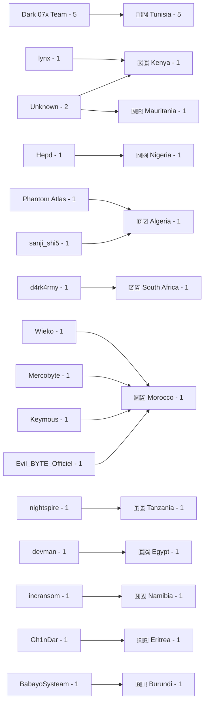
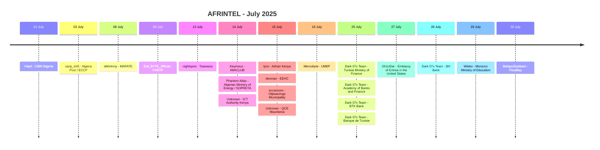

# CTI Report - Cyberattacks in Africa - July 2025

👉🏾 [**French version available here**](./README_FR.md)

## 1. Executive summary

July 2025 contains **21 documented incidents across 12 African countries**: **5 Ransomware** and **16 Data Leak**. No Access Sale, DDoS, Defacement or Operational Fraud is recorded as the primary incident type.

- **Tunisia**: 5 Data Leak records, all attributed to Dark 07x Team.
- **Morocco**: 4 Data Leak records.
- **Algeria**: 2 Data Leak records.
- **Kenya**: 2 incidents, including 1 Ransomware and 1 Data Leak.
- **Dark 07x Team** is the most visible label with 5 records.
- Two records have no identified actor: ICT Authority in Kenya and QCE in Mauritania.
- Significant technical material is available for CIBN, FNBTP, ICT Authority, Adrian Kenya, EEHC, Otjiwarongo Municipality, QCE, the Tunisian banks and PesaBay.
- EEHC carries an actor-claimed ransom demand of **$2.27 million**.
- FNBTP has a reviewed CSV containing **180 rows and 14 columns**.
- The Embassy of Eritrea in the United States is associated with an unverified claim affecting approximately **5,000 citizens**.
- PesaBay is classified as **Data Fully Published**, with a database advertised as containing **1,850 records**.

### 📋 Victim list

👉🏾 [View the full victim list](./victims.md)

### 1.1 Month-over-month comparison

> Comparison based on validated AFRINTEL monthly corpora. Stable record counts do not mean that real attacker activity or victim impact remained unchanged.

| Indicator | June 2025 | July 2025 | Observed change |
|---|---:|---:|---:|
| Total incidents | 21 | 21 | **0 (+0.0%)** |
| Ransomware | 5 | 5 | **0 (+0.0%)** |
| Data Leak | 16 | 16 | **0 (+0.0%)** |
| Access Sale | 0 | 0 | **0 (stable)** |
| DDoS | 0 | 0 | **0 (stable)** |
| Defacement | 0 | 0 | **0 (stable)** |
| Operational Fraud | 0 | 0 | **0 (stable)** |

## 2. Methodology

- **Scope**: 54 African countries.
- **Period**: 1-31 July 2025.
- **Sources**: OSINT, leak sites, underground forums, actor publications and available samples.
- **Source of truth**: validated bilingual pair [`victims_FR.md`](./victims_FR.md) / [`victims.md`](./victims.md), with French editorial review before English synchronization.
- **Counting**: one card equals one unique incident.
- **Taxonomy**: Ransomware, Data Leak, Access Sale, DDoS, Defacement, Operational Fraud.
- **Qualification**: claim, sample, full publication and technical confirmation remain distinct evidence levels.
- **Visualization**: tables, text bars, simple Mermaid diagrams and a timeline.

## 3. Global overview

### 3.1 Incident-type distribution

| Incident type | Count | Share |
|---|---:|---:|
| Ransomware | 5 | 23.8% |
| Data Leak | 16 | 76.2% |
| Access Sale | 0 | 0.0% |
| DDoS | 0 | 0.0% |
| Defacement | 0 | 0.0% |
| Operational Fraud | 0 | 0.0% |
| **Total** | **21** | **100%** |

**Color convention:** 🟧 Ransomware | 🟦 Data Leak | 🟪 Access Sale | 🟥 DDoS | 🟨 Defacement | 🟩 Operational Fraud.

### 3.2 Country distribution

| Country | Ransomware | Data Leak | Total | Distribution |
|---|---:|---:|---:|---|
| 🇹🇳 Tunisia | 0 | 5 | 5 | 🟦🟦🟦🟦🟦 |
| 🇲🇦 Morocco | 0 | 4 | 4 | 🟦🟦🟦🟦 |
| 🇩🇿 Algeria | 0 | 2 | 2 | 🟦🟦 |
| 🇰🇪 Kenya | 1 | 1 | 2 | 🟧🟦 |
| 🇪🇬 Egypt | 1 | 0 | 1 | 🟧 |
| 🇪🇷 Eritrea | 0 | 1 | 1 | 🟦 |
| 🇲🇷 Mauritania | 0 | 1 | 1 | 🟦 |
| 🇳🇦 Namibia | 1 | 0 | 1 | 🟧 |
| 🇳🇬 Nigeria | 0 | 1 | 1 | 🟦 |
| 🇿🇦 South Africa | 1 | 0 | 1 | 🟧 |
| 🇹🇿 Tanzania | 1 | 0 | 1 | 🟧 |
| 🇧🇮 Burundi | 0 | 1 | 1 | 🟦 |
| **Total** | **5** | **16** | **21** | |

### 3.3 Geographic distribution by region

| Region | Incidents | Share | Activity |
|---|---:|---:|---|
| North Africa | 13 | 61.9% | ██████████ |
| East Africa | 5 | 23.8% | ████ |
| Southern Africa | 2 | 9.5% | ██ |
| West Africa | 1 | 4.8% | █ |
| Central Africa | 0 | 0.0% |  |
| **Total** | **21** | **100%** | |

### 3.4 Harmonized sector distribution

| Harmonized sector | Incidents | Share | Activity |
|---|---:|---:|---|
| Government / Administration | 8 | 38.1% | ██████████ |
| Finance / Banking | 6 | 28.6% | ████████ |
| Education / University / Training | 2 | 9.5% | ██ |
| Telecommunications / ICT | 2 | 9.5% | ██ |
| Construction / Professional Organisation | 1 | 4.8% | █ |
| Mining / Industrial Services | 1 | 4.8% | █ |
| Retail / E-commerce | 1 | 4.8% | █ |
| **Total** | **21** | **100%** | |

### 3.5 Actors / groups

| Actor / Group | Incidents | Activity |
|---|---:|---|
| Dark 07x Team | 5 | ██████████ |
| Unknown | 2 | ████ |
| BabayoSysteam | 1 | ██ |
| d4rk4rmy | 1 | ██ |
| Evil_BYTE_Officiel | 1 | ██ |
| Gh1nDar | 1 | ██ |
| Hepd | 1 | ██ |
| Keymous | 1 | ██ |
| lynx | 1 | ██ |
| Mercobyte | 1 | ██ |
| nightspire | 1 | ██ |
| Phantom Atlas | 1 | ██ |
| sanji_shi5 | 1 | ██ |
| devman | 1 | ██ |
| incransom | 1 | ██ |
| Wieko | 1 | ██ |
| **Total** | **21** | |

### 3.6 Actor -> country mapping

## 4. Detailed analysis by incident type

### 4.1 Ransomware - 5 incidents

The five Ransomware records concern:

- **MAFATE BUSINESS ENTERPRISE** in South Africa, claimed by d4rk4rmy.
- **Twaweza** in Tanzania, claimed by nightspire.
- **Adrian Kenya** in Kenya, claimed by lynx, with four reviewed documents.
- **Egyptian Electricity Holding Company (EEHC)** in Egypt, claimed by devman, with a reviewed internal-share listing covering approximately 8,000 folders and more than 50,000 file entries; the displayed ransom demand is $2.27 million.
- **Otjiwarongo Municipality** in Namibia, claimed by incransom, with a municipal payroll sample consistent with real HR and banking-data access.

### 4.2 Data Leak - 16 incidents

The 16 Data Leak records account for **76.2%** of the monthly corpus.

Significant cases include:

- **CIBN Nigeria**: structured archive of 472 files and approximately 18 MB covering multiple categories of member, staff and system data.
- **Algeria Post / ECCP**: sample of claimed account-access data that was not validated.
- **FNBTP Morocco**: freely published database with 180 rows and 14 columns in the reviewed CSV.
- **Algerian Ministry of Energy / SOPRETA**: a likely authentic administrative document, while the actor's accusatory framing is not corroborated by the analysis.
- **ICT Authority Kenya**: 1,697-row CSV export with no identified actor.
- **QCE Mauritania**: qualification dossiers containing CVs, national IDs, diplomas and contracts, with no identified actor.
- **UM6P Morocco**: targeted data-leak and influence-operation claim without collection of the underlying dataset.
- **Dark 07x Team in Tunisia**: five records involving the Ministry of Finance, Academy of Banks and Finance, BTK Bank, Banque de Tunisie and BH Bank. Several samples show authenticated administrative or banking sessions. Some publications also contain sale offers, but the cards remain classified as Data Leak because direct data exposure and access are documented.
- **Embassy of Eritrea in the United States**: unverified claim affecting approximately 5,000 citizens.
- **Moroccan Ministry of Education**: claimed 223,501-line combo list; the material does not establish direct compromise of the ministry's central systems.
- **PesaBay Burundi**: database advertised as complete with 1,850 accounts.

## 5. Sectoral impact

**Government / Administration** is the leading harmonized category with **8 of 21 incidents (38.1%)**.

**Finance / Banking** accounts for **6 incidents (28.6%)**, including CIBN, Algeria Post/ECCP, the Academy of Banks and Finance and the three Tunisian banks BTK, Banque de Tunisie and BH Bank.

**Education / University / Training** and **Telecommunications / ICT** account for 2 incidents each. Construction / Professional Organisation, Mining / Industrial Services and Retail / E-commerce each account for 1.

## 6. Threat actor profile

**Dark 07x Team** dominates the month with **5 records**, all in Tunisia. **Unknown** appears on 2 records: ICT Authority and QCE. The other fourteen labels appear once.

The `Actor / Group` field was normalized: `sanji_shi5 (source account)` becomes `sanji_shi5`, while the two unattributed cases use the structured value `Unknown` in both languages.

## 7. Key trends and intelligence gaps

### 7.1 Observed trends

1. **Stable volume**: 21 incidents in both June and July.
2. **Identical type mix**: 5 Ransomware and 16 Data Leak in both months.
3. **Tunisia leads**: 5 incidents, all linked to a Dark 07x Team campaign.
4. **Morocco**: 4 Data Leak records.
5. **Strong Data Leak majority**: 76.2% of the corpus.
6. **North Africa highly represented**: 13 of 21 incidents.
7. **Uneven evidence depth**: unverified claims, structured samples, authenticated sessions and full publications coexist in the same corpus.

### 7.2 Intelligence gaps

- Initial-access vectors remain unknown for most incidents.
- Several volumes or victim counts remain actor claims.
- The exact origin of Algeria Post / ECCP credentials is not established.
- ICT Authority and QCE have no identified actor.
- The Moroccan Ministry of Education case is based on a multi-institution combo list and does not demonstrate compromise of the ministry's central systems.
- The Eritrean Embassy claim has no verifiable sample in the collected material.

### 7.3 Monthly evolution

| Type | June 2025 | July 2025 | Change |
|---|---:|---:|---:|
| Total | 21 | 21 | **0 (stable)** |
| Ransomware | 5 | 5 | **0 (stable)** |
| Data Leak | 16 | 16 | **0 (stable)** |
| Access Sale | 0 | 0 | **0 (stable)** |

## 8. Summary timeline

## 9. MITRE ATT&CK mapping - contextual

| Phase | Technique | Analytical scope |
|---|---|---|
| Valid accounts | T1078 - Valid Accounts | Relevant to authenticated administrative or banking sessions observed in several Tunisian cases. |
| Collection | T1005 - Data from Local System | Relevant to reviewed documents, exports and internal directories. |
| Collection | T1213 - Data from Information Repositories | Relevant to CIBN, FNBTP, ICT Authority, QCE and PesaBay databases. |
| Discovery | T1083 - File and Directory Discovery | Relevant context for the EEHC share inventory, without direct evidence of the command or tooling used by the actor. |

> These mappings are contextual and do not prove that every actor used the listed techniques.

## 10. Recommendations

- **Banking / Finance**: phishing-resistant MFA, session monitoring, anomalous-login detection, transfer protection and export controls.
- **Public sector**: PAM, segmentation, administrative-access logging and database-export monitoring.
- **Education**: identity controls, combo-list detection and source validation before attributing credentials to a central compromise.
- **Telecommunications / ICT**: protect partner portals, administrator accounts and project data.
- **E-commerce**: restrict customer exports, encrypt sensitive data and monitor production-database access.

## 11. SOC and tactical recommendations

### Observed

The corpus includes claims, published databases, structured exports, authenticated administrative or banking sessions, internal documents and file inventories.

### Assumptions

Initial vectors, persistence mechanisms and complete exfiltration paths are not established for most cases.

### Preventive

Monitor privileged authentication, anomalous logins, large exports, database access, archive creation, unusual banking sessions and outbound transfers. Maintain MFA, PAM, EDR, segmentation, immutable backups and rapid session/secret revocation procedures.

## 12. Conclusion

July 2025 contains **21 incidents across 12 countries**, split into **5 Ransomware and 16 Data Leak**. The volume and incident-type distribution are identical to June, but evidence depth varies significantly between cases.

Tunisia accounts for 5 incidents linked to Dark 07x Team, while Morocco records 4. The Tunisian banking cases, EEHC, Otjiwarongo, ICT Authority, QCE, FNBTP and PesaBay illustrate the distinction between a simple claim, authenticated access, reviewed sample and full publication.

**AFRINTEL** - Open African CTI Monitoring Initiative
