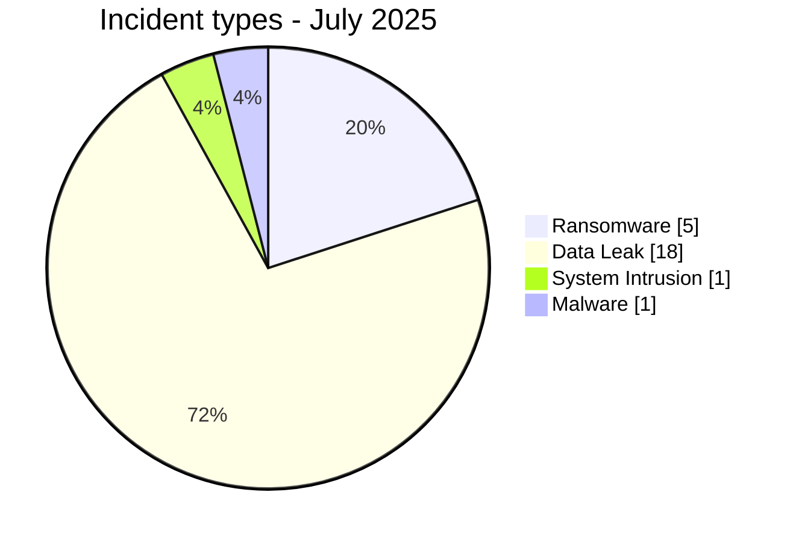

# AFRINTEL CTI Report - Cyber Threats in Africa - July 2025

👉🏾 [Version française](./README_FR.md)

   

## 1. Executive summary

In July 2025, AFRINTEL documents **25 cyber incidents** affecting organizations and digital services across **13 African countries**.

The landscape is dominated by **Data Leak with 18 records (72.0%)**, followed by **Ransomware with 5 (20.0%)**. Other observed types are System Intrusion 1, Malware 1.

Geographic concentration is significant: **Tunisia (7)**, **Morocco (4)**, **Algeria (2)** together account for **13 records, or 52.0% of the month**. This concentration reflects AFRINTEL corpus visibility rather than an exhaustive national compromise rate.

At sector level, the most represented categories are **Government / Administration (9)**, **Finance / Banking (7)**, **Education / University (3)**. The most frequent actor labels are `Unknown` (5), `Dark 07x Team` (5), `Hepd` (1). `Unknown`, when present, denotes missing attribution rather than a threat actor.

Evidence maturity remains variable: **19 records** are unverified claims or claims accompanied by samples. AFRINTEL maintains a strict separation between **observed facts, claims, corroboration, official confirmation, and technical unknowns**.

Compared with June, monthly volume **increases by 4 records**. The most visible changes are Data Leak 16->18 (+2), System Intrusion 0->1 (+1), Malware 0->1 (+1).

> **Reading note:** AFRINTEL figures describe documented incidents and the visibility of observed threats. They are not an exhaustive measurement of every cyberattack that actually occurred across Africa.

### 1.1 Month-over-month comparison

| Indicator | June 2025 | July 2025 | Change |
|---|---:|---:|---:|
| Total incidents | 21 | 25 | **+4 (+19.0%)** |
| Ransomware | 5 | 5 | **Stable** |
| Data Leak | 16 | 18 | **+2 (+12.5%)** |
| Access Sale | 0 | 0 | **Stable** |
| DDoS | 0 | 0 | **Stable** |
| Defacement | 0 | 0 | **Stable** |
| Account Takeover | 0 | 0 | **Stable** |
| System Intrusion | 0 | 1 | **+1 (new)** |
| Malware | 0 | 1 | **+1 (new)** |
| Operational Fraud | 0 | 0 | **Stable** |

## 2. Methodology

- **Scope:** 54 African countries; reference period: July 2025.
- **Source of truth:** validated `victims_FR.md` / `victims.md` pair.
- **Classification:** Ransomware, Data Leak, Access Sale, DDoS, Defacement, Account Takeover, System Intrusion, Malware, and Operational Fraud.
- **Counting:** one canonical record equals one documented cyber incident; cases under investigation remain outside statistics.
- **Timeline:** `Incident date` and `Initial publication date` remain separate. A later disclosure does not artificially move an incident into another month when chronology is sufficiently supported.
- **Uncertain dates:** when no exact day is known, the evidence-supported month or time window is retained.
- **Sources:** public links are retained for supplementary incidents found through OSINT/web research; they are not retroactively imposed on historical or direct Dark Web observations.
- **Evidence:** incident type, status, confidence, impact, and provenance remain separate dimensions.
- **Sectors:** normalization is calculated once from the structured corpus and used identically in FR and EN.
- **Limitation:** frequencies reflect AFRINTEL visibility rather than every real compromise on the continent.

## 3. Overview and incident types

| Indicator | Value |
|---|---:|
| Documented incidents | **25** |
| Countries represented | **13** |
| Regions represented | **5** |
| Leading country | **Tunisia (7)** |
| Leading sector | **Government / Administration (9)** |
| Leading actor label | **Unknown (5)** |

| Incident type | Records | Share |
|---|---:|---:|
| Ransomware | 5 | 20.0% |
| Data Leak | 18 | 72.0% |
| Access Sale | 0 | 0.0% |
| DDoS | 0 | 0.0% |
| Defacement | 0 | 0.0% |
| Account Takeover | 0 | 0.0% |
| System Intrusion | 1 | 4.0% |
| Malware | 1 | 4.0% |
| Operational Fraud | 0 | 0.0% |
| **Total** | **25** | **100%** |

## 4. Geographic distribution

| Country | Total | Ransomware | Data Leak | Access Sale | DDoS | Defacement | Account Takeover | System Intrusion | Malware |
|---|---:|---:|---:|---:|---:|---:|---:|---:|---:|
| Tunisia | **7** | 0 | 6 | 0 | 0 | 0 | 0 | 1 | 0 |
| Morocco | **4** | 0 | 4 | 0 | 0 | 0 | 0 | 0 | 0 |
| Algeria | **2** | 0 | 2 | 0 | 0 | 0 | 0 | 0 | 0 |
| South Africa | **2** | 1 | 0 | 0 | 0 | 0 | 0 | 0 | 1 |
| Kenya | **2** | 1 | 1 | 0 | 0 | 0 | 0 | 0 | 0 |
| Nigeria | **1** | 0 | 1 | 0 | 0 | 0 | 0 | 0 | 0 |
| Tanzania | **1** | 1 | 0 | 0 | 0 | 0 | 0 | 0 | 0 |
| Egypt | **1** | 1 | 0 | 0 | 0 | 0 | 0 | 0 | 0 |
| Namibia | **1** | 1 | 0 | 0 | 0 | 0 | 0 | 0 | 0 |
| Mauritania | **1** | 0 | 1 | 0 | 0 | 0 | 0 | 0 | 0 |
| Eritrea | **1** | 0 | 1 | 0 | 0 | 0 | 0 | 0 | 0 |
| Burundi | **1** | 0 | 1 | 0 | 0 | 0 | 0 | 0 | 0 |
| Seychelles | **1** | 0 | 1 | 0 | 0 | 0 | 0 | 0 | 0 |
| **Total** | **25** | **5** | **18** | **0** | **0** | **0** | **0** | **1** | **1** |

> `Operational Fraud = 0` this month; the column is omitted for readability.

## 5. Regional distribution

| Region | Records | Share |
|---|---:|---:|
| North Africa | 14 | 56.0% |
| East Africa | 5 | 20.0% |
| Southern Africa | 3 | 12.0% |
| West Africa | 2 | 8.0% |
| Indian Ocean | 1 | 4.0% |
| **Total** | **25** | **100%** |

The leading region is **North Africa with 14 records (56.0%)**.

## 6. Sector impact

| Sector | Records | Share | Activity |
|---|---:|---:|---|
| Government / Administration | 9 | 36.0% | █████████ |
| Finance / Banking | 7 | 28.0% | ███████ |
| Education / University | 3 | 12.0% | ███ |
| Telecommunications | 2 | 8.0% | ██ |
| Mining | 1 | 4.0% | █ |
| Construction / Real Estate | 1 | 4.0% | █ |
| Retail / E-commerce | 1 | 4.0% | █ |
| Healthcare / Medical | 1 | 4.0% | █ |
| **Total** | **25** | **100%** | |

## 7. Actors / groups

`Unknown` denotes missing attribution, not a threat actor.

| Actor / Group | Records | Activity |
|---|---:|---|
| Unknown | 5 | █████ |
| Dark 07x Team | 5 | █████ |
| Hepd | 1 | █ |
| sanji_shi5 | 1 | █ |
| d4rk4rmy | 1 | █ |
| Evil_BYTE_Officiel | 1 | █ |
| nightspire | 1 | █ |
| Keymous | 1 | █ |
| Phantom Atlas | 1 | █ |
| lynx | 1 | █ |
| devman | 1 | █ |
| incransom | 1 | █ |
| Mercobyte | 1 | █ |
| Gh1nDar | 1 | █ |
| Wieko | 1 | █ |
| BabayoSysteam | 1 | █ |
| Jokeir 07x / Dr Shell 08x (claim) | 1 | █ |

## 8. Evidence maturity

| Evidence maturity | Records | Share |
|---|---:|---:|
| Claim - Unverified | 6 | 24.0% |
| Claim - Data Sample Published | 13 | 52.0% |
| Data Fully Published | 2 | 8.0% |
| Victim/Government/Authority Confirmed | 2 | 8.0% |
| Corroborated / Secondary evidence | 1 | 4.0% |
| Attempted | 1 | 4.0% |
| **Total** | **25** | **100%** |

Evidence statuses describe the available validation level; they do not change the technical incident type.

## 9. Timeline

```mermaid
timeline
    title AFRINTEL - July 2025
    01 July 2025 : Chartered Institute of Bankers of Nigeria (CIBN)
    03 July 2025 : Algeria Post / ECCP
    08 July 2025 : MAFATE BUSINESS ENTERPRISE
    09 July 2025 : Fédération Nationale du Bâtiment et des Travaux Publics (FNBTP)
    10 July 2025 : University network / Centre Al-Khwarizmi
    13 July 2025 : Twaweza
    14 July 2025 : IWACLUB (iwaclub.ma)
    14 July 2025 : Ministry of Energy, Mines and Renewable Energies / SARL SOPRETA
    14 July 2025 : ICT Authority (icta.go.ke)
    15 July 2025 : Adrian Kenya
    15 July 2025 : Egyptian Electricity Holding Company (EEHC, eehc.gov.eg)
    15 July 2025 : Otjiwarongo Municipality
    15 July 2025 : QCE Portal (qce.gov.mr)
    18 July 2025 : Mohammed VI Polytechnic University (UM6P)
    22 July 2025 : National Treasury - Infrastructure Reporting Model (IRM) website
    25 July 2025 : Ministry of Finance (finances.gov.tn)
    25 July 2025 : Academy of Banks and Finance (abf.tn)
    25 July 2025 : BTK Bank
    25 July 2025 : Banque de Tunisie (bt.com.tn)
    27 July 2025 : Embassy of Eritrea in the United States
    28 July 2025 : BH Bank
    29 July 2025 : Ministry of National Education, Preschool and Sports
    30 July 2025 : PesaBay
    31 July 2025 : Le Groupement Pharmaceutique (LGP)
    July 2025 - exact incident date not publicly disclosed : Seychelles Commercial Bank
```

## 10. Monthly CTI analysis

### Ransomware

**5 records** are classified as Ransomware. Leading countries: South Africa (1), Tanzania (1), Kenya (1). A leak-site listing does not itself prove encryption or complete exfiltration.

### Data Leak

**18 records** are classified as Data Leak. Leading countries: Tunisia (6), Morocco (4), Algeria (2). AFRINTEL distinguishes actually observed data from aggregate volumes claimed by actors.

### System Intrusion

**1 System Intrusion records** are documented. Distribution: Tunisia (1). The type is used where system access or attempted access is established without enough evidence for a more specific category.

### Malware

**1 Malware incident(s)** are documented. Distribution: South Africa (1). The type is used only where malicious software is explicitly identified.

## 11. Notable incidents

| Country | Organization | Type | Status | Impact | Confidence |
|---|---|---|---|---|---|
| Seychelles | Seychelles Commercial Bank | Data Leak | Bank + Central Bank Confirmed | Level 4 | Very High |
| Tunisia | University network / Centre Al-Khwarizmi | System Intrusion | Attempted - Outcome Unknown | Level 4 | High |
| Egypt | Egyptian Electricity Holding Company (EEHC, eehc.gov.eg) | Ransomware | Claim - Data Sample Published | Level 4 | High |
| Tunisia | Le Groupement Pharmaceutique (LGP) | Data Leak | Claim - Secondary Evidence / Screenshots | Level 4 | Medium |
| South Africa | National Treasury - Infrastructure Reporting Model (IRM) website | Malware | Government Confirmed | Level 3 | Very High |

> This table highlights up to five records using structured impact, confirmation, and confidence fields. It is not an absolute severity ranking.

## 12. Key findings and intelligence gaps

- **Geographic concentration:** Tunisia accounts for 7 records (28.0%), followed by Morocco (4) and Algeria (2).
- **Threat structure:** Data Leak is the leading type with 18 records, followed by Ransomware (5).
- **Sectors:** Government / Administration (9) and Finance / Banking (7) have the highest visibility.
- **Actors:** the most frequent labels are Unknown (5), Dark 07x Team (5), and Hepd (1).
- **Evidence:** 19 records rely on unverified claims or claims with a published sample; these statuses do not equal complete technical confirmation.

### Intelligence gaps

- initial-access vector often not public;
- exact technical compromise date sometimes unknown;
- claimed volumes rarely fully verifiable;
- technical attribution often limited to a publication handle or label;
- public remediation, root-cause, and DFIR conclusions remain limited.

These gaps should guide collection rather than be replaced with assumptions.

## 13. Recommendations

### Organizations

- enforce phishing-resistant MFA on privileged accounts, VPN, email, social media, and administration consoles;
- apply PAM, least privilege, segmentation, and secret rotation;
- maintain immutable backups and test restoration;
- strengthen public applications, APIs, and administration interfaces;
- formalize incident response and data-breach notification.

### SOC and detection

- monitor abnormal authentication, MFA changes, privileged-account creation, and role elevation;
- detect mass database reads, unusual exports, archive creation, and large outbound transfers;
- correlate EDR, IAM, VPN, WAF, proxy, DNS, cloud, and application logs;
- distinguish DDoS, internal intrusion, account compromise, and data exposure to avoid unsupported conclusions.

### CTI

- keep incident date, initial publication, first observation, sample, disclosure, and confirmation separate;
- track republication and resale without automatically counting them as new compromise;
- preserve the evidence hierarchy between claim, corroboration, and confirmation;
- validate FR/EN parity before generating statistics.

## 14. Conclusion

**July 2025** contains **25 documented cyber incidents** across **13 African countries**. The monthly CTI value lies not only in volume but in separating **incident type, timeline, evidence level, geography, sector, and actor**.

The report therefore preserves a structured picture of the observable threat environment while keeping claims, corroboration, confirmations, and unknowns at their actual evidence level.

👉🏾 [See monthly victims](./victims.md)

**AFRINTEL** - TLP:CLEAR
