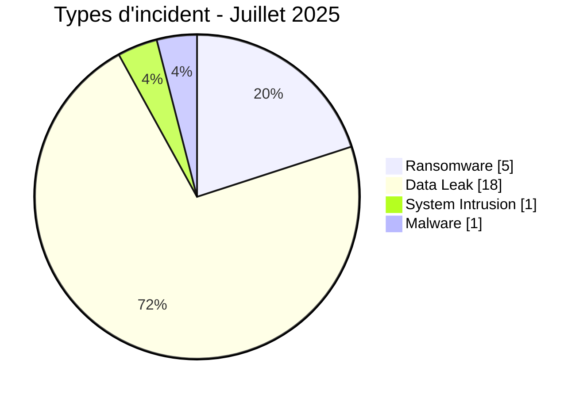

# Rapport CTI AFRINTEL - Cybermenaces en Afrique - Juillet 2025

👉🏾 [English version](./README.md)

   

## 1. Synthèse exécutive

En Juillet 2025, AFRINTEL documente **25 cyberincidents** affectant des organisations et services numériques dans **13 pays africains**.

Le paysage est dominé par **Data Leak avec 18 fiches (72,0 %)**, suivi de **Ransomware avec 5 (20,0 %)**. Les autres types observés sont System Intrusion 1, Malware 1.

La concentration géographique est marquée : **Tunisie (7)**, **Maroc (4)**, **Algérie (2)** représentent ensemble **13 fiches, soit 52,0 % du mois**. Cette concentration doit être interprétée comme la visibilité du corpus AFRINTEL et non comme un taux national exhaustif de compromission.

Sur le plan sectoriel, les catégories les plus représentées sont **Gouvernement / Administration (9)**, **Finance / Banque (7)**, **Éducation / Université (3)**. Les labels d'acteurs les plus fréquents sont `Unknown` (5), `Dark 07x Team` (5), `Hepd` (1). `Unknown`, lorsqu'il apparaît, désigne une absence d'attribution et non un groupe cybercriminel.

La maturité des preuves reste variable : **19 fiches** relèvent de claims non vérifiés ou accompagnés d'échantillons. AFRINTEL conserve une séparation stricte entre **faits observés, revendications, corroborations, confirmations officielles et inconnues techniques**.

Par rapport à Juin, le volume mensuel **augmente de 4 fiches**. Les variations les plus visibles concernent Data Leak 16->18 (+2), System Intrusion 0->1 (+1), Malware 0->1 (+1).

> **Note de lecture :** les chiffres AFRINTEL décrivent les incidents documentés et la visibilité des menaces observées. Ils ne constituent pas une mesure exhaustive de toutes les cyberattaques réellement survenues en Afrique.

### 1.1 Comparaison avec le mois précédent

| Indicateur | Juin 2025 | Juillet 2025 | Évolution |
|---|---:|---:|---:|
| Total incidents | 21 | 25 | **+4 (+19,0 %)** |
| Ransomware | 5 | 5 | **Stable** |
| Data Leak | 16 | 18 | **+2 (+12,5 %)** |
| Access Sale | 0 | 0 | **Stable** |
| DDoS | 0 | 0 | **Stable** |
| Defacement | 0 | 0 | **Stable** |
| Account Takeover | 0 | 0 | **Stable** |
| System Intrusion | 0 | 1 | **+1 (nouveau)** |
| Malware | 0 | 1 | **+1 (nouveau)** |
| Operational Fraud | 0 | 0 | **Stable** |

## 2. Méthodologie

- **Périmètre :** 54 pays africains ; période de référence : Juillet 2025.
- **Source de vérité :** couple validé `victims_FR.md` / `victims.md`.
- **Classification :** Ransomware, Data Leak, Access Sale, DDoS, Defacement, Account Takeover, System Intrusion, Malware et Operational Fraud.
- **Comptage :** une fiche canonique correspond à un cyberincident documenté ; les dossiers en investigation restent hors statistiques.
- **Chronologie :** `Date de l'incident` et `Date de publication initiale` sont séparées. Une publication ultérieure ne déplace pas artificiellement un incident vers un autre mois lorsque la chronologie est suffisamment établie.
- **Dates incertaines :** lorsqu'un jour exact n'est pas connu, le mois ou la fenêtre soutenue par les preuves est conservé.
- **Sources :** les liens publics sont conservés pour les incidents complémentaires identifiés par recherche OSINT/web ; ils ne sont pas imposés rétroactivement aux observations historiques ou Dark Web directes.
- **Preuve :** type d'incident, statut, confiance, impact et provenance restent des dimensions distinctes.
- **Secteurs :** normalisation calculée une seule fois à partir du corpus structuré, puis utilisée à l'identique en FR et EN.
- **Limite :** les fréquences reflètent la visibilité AFRINTEL et non l'ensemble des compromissions réelles sur le continent.

## 3. Vue d'ensemble et types d'incident

| Indicateur | Valeur |
|---|---:|
| Incidents documentés | **25** |
| Pays représentés | **13** |
| Régions représentées | **5** |
| Premier pays | **Tunisie (7)** |
| Premier secteur | **Gouvernement / Administration (9)** |
| Premier label acteur | **Unknown (5)** |

| Type d'incident | Fiches | Part |
|---|---:|---:|
| Ransomware | 5 | 20,0 % |
| Data Leak | 18 | 72,0 % |
| Access Sale | 0 | 0,0 % |
| DDoS | 0 | 0,0 % |
| Defacement | 0 | 0,0 % |
| Account Takeover | 0 | 0,0 % |
| System Intrusion | 1 | 4,0 % |
| Malware | 1 | 4,0 % |
| Operational Fraud | 0 | 0,0 % |
| **Total** | **25** | **100 %** |

## 4. Répartition géographique

| Pays | Total | Ransomware | Data Leak | Access Sale | DDoS | Defacement | Account Takeover | System Intrusion | Malware |
|---|---:|---:|---:|---:|---:|---:|---:|---:|---:|
| Tunisie | **7** | 0 | 6 | 0 | 0 | 0 | 0 | 1 | 0 |
| Maroc | **4** | 0 | 4 | 0 | 0 | 0 | 0 | 0 | 0 |
| Algérie | **2** | 0 | 2 | 0 | 0 | 0 | 0 | 0 | 0 |
| Afrique du Sud | **2** | 1 | 0 | 0 | 0 | 0 | 0 | 0 | 1 |
| Kenya | **2** | 1 | 1 | 0 | 0 | 0 | 0 | 0 | 0 |
| Nigeria | **1** | 0 | 1 | 0 | 0 | 0 | 0 | 0 | 0 |
| Tanzanie | **1** | 1 | 0 | 0 | 0 | 0 | 0 | 0 | 0 |
| Égypte | **1** | 1 | 0 | 0 | 0 | 0 | 0 | 0 | 0 |
| Namibie | **1** | 1 | 0 | 0 | 0 | 0 | 0 | 0 | 0 |
| Mauritanie | **1** | 0 | 1 | 0 | 0 | 0 | 0 | 0 | 0 |
| Érythrée | **1** | 0 | 1 | 0 | 0 | 0 | 0 | 0 | 0 |
| Burundi | **1** | 0 | 1 | 0 | 0 | 0 | 0 | 0 | 0 |
| Seychelles | **1** | 0 | 1 | 0 | 0 | 0 | 0 | 0 | 0 |
| **Total** | **25** | **5** | **18** | **0** | **0** | **0** | **0** | **1** | **1** |

> `Operational Fraud = 0` ce mois-ci ; la colonne est omise pour préserver la lisibilité.

## 5. Répartition régionale

| Région | Fiches | Part |
|---|---:|---:|
| Afrique du Nord | 14 | 56,0 % |
| Afrique de l'Est | 5 | 20,0 % |
| Afrique australe | 3 | 12,0 % |
| Afrique de l'Ouest | 2 | 8,0 % |
| Océan Indien | 1 | 4,0 % |
| **Total** | **25** | **100 %** |

La région la plus représentée est **Afrique du Nord avec 14 fiches (56,0 %)**.

## 6. Impact sectoriel

| Secteur | Fiches | Part | Activité |
|---|---:|---:|---|
| Gouvernement / Administration | 9 | 36,0 % | █████████ |
| Finance / Banque | 7 | 28,0 % | ███████ |
| Éducation / Université | 3 | 12,0 % | ███ |
| Télécommunications | 2 | 8,0 % | ██ |
| Mines | 1 | 4,0 % | █ |
| Construction / Immobilier | 1 | 4,0 % | █ |
| Commerce / E-commerce | 1 | 4,0 % | █ |
| Santé / Médical | 1 | 4,0 % | █ |
| **Total** | **25** | **100 %** | |

## 7. Acteurs / groupes

`Unknown` correspond à une absence d'attribution, pas à un acteur.

| Acteur / Groupe | Fiches | Activité |
|---|---:|---|
| Unknown | 5 | █████ |
| Dark 07x Team | 5 | █████ |
| Hepd | 1 | █ |
| sanji_shi5 | 1 | █ |
| d4rk4rmy | 1 | █ |
| Evil_BYTE_Officiel | 1 | █ |
| nightspire | 1 | █ |
| Keymous | 1 | █ |
| Phantom Atlas | 1 | █ |
| lynx | 1 | █ |
| devman | 1 | █ |
| incransom | 1 | █ |
| Mercobyte | 1 | █ |
| Gh1nDar | 1 | █ |
| Wieko | 1 | █ |
| BabayoSysteam | 1 | █ |
| Jokeir 07x / Dr Shell 08x (claim) | 1 | █ |

## 8. Maturité des preuves

| Maturité de preuve | Fiches | Part |
|---|---:|---:|
| Claim - Unverified | 6 | 24,0 % |
| Claim - Data Sample Published | 13 | 52,0 % |
| Data Fully Published | 2 | 8,0 % |
| Confirmation victime / gouvernement / autorité | 2 | 8,0 % |
| Corroboré / preuve secondaire | 1 | 4,0 % |
| Tentative | 1 | 4,0 % |
| **Total** | **25** | **100 %** |

Les statuts de preuve décrivent le niveau de validation disponible ; ils ne changent pas le type technique de l'incident.

## 9. Chronologie

```mermaid
timeline
    title AFRINTEL - Juillet 2025
    01 Juillet 2025 : Chartered Institute of Bankers of Nigeria (CIBN)
    03 Juillet 2025 : Algérie Poste / ECCP
    08 Juillet 2025 : MAFATE BUSINESS ENTERPRISE
    09 Juillet 2025 : Fédération Nationale du Bâtiment et des Travaux Publics (FNBTP)
    10 Juillet 2025 : University network / Centre Al-Khwarizmi
    13 Juillet 2025 : Twaweza
    14 Juillet 2025 : IWACLUB (iwaclub.ma)
    14 Juillet 2025 : Ministère de l'Énergie, des Mines et des Énergies Renouvelables / SARL SOPRETA
    14 Juillet 2025 : ICT Authority (icta.go.ke)
    15 Juillet 2025 : Adrian Kenya
    15 Juillet 2025 : Egyptian Electricity Holding Company (EEHC, eehc.gov.eg)
    15 Juillet 2025 : Otjiwarongo Municipality
    15 Juillet 2025 : Portail QCE (qce.gov.mr)
    18 Juillet 2025 : Université Mohammed VI Polytechnique (UM6P)
    22 Juillet 2025 : National Treasury - Infrastructure Reporting Model (IRM) website
    25 Juillet 2025 : Ministère des Finances (finances.gov.tn)
    25 Juillet 2025 : Académie des Banques et des Finances (abf.tn)
    25 Juillet 2025 : BTK Bank
    25 Juillet 2025 : Banque de Tunisie (bt.com.tn)
    27 Juillet 2025 : Ambassade d'Érythrée aux États-Unis
    28 Juillet 2025 : BH Bank
    29 Juillet 2025 : Ministère de l’Éducation nationale, du Préscolaire et des Sports
    30 Juillet 2025 : PesaBay
    31 Juillet 2025 : Le Groupement Pharmaceutique (LGP)
    Juillet 2025 - date exacte de l'incident non communiquée publiquement : Seychelles Commercial Bank
```

## 10. Analyse CTI mensuelle

### Ransomware

**5 fiches** sont classées Ransomware. Principaux pays : Afrique du Sud (1), Tanzanie (1), Kenya (1). Une publication sur un leak site ne prouve pas, à elle seule, le chiffrement ou l'exfiltration complète.

### Data Leak

**18 fiches** sont classées Data Leak. Principaux pays : Tunisie (6), Maroc (4), Algérie (2). AFRINTEL distingue les données effectivement observées des volumes globaux revendiqués.

### System Intrusion

**1 System Intrusion** sont documentées. Répartition : Tunisie (1). Ce type est utilisé lorsqu'un accès ou une tentative d'accès système est établi sans preuve suffisante pour une catégorie plus spécifique.

### Malware

**1 incident(s) Malware** sont documentés. Répartition : Afrique du Sud (1). Le type est retenu uniquement lorsqu'un logiciel malveillant est explicitement identifié.

## 11. Incidents notables

| Pays | Organisation | Type | Statut | Impact | Confiance |
|---|---|---|---|---|---|
| Seychelles | Seychelles Commercial Bank | Data Leak | Bank + Central Bank Confirmed | Level 4 | Very High |
| Tunisie | University network / Centre Al-Khwarizmi | System Intrusion | Attempted - Outcome Unknown | Level 4 | High |
| Égypte | Egyptian Electricity Holding Company (EEHC, eehc.gov.eg) | Ransomware | Claim - Data Sample Published | Level 4 | High |
| Tunisie | Le Groupement Pharmaceutique (LGP) | Data Leak | Claim - Secondary Evidence / Screenshots | Level 4 | Medium |
| Afrique du Sud | National Treasury - Infrastructure Reporting Model (IRM) website | Malware | Government Confirmed | Level 3 | Very High |

> Ce tableau met en avant jusqu'à cinq fiches selon le niveau d'impact, la confirmation et la confiance structurés. Il ne constitue pas un classement absolu de gravité.

## 12. Principaux enseignements et lacunes de renseignement

- **Concentration géographique :** Tunisie représente 7 fiches (28,0 %), devant Maroc (4) et Algérie (2).
- **Structure de menace :** Data Leak est le premier type avec 18 fiches, suivi de Ransomware (5).
- **Secteurs :** Gouvernement / Administration (9) et Finance / Banque (7) concentrent la plus forte visibilité.
- **Acteurs :** les labels les plus fréquents sont Unknown (5), Dark 07x Team (5) et Hepd (1).
- **Preuve :** 19 fiches reposent sur des claims non vérifiés ou accompagnés d'un échantillon ; ces statuts ne valent pas confirmation technique complète.

### Intelligence gaps

- vecteur d'accès initial souvent non public ;
- date technique exacte de compromission parfois inconnue ;
- volumes revendiqués rarement vérifiables intégralement ;
- attribution technique souvent limitée au pseudonyme ou label de publication ;
- informations publiques sur remédiation, cause racine et conclusions DFIR encore limitées.

Ces lacunes doivent guider la collecte sans être remplacées par des hypothèses.

## 13. Recommandations

### Organisations

- imposer MFA résistante au phishing sur les comptes privilégiés, VPN, messagerie, réseaux sociaux et consoles d'administration ;
- appliquer PAM, moindre privilège, segmentation et rotation des secrets ;
- maintenir des sauvegardes immuables et tester la restauration ;
- renforcer les applications publiques, API et interfaces administratives ;
- formaliser réponse à incident et notification des violations de données.

### SOC et détection

- surveiller les authentifications anormales, changements MFA, créations de comptes privilégiés et élévations de rôles ;
- détecter lectures massives de bases, exports inhabituels, créations d'archives et transferts sortants volumineux ;
- corréler EDR, IAM, VPN, WAF, proxy, DNS, cloud et journaux applicatifs ;
- distinguer DDoS, intrusion interne, compromission de compte et fuite de données pour éviter les conclusions non étayées.

### CTI

- conserver séparément date d'incident, publication initiale, première observation, échantillon, divulgation et confirmation ;
- suivre republications et reventes sans les compter automatiquement comme nouvelles compromissions ;
- maintenir la hiérarchie de preuve entre claim, corroboration et confirmation ;
- valider la parité FR/EN avant toute génération de statistiques.

## 14. Conclusion

Le mois de **Juillet 2025** compte **25 cyberincidents documentés** dans **13 pays africains**. La lecture mensuelle montre que la valeur CTI ne réside pas seulement dans le volume, mais dans la distinction entre **type d'incident, chronologie, niveau de preuve, géographie, secteur et acteur**.

Le rapport conserve ainsi une photographie structurée de la menace observable tout en maintenant les revendications, corroborations, confirmations et inconnues à leur niveau de preuve réel.

👉🏾 [Voir les victimes du mois](./victims_FR.md)

**AFRINTEL** - TLP:CLEAR
