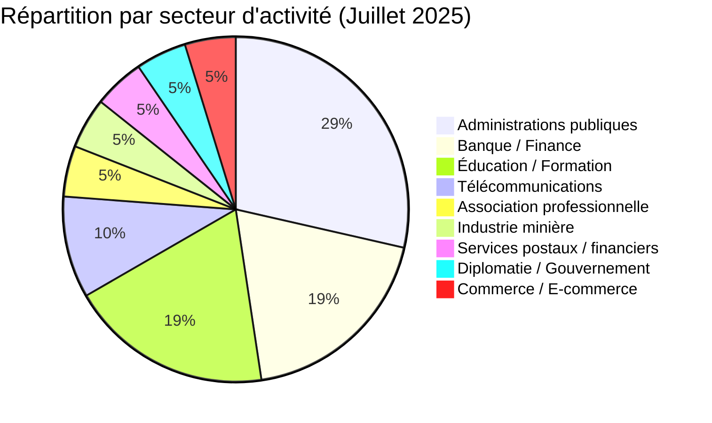
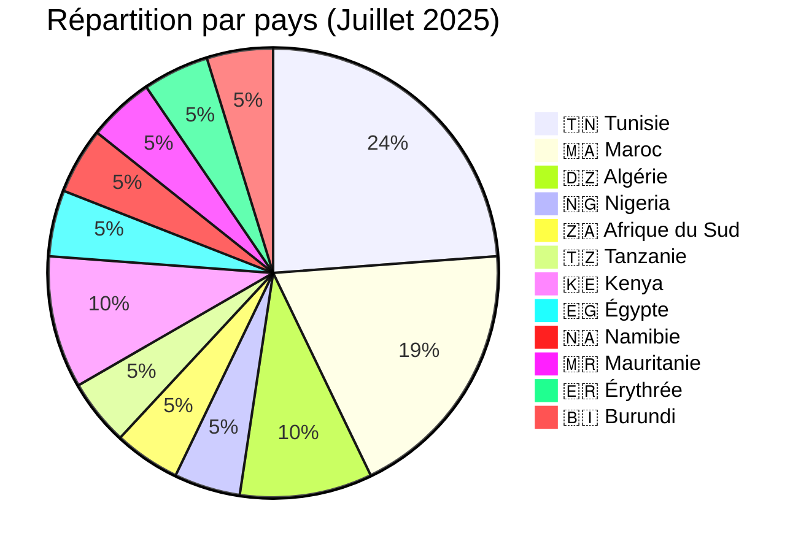
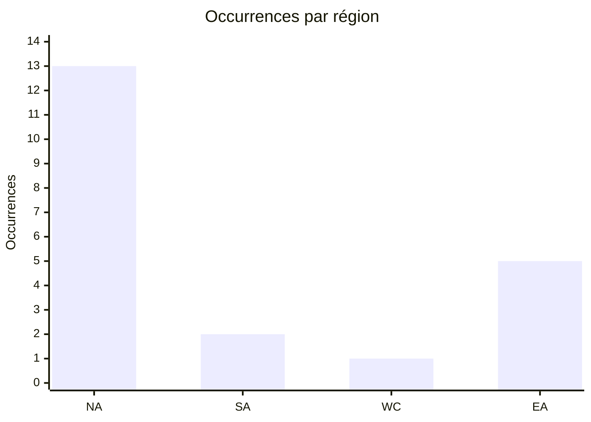
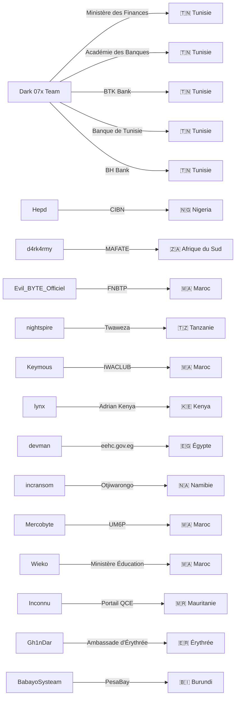
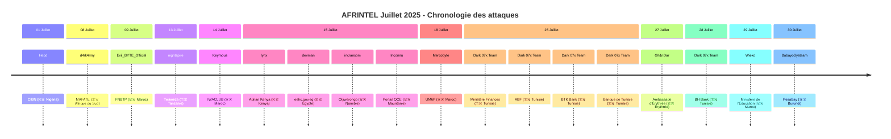

[](https://github.com/Hatchepsoute/AFRINTEL)


 
# Rapport CTI : Cyberattaques en Afrique - Juillet 2025 (21 victimes)
👉🏾 [**English version available here**](./README.md)

## 1. Introduction
Ce rapport de Cyber Threat Intelligence (CTI) présente une analyse détaillée des cyberattaques survenues en Afrique durant le mois de juillet 2025. Les informations sont issues de sources OSINT et de sites de fuites de groupes ransomware, compilées dans le cadre du projet AFRINTEL. L'objectif est de fournir une vision claire des tendances, des acteurs menaçants, des secteurs ciblés et des indicateurs de compromission associés.

## 2. Résumé exécutif
- **Nombre total d'attaques recensées** : 21
- **Acteurs les plus actifs** : Dark 07x Team (5 attaques), Inconnu (2), Hepd (1), sanji_shi5 (1), d4rk4rmy (1), Evil_BYTE_Officiel (1), nightspire (1), Keymous (1), Phantom Atlas (1), lynx (1), devman (1), incransom (1), Mercobyte (1), Gh1nDar (1), Wieko (1), BabayoSysteam (1).
- **Secteurs les plus ciblés** : Administrations publiques (6), Banque/Finance (4), Éducation/Formation (4), Télécommunications (2), Association professionnelle/Bâtiment (1), Industrie minière (1), Services postaux/financiers (1), Diplomatie/Gouvernement (1), Commerce/E-commerce (1).
- **Pays les plus touchés** : Tunisie (5), Maroc (4), Algérie (2), Kenya (2), Nigeria (1), Afrique du Sud (1), Tanzanie (1), Égypte (1), Namibie (1), Mauritanie (1), Érythrée (1), Burundi (1).
- **Volumes de données revendiqués notables** : Rançon de 2,27 M$ demandée pour eehc.gov.eg (Égypte). FNBTP (Maroc) : base de données de 180 lignes / 14 colonnes publiée gratuitement. Ambassade d'Érythrée aux États-Unis : revendication non vérifiée portant sur environ 5 000 enregistrements de citoyens. PesaBay (Burundi) : base de données complète de 1 850 enregistrements publiée. Autres volumes non précisés.

## 3. Statistiques clés

### 3.1 Répartition par groupe/acteur
| Groupe/Acteur | Nombre d'attaques |
|---------------|-------------------|
| Dark 07x Team | 5                 |
| Hepd          | 1                 |
| d4rk4rmy      | 1                 |
| Evil_BYTE_Officiel | 1            |
| nightspire    | 1                 |
| Keymous       | 1                 |
| Phantom Atlas | 1                 |
| lynx          | 1                 |
| devman        | 1                 |
| incransom     | 1                 |
| Mercobyte     | 1                 |
| Wieko         | 1                 |
| sanji_shi5    | 1                 |
| Inconnu       | 2                 |
| Gh1nDar       | 1                 |
| BabayoSysteam | 1                 |
| **Total**     | **21**            |


### 3.2 Répartition par secteur d'activité

| Secteur | Nombre d'attaques |
|---------|-------------------|
| Administrations publiques| 6 |
| Banque / Finance| 4 |
| Éducation / Formation | 4 |
| Télécommunications | 2 |
| Association professionnelle / Bâtiment | 1 |
| Industrie minière | 1 |
| Services postaux / financiers | 1 |
| Diplomatie / Gouvernement | 1 |
| Commerce / E-commerce | 1 |
| **Total** | **21** |


### 3.3 Répartition par pays
| Pays | Nombre d'attaques |
|------|-------------------|
| 🇹🇳 Tunisie | 5 |
| 🇲🇦 Maroc | 4 |
| 🇩🇿 Algérie | 2 |
| 🇿🇦 Afrique du Sud | 1 |
| 🇳🇬 Nigeria | 1 |
| 🇹🇿 Tanzanie | 1 |
| 🇰🇪 Kenya | 2 |
| 🇪🇬 Égypte | 1 |
| 🇳🇦 Namibie | 1 |
| 🇲🇷 Mauritanie | 1 |
| 🇪🇷 Érythrée | 1 |
| 🇧🇮 Burundi | 1 |
| **Total** | **21** |




<!-- AFRINTEL_CURRENT_MODEL_START -->
### 3.4 Vue globale standardisée

| Pays | Ransomware | Exposition des données (fuites + accès) | Total | Distribution |
| :--- | ---: | ---: | ---: | :--- |
| 🇹🇳 Tunisie | 0 | 5 | 5 |  🟦🟦🟦🟦🟦 |
| 🇲🇦 Maroc | 0 | 4 | 4 |  🟦🟦🟦🟦 |
| 🇩🇿 Algérie | 0 | 2 | 2 |  🟦🟦 |
| 🇰🇪 Kenya | 1 | 1 | 2 | 🟧 🟦 |
| 🇪🇬 Égypte | 1 | 0 | 1 | 🟧 |
| 🇪🇷 Érythrée | 0 | 1 | 1 |  🟦 |
| 🇲🇷 Mauritanie | 0 | 1 | 1 |  🟦 |
| 🇳🇦 Namibie | 1 | 0 | 1 | 🟧 |
| 🇳🇬 Nigeria | 0 | 1 | 1 |  🟦 |
| 🇿🇦 Afrique du Sud | 1 | 0 | 1 | 🟧 |
| 🇹🇿 Tanzanie | 1 | 0 | 1 | 🟧 |
| 🇧🇮 Burundi | 0 | 1 | 1 |  🟦 |

```pie
    title Types d’incidents
    "Ransomware" : 5
    "Fuites de données + ventes d’accès" : 16
```

### Vue agrégée mensuelle de l’exposition

La vue CTI mensuelle regroupe les fuites de données et les ventes d’accès sous **exposition des données** : **16 fiches** (76,2% du corpus mensuel). Les fiches sources restent la référence ; une vente d’accès ne prouve pas à elle seule l’exfiltration de données.


### Répartition géographique par région

| Région | Occurrences | Ransomware | Exposition des données (fuites + accès) | Distribution |
| :--- | ---: | ---: | ---: | :--- |
| Afrique du Nord | 13 | 1 | 12 | 🟧 🟦🟦🟦🟦🟦🟦🟦🟦🟦🟦🟦🟦 |
| Afrique australe | 2 | 2 | 0 | 🟧🟧 |
| Afrique de l’Ouest et centrale | 1 | 0 | 1 |  🟦 |
| Afrique de l’Est | 5 | 2 | 3 | 🟧🟧 🟦🟦🟦 |


Légende : NA = Afrique du Nord ; SA = Afrique australe ; WC = Afrique de l’Ouest et centrale ; EA = Afrique de l’Est

### Répartition sectorielle

| Secteur | Fiches | Part | Activité |
| :--- | ---: | ---: | :--- |
| Gouvernement / administration | 9 | 42,9% | ██████████ |
| Finance / banque | 6 | 28,6% | ███████ |
| Éducation / universités | 2 | 9,5% | ██ |
| Technologies / informatique | 2 | 9,5% | ██ |
| Commerce / E-commerce | 1 | 4,8% | █ |
| Énergie / services publics | 1 | 4,8% | █ |

### Acteurs / groupes les plus présents

| Acteur / Groupe | Fiches | Activité |
| :--- | ---: | :--- |
| Dark 07x Team | 5 | ██████████ |
| Unknown | 2 | ████ |
| Evil_BYTE_Officiel | 1 | ██ |
| Gh1nDar | 1 | ██ |
| Hepd | 1 | ██ |
| Keymous | 1 | ██ |
| Mercobyte | 1 | ██ |
| Phantom Atlas | 1 | ██ |
| Wieko | 1 | ██ |
| d4rk4rmy | 1 | ██ |
<!-- AFRINTEL_CURRENT_MODEL_END -->
## 4. Détail des attaques par groupe/acteur
### 4.1 Dark 07x Team (5 attaques)
- **25/07/2025 :** Ministère des Finances (Tunisie, gouvernement) - Revendication "Full Access".
- **25/07/2025 :** Académie des Banques et des Finances (Tunisie, formation) - Compromission interface admin.
- **25/07/2025 :** BTK Bank (Tunisie, banque) - Compromission de comptes (ATO) et mise en vente.
- **25/07/2025 :** Banque de Tunisie (Tunisie, banque) - Exfiltration de données financières et identités.
- **28/07/2025 :** BH Bank (Tunisie, banque) - Compromission majeure et prise de contrôle de comptes (ATO).

**Remarque :** Dark 07x Team a mené une campagne coordonnée contre le secteur financier et gouvernemental tunisien, avec cinq attaques en quelques jours, démontrant une capacité opérationnelle élevée.

### 4.2 Hepd (1 attaque)
- **01/07/2025** : Chartered Institute of Bankers of Nigeria (CIBN) (Nigeria, régulation bancaire) – Fuite de données sur l'élite bancaire.

### 4.3 d4rk4rmy (1 attaque)
- **08/07/2025** : MAFATE BUSINESS ENTERPRISE (Afrique du Sud, services miniers) – Revendication & divulgation.

### 4.4 Evil_BYTE_Officiel (1 attaque)
- **09/07/2025** : Fédération Nationale du Bâtiment et des Travaux Publics - FNBTP (Maroc, association professionnelle/bâtiment) – Claim - Data Fully Published. Base de données d'adhérents de 180 lignes / 14 colonnes (table `societe`) publiée gratuitement sur un forum underground ; aucun prix ni demande de rançon.

### 4.5 nightspire (1 attaque)
- **13/07/2025** : Twaweza (Tanzanie, ONG éducative) – Revendication & divulgation.

### 4.6 Keymous (1 attaque)
- **14/07/2025** : IWACLUB (Maroc, télécommunications/distribution) – Fuite de données.

### 4.7 lynx (1 attaque)
- **15/07/2025** : Adrian Kenya (Kenya, télécommunications/ingénierie) – Revendication & divulgation.

### 4.8 devman (1 attaque)
- **15/07/2025** : eehc.gov.eg (Égypte, gouvernement) – Rançon de 2,27 M$ demandée.

### 4.9 incransom (1 attaque)
- **15/07/2025** : Otjiwarongo Municipality (Namibie, gouvernement local) – Revendication & divulgation.

### 4.10 Mercobyte (1 attaque)
- **18/07/2025** : Université Mohammed VI Polytechnique (Maroc, éducation) – Fuite de données ciblée et opération d'influence.

### 4.11 Wieko (1 attaque)
- **29/07/2025** : Ministère de l’Éducation nationale, du Préscolaire et des Sports (Maroc, éducation) – revendication de combo list étayée par un échantillon visible ; aucune compromission directe du SI central du ministère n’est établie.

### 4.12 Inconnu (2 attaques)
- **14/07/2025** : ICT Authority (Kenya, gouvernement/infrastructure numérique) – aucun acteur revendicateur identifié ; l'échantillon CSV fourni contient 1 697 lignes de type annuaire, examiné sans reproduire de données personnelles.
- **15/07/2025** : Portail QCE - qce.gov.mr (Mauritanie, gouvernement/marchés publics) – aucun acteur revendicateur identifié ; échantillon local de dossiers de qualification de personnel (CV, cartes d'identité nationale, diplômes, contrats de travail notariés) daté à partir des métadonnées des fichiers en l'absence de date de publication.

### 4.13 Gh1nDar (1 attaque)
- **27/07/2025** : Ambassade d'Érythrée aux États-Unis (Érythrée, diplomatie/gouvernement) – Claim - Unverified. Revendication non vérifiée d'une fuite portant sur environ 5 000 enregistrements de citoyens ; aucun échantillon accessible.

### 4.14 BabayoSysteam (1 attaque)
- **30/07/2025** : PesaBay (Burundi, commerce électronique) – `Data Fully Published` ; publication d'une base de données complète de 1 850 comptes contenant des données de contact et des statuts de compte. La méthode d'acquisition demeure inconnue.

### 4.15 Graphe acteur → victime → pays

## 5. Analyse sectorielle
- **Banque/Finance** : 4 attaques (CIBN, BTK, Banque de Tunisie, BH Bank). Dark 07x Team a ciblé trois banques tunisiennes et Hepd a visé l'organisme de régulation nigérian, montrant une attention soutenue au secteur financier.
- **Administrations publiques** : 4 revendications (eehc.gov.eg, Otjiwarongo Municipality, Ministère des Finances tunisien, Portail QCE Mauritanie).
- **Éducation/Formation** : 4 attaques (Twaweza, ABF, UM6P, Ministère de l’Éducation). La publication de Wieko annonce une combo list multi-établissements et n’établit pas une compromission du SI central du ministère.
- **Télécommunications** : 2 attaques (IWACLUB, Adrian Kenya). Keymous et lynx ont ciblé des entreprises du secteur au Maroc et au Kenya.
- **Association professionnelle/Bâtiment** : 1 attaque (FNBTP) par Evil_BYTE_Officiel, exposant une base de données d'adhérents de 180 lignes publiée gratuitement.
- **Industrie minière** : 1 attaque (MAFATE) par d4rk4rmy en Afrique du Sud.
- **Diplomatie/Gouvernement** : 1 revendication non vérifiée (Ambassade d'Érythrée aux États-Unis) par Gh1nDar, concernant la représentation diplomatique d'un État africain à l'étranger.
- **Commerce/E-commerce** : 1 fuite concernant PesaBay au Burundi, avec publication complète d'une base de données de 1 850 comptes contenant des données de contact d'utilisateurs.

## 6. Analyse géographique
- **Tunisie** : 5 attaques, toutes menées par Dark 07x Team, ciblant le gouvernement et le secteur bancaire. La Tunisie est le pays le plus touché du mois, avec une campagne coordonnée.
- **Maroc** : 4 revendications (FNBTP, IWACLUB, UM6P, Ministère de l’Éducation) impliquant Evil_BYTE_Officiel, Keymous, Mercobyte et Wieko.
- **Nigeria** : 1 attaque (CIBN) par Hepd, visant l'organisme de régulation bancaire.
- **Afrique du Sud** : 1 attaque (MAFATE) par d4rk4rmy dans le secteur minier.
- **Tanzanie** : 1 attaque (Twaweza) par nightspire, touchant une ONG éducative.
- **Kenya** : 2 fiches (ICT Authority et Adrian Kenya), concernant une infrastructure numérique publique et un prestataire télécom/ingénierie.
- **Égypte** : 1 attaque (eehc.gov.eg) par devman, avec une demande de rançon élevée.
- **Namibie** : 1 attaque (Otjiwarongo Municipality) par incransom, visant une administration locale.
- **Mauritanie** : 1 revendication non attribuée (Portail QCE), une plateforme publique de qualification du personnel et des entreprises, avec un échantillon examiné localement de CV, cartes d'identité nationale, diplômes et contrats de travail notariés.
- **Érythrée** : 1 revendication non vérifiée (Ambassade d'Érythrée aux États-Unis) par Gh1nDar, visant une représentation diplomatique érythréenne plutôt qu'une entité domestique.
- **Burundi** : 1 fuite concernant la place de marché PesaBay, attribuée au compte BabayoSysteam, avec publication complète d'une base de 1 850 enregistrements.

L'Afrique du Nord (Tunisie, Maroc, Algérie, Égypte et Mauritanie) concentre 13 fiches sur 21. L'Afrique de l'Est atteint 5 fiches avec l'ajout du cas burundais.

### 6.1 Chronologie des attaques

        
## 7. TTPs observées
- **Campagnes coordonnées** : Dark 07x Team a mené plusieurs attaques simultanées contre des cibles tunisiennes, montrant une planification avancée.
- **Compromission de comptes (ATO)** : observée sur BTK Bank et BH Bank, avec mise en vente d'accès.
- **Exfiltration de données sensibles** : données financières, identités, informations sur l'élite bancaire (CIBN).
- **Demande de rançon** : devman a exigé 2,27 M$ pour eehc.gov.eg.
- **Opérations d'influence** : Mercobyte a publié des photos d'étudiants avec un message politique, allant au-delà de l'extorsion classique.
- **Hacktivisme** : Dark 07x Team semble avoir des motivations multiples (financières et politiques).
- **Publication gratuite / divulgation réputationnelle** : Evil_BYTE_Officiel a publié gratuitement la base de données FNBTP plutôt que de la vendre, cohérent avec une motivation réputationnelle plutôt que purement financière.
- **Circulation de jeux de données non attribués** : le cas du Portail QCE (Mauritanie) implique un échantillon de documents de qualification de personnel circulant sans acteur revendicateur ni post de forum identifié.
- **Exposition de données de comptes e-commerce** : la base PesaBay publiée contient des données de contact et des statuts de compte pouvant faciliter le phishing, le spam et l'usurpation d'identité.

## 8. Recommandations
- **Tunisie** : les institutions financières et gouvernementales doivent renforcer leur cybersécurité de manière urgente face à des campagnes coordonnées. Mettre en place une cellule de veille et de réponse aux incidents.
- **Secteur bancaire** : les banques (CIBN, BTK, BT, BH) doivent revoir leurs protocoles d'authentification et segmenter leurs réseaux pour limiter les compromissions de comptes.
- **Éducation** : les universités (UM6P), académies (ABF) et ONG éducatives (Twaweza) doivent protéger les données personnelles et former le personnel aux risques.
- **Administrations publiques** : renforcer la sécurité des sites web et portails gouvernementaux (eehc.gov.eg, Otjiwarongo, Portail QCE Mauritanie), imposer des contrôles d'accès stricts sur les plateformes traitant des pièces d'identité nationale, et mettre en place des sauvegardes hors ligne.
- **Tous secteurs** : sensibiliser les employés aux risques de phishing, mettre en place l'authentification multi-facteurs et des audits de sécurité réguliers.
- **Plateformes e-commerce** : limiter les exports de comptes, journaliser les consultations massives et notifier les utilisateurs concernés après validation interne de l'incident.

## 9. Conclusion
Juillet 2025 a été marqué par une campagne majeure du groupe **Dark 07x Team** contre la Tunisie, avec cinq attaques visant le gouvernement et le secteur bancaire. La diversité des acteurs et des cibles s'étend également au commerce électronique avec la publication visant PesaBay au Burundi. La demande de rançon de 2,27 M$ en Égypte et les fuites de données sensibles observées dans plusieurs pays soulignent l'urgence d'une coopération régionale renforcée. Le cas de l'Érythrée reste une revendication non vérifiée visant la représentation diplomatique d'un État africain à l'étranger.

## ✍🏿 Auteur
*Adama ASSIONGBON*  
*Consultant SOC & Cyber Threat Intelligence*  
[LinkedIn Profile](https://www.linkedin.com/in/adama-assiongbon-9029893a/)
