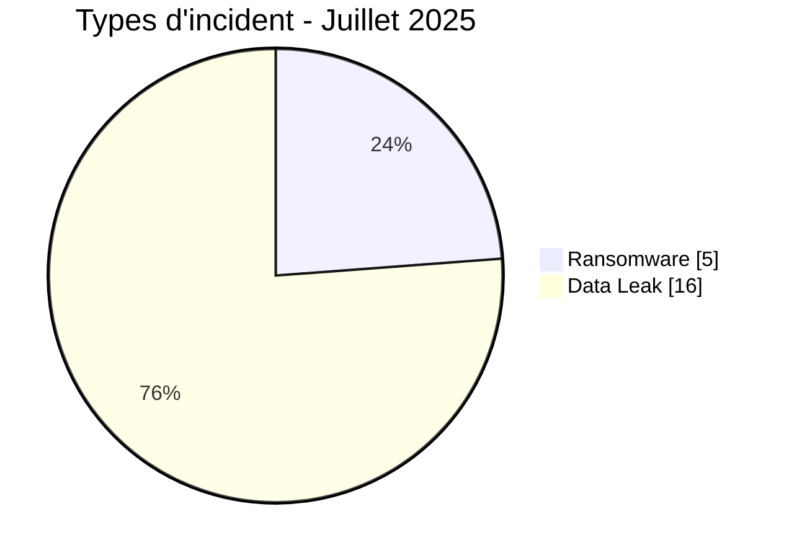
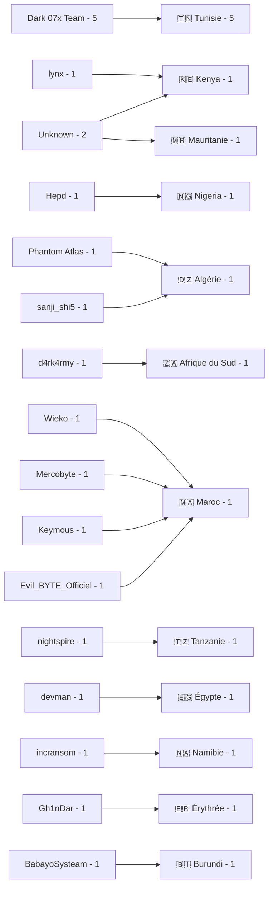
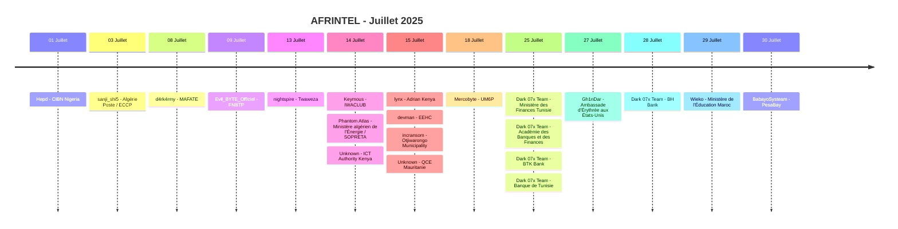

# Rapport CTI - Cyberattaques en Afrique - Juillet 2025

👉🏾 [**English version available here**](./README.md)

## 1. Synthèse exécutive

Juillet 2025 compte **21 incidents documentés dans 12 pays africains** : **5 Ransomware** et **16 Data Leak**. Aucun Access Sale, DDoS, Defacement ou Operational Fraud n'est enregistré comme type principal.

- **Tunisie** : 5 Data Leak, tous attribués à Dark 07x Team.
- **Maroc** : 4 Data Leak.
- **Algérie** : 2 Data Leak.
- **Kenya** : 2 incidents, dont 1 Ransomware et 1 Data Leak.
- **Dark 07x Team** est le label le plus visible avec 5 fiches.
- Deux dossiers ont un acteur non identifié : ICT Authority au Kenya et QCE en Mauritanie.
- Les éléments techniques les plus significatifs concernent notamment CIBN, FNBTP, ICT Authority, Adrian Kenya, EEHC, Otjiwarongo Municipality, QCE, les banques tunisiennes et PesaBay.
- EEHC fait l'objet d'une demande de rançon revendiquée de **2,27 millions USD**.
- FNBTP dispose d'un CSV examiné de **180 lignes et 14 colonnes**.
- L'Ambassade d'Érythrée aux États-Unis fait l'objet d'une revendication non vérifiée portant sur environ **5 000 citoyens**.
- PesaBay est classé **Data Fully Published** avec une base annoncée de **1 850 enregistrements**.

### 📋 Liste des victimes

👉🏾 [Voir la liste complète des victimes](./victims_FR.md)

### 1.1 Comparaison avec le mois précédent

> Comparaison fondée sur les corpus mensuels AFRINTEL validés. Une stabilité du nombre de fiches documentées ne signifie pas que l'activité réelle des attaquants ou l'impact sur les victimes est resté identique.

| Indicateur | Juin 2025 | Juillet 2025 | Évolution observée |
|---|---:|---:|---:|
| Total incidents | 21 | 21 | **0 (+0,0 %)** |
| Ransomware | 5 | 5 | **0 (+0,0 %)** |
| Data Leak | 16 | 16 | **0 (+0,0 %)** |
| Access Sale | 0 | 0 | **0 (stable)** |
| DDoS | 0 | 0 | **0 (stable)** |
| Defacement | 0 | 0 | **0 (stable)** |
| Operational Fraud | 0 | 0 | **0 (stable)** |

## 2. Méthodologie

- **Périmètre** : 54 pays africains.
- **Période** : 1er au 31 juillet 2025.
- **Sources** : OSINT, leak sites, forums underground, publications d'acteurs et échantillons disponibles.
- **Source de vérité** : couple validé [`victims_FR.md`](./victims_FR.md) / [`victims.md`](./victims.md), avec contrôle éditorial en français avant synchronisation anglaise.
- **Comptage** : une fiche correspond à un incident unique.
- **Taxonomie** : Ransomware, Data Leak, Access Sale, DDoS, Defacement, Operational Fraud.
- **Qualification** : revendication, échantillon, publication complète et confirmation technique restent des niveaux distincts.
- **Visualisation** : tableaux, barres textuelles, diagrammes Mermaid simples et chronologie.

## 3. Vue d'ensemble

### 3.1 Répartition par type d'incident

| Type d'incident | Nombre | Part |
|---|---:|---:|
| Ransomware | 5 | 23,8 % |
| Data Leak | 16 | 76,2 % |
| Access Sale | 0 | 0,0 % |
| DDoS | 0 | 0,0 % |
| Defacement | 0 | 0,0 % |
| Operational Fraud | 0 | 0,0 % |
| **Total** | **21** | **100 %** |

**Convention couleur :** 🟧 Ransomware | 🟦 Data Leak | 🟪 Access Sale | 🟥 DDoS | 🟨 Defacement | 🟩 Operational Fraud.

### 3.2 Répartition par pays

| Pays | Ransomware | Data Leak | Total | Distribution |
|---|---:|---:|---:|---|
| 🇹🇳 Tunisie | 0 | 5 | 5 | 🟦🟦🟦🟦🟦 |
| 🇲🇦 Maroc | 0 | 4 | 4 | 🟦🟦🟦🟦 |
| 🇩🇿 Algérie | 0 | 2 | 2 | 🟦🟦 |
| 🇰🇪 Kenya | 1 | 1 | 2 | 🟧🟦 |
| 🇪🇬 Égypte | 1 | 0 | 1 | 🟧 |
| 🇪🇷 Érythrée | 0 | 1 | 1 | 🟦 |
| 🇲🇷 Mauritanie | 0 | 1 | 1 | 🟦 |
| 🇳🇦 Namibie | 1 | 0 | 1 | 🟧 |
| 🇳🇬 Nigeria | 0 | 1 | 1 | 🟦 |
| 🇿🇦 Afrique du Sud | 1 | 0 | 1 | 🟧 |
| 🇹🇿 Tanzanie | 1 | 0 | 1 | 🟧 |
| 🇧🇮 Burundi | 0 | 1 | 1 | 🟦 |
| **Total** | **5** | **16** | **21** | |

### 3.3 Répartition géographique par région

| Région | Incidents | Part | Activité |
|---|---:|---:|---|
| Afrique du Nord | 13 | 61,9 % | ██████████ |
| Afrique de l'Est | 5 | 23,8 % | ████ |
| Afrique australe | 2 | 9,5 % | ██ |
| Afrique de l'Ouest | 1 | 4,8 % | █ |
| Afrique centrale | 0 | 0,0 % |  |
| **Total** | **21** | **100 %** | |

### 3.4 Répartition sectorielle harmonisée

| Secteur harmonisé | Incidents | Part | Activité |
|---|---:|---:|---|
| Gouvernement / Administration | 8 | 38,1 % | ██████████ |
| Finance / Banque | 6 | 28,6 % | ████████ |
| Éducation / Université / Formation | 2 | 9,5 % | ██ |
| Télécommunications / ICT | 2 | 9,5 % | ██ |
| BTP / Organisation professionnelle | 1 | 4,8 % | █ |
| Mines / Services industriels | 1 | 4,8 % | █ |
| Commerce / E-commerce | 1 | 4,8 % | █ |
| **Total** | **21** | **100 %** | |

### 3.5 Acteurs / groupes

| Acteur / Groupe | Incidents | Activité |
|---|---:|---|
| Dark 07x Team | 5 | ██████████ |
| Unknown | 2 | ████ |
| BabayoSysteam | 1 | ██ |
| d4rk4rmy | 1 | ██ |
| Evil_BYTE_Officiel | 1 | ██ |
| Gh1nDar | 1 | ██ |
| Hepd | 1 | ██ |
| Keymous | 1 | ██ |
| lynx | 1 | ██ |
| Mercobyte | 1 | ██ |
| nightspire | 1 | ██ |
| Phantom Atlas | 1 | ██ |
| sanji_shi5 | 1 | ██ |
| devman | 1 | ██ |
| incransom | 1 | ██ |
| Wieko | 1 | ██ |
| **Total** | **21** | |

### 3.6 Cartographie acteurs -> pays

## 4. Analyse détaillée par type d'incident

### 4.1 Ransomware - 5 incidents

Les cinq fiches Ransomware concernent :

- **MAFATE BUSINESS ENTERPRISE** en Afrique du Sud, revendiquée par d4rk4rmy.
- **Twaweza** en Tanzanie, revendiquée par nightspire.
- **Adrian Kenya** au Kenya, revendiquée par lynx, avec quatre documents analysés.
- **Egyptian Electricity Holding Company (EEHC)** en Égypte, revendiquée par devman, avec un inventaire de partage interne représentant environ 8 000 dossiers et plus de 50 000 entrées de fichiers ; la demande de rançon affichée est de 2,27 millions USD.
- **Otjiwarongo Municipality** en Namibie, revendiquée par incransom, avec un échantillon de paie municipale cohérent avec un accès réel à des données RH et bancaires.

### 4.2 Data Leak - 16 incidents

Les 16 Data Leak représentent **76,2 %** du corpus mensuel.

Les cas les plus significatifs incluent :

- **CIBN Nigeria** : archive structurée de 472 fichiers et environ 18 Mo, avec de multiples catégories de données liées aux membres, au personnel et aux systèmes.
- **Algérie Poste / ECCP** : échantillon de données d'accès revendiquées, non validées.
- **FNBTP Maroc** : base publiée gratuitement, avec 180 lignes et 14 colonnes dans le CSV examiné.
- **Ministère algérien de l'Énergie / SOPRETA** : document administratif probablement authentique, mais le cadrage accusatoire de l'acteur n'est pas corroboré par l'analyse.
- **ICT Authority Kenya** : export CSV de 1 697 lignes, sans acteur identifié.
- **QCE Mauritanie** : dossiers de qualification comprenant CV, pièces d'identité, diplômes et contrats, sans acteur identifié.
- **UM6P Maroc** : revendication de fuite ciblée et opération d'influence, sans collecte du jeu de données sous-jacent.
- **Dark 07x Team en Tunisie** : cinq fiches touchant le ministère des Finances, l'Académie des Banques et des Finances, BTK Bank, Banque de Tunisie et BH Bank. Plusieurs échantillons montrent des sessions administratives ou bancaires authentifiées. Certaines publications incluent aussi des offres de vente, mais les fiches restent classées Data Leak car l'exposition et l'accès aux données sont directement documentés.
- **Ambassade d'Érythrée aux États-Unis** : revendication non vérifiée portant sur environ 5 000 citoyens.
- **Ministère marocain de l'Éducation** : combo-list de 223 501 lignes revendiquée ; le matériel ne prouve pas une compromission directe du SI central du ministère.
- **PesaBay Burundi** : base de 1 850 comptes annoncée comme complète et publiée.

## 5. Impact sectoriel

**Gouvernement / Administration** est la catégorie harmonisée la plus représentée avec **8 incidents sur 21 (38,1 %)**.

**Finance / Banque** compte **6 incidents (28,6 %)**, en incluant CIBN, Algérie Poste/ECCP, l'Académie des Banques et des Finances et les trois banques tunisiennes BTK, Banque de Tunisie et BH Bank.

**Éducation / Université / Formation** et **Télécommunications / ICT** comptent 2 incidents chacune. Le BTP / Organisation professionnelle, les Mines / Services industriels et le Commerce / E-commerce comptent chacun 1 incident.

## 6. Profil des acteurs

**Dark 07x Team** domine le mois avec **5 fiches**, toutes en Tunisie. **Unknown** apparaît sur 2 fiches : ICT Authority et QCE. Les quatorze autres labels apparaissent une fois.

Le champ `Acteur / Groupe` a été normalisé : `sanji_shi5 (compte source)` devient `sanji_shi5`, tandis que les deux cas sans attribution conservent la valeur structurée `Unknown` dans les deux langues.

## 7. Tendances et lacunes de renseignement

### 7.1 Tendances observées

1. **Volume stable** : 21 incidents en juin et 21 en juillet.
2. **Structure identique par type** : 5 Ransomware et 16 Data Leak dans les deux mois.
3. **Tunisie en tête** : 5 incidents, tous liés à une campagne Dark 07x Team.
4. **Maroc** : 4 Data Leak.
5. **Forte dominante Data Leak** : 76,2 % du corpus.
6. **Nord de l'Afrique très représenté** : 13 incidents sur 21.
7. **Preuves très hétérogènes** : revendications non vérifiées, échantillons structurés, sessions authentifiées et publications complètes coexistent dans le même corpus.

### 7.2 Lacunes de renseignement

- Le vecteur d'accès initial reste inconnu pour la majorité des incidents.
- Plusieurs volumes ou nombres de victimes restent des revendications d'acteurs.
- L'origine exacte des identifiants Algérie Poste / ECCP n'est pas établie.
- Les dossiers ICT Authority et QCE n'ont pas d'acteur identifié.
- Le cas du ministère marocain de l'Éducation repose sur une combo-list multi-établissements et ne démontre pas une compromission du SI central.
- L'Ambassade d'Érythrée ne dispose pas d'échantillon vérifiable dans les éléments collectés.

### 7.3 Évolution mensuelle

| Type | Juin 2025 | Juillet 2025 | Évolution |
|---|---:|---:|---:|
| Total | 21 | 21 | **0 (stable)** |
| Ransomware | 5 | 5 | **0 (stable)** |
| Data Leak | 16 | 16 | **0 (stable)** |
| Access Sale | 0 | 0 | **0 (stable)** |

## 8. Chronologie synthétique

## 9. Cartographie MITRE ATT&CK contextuelle

| Phase | Technique | Portée analytique |
|---|---|---|
| Comptes valides | T1078 - Valid Accounts | Pertinent pour les sessions administratives ou bancaires authentifiées observées dans plusieurs cas tunisiens. |
| Collecte | T1005 - Data from Local System | Pertinent pour les documents, exports et répertoires internes examinés. |
| Collecte | T1213 - Data from Information Repositories | Pertinent pour les bases CIBN, FNBTP, ICT Authority, QCE et PesaBay. |
| Découverte | T1083 - File and Directory Discovery | Contexte pertinent pour l'inventaire de partage EEHC, sans preuve directe de la commande ou de l'outil utilisé par l'acteur. |

> Les mappings sont contextuels et ne constituent pas une preuve que chaque acteur a utilisé les techniques indiquées.

## 10. Recommandations

- **Banque / Finance** : MFA résistant au phishing, surveillance des sessions, détection des connexions anormales, protection des opérations de virement et contrôle des exports.
- **Secteur public** : PAM, segmentation, journalisation des accès administratifs et surveillance des exports de bases.
- **Éducation** : contrôle des identités, détection des combo-lists et vérification de l'origine des identifiants avant attribution à une compromission centrale.
- **Télécommunications / ICT** : protéger les portails partenaires, comptes administrateurs et données de projets.
- **E-commerce** : limiter les exports clients, chiffrer les données sensibles et surveiller les accès aux bases de production.

## 11. Recommandations SOC et tactiques

### Observé

Le corpus comprend des revendications, des bases publiées, des exports structurés, des sessions administratives ou bancaires authentifiées, des documents internes et des inventaires de fichiers.

### Hypothèses

Les vecteurs initiaux, les mécanismes de persistance et les chemins complets d'exfiltration ne sont pas établis pour la majorité des cas.

### Préventif

Surveiller les authentifications à privilèges, connexions anormales, exports volumineux, accès aux bases, création d'archives, sessions bancaires inhabituelles et transferts sortants. Maintenir MFA, PAM, EDR, segmentation, sauvegardes immuables et procédures rapides de révocation des sessions et secrets.

## 12. Conclusion

Juillet 2025 compte **21 incidents dans 12 pays**, répartis entre **5 Ransomware et 16 Data Leak**. Le volume et la répartition par type sont identiques à juin, mais la nature des preuves diffère fortement selon les dossiers.

La Tunisie concentre 5 incidents liés à Dark 07x Team, tandis que le Maroc en compte 4. Les cas bancaires tunisiens, EEHC, Otjiwarongo, ICT Authority, QCE, FNBTP et PesaBay illustrent l'écart important entre simple revendication, accès authentifié, échantillon analysé et publication complète.

**AFRINTEL** - Initiative ouverte de veille CTI sur l'Afrique
