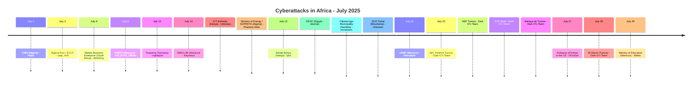
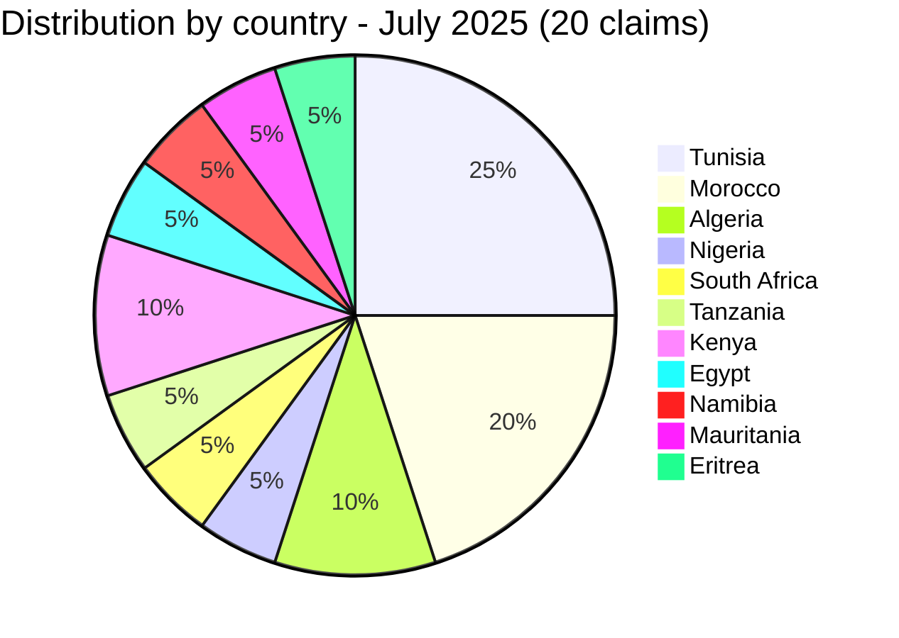
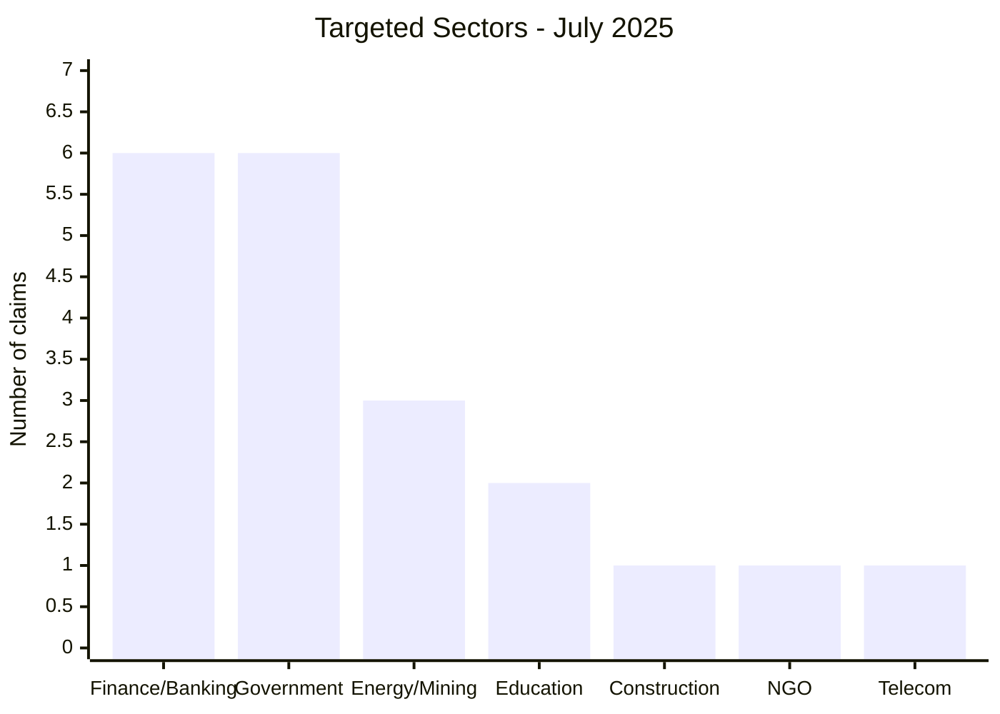
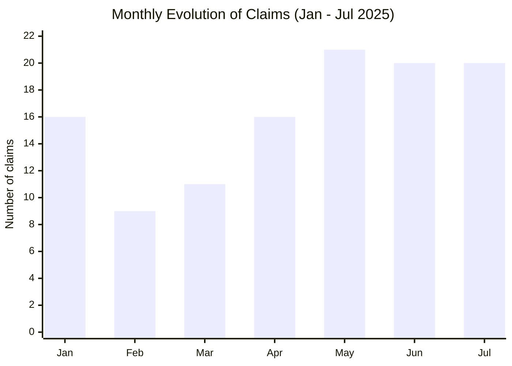

# CTI Report - July 2025: Tunisia's banking sector hit hard by Dark 07x Team

👉🏾 [Version française disponible ici](./README_FR.md)

👉🏾 [Victims list](../victims.md)

### 1. Executive summary

July 2025 records **20 documented claims** across 11 countries. The month is dominated by a **coordinated campaign by Dark 07x Team against Tunisia's banking and financial sector**: 5 of the 20 claims are Tunisian financial institutions, targeted between July 25 and July 28. Morocco is the second most-targeted country with four separate claims spanning construction, telecom distribution, higher education and a ministry credential leak. Egypt faces the month's highest ransom demand ($2.27M) against a public electricity authority, and a Mauritanian government portal exposes personnel-qualification dossiers containing national ID numbers and diplomas. AFRINTEL also reviewed and partly corroborated an accusatory leak targeting Algeria's Ministry of Energy, and recorded a claim affecting the Eritrean embassy in the United States.

**Key figures:**
- 🔹 **20 claims** documented
- 🔹 **16 active actors/groups**: Dark 07x Team (5), Hepd (1), sanji_shi5 (1), d4rk4rmy (1), Evil_BYTE_Officiel (1), nightspire (1), Keymous (1), Phantom Atlas (1), lynx (1), devman (1), incransom (1), Unknown (2), Mercobyte (1), Gh1nDar (1), Wieko (1)
- 🔹 **Countries affected**: Tunisia (5), Morocco (4), Algeria (2), Nigeria (1), South Africa (1), Tanzania (1), Kenya (2), Egypt (1), Namibia (1), Mauritania (1), Eritrea (1)
- 🔹 **Sectors**: Finance / Banking / Insurance (6), Government / Public administrations (6), Energy / Mining (3), Education (2), Construction / Real estate (1), Religion / NGO (1), Telecommunications (1)

---

### 2. Attack timeline

| Date | Victim | Country | Group |
|------|--------|---------|-------|
| July 1 | Chartered Institute of Bankers of Nigeria (CIBN) | Nigeria | Hepd |
| July 3 | Algeria Post / ECCP | Algeria | sanji_shi5 |
| July 8 | Mafate Business Enterprise | South Africa | d4rk4rmy |
| July 9 | Fédération Nationale du Bâtiment et des Travaux Publics (FNBTP) | Morocco | Evil_BYTE_Officiel |
| July 13 | Twaweza | Tanzania | nightspire |
| July 14 | IWACLUB (iwaclub.ma) | Morocco | Keymous |
| July 14 | ICT Authority (icta.go.ke) | Kenya | Unknown |
| July 14 | Ministry of Energy, Mines and Renewable Energies / SARL SOPRETA | Algeria | Phantom Atlas |
| July 15 | Adrian Kenya | Kenya | lynx |
| July 15 | EEHC (eehc.gov.eg) | Egypt | devman |
| July 15 | Otjiwarongo Municipality | Namibia | incransom |
| July 15 | QCE Portal (qce.gov.mr) | Mauritania | Unknown |
| July 18 | Mohammed VI Polytechnic University (UM6P) | Morocco | Mercobyte |
| July 25 | Ministry of Finance (finances.gov.tn) | Tunisia | Dark 07x Team |
| July 25 | Academy of Banks and Finance (ABF) | Tunisia | Dark 07x Team |
| July 25 | BTK Bank | Tunisia | Dark 07x Team |
| July 25 | Banque de Tunisie | Tunisia | Dark 07x Team |
| July 27 | Embassy of Eritrea in the United States | Eritrea | Gh1nDar |
| July 28 | BH Bank | Tunisia | Dark 07x Team |
| July 29 | Ministry of National Education, Preschool and Sports | Morocco | Wieko |

---

### 3. Victim analysis

#### 3.1 By country

| Country | Number of claims |
|---------|-----------------|
| Tunisia | 5 |
| Morocco | 4 |
| Algeria | 2 |
| Nigeria | 1 |
| South Africa | 1 |
| Tanzania | 1 |
| Kenya | 2 |
| Egypt | 1 |
| Namibia | 1 |
| Mauritania | 1 |
| Eritrea | 1 |

#### 3.2 By sector

| Sector | Count |
|--------|-------|
| Finance / Banking / Insurance | 6 |
| Government / Public administrations | 6 |
| Energy / Mining | 3 |
| Education | 2 |
| Construction / Real estate | 1 |
| Religion / NGO | 1 |
| Telecommunications | 1 |

#### 3.3 Active groups

| Group | Claims | Targets |
|-------|---------|---------|
| Dark 07x Team | 5 | Tunisian banking and finance sector |
| Hepd | 1 | Nigeria (banking regulatory body) |
| sanji_shi5 | 1 | Algeria (postal/financial services) |
| d4rk4rmy | 1 | South Africa (mining support services) |
| Evil_BYTE_Officiel | 1 | Morocco (construction sector federation) |
| nightspire | 1 | Tanzania (NGO) |
| Keymous | 1 | Morocco (telecom distributor) |
| Phantom Atlas | 1 | Algeria (energy ministry / chemicals import) |
| lynx | 1 | Kenya (telecom/energy infrastructure) |
| devman | 1 | Egypt (government electricity authority) |
| incransom | 1 | Namibia (municipality) |
| Unknown | 2 | Mauritania (government procurement portal) and Kenya (ICT Authority) |
| Mercobyte | 1 | Morocco (university) |
| Gh1nDar | 1 | Eritrea (embassy, diplomatic) |
| Wieko | 1 | Morocco (education credential list) |

---

### 4. Key observations

- **Dark 07x Team coordinated campaign**: 5 Tunisian financial institutions compromised in a single wave (July 25-28). Ministry of Finance, two major banks (Banque de Tunisie, BH Bank), BTK Bank, and the banking training academy (ABF). Several claims are backed by evidence of live, authenticated banking sessions rather than mere assertions, and part of the stolen data is offered for tiered sale. This is the most concentrated single-sector campaign observed by AFRINTEL in 2025.
- **Egypt: highest ransom demand of the month**. devman demands **$2.27M USD** for EEHC (Egyptian Electricity Holding Company), a public electricity authority. Critical infrastructure at stake.
- **Morocco, four separate claims**: FNBTP (construction federation, full database publication with 180 company records), IWACLUB (inwi telecom distributor), UM6P (university, hybrid data-leak/influence operation combining student photos and political messaging), and the Ministry of National Education (a 223,501-line combined credential list, distinct from the June Massar-platform claim on the same ministry).
- **Algeria, investigative verification**: a Phantom Atlas post accused the Ministry of Energy, Mines and Renewable Energies of granting an import licence to an "unknown" company for hazardous chemicals. AFRINTEL's review of the leaked documents assessed them as probably authentic, but found the accusatory framing unsupported: the named company is a registered waterproofing manufacturer and the import falls within an existing regulatory declaration process. The leak nonetheless exposes an internal administrative document and third-party commercial data without authorization.
- **Mauritania, sensitive personnel data**: a local sample from the QCE government procurement portal exposed personnel-qualification dossiers (CVs, national ID cards, diplomas, notarized contracts) for private-sector employees, with no claiming actor identified. The combination of national ID numbers, diplomas and employment records creates a significant identity-fraud risk.
- **Eritrea, diplomatic-sector claim**: a claim by Gh1nDar alleges a leak affecting roughly 5,000 citizens linked to the Eritrean embassy in the United States, including identity and passport data. No verifiable sample was accessible; AFRINTEL records this as an unverified claim from a source account with no established reliability history.

---

### 5. Recommendations

| Domain | Recommended action |
|--------|--------------------|
| Banking / Financial institutions | Investigate Dark 07x Team IOCs, audit admin interfaces for account-takeover indicators, and review SWIFT/payment-gateway access logs. |
| Government / Public administration | Assess ransomware readiness, implement out-of-band backups for critical systems, and enforce privileged access management. |
| Public procurement / personnel data platforms | Restrict access to identity-document and qualification-dossier repositories, encrypt data at rest, and log all export activity. |
| Education | Harden public-facing web portals, monitor for data scraping, and prepare for influence-operation scenarios. |
| Diplomatic missions | Review third-party hosting and CRM providers handling citizen data, and enforce MFA on administrative consular systems. |
| All organizations | Track Dark 07x Team as a highly active group against North African financial infrastructure. |

---

*Report generated from AFRINTEL OSINT data. Free distribution (TLP:CLEAR)*
