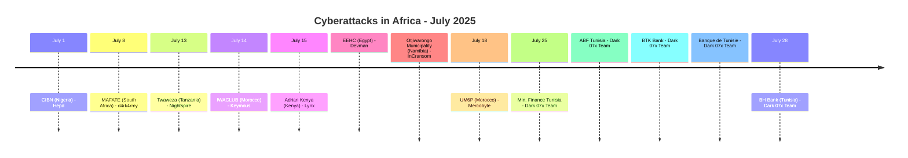
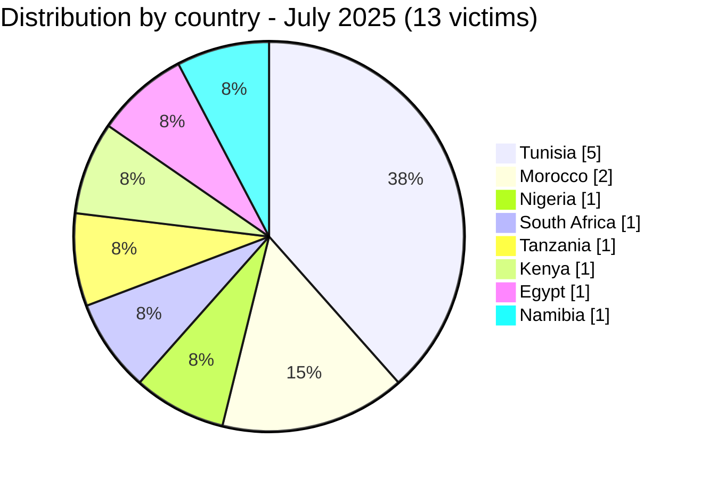

[](https://github.com/Hatchepsoute/AFRINTEL)


# CTI Report - July 2025: Tunisia's banking sector hit hard by Dark 07x Team

👉🏾 [Version française disponible ici](./README_FR.md)

👉🏾 [Victims list](../victims.md)

### 1. Executive summary

July 2025 records **13 documented victims** across 8 countries. The month is dominated by a **coordinated campaign by Dark 07x Team against Tunisia's banking and financial sector**, 5 out of 13 victims are Tunisian financial institutions claimed on the same day (July 25). Egypt faces a major ransom demand ($2.27M) targeting a government electricity body, and Morocco sees both a telecom distributor and a university compromised.

**Key figures:**
- 🔹 **13 victims** identified
- 🔹 **9 active groups**: Dark 07x Team (5), Hepd (1), d4rk4rmy (1), Nightspire (1), Keymous (1), Lynx (1), Devman (1), InCransom (1), Mercobyte (1)
- 🔹 **Countries affected**: Tunisia (5), Morocco (2), Nigeria (1), South Africa (1), Tanzania (1), Kenya (1), Egypt (1), Namibia (1)
- 🔹 **Sectors**: Banking & Finance (5), Government (3), Education (2), Telecom (1), NGO (1), Industrial/Mining (1)

---

### 2. Attack timeline

| Date | Victim | Country | Group |
|------|--------|---------|-------|
| July 1 | Chartered Institute of Bankers of Nigeria (CIBN) | Nigeria | Hepd |
| July 8 | MAFATE BUSINESS ENTERPRISE | South Africa | d4rk4rmy |
| July 13 | Twaweza | Tanzania | Nightspire |
| July 14 | IWACLUB (iwaclub.ma) | Morocco | Keymous |
| July 15 | Adrian Kenya | Kenya | Lynx |
| July 15 | EEHC (eehc.gov.eg) | Egypt | Devman |
| July 15 | Otjiwarongo Municipality | Namibia | InCransom |
| July 18 | Mohammed VI Polytechnic University (UM6P) | Morocco | Mercobyte |
| July 25 | Ministry of Finance (finances.gov.tn) | Tunisia | Dark 07x Team |
| July 25 | Academy of Banks and Finance (ABF) | Tunisia | Dark 07x Team |
| July 25 | BTK Bank | Tunisia | Dark 07x Team |
| July 25 | Banque de Tunisie | Tunisia | Dark 07x Team |
| July 28 | BH Bank | Tunisia | Dark 07x Team |



---

### 3. Victim analysis

#### 3.1 By country

| Country | Number of attacks |
|---------|-----------------|
| Tunisia | 5 |
| Morocco | 2 |
| Nigeria | 1 |
| South Africa | 1 |
| Tanzania | 1 |
| Kenya | 1 |
| Egypt | 1 |
| Namibia | 1 |



#### 3.2 By sector

| Sector | Count |
|--------|-------|
| Banking & Financial Services | 5 |
| Government / Public Administration | 3 |
| Education | 2 |
| Telecom / Distribution | 1 |
| NGO | 1 |
| Industrial / Mining Support | 1 |

```mermaid
xychart-beta
    title "Targeted Sectors - July 2025"
    x-axis ["Banking", "Government", "Education", "Telecom", "NGO", "Industrial"]
    y-axis "Number of attacks" 0 to 6
    bar [5, 3, 2, 1, 1, 1]
```

#### 3.3 Active groups

| Group | Attacks | Targets |
|-------|---------|---------|
| Dark 07x Team | 5 | Tunisian banking sector |
| Hepd | 1 | Nigeria (regulatory body) |
| d4rk4rmy | 1 | South Africa (mining services) |
| Nightspire | 1 | Tanzania (NGO) |
| Keymous | 1 | Morocco (telecom) |
| Lynx | 1 | Kenya (ICT/energy) |
| Devman | 1 | Egypt (government) |
| InCransom | 1 | Namibia (municipality) |
| Mercobyte | 1 | Morocco (university) |

---

### 4. Key observations

- **Dark 07x Team coordinated campaign**: 5 Tunisian financial institutions compromised in a single wave (July 25–28). Ministry of Finance, two major banks (Banque de Tunisie, BH Bank), BTK Bank, and the banking training academy (ABF). This represents the most concentrated sector attack seen in AFRINTEL tracking so far.
- **Egypt: highest ransom of the month**. Devman demands **$2.27M USD** for EEHC (Egyptian Electricity Holding Company), a public electricity authority. Critical infrastructure at stake.
- **Morocco dual targeting**: UM6P (research university) hit via an influence operation (student photos published with political messages) and IWACLUB (inwi telecom distributor) via data leak, distinct threat actors, same month.
- **East Africa**: Twaweza (Tanzania) and Adrian Kenya mark continued expansion beyond Southern/North African targets, with NGO and critical infrastructure profiles.
- **Mercobyte, influence operation**: the UM6P compromise blends data exfiltration with political messaging, illustrating the hybrid nature of some threat actors operating in Africa.

---

```mermaid
xychart-beta
    title "Monthly Evolution of Attacks (Jan - Jul 2025)"
    x-axis ["Jan", "Feb", "Mar", "Apr", "May", "Jun", "Jul"]
    y-axis "Number of attacks" 0 to 20
    bar [8, 10, 9, 10, 16, 14, 13]
```

### 5. Recommendations

| Domain | Recommended action |
|--------|--------------------|
| Banking / Financial institutions | Investigate Dark 07x Team IOCs, audit admin interfaces for ATO indicators, review SWIFT/payment gateway access logs. |
| Government / Public administration | Assess ransomware readiness, implement out-of-band backup for critical systems, enforce privileged access management. |
| Education | Harden public-facing web portals, monitor for data scraping, prepare for influence operation scenarios. |
| Telecom / Distribution platforms | Audit partner and reseller access, monitor API endpoints for anomalous queries. |
| All organizations | Track Dark 07x Team as a highly active group against North African financial infrastructure. |

---

*Report generated from AFRINTEL OSINT data. Free distribution (TLP:CLEAR)*
