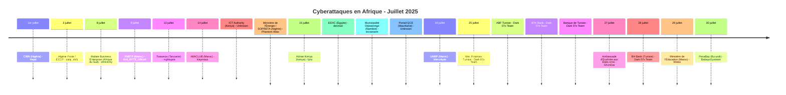
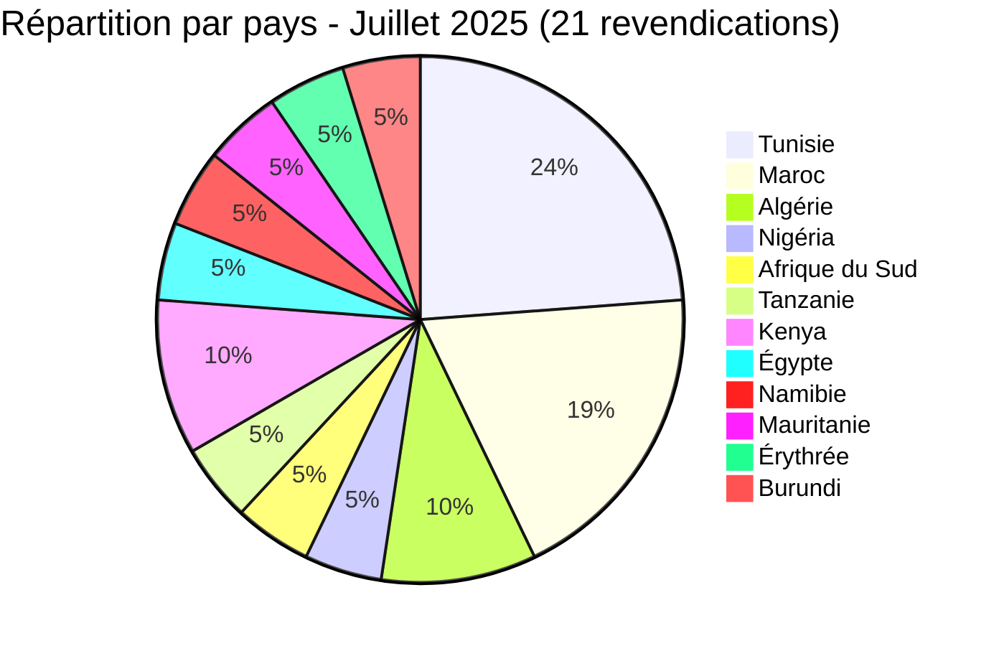
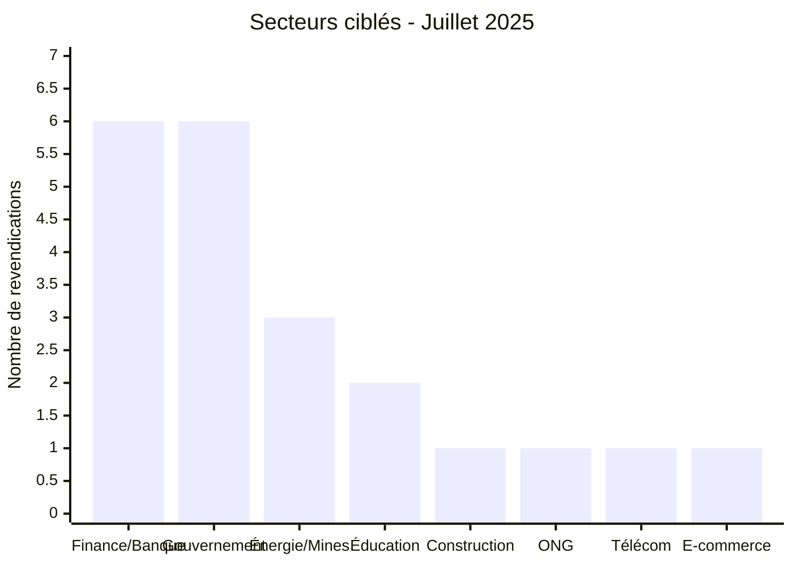
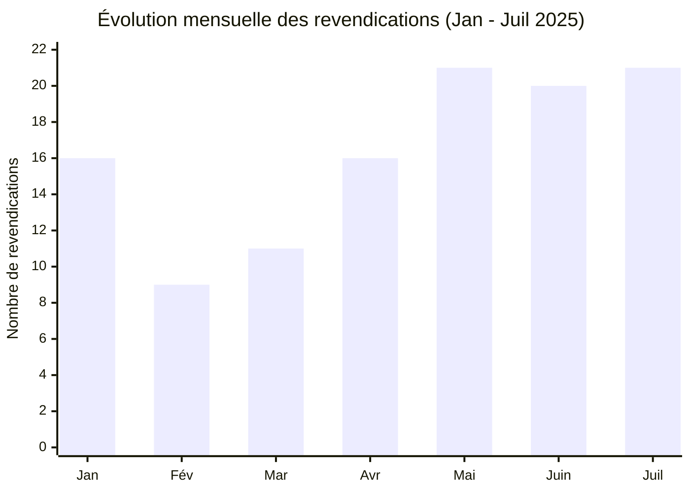

# Rapport CTI - Juillet 2025 : le secteur bancaire tunisien frappé de plein fouet par Dark 07x Team

👉🏾 [English version available here](./README.md)

👉🏾 [Liste des victimes](../victims_FR.md)

### 1. Résumé exécutif

Juillet 2025 enregistre **21 revendications** documentées dans 12 pays. Le mois est dominé par une **campagne coordonnée de Dark 07x Team contre le secteur bancaire et financier tunisien** : 5 des 21 revendications concernent des institutions financières tunisiennes, publiées entre le 25 et le 28 juillet. Le Maroc est le deuxième pays le plus visible avec quatre revendications distinctes couvrant la construction, la distribution télécom, l'enseignement supérieur et une fuite d'identifiants ministériels. L'Égypte fait face à la demande de rançon la plus élevée du mois (2,27 M$) contre une autorité publique de l'électricité, et un portail gouvernemental mauritanien expose des dossiers de qualification du personnel contenant numéros de carte d'identité et diplômes. AFRINTEL a également examiné et partiellement corroboré une publication accusatoire visant le ministère algérien de l'Énergie, enregistré une revendication concernant l'ambassade d'Érythrée aux États-Unis et recensé la publication complète d'une base de données de contact visant la place de marché burundaise PesaBay.

**Chiffres clés :**
- 🔹 **21 revendications** documentées
- 🔹 **16 acteurs/groupes actifs** : Dark 07x Team (5), Unknown (2), Hepd (1), sanji_shi5 (1), d4rk4rmy (1), Evil_BYTE_Officiel (1), nightspire (1), Keymous (1), Phantom Atlas (1), lynx (1), devman (1), incransom (1), Mercobyte (1), Gh1nDar (1), Wieko (1), BabayoSysteam (1)
- 🔹 **Pays touchés** : Tunisie (5), Maroc (4), Algérie (2), Kenya (2), Nigéria (1), Afrique du Sud (1), Tanzanie (1), Égypte (1), Namibie (1), Mauritanie (1), Érythrée (1), Burundi (1)
- 🔹 **Secteurs** : Finance / Banque / Assurance (6), Gouvernement / Administrations publiques (6), Énergie / Mines (3), Éducation (2), Construction / Immobilier (1), Religion / ONG (1), Télécommunications (1), Commerce / E-commerce (1)

---

### 2. Chronologie des attaques

| Date | Victime | Pays | Groupe |
|------|---------|------|--------|
| 1er juillet | Chartered Institute of Bankers of Nigeria (CIBN) | Nigéria | Hepd |
| 3 juillet | Algérie Poste / ECCP | Algérie | sanji_shi5 |
| 8 juillet | Mafate Business Enterprise | Afrique du Sud | d4rk4rmy |
| 9 juillet | Fédération Nationale du Bâtiment et des Travaux Publics (FNBTP) | Maroc | Evil_BYTE_Officiel |
| 13 juillet | Twaweza | Tanzanie | nightspire |
| 14 juillet | IWACLUB (iwaclub.ma) | Maroc | Keymous |
| 14 juillet | ICT Authority (icta.go.ke) | Kenya | Unknown |
| 14 juillet | Ministère de l'Énergie, des Mines et des Énergies Renouvelables / SARL SOPRETA | Algérie | Phantom Atlas |
| 15 juillet | Adrian Kenya | Kenya | lynx |
| 15 juillet | EEHC (eehc.gov.eg) | Égypte | devman |
| 15 juillet | Municipalité d'Otjiwarongo | Namibie | incransom |
| 15 juillet | Portail QCE (qce.gov.mr) | Mauritanie | Unknown |
| 18 juillet | Université Mohammed VI Polytechnique (UM6P) | Maroc | Mercobyte |
| 25 juillet | Ministère des Finances (finances.gov.tn) | Tunisie | Dark 07x Team |
| 25 juillet | Académie des Banques et Finances (ABF) | Tunisie | Dark 07x Team |
| 25 juillet | BTK Bank | Tunisie | Dark 07x Team |
| 25 juillet | Banque de Tunisie | Tunisie | Dark 07x Team |
| 27 juillet | Ambassade d'Érythrée aux États-Unis | Érythrée | Gh1nDar |
| 28 juillet | BH Bank | Tunisie | Dark 07x Team |
| 29 juillet | Ministère de l'Éducation nationale, du Préscolaire et des Sports | Maroc | Wieko |
| 30 juillet | PesaBay | Burundi | BabayoSysteam |

---

### 3. Analyse des victimes

#### 3.1 Par pays

| Pays | Nombre de revendications |
|------|-----------------|
| Tunisie | 5 |
| Maroc | 4 |
| Algérie | 2 |
| Nigéria | 1 |
| Afrique du Sud | 1 |
| Tanzanie | 1 |
| Kenya | 2 |
| Égypte | 1 |
| Namibie | 1 |
| Mauritanie | 1 |
| Érythrée | 1 |
| Burundi | 1 |

#### 3.2 Par secteur

| Secteur | Nombre |
|---------|--------|
| Finance / Banque / Assurance | 6 |
| Gouvernement / Administrations publiques | 6 |
| Énergie / Mines | 3 |
| Éducation | 2 |
| Construction / Immobilier | 1 |
| Religion / ONG | 1 |
| Télécommunications | 1 |
| Commerce / E-commerce | 1 |

#### 3.3 Groupes actifs

| Groupe | Revendications | Cibles |
|--------|---------|--------|
| Dark 07x Team | 5 | Secteur bancaire et financier tunisien |
| Hepd | 1 | Nigéria (organe de régulation bancaire) |
| sanji_shi5 | 1 | Algérie (services postaux/financiers) |
| d4rk4rmy | 1 | Afrique du Sud (services miniers) |
| Evil_BYTE_Officiel | 1 | Maroc (fédération du secteur construction) |
| nightspire | 1 | Tanzanie (ONG) |
| Keymous | 1 | Maroc (distributeur télécom) |
| Phantom Atlas | 1 | Algérie (ministère de l'Énergie / import chimique) |
| lynx | 1 | Kenya (infrastructure télécom/énergie) |
| devman | 1 | Égypte (autorité publique de l'électricité) |
| incransom | 1 | Namibie (municipalité) |
| Unknown | 2 | Mauritanie (portail gouvernemental de marchés publics) et Kenya (ICT Authority) |
| Mercobyte | 1 | Maroc (université) |
| Gh1nDar | 1 | Érythrée (ambassade, diplomatique) |
| Wieko | 1 | Maroc (liste d'identifiants du secteur éducatif) |
| BabayoSysteam | 1 | Burundi (place de marché PesaBay) |

---

### 4. Points d'attention

- **Campagne coordonnée de Dark 07x Team** : 5 institutions financières tunisiennes compromises en une seule vague (25 au 28 juillet). Ministère des Finances, deux grandes banques (Banque de Tunisie, BH Bank), BTK Bank et l'académie de formation bancaire (ABF). Plusieurs revendications s'appuient sur des sessions bancaires authentifiées et actives plutôt que de simples affirmations, et une partie des données volées est proposée à la vente par lots. C'est la campagne sectorielle la plus concentrée observée par AFRINTEL en 2025.
- **Égypte : demande de rançon la plus élevée du mois**. devman réclame **2,27 M$ USD** pour EEHC (Egyptian Electricity Holding Company), autorité publique de l'électricité. Infrastructure critique en jeu.
- **Maroc, quatre revendications distinctes** : FNBTP (fédération de la construction, publication complète d'une base de 180 fiches d'entreprises), IWACLUB (distributeur télécom inwi), UM6P (université, opération hybride mêlant fuite de données et influence politique via des photos d'étudiants) et le ministère de l'Éducation nationale (liste combinée de 223 501 identifiants, distincte de la revendication de juin sur la plateforme Massar du même ministère).
- **Algérie, vérification par AFRINTEL** : une publication de Phantom Atlas accuse le ministère de l'Énergie, des Mines et des Énergies Renouvelables d'avoir accordé une licence d'importation à une entreprise « inconnue » pour des produits chimiques dangereux. L'examen des documents divulgués par AFRINTEL les évalue comme probablement authentiques, mais l'angle accusatoire n'est pas corroboré : l'entreprise citée est un fabricant d'étanchéité dûment enregistré, et l'importation relève d'une procédure de déclaration réglementaire existante. La fuite expose néanmoins un document administratif interne et des données commerciales d'un tiers sans autorisation.
- **Mauritanie, données personnelles sensibles** : un échantillon local du portail gouvernemental QCE de marchés publics a exposé des dossiers de qualification du personnel (CV, cartes d'identité nationale, diplômes, contrats notariés) pour des employés du secteur privé, sans acteur revendicateur identifié. La combinaison de numéros d'identité nationale, de diplômes et de données d'emploi crée un risque important de fraude à l'identité.
- **Érythrée, revendication touchant le secteur diplomatique** : une revendication de Gh1nDar allègue une fuite concernant environ 5 000 citoyens liés à l'ambassade d'Érythrée aux États-Unis, incluant des données d'identité et de passeport. Aucun échantillon vérifiable n'était accessible ; AFRINTEL enregistre cette revendication comme non vérifiée, provenant d'un compte source sans historique de fiabilité établi.
- **Burundi, base de données PesaBay intégralement publiée** : une publication attribuée à BabayoSysteam met à disposition une base présentée comme complète de 1 850 enregistrements PesaBay, contenant des noms, adresses e-mail, numéros de téléphone et statuts de compte. Le cas est classé `Data Fully Published` ; la méthode d'acquisition demeure inconnue.

---

### 5. Recommandations

| Domaine | Action recommandée |
|---------|--------------------|
| Banque / Institutions financières | Analyser les IOC de Dark 07x Team, auditer les interfaces d'administration pour repérer des indicateurs de prise de contrôle de compte, et revoir les journaux d'accès aux passerelles SWIFT/paiement. |
| Gouvernement / Administration publique | Évaluer la préparation face au ransomware, mettre en place des sauvegardes hors bande pour les systèmes critiques, et appliquer une gestion stricte des accès privilégiés. |
| Plateformes de marchés publics / données personnelles | Restreindre l'accès aux dépôts de documents d'identité et de dossiers de qualification, chiffrer les données au repos, et journaliser tout export. |
| Éducation | Durcir les portails web publics, surveiller le scraping de données, et se préparer à des scénarios d'opération d'influence. |
| Missions diplomatiques | Revoir les prestataires tiers (hébergement, CRM) traitant des données de citoyens, et imposer l'authentification multifacteur sur les systèmes consulaires administratifs. |
| Plateformes e-commerce | Restreindre les exports massifs de comptes, surveiller les lectures inhabituelles en base et préparer la notification des utilisateurs après validation interne. |
| Toutes organisations | Suivre Dark 07x Team comme groupe très actif contre les infrastructures financières nord-africaines. |

---

*Rapport généré à partir des données OSINT AFRINTEL. Diffusion libre (TLP:CLEAR)*
