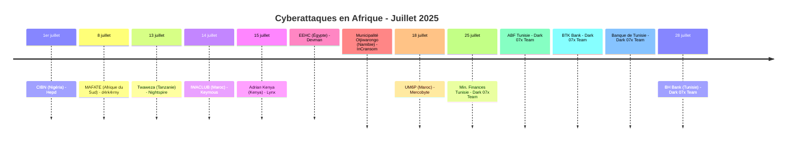
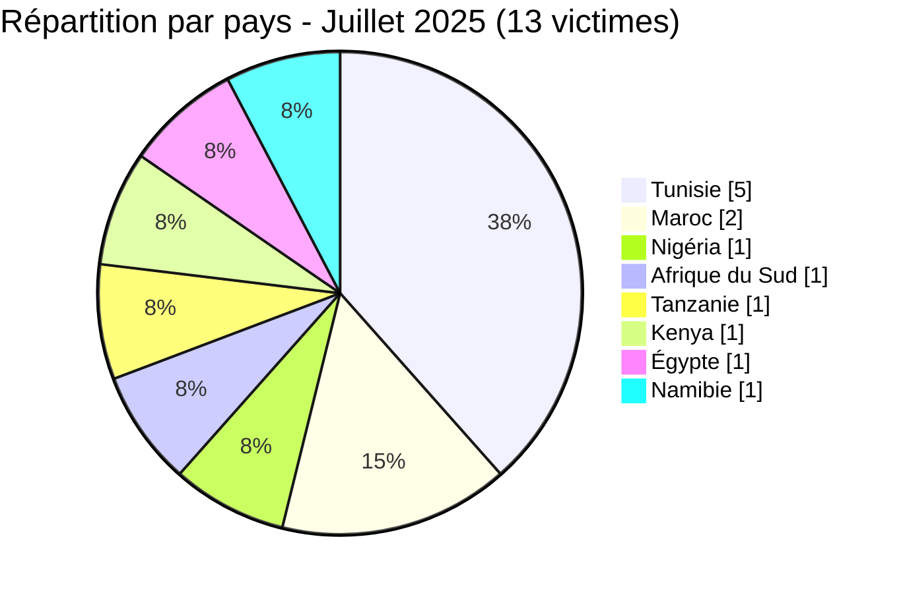

[](https://github.com/Hatchepsoute/AFRINTEL)


# Rapport CTI - Juillet 2025 : Le secteur bancaire tunisien frappé de plein fouet par Dark 07x Team

👉🏾 [English version available here](./README.md)

👉🏾 [Liste des victimes](../victims_FR.md)

### 1. Résumé exécutif

Juillet 2025 enregistre **13 victimes** documentées dans 8 pays. Le mois est dominé par une **campagne coordonnée de Dark 07x Team contre le secteur bancaire et financier tunisien**, 5 des 13 victimes sont des institutions financières tunisiennes revendiquées le même jour (25 juillet). L'Égypte fait face à une demande de rançon majeure (2,27 M$) ciblant un organisme gouvernemental d'électricité, et le Maroc voit à la fois un distributeur télécom et une université compromis.

**Chiffres clés :**
- 🔹 **13 victimes** identifiées
- 🔹 **9 groupes actifs** : Dark 07x Team (5), Hepd (1), d4rk4rmy (1), Nightspire (1), Keymous (1), Lynx (1), Devman (1), InCransom (1), Mercobyte (1)
- 🔹 **Pays touchés** : Tunisie (5), Maroc (2), Nigéria (1), Afrique du Sud (1), Tanzanie (1), Kenya (1), Égypte (1), Namibie (1)
- 🔹 **Secteurs** : Banque & Finance (5), Gouvernement (3), Éducation (2), Télécom (1), ONG (1), Industrie/Mines (1)

---

### 2. Chronologie des attaques

| Date | Victime | Pays | Groupe |
|------|---------|------|--------|
| 1er juillet | Chartered Institute of Bankers of Nigeria (CIBN) | Nigéria | Hepd |
| 8 juillet | MAFATE BUSINESS ENTERPRISE | Afrique du Sud | d4rk4rmy |
| 13 juillet | Twaweza | Tanzanie | Nightspire |
| 14 juillet | IWACLUB (iwaclub.ma) | Maroc | Keymous |
| 15 juillet | Adrian Kenya | Kenya | Lynx |
| 15 juillet | EEHC (eehc.gov.eg) | Égypte | Devman |
| 15 juillet | Municipalité d'Otjiwarongo | Namibie | InCransom |
| 18 juillet | Université Mohammed VI Polytechnique (UM6P) | Maroc | Mercobyte |
| 25 juillet | Ministère des Finances (finances.gov.tn) | Tunisie | Dark 07x Team |
| 25 juillet | Académie des Banques et Finances (ABF) | Tunisie | Dark 07x Team |
| 25 juillet | BTK Bank | Tunisie | Dark 07x Team |
| 25 juillet | Banque de Tunisie | Tunisie | Dark 07x Team |
| 28 juillet | BH Bank | Tunisie | Dark 07x Team |



---

### 3. Analyse des victimes

#### 3.1 Par pays

| Pays | Nombre d'attaques |
|------|-----------------|
| Tunisie | 5 |
| Maroc | 2 |
| Nigéria | 1 |
| Afrique du Sud | 1 |
| Tanzanie | 1 |
| Kenya | 1 |
| Égypte | 1 |
| Namibie | 1 |



#### 3.2 Par secteur

| Secteur | Nombre |
|---------|--------|
| Banque & Services financiers | 5 |
| Gouvernement / Administration publique | 3 |
| Éducation | 2 |
| Télécom / Distribution | 1 |
| ONG | 1 |
| Industrie / Services miniers | 1 |

```mermaid
xychart-beta
    title "Secteurs ciblés - Juillet 2025"
    x-axis ["Banque", "Gouvernement", "Éducation", "Télécom", "ONG", "Industrie"]
    y-axis "Nombre d'attaques" 0 to 6
    bar [5, 3, 2, 1, 1, 1]
```

#### 3.3 Groupes actifs

| Groupe | Attaques | Cibles |
|--------|---------|--------|
| Dark 07x Team | 5 | Secteur bancaire tunisien |
| Hepd | 1 | Nigéria (organe de réglementation) |
| d4rk4rmy | 1 | Afrique du Sud (services miniers) |
| Nightspire | 1 | Tanzanie (ONG) |
| Keymous | 1 | Maroc (télécom) |
| Lynx | 1 | Kenya (ICT/énergie) |
| Devman | 1 | Égypte (gouvernement) |
| InCransom | 1 | Namibie (municipalité) |
| Mercobyte | 1 | Maroc (université) |

---

### 4. Points d'attention

- **Campagne coordonnée de Dark 07x Team** : 5 institutions financières tunisiennes compromises en une seule vague (25–28 juillet). Ministère des Finances, deux grandes banques (Banque de Tunisie, BH Bank), BTK Bank et l'académie de formation bancaire (ABF). Il s'agit de l'attaque sectorielle la plus concentrée observée dans le suivi AFRINTEL à ce jour.
- **Égypte : rançon la plus élevée du mois**. Devman réclame **2,27 M$ USD** pour EEHC (Egyptian Electricity Holding Company), autorité publique de l'électricité. Infrastructure critique en jeu.
- **Double ciblage du Maroc** : UM6P (université de recherche) touchée via une opération d'influence (photos d'étudiants publiées avec messages politiques) et IWACLUB (distributeur télécom inwi) via fuite de données, acteurs distincts, même mois.
- **Afrique de l'Est** : Twaweza (Tanzanie) et Adrian Kenya marquent une expansion continue au-delà des cibles habituelles d'Afrique australe et du Nord, avec des profils ONG et infrastructure critique.
- **Mercobyte, opération d'influence** : la compromission d'UM6P mêle exfiltration de données et message politique, illustrant la nature hybride de certains acteurs menaçants opérant en Afrique.

---

```mermaid
xychart-beta
    title "Évolution mensuelle des attaques (Jan - Juil 2025)"
    x-axis ["Jan", "Fév", "Mar", "Avr", "Mai", "Juin", "Juil"]
    y-axis "Nombre d'attaques" 0 to 20
    bar [8, 10, 9, 10, 16, 14, 13]
```

### 5. Recommandations

| Domaine | Action recommandée |
|---------|--------------------|
| Banque / Institutions financières | Analyser les IOCs de Dark 07x Team, auditer les interfaces d'administration pour indicateurs d'ATO, revoir les journaux d'accès aux passerelles SWIFT/paiement. |
| Gouvernement / Administration publique | Évaluer la maturité ransomware, mettre en place des sauvegardes hors bande pour les systèmes critiques, appliquer la gestion des accès privilégiés. |
| Éducation | Durcir les portails web publics, surveiller le scraping de données, préparer des scénarios d'opération d'influence. |
| Télécom / Plateformes de distribution | Auditer les accès partenaires et revendeurs, surveiller les API pour requêtes anormales. |
| Toutes organisations | Suivre Dark 07x Team comme groupe très actif contre les infrastructures financières nord-africaines. |

---

*Rapport généré à partir des données OSINT AFRINTEL. Diffusion libre (TLP:CLEAR)*
