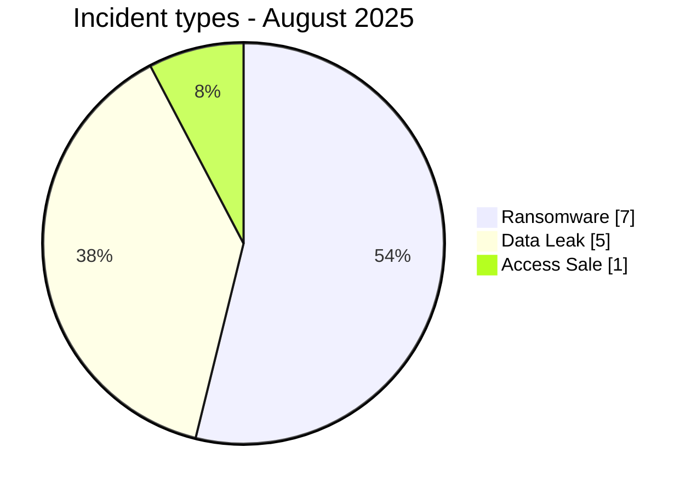
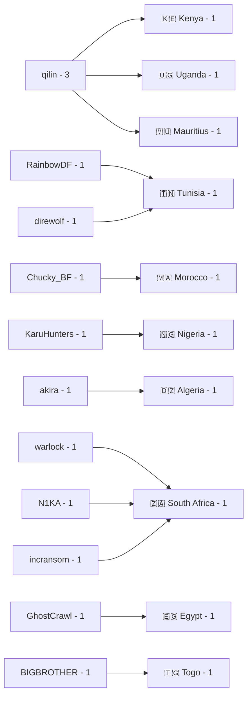
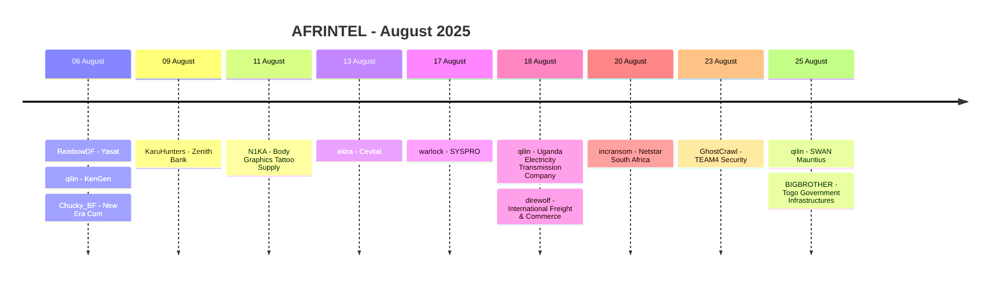

# CTI Report - Cyberattacks in Africa - August 2025

👉🏾 [**French version available here**](./README_FR.md)

## 1. Executive summary

August 2025 contains **13 documented incidents across 10 African countries**: **7 Ransomware**, **5 Data Leak** and **1 Access Sale**. No DDoS, Defacement or Operational Fraud is recorded.

- **South Africa**: 3 incidents, including 2 Ransomware and 1 Data Leak.
- **Tunisia**: 2 incidents, including 1 Ransomware and 1 Data Leak.
- The other eight countries each record 1 incident.
- **qilin** is the most visible group with 3 claims: KenGen, Uganda Electricity Transmission Company Limited and SWAN Mauritius.
- Contrary to the previous README, no incident is classified under an `Unknown` actor: Zenith Bank is attributed to **KaruHunters** and Body Graphics to **N1KA**.
- **Yasat** includes tens of thousands of customer and transaction records in reviewed exports.
- **New Era Com** is classified Data Fully Published with a claimed **607 MB** SQL dump containing more than **476,000 records**.
- **Zenith Bank** is associated with a claim of more than **1.8 million records**, with a reviewed local sample of 18 rows.
- **Body Graphics Tattoo Supply** is classified Data Fully Published with **6,501 records** across two structured exports.
- **Togo - Government Infrastructures** is the month's only **Access Sale**, with material showing active administrative access to multiple government platforms.

### 📋 Victim list

👉🏾 [View the full victim list](./victims.md)

### 1.1 Month-over-month comparison

> Comparison based on validated AFRINTEL monthly corpora. A change in documented records does not, by itself, prove an equivalent change in the real number of compromises.

| Indicator | July 2025 | August 2025 | Observed change |
|---|---:|---:|---:|
| Total incidents | 21 | 13 | **-8 (-38.1%)** |
| Ransomware | 5 | 7 | **+2 (+40.0%)** |
| Data Leak | 16 | 5 | **-11 (-68.8%)** |
| Access Sale | 0 | 1 | **+1 (new)** |
| DDoS | 0 | 0 | **0 (stable)** |
| Defacement | 0 | 0 | **0 (stable)** |
| Operational Fraud | 0 | 0 | **0 (stable)** |

## 2. Methodology

- **Scope**: 54 African countries.
- **Period**: 1-31 August 2025.
- **Sources**: OSINT, leak sites, underground forums, actor publications and available samples.
- **Source of truth**: validated bilingual pair [`victims_FR.md`](./victims_FR.md) / [`victims.md`](./victims.md), with French editorial review before English synchronization.
- **Counting**: one card equals one unique incident.
- **Taxonomy**: Ransomware, Data Leak, Access Sale, DDoS, Defacement, Operational Fraud.
- **Qualification**: claim, sample, full publication and technical confirmation remain distinct evidence levels.
- **Visualization**: tables, text bars, simple Mermaid diagrams and a timeline.

## 3. Global overview

### 3.1 Incident-type distribution

| Incident type | Count | Share |
|---|---:|---:|
| Ransomware | 7 | 53.8% |
| Data Leak | 5 | 38.5% |
| Access Sale | 1 | 7.7% |
| DDoS | 0 | 0.0% |
| Defacement | 0 | 0.0% |
| Operational Fraud | 0 | 0.0% |
| **Total** | **13** | **100%** |

**Color convention:** 🟧 Ransomware | 🟦 Data Leak | 🟪 Access Sale | 🟥 DDoS | 🟨 Defacement | 🟩 Operational Fraud.

### 3.2 Country distribution

| Country | Ransomware | Data Leak | Access Sale | Total | Distribution |
|---|---:|---:|---:|---:|---|
| 🇿🇦 South Africa | 2 | 1 | 0 | 3 | 🟧🟧🟦 |
| 🇹🇳 Tunisia | 1 | 1 | 0 | 2 | 🟧🟦 |
| 🇰🇪 Kenya | 1 | 0 | 0 | 1 | 🟧 |
| 🇲🇦 Morocco | 0 | 1 | 0 | 1 | 🟦 |
| 🇳🇬 Nigeria | 0 | 1 | 0 | 1 | 🟦 |
| 🇩🇿 Algeria | 1 | 0 | 0 | 1 | 🟧 |
| 🇺🇬 Uganda | 1 | 0 | 0 | 1 | 🟧 |
| 🇪🇬 Egypt | 0 | 1 | 0 | 1 | 🟦 |
| 🇲🇺 Mauritius | 1 | 0 | 0 | 1 | 🟧 |
| 🇹🇬 Togo | 0 | 0 | 1 | 1 | 🟪 |
| **Total** | **7** | **5** | **1** | **13** | |

### 3.3 Geographic distribution by region

| Region | Incidents | Share | Activity |
|---|---:|---:|---|
| North Africa | 5 | 38.5% | ██████████ |
| Southern Africa | 4 | 30.8% | ████████ |
| East Africa | 2 | 15.4% | ████ |
| West Africa | 2 | 15.4% | ████ |
| Central Africa | 0 | 0.0% |  |
| **Total** | **13** | **100%** | |

### 3.4 Harmonized sector distribution

| Harmonized sector | Incidents | Share | Activity |
|---|---:|---:|---|
| Technology / IT / Telecommunications | 4 | 30.8% | ██████████ |
| Energy / Critical Infrastructure | 2 | 15.4% | █████ |
| Finance / Banking / Insurance | 2 | 15.4% | █████ |
| Agribusiness / Industry | 1 | 7.7% | ██ |
| Transport / Logistics | 1 | 7.7% | ██ |
| Retail / E-commerce | 1 | 7.7% | ██ |
| Security / Defense Services | 1 | 7.7% | ██ |
| Government / Critical Infrastructure | 1 | 7.7% | ██ |
| **Total** | **13** | **100%** | |

### 3.5 Actors / groups

| Actor / Group | Incidents | Activity |
|---|---:|---|
| qilin | 3 | ██████████ |
| akira | 1 | ███ |
| BIGBROTHER | 1 | ███ |
| Chucky_BF | 1 | ███ |
| direwolf | 1 | ███ |
| GhostCrawl | 1 | ███ |
| incransom | 1 | ███ |
| KaruHunters | 1 | ███ |
| N1KA | 1 | ███ |
| RainbowDF | 1 | ███ |
| warlock | 1 | ███ |
| **Total** | **13** | |

### 3.6 Actor -> country mapping

## 4. Detailed analysis by incident type

### 4.1 Ransomware - 7 incidents

The seven Ransomware records concern:

- **KenGen** in Kenya, claimed by qilin, with coherent internal documents covering contracts, CAPEX, human resources, procurement and technical documentation.
- **Cevital** in Algeria, claimed by akira.
- **SYSPRO** in South Africa, claimed by warlock.
- **Uganda Electricity Transmission Company Limited** in Uganda, claimed by qilin.
- **International Freight & Commerce** in Tunisia, claimed by direwolf.
- **Netstar South Africa** in South Africa, claimed by incransom. AFRINTEL had already recorded a separate claim by devman in May 2025.
- **SWAN Mauritius** in Mauritius, claimed by qilin.

### 4.2 Data Leak - 5 incidents

The five Data Leak records are:

- **Yasat** in Tunisia: multiple structured exports covering sales, invoicing, customer profiles and user accounts.
- **New Era Com** in Morocco: full publication of a claimed 607 MB SQL dump containing more than 476,000 records.
- **Zenith Bank Plc** in Nigeria: more than 1.8 million records claimed; AFRINTEL reviewed a local 18-row, 8-column sample.
- **Body Graphics Tattoo Supply** in South Africa: two WordPress/WooCommerce exports totaling 6,501 records, classified Data Fully Published.
- **TEAM4 Security** in Egypt: mailbox batches, internal documents and HR/payroll data. The card uses 23 August as the detection date, while the reviewed forum-thread timestamps run from 29 to 31 August.

### 4.3 Access Sale - 1 incident

**Togo Government Infrastructures** is the month's only Access Sale. The reviewed material shows active administrative access to multiple public digital platforms under `gouv.tg`, including identity, collaboration, data-collection and education-reporting systems.

AFRINTEL classifies the incident as Access Sale because the offer concerns privileged access. This classification does not by itself establish complete exfiltration of data hosted on those systems.

## 5. Sectoral impact

**Technology / IT / Telecommunications** is the leading harmonized category with **4 of 13 incidents (30.8%)**: Yasat, New Era Com, SYSPRO and Netstar.

**Energy / Critical Infrastructure** accounts for 2 incidents: KenGen and Uganda Electricity Transmission Company Limited.

**Finance / Banking / Insurance** accounts for 2 incidents: Zenith Bank and SWAN Mauritius.

Cevital, International Freight & Commerce, Body Graphics, TEAM4 Security and Togo Government Infrastructures each belong to a distinct sector category.

## 6. Threat actor profile

**qilin** leads with **3 records**. The other ten identified actors appear once each.

The previous README treated Zenith Bank and Body Graphics as unattributed. The structured victim cards identify **KaruHunters** and **N1KA** respectively, and these values are restored in the actor statistics.

## 7. Key trends and intelligence gaps

### 7.1 Observed trends

1. **Monthly volume decline**: 21 incidents in July versus 13 in August.
2. **Ransomware increases**: 5 incidents in July versus 7 in August.
3. **Data Leak declines**: 16 in July versus 5 in August.
4. **Access Sale appears**: 0 in July, 1 in August.
5. **South Africa leads**: 3 incidents.
6. **qilin dominates the month** with 3 claims.
7. **Sensitive energy exposure**: two East African electricity operators are claimed by qilin.
8. **Evidence depth varies**: claim-only cases, structured samples, full publications and observed administrative access coexist.

### 7.2 Intelligence gaps

- Initial-access vectors remain unknown for most incidents.
- Several Ransomware claims do not have samples in the supplied cards.
- The 1.8 million Zenith Bank figure remains actor-claimed; only an 18-row sample was reviewed.
- The relationship between the May and August 2025 Netstar claims remains unresolved.
- The exact technical origin of access to Togo government infrastructures is not established.
- The TEAM4 card date should be interpreted as AFRINTEL's detection date, while observed publications are dated 29-31 August.

### 7.3 Monthly evolution

| Type | July 2025 | August 2025 | Change |
|---|---:|---:|---:|
| Total | 21 | 13 | **-8 (-38.1%)** |
| Ransomware | 5 | 7 | **+2 (+40.0%)** |
| Data Leak | 16 | 5 | **-11 (-68.8%)** |
| Access Sale | 0 | 1 | **+1 (new)** |

## 8. Summary timeline

> For TEAM4 Security, 23 August is the detection date retained in the card. The reviewed thread publications are timestamped from 29 to 31 August 2025.

## 9. MITRE ATT&CK mapping - contextual

| Phase | Technique | Analytical scope |
|---|---|---|
| Valid accounts | T1078 - Valid Accounts | Relevant context where active administrative access is observed, notably in the Togo case. |
| Collection | T1005 - Data from Local System | Relevant to observed documents, exports and internal files. |
| Collection | T1213 - Data from Information Repositories | Relevant to structured Yasat, New Era Com, Zenith Bank and Body Graphics databases. |
| Email collection | T1114 - Email Collection | Relevant to TEAM4 Security, where an exfiltrated administrative/support mailbox is described in the reviewed batches. |

> These mappings are contextual and do not prove that every actor used the listed techniques.

## 10. Recommendations

- **Energy / Critical Infrastructure**: segmentation, PAM, EDR, administrative-access monitoring and protection of technical repositories.
- **Finance / Insurance**: phishing-resistant MFA, customer-export controls, anomalous-access detection and transfer monitoring.
- **Technology / IT**: harden exposed applications, protect backups and restrict service accounts.
- **E-commerce**: secure WordPress/WooCommerce administrator accounts, invalidate exposed sessions and monitor exports.
- **Public sector**: control privileged access, segment platforms, log administrative actions and rapidly revoke compromised access.

## 11. SOC and tactical recommendations

### Observed

The corpus contains SQL dumps, structured exports, internal documents, HR data, mailboxes, Ransomware claims and administrative access to public systems.

### Assumptions

Initial vectors, persistence mechanisms and complete exfiltration paths are not established for most incidents.

### Preventive

Monitor privileged authentication, bulk exports, backup access, abnormal database queries, outbound transfers, archive creation and anomalous activity on collaboration platforms. Maintain MFA, PAM, EDR, segmentation, immutable backups and secret rotation.

## 12. Conclusion

August 2025 contains **13 incidents across 10 countries**, split into **7 Ransomware, 5 Data Leak and 1 Access Sale**.

The total declines by 38.1% compared with July, while the share of Ransomware rises. South Africa is the most represented country with 3 incidents and qilin is the most visible group with 3 claims. Correcting the Zenith Bank and Body Graphics actor fields removes the two `Unknown` entries from the previous report.

**AFRINTEL** - Open African CTI Monitoring Initiative
