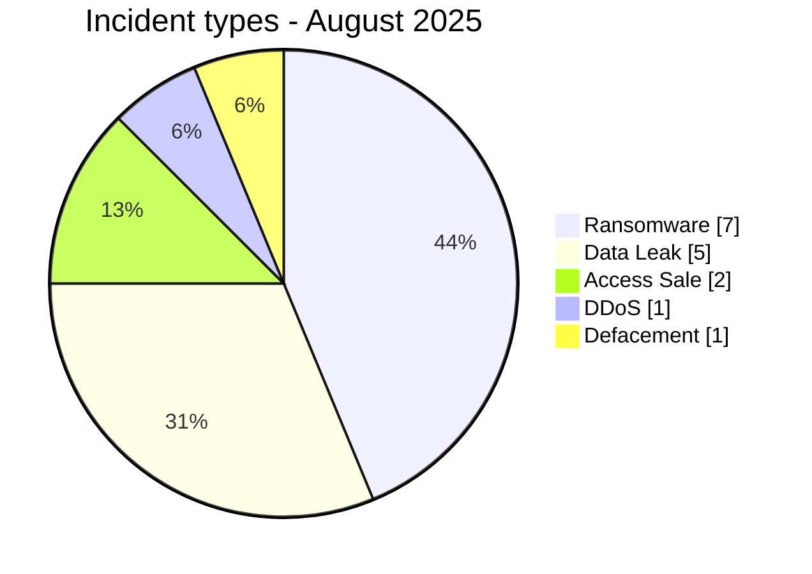
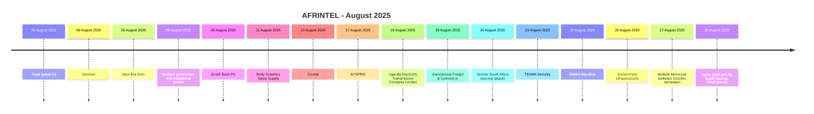

# AFRINTEL CTI Report - Cyber Threats in Africa - August 2025

👉🏾 [Version française](./README_FR.md)

   

## 1. Executive summary

In August 2025, AFRINTEL documents **16 cyber incidents** affecting organizations and digital services across **10 African countries**.

The landscape is dominated by **Ransomware with 7 records (43.8%)**, followed by **Data Leak with 5 (31.2%)**. Other observed types are Access Sale 2, DDoS 1, Defacement 1.

Geographic concentration is significant: **Egypt (3)**, **South Africa (3)**, **Tunisia (2)** together account for **8 records, or 50.0% of the month**. This concentration reflects AFRINTEL corpus visibility rather than an exhaustive national compromise rate.

At sector level, the most represented categories are **Technology / IT (3)**, **Government / Administration (3)**, **Energy / Utilities (2)**. The most frequent actor labels are `qilin` (3), `RainbowDF` (1), `Chucky_BF` (1). `Unknown`, when present, denotes missing attribution rather than a threat actor.

Evidence maturity remains variable: **11 records** are unverified claims or claims accompanied by samples. AFRINTEL maintains a strict separation between **observed facts, claims, corroboration, official confirmation, and technical unknowns**.

Compared with July, monthly volume **decreases by 9 records**. The most visible changes are Data Leak 18->5 (-13), Ransomware 5->7 (+2), Access Sale 0->2 (+2).

> **Reading note:** AFRINTEL figures describe documented incidents and the visibility of observed threats. They are not an exhaustive measurement of every cyberattack that actually occurred across Africa.

### 1.1 Month-over-month comparison

| Indicator | July 2025 | August 2025 | Change |
|---|---:|---:|---:|
| Total incidents | 25 | 16 | **-9 (-36.0%)** |
| Ransomware | 5 | 7 | **+2 (+40.0%)** |
| Data Leak | 18 | 5 | **-13 (-72.2%)** |
| Access Sale | 0 | 2 | **+2 (new)** |
| DDoS | 0 | 1 | **+1 (new)** |
| Defacement | 0 | 1 | **+1 (new)** |
| Account Takeover | 0 | 0 | **Stable** |
| System Intrusion | 1 | 0 | **-1 (-100.0%)** |
| Malware | 1 | 0 | **-1 (-100.0%)** |
| Operational Fraud | 0 | 0 | **Stable** |

## 2. Methodology

- **Scope:** 54 African countries; reference period: August 2025.
- **Source of truth:** validated `victims_FR.md` / `victims.md` pair.
- **Classification:** Ransomware, Data Leak, Access Sale, DDoS, Defacement, Account Takeover, System Intrusion, Malware, and Operational Fraud.
- **Counting:** one canonical record equals one documented cyber incident; cases under investigation remain outside statistics.
- **Timeline:** `Incident date` and `Initial publication date` remain separate. A later disclosure does not artificially move an incident into another month when chronology is sufficiently supported.
- **Uncertain dates:** when no exact day is known, the evidence-supported month or time window is retained.
- **Sources:** public links are retained for supplementary incidents found through OSINT/web research; they are not retroactively imposed on historical or direct Dark Web observations.
- **Evidence:** incident type, status, confidence, impact, and provenance remain separate dimensions.
- **Sectors:** normalization is calculated once from the structured corpus and used identically in FR and EN.
- **Limitation:** frequencies reflect AFRINTEL visibility rather than every real compromise on the continent.

## 3. Overview and incident types

| Indicator | Value |
|---|---:|
| Documented incidents | **16** |
| Countries represented | **10** |
| Regions represented | **5** |
| Leading country | **Egypt (3)** |
| Leading sector | **Technology / IT (3)** |
| Leading actor label | **qilin (3)** |

| Incident type | Records | Share |
|---|---:|---:|
| Ransomware | 7 | 43.8% |
| Data Leak | 5 | 31.2% |
| Access Sale | 2 | 12.5% |
| DDoS | 1 | 6.2% |
| Defacement | 1 | 6.2% |
| Account Takeover | 0 | 0.0% |
| System Intrusion | 0 | 0.0% |
| Malware | 0 | 0.0% |
| Operational Fraud | 0 | 0.0% |
| **Total** | **16** | **100%** |

## 4. Geographic distribution

| Country | Total | Ransomware | Data Leak | Access Sale | DDoS | Defacement | Account Takeover | System Intrusion | Malware |
|---|---:|---:|---:|---:|---:|---:|---:|---:|---:|
| Egypt | **3** | 0 | 1 | 1 | 1 | 0 | 0 | 0 | 0 |
| South Africa | **3** | 2 | 1 | 0 | 0 | 0 | 0 | 0 | 0 |
| Tunisia | **2** | 1 | 1 | 0 | 0 | 0 | 0 | 0 | 0 |
| Morocco | **2** | 0 | 1 | 0 | 0 | 1 | 0 | 0 | 0 |
| Kenya | **1** | 1 | 0 | 0 | 0 | 0 | 0 | 0 | 0 |
| Nigeria | **1** | 0 | 1 | 0 | 0 | 0 | 0 | 0 | 0 |
| Algeria | **1** | 1 | 0 | 0 | 0 | 0 | 0 | 0 | 0 |
| Uganda | **1** | 1 | 0 | 0 | 0 | 0 | 0 | 0 | 0 |
| Mauritius | **1** | 1 | 0 | 0 | 0 | 0 | 0 | 0 | 0 |
| Togo | **1** | 0 | 0 | 1 | 0 | 0 | 0 | 0 | 0 |
| **Total** | **16** | **7** | **5** | **2** | **1** | **1** | **0** | **0** | **0** |

> `Operational Fraud = 0` this month; the column is omitted for readability.

## 5. Regional distribution

| Region | Records | Share |
|---|---:|---:|
| North Africa | 8 | 50.0% |
| Southern Africa | 3 | 18.8% |
| East Africa | 2 | 12.5% |
| West Africa | 2 | 12.5% |
| Indian Ocean | 1 | 6.2% |
| **Total** | **16** | **100%** |

The leading region is **North Africa with 8 records (50.0%)**.

## 6. Sector impact

| Sector | Records | Share | Activity |
|---|---:|---:|---|
| Technology / IT | 3 | 18.8% | ███ |
| Government / Administration | 3 | 18.8% | ███ |
| Energy / Utilities | 2 | 12.5% | ██ |
| Finance / Banking | 2 | 12.5% | ██ |
| Telecommunications | 1 | 6.2% | █ |
| Retail / E-commerce | 1 | 6.2% | █ |
| Manufacturing / Industry | 1 | 6.2% | █ |
| Transport / Logistics | 1 | 6.2% | █ |
| Professional / Business Services | 1 | 6.2% | █ |
| Not specified | 1 | 6.2% | █ |
| **Total** | **16** | **100%** | |

## 7. Actors / groups

`Unknown` denotes missing attribution, not a threat actor.

| Actor / Group | Records | Activity |
|---|---:|---|
| qilin | 3 | ███ |
| RainbowDF | 1 | █ |
| Chucky_BF | 1 | █ |
| Hider_Nex / Keymous Plus (claim) | 1 | █ |
| KaruHunters | 1 | █ |
| N1KA | 1 | █ |
| akira | 1 | █ |
| warlock | 1 | █ |
| direwolf | 1 | █ |
| incransom | 1 | █ |
| GhostCrawl | 1 | █ |
| BIGBROTHER | 1 | █ |
| OurSec (claim) | 1 | █ |
| BIGBROTHER (claimed seller) | 1 | █ |

## 8. Evidence maturity

| Evidence maturity | Records | Share |
|---|---:|---:|
| Claim - Unverified | 6 | 37.5% |
| Claim - Data Sample Published | 5 | 31.2% |
| Data Fully Published | 2 | 12.5% |
| Corroborated / Secondary evidence | 3 | 18.8% |
| **Total** | **16** | **100%** |

Evidence statuses describe the available validation level; they do not change the technical incident type.

## 9. Timeline

## 10. Monthly CTI analysis

### Ransomware

**7 records** are classified as Ransomware. Leading countries: South Africa (2), Kenya (1), Algeria (1). A leak-site listing does not itself prove encryption or complete exfiltration.

### Data Leak

**5 records** are classified as Data Leak. Leading countries: Tunisia (1), Morocco (1), Nigeria (1). AFRINTEL distinguishes actually observed data from aggregate volumes claimed by actors.

### Access Sale

**2 record(s)** fall under Access Sale. Distribution: Togo (1), Egypt (1). An access offer does not automatically prove exfiltration or compromise of the entire internal environment.

### DDoS

**1 DDoS campaign(s)** are documented. Distribution: Egypt (1). Counts refer to campaigns, not necessarily every individual targeted domain.

### Defacement

**1 Defacement records** are documented. Distribution: Morocco (1). Defacement is not reclassified as Data Leak without separate evidence.

## 11. Notable incidents

| Country | Organization | Type | Status | Impact | Confidence |
|---|---|---|---|---|---|
| Kenya | KenGen | Ransomware | Claim - Data Sample Published | Level 4 | High |
| Egypt | Multiple government and institutional portals | DDoS | Claim - OSINT Availability Evidence | Level 4 | Medium |
| Egypt | cg.eg; gags.gov.eg; kayani.gov.eg; shmft.gov.eg | Access Sale | Claim - Marketplace Listing / Screenshots | Level 4 | Medium |
| Morocco | Multiple Moroccan websites (OurSec campaign) | Defacement | Claim - OSINT Corroborated | Level 3 | Medium |
| Nigeria | Zenith Bank Plc | Data Leak | Claim - Data Sample Published | Level 3 | Medium |

> This table highlights up to five records using structured impact, confirmation, and confidence fields. It is not an absolute severity ranking.

## 12. Key findings and intelligence gaps

- **Geographic concentration:** Egypt accounts for 3 records (18.8%), followed by South Africa (3) and Tunisia (2).
- **Threat structure:** Ransomware is the leading type with 7 records, followed by Data Leak (5).
- **Sectors:** Technology / IT (3) and Government / Administration (3) have the highest visibility.
- **Actors:** the most frequent labels are qilin (3), RainbowDF (1), and Chucky_BF (1).
- **Evidence:** 11 records rely on unverified claims or claims with a published sample; these statuses do not equal complete technical confirmation.

### Intelligence gaps

- initial-access vector often not public;
- exact technical compromise date sometimes unknown;
- claimed volumes rarely fully verifiable;
- technical attribution often limited to a publication handle or label;
- public remediation, root-cause, and DFIR conclusions remain limited.

These gaps should guide collection rather than be replaced with assumptions.

## 13. Recommendations

### Organizations

- enforce phishing-resistant MFA on privileged accounts, VPN, email, social media, and administration consoles;
- apply PAM, least privilege, segmentation, and secret rotation;
- maintain immutable backups and test restoration;
- strengthen public applications, APIs, and administration interfaces;
- formalize incident response and data-breach notification.

### SOC and detection

- monitor abnormal authentication, MFA changes, privileged-account creation, and role elevation;
- detect mass database reads, unusual exports, archive creation, and large outbound transfers;
- correlate EDR, IAM, VPN, WAF, proxy, DNS, cloud, and application logs;
- distinguish DDoS, internal intrusion, account compromise, and data exposure to avoid unsupported conclusions.

### CTI

- keep incident date, initial publication, first observation, sample, disclosure, and confirmation separate;
- track republication and resale without automatically counting them as new compromise;
- preserve the evidence hierarchy between claim, corroboration, and confirmation;
- validate FR/EN parity before generating statistics.

## 14. Conclusion

**August 2025** contains **16 documented cyber incidents** across **10 African countries**. The monthly CTI value lies not only in volume but in separating **incident type, timeline, evidence level, geography, sector, and actor**.

The report therefore preserves a structured picture of the observable threat environment while keeping claims, corroboration, confirmations, and unknowns at their actual evidence level.

👉🏾 [See monthly victims](./victims.md)

**AFRINTEL** - TLP:CLEAR
