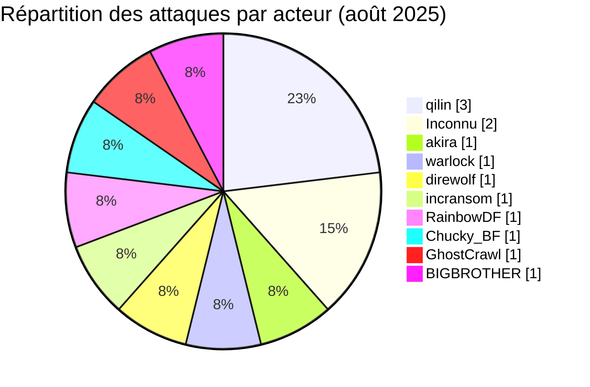
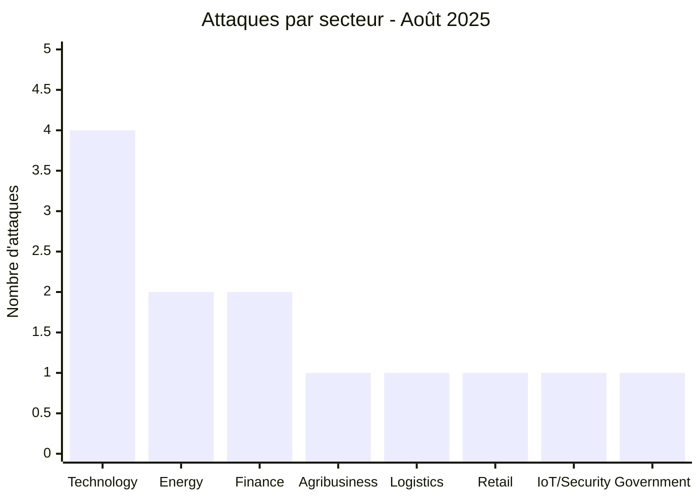
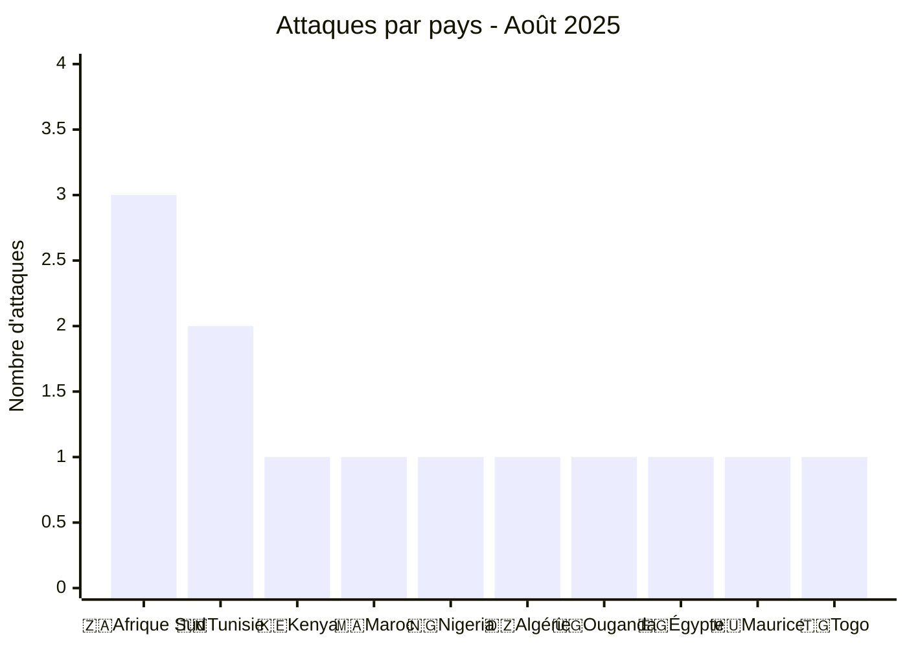
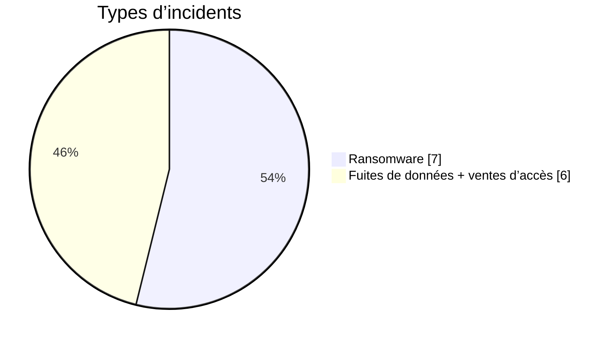
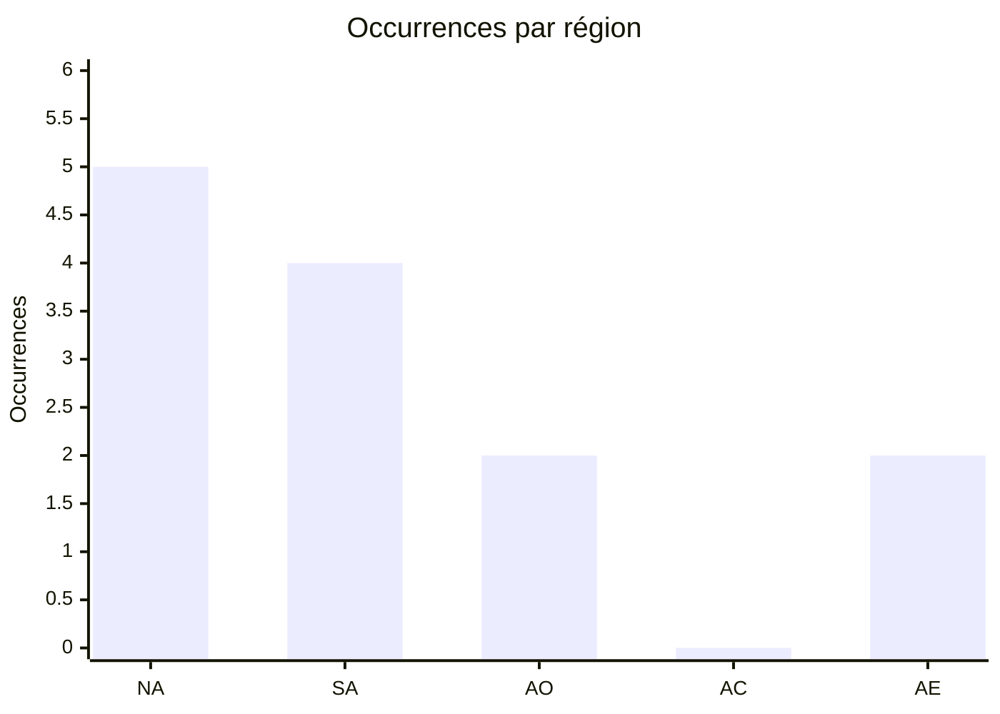
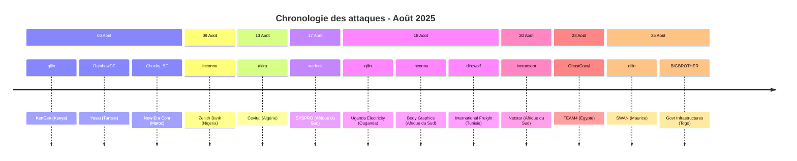

 
# Rapport CTI : Cyberattaques en Afrique - Août 2025 (13 victimes)
👉🏾 [**English version available here**](./README.md)

## 1. Résumé exécutif
- **Nombre total d'attaques recensées** : 13
- **Acteurs les plus actifs** : qilin (3 attaques), inconnu (2), akira (1), warlock (1), direwolf (1), incransom (1), RainbowDF (1), Chucky_BF (1), GhostCrawl (1), BIGBROTHER (1).
- **Secteurs les plus ciblés** : Technologies (4), Énergie (2), Banque/Finance (2), Agroalimentaire/Industrie (1), Logistique (1), Commerce de détail (1), IoT/Sécurité (1), Gouvernement (1).
- **Pays les plus touchés** : Afrique du Sud (3), Tunisie (2), Kenya (1), Maroc (1), Nigeria (1), Algérie (1), Ouganda (1), Égypte (1), Maurice (1), Togo (1).
- **Volumes de données exfiltrés notables** : Zenith Bank (Nigeria) - 1,8 million d'enregistrements ; New Era Com (Maroc) - 607 Mo (dump SQL) ; Body Graphics (Afrique du Sud) - plus de 6 500 fiches clients ; TEAM4 Security (Égypte) - lots de données multiples.

## 2. Méthodologie
Ce rapport de Cyber Threat Intelligence (CTI) présente une analyse détaillée des cyberattaques survenues en Afrique durant le mois d'août 2025. Les informations sont issues de sources OSINT et de sites de fuites de groupes ransomware, compilées dans le cadre du projet AFRINTEL. L'objectif est de fournir une vision claire des tendances, des acteurs menaçants, des secteurs ciblés et des indicateurs de compromission associés.

## 3. Vue d'ensemble

### 3.1 Répartition par groupe/acteur
| Groupe/Acteur | Nombre d'attaques |
|---------------|-------------------|
| qilin | 3 |
| Inconnu | 2 |
| akira | 1 |
| warlock | 1 |
| direwolf | 1 |
| incransom | 1 |
| RainbowDF | 1 |
| Chucky_BF | 1 |
| GhostCrawl | 1 |
| BIGBROTHER | 1 |
| **Total** | **13** |

### 3.2 Répartition par secteur d'activité
| Secteur | Nombre d'attaques |
|---------|-------------------|
| Technologies | 4 |
| Énergie | 2 |
| Banque / Finance | 2 |
| Agroalimentaire / Industrie | 1 |
| Logistique | 1 |
| Commerce de détail / E‑commerce | 1 |
| IoT / Sécurité télématique | 1 |
| Gouvernement | 1 |
| **Total** | **13** |

### 3.3 Répartition par pays
| Pays | Nombre d'attaques |
|------|-------------------|
| 🇿🇦 Afrique du Sud | 3 |
| 🇹🇳 Tunisie | 2 |
| 🇰🇪 Kenya | 1 |
| 🇲🇦 Maroc | 1 |
| 🇳🇬 Nigeria | 1 |
| 🇩🇿 Algérie | 1 |
| 🇺🇬 Ouganda | 1 |
| 🇪🇬 Égypte | 1 |
| 🇲🇺 Maurice | 1 |
| 🇹🇬 Togo | 1 |
| **Total** | **13** |

<!-- AFRINTEL_CURRENT_MODEL_START -->
### 3.4 Vue globale standardisée

| Pays | Ransomware | Exposition des données (fuites + accès) | Total | Distribution |
| :--- | ---: | ---: | ---: | :--- |
| 🇿🇦 Afrique du Sud | 2 | 1 | 3 | 🟧🟧 🟦 |
| 🇹🇳 Tunisie | 1 | 1 | 2 | 🟧 🟦 |
| 🇩🇿 Algérie | 1 | 0 | 1 | 🟧 |
| 🇪🇬 Égypte | 0 | 1 | 1 |  🟦 |
| 🇰🇪 Kenya | 1 | 0 | 1 | 🟧 |
| 🇲🇺 Maurice | 1 | 0 | 1 | 🟧 |
| 🇲🇦 Maroc | 0 | 1 | 1 |  🟦 |
| 🇳🇬 Nigeria | 0 | 1 | 1 |  🟦 |
| 🇹🇬 Togo | 0 | 1 | 1 |  🟦 |
| 🇺🇬 Ouganda | 1 | 0 | 1 | 🟧 |

### Vue agrégée mensuelle de l’exposition

La vue CTI mensuelle regroupe les fuites de données et les ventes d’accès sous **exposition des données** : **6 fiches** (46,2% du corpus mensuel). Les fiches sources restent la référence ; une vente d’accès ne prouve pas à elle seule l’exfiltration de données.

### Répartition géographique par région

| Région | Occurrences | Ransomware | Exposition des données (fuites + accès) | Distribution |
| :--- | ---: | ---: | ---: | :--- |
| Afrique du Nord | 5 | 2 | 3 | 🟧🟧 🟦🟦🟦 |
| Afrique australe | 4 | 3 | 1 | 🟧🟧🟧 🟦 |
| Afrique de l’Ouest | 2 | 0 | 2 |  🟦🟦 |
| Afrique centrale | 0 | 0 | 0 |  |
| Afrique de l’Est | 2 | 2 | 0 | 🟧🟧 |

Légende : NA = Afrique du Nord ; SA = Afrique australe ; AO = Afrique de l’Ouest ; AC = Afrique centrale ; AE = Afrique de l’Est

### Répartition sectorielle

| Secteur | Fiches | Part | Activité |
| :--- | ---: | ---: | :--- |
| Technologies / informatique | 6 | 46,2% | ██████████ |
| Finance / banque | 2 | 15,4% | ███ |
| Gouvernement / administration | 2 | 15,4% | ███ |
| Transport / logistique | 2 | 15,4% | ███ |
| Commerce / e-commerce | 1 | 7,7% | ██ |

### Acteurs / groupes les plus présents

| Acteur / Groupe | Fiches | Activité |
| :--- | ---: | :--- |
| qilin | 3 | ██████████ |
| BIGBROTHER | 1 | ███ |
| Chucky_BF | 1 | ███ |
| GhostCrawl | 1 | ███ |
| KaruHunters | 1 | ███ |
| N1KA | 1 | ███ |
| RainbowDF | 1 | ███ |
| akira | 1 | ███ |
| direwolf | 1 | ███ |
| incransom | 1 | ███ |
<!-- AFRINTEL_CURRENT_MODEL_END -->

### Comparaison avec le mois précédent

À partir des fiches incidents validées comme source de comptage, août 2025 compte **13** incidents contre **21** le mois précédent (une baisse de **-8** ; **-38.1%**). Cette comparaison décrit les publications enregistrées par AFRINTEL et ne prouve pas à elle seule une évolution de l'activité des attaquants ni un impact confirmé sur les victimes.

| Indicateur | Mois précédent | Mois en cours | Variation |
|---|---:|---:|---:|
| Fiches incidents enregistrées | 21 | 13 | -8 (-38.1%) |

## 4. Analyse détaillée par type d'incident

## 5. Impact sectoriel
- **Technologies** : 4 attaques (Yasat, New Era Com, SYSPRO, TEAM4 Security). Le secteur reste une cible de choix, avec des injections SQL et des fuites de données touchant des plateformes multimédia, des services IT, des éditeurs de logiciels et des sociétés de sécurité.
- **Énergie** : 2 attaques (KenGen, Uganda Electricity). qilin a frappé des infrastructures critiques en Afrique de l'Est, soulevant des inquiétudes sur la sécurité des réseaux électriques.
- **Banque/Finance** : 2 attaques (Zenith Bank, SWAN Mauritius). De grandes institutions financières au Nigeria et à Maurice ont subi des fuites, Zenith Bank perdant 1,8 million d'enregistrements.
- **Agroalimentaire/Industrie** : 1 attaque (Cevital) par akira, visant le plus grand conglomérat industriel algérien.
- **Logistique** : 1 attaque (International Freight & Commerce) par direwolf, touchant une entreprise tunisienne.
- **Commerce de détail/E‑commerce** : 1 attaque (Body Graphics) par un acteur inconnu, avec fuite de données clients.
- **IoT/Sécurité télématique** : 1 attaque (Netstar) par incransom, deuxième incident pour cette société sud-africaine.
- **Gouvernement** : 1 attaque (infrastructures togolaises) par BIGBROTHER, avec vente d'accès privilégiés.

## 6. Profil des acteurs
### 6.1 Profil des acteurs

Les comptages d'acteurs et de sources restent ceux documentés en section 3 et dans les fiches victimes sources. L'attribution est conservée uniquement au niveau étayé par les éléments publics.

### 6.2 Évaluation du risque

Les pays et secteurs présentant plusieurs fiches ou des fonctions publiques, éducatives, sanitaires, financières ou critiques doivent faire l'objet d'une validation prioritaire. Il s'agit d'un signal de priorisation OSINT, et non d'une confirmation de compromission ou d'impact.

- **Afrique du Sud** : 3 attaques (SYSPRO, Body Graphics, Netstar) - secteurs technologique, commercial et IoT.
- **Tunisie** : 2 attaques (Yasat, International Freight) - technologies et logistique.
- **Kenya, Maroc, Nigeria, Algérie, Ouganda, Égypte, Maurice, Togo** : 1 attaque chacun, illustrant une large dispersion géographique.

L'Afrique du Nord (🇹🇳 Tunisie, 🇲🇦 Maroc, 🇩🇿 Algérie, 🇪🇬 Égypte) totalise 5 attaques, tandis que l'Afrique subsaharienne (Afrique du Sud, Kenya, Nigeria, Ouganda, Maurice, Togo) en compte 8, confirmant l'étendue de la menace sur tout le continent.

### 6.1 Chronologie des attaques

## 7. Tendances et lacunes de renseignement
### 7.1 Tendances observées

Les répartitions par pays, secteur, acteur et type d'incident présentées ci-dessus constituent les tendances traçables du mois. Elles décrivent le corpus surveillé et n'établissent pas une campagne plus large sans éléments indépendants.

### 7.2 Lacunes de renseignement

Les rapports disponibles ne permettent pas d'établir pour chaque revendication le vecteur d'accès initial, l'exfiltration complète, la confirmation par la victime, la chronologie de remédiation ou l'impact opérationnel. Aucun détail DFIR public n'est inclus dans le corpus consulté pour cette fiche mensuelle ; cette absence est limitée aux sources examinées.

## 8. Cartographie MITRE ATT&CK (contextuelle)
| Phase | ID technique | Nom | Association à l'incident |
|---|---|---|---|
| Collecte | T1005 | Data from Local System | Correspondance contextuelle pour une collecte ou exposition revendiquée ; la méthode n'est pas confirmée. |
| Collecte | T1213 | Data from Information Repositories | Correspondance contextuelle pour les dossiers ou référentiels décrits publiquement ; la méthode n'est pas confirmée. |

Ces correspondances ATT&CK sont contextuelles et défensives. Elles ne prouvent pas qu'un acteur donné a utilisé la technique.

### Contextual observations
- **Injections SQL** : probablement utilisées contre Yasat et New Era Com, aboutissant à des dumps complets de bases de données.
- **Exfiltration et vente de données** : plusieurs acteurs (Inconnu, GhostCrawl, BIGBROTHER) ont mis en vente les données volées sur des forums clandestins.
- **Ciblage d'infrastructures critiques** : qilin s'est concentré sur des compagnies d'électricité au Kenya et en Ouganda.
- **Attaques répétées** : Netstar a été de nouveau frappée par incransom après un premier incident en mai 2025.
- **Vente d'accès privilégiés** : BIGBROTHER a proposé un accès administrateur aux systèmes gouvernementaux togolais, indiquant probablement une compromission RDP/VPN.

## 9. Recommandations
- **Entreprises technologiques** : mettre en place une validation rigoureuse des entrées et des pare-feu applicatifs pour prévenir les injections SQL. Des audits de sécurité et des tests d'intrusion réguliers sont indispensables.
- **Secteur de l'énergie** : les infrastructures critiques doivent adopter une surveillance avancée des menaces, une segmentation réseau et des plans de réponse aux incidents.
- **Banque/finance** : les institutions financières devraient imposer l'authentification multi-facteurs, chiffrer les données sensibles et surveiller les schémas d'accès anormaux.
- **Tous secteurs** : la formation des employés à la détection du phishing, les sauvegardes hors ligne et l'application régulière des correctifs restent fondamentales.

## 10. Recommandations SOC et tactiques
### Observé

Les sources publiques documentent des revendications, des publications ou du matériel exposé. Elles ne fournissent pas à elles seules une télémétrie prouvant une technique ou une compromission active.

### Hypothèses

L'abus d'identifiants, un stockage exposé, des contrôles d'accès faibles ou des privilèges d'export excessifs peuvent expliquer certaines expositions, mais chaque hypothèse doit être vérifiée par l'organisation concernée.

### Préventif

Surveiller les journaux d'identité, VPN, cloud, bases de données, messagerie et transferts sortants. Imposer une MFA résistante au phishing, le moindre privilège, la segmentation, des sauvegardes testées et la révocation rapide des jetons ou identifiants.

## 11. Recommandations stratégiques
1. **Risques observés :** prioriser la validation des organisations, secteurs et types de données documentés dans le corpus mensuel.
2. **Hypothèses :** tester les chemins possibles liés aux identifiants, au stockage cloud et aux exports excessifs sans les présenter comme des faits établis.
3. **Socle préventif :** maintenir l'inventaire des actifs, la classification des données, les exercices de réponse, les plans de reprise et les procédures coordonnées de sécurité, de droit et de protection des données.

## 12. Conclusion
Août 2025 a vu une grande variété d'attaques à travers l'Afrique, les secteurs technologique et énergétique étant les plus touchés. L'implication de multiples acteurs (qilin, pirates inconnus, hacktivistes) et la vente d'accès privilégiés soulignent l'évolution de la menace. La réitération des attaques contre Netstar montre la persistance des groupes ransomware. Une coopération régionale renforcée et le partage d'informations sont cruciaux pour contrer ces menaces.

### Auteur
*Adama ASSIONGBON*  
*Consultant SOC & Cyber Threat Intelligence*  
[LinkedIn Profile](https://www.linkedin.com/in/adama-assiongbon-9029893a/)
