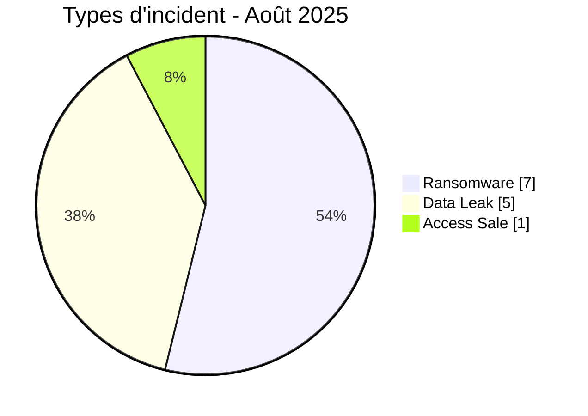
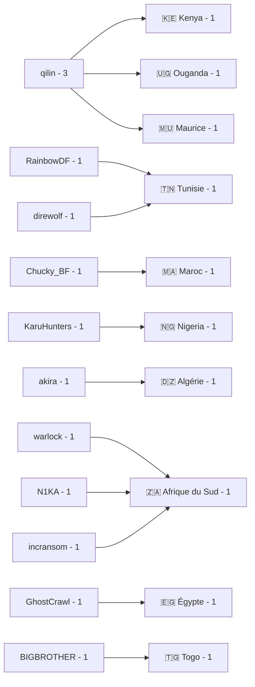
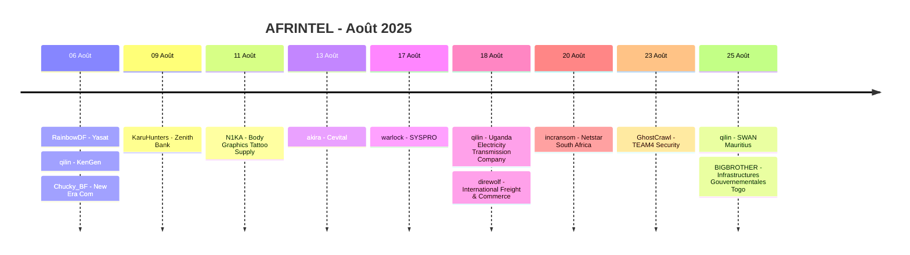

# Rapport CTI - Cyberattaques en Afrique - Août 2025

👉🏾 [**English version available here**](./README.md)

## 1. Synthèse exécutive

Août 2025 compte **13 incidents documentés dans 10 pays africains** : **7 Ransomware**, **5 Data Leak** et **1 Access Sale**. Aucun DDoS, Defacement ou Operational Fraud n'est enregistré.

- **Afrique du Sud** : 3 incidents, dont 2 Ransomware et 1 Data Leak.
- **Tunisie** : 2 incidents, dont 1 Ransomware et 1 Data Leak.
- Les huit autres pays comptent 1 incident chacun.
- **qilin** est le groupe le plus visible avec 3 revendications : KenGen, Uganda Electricity Transmission Company Limited et SWAN Mauritius.
- Contrairement à l'ancien README, aucun incident n'est classé `Unknown` au niveau de l'acteur : Zenith Bank est attribué à **KaruHunters** et Body Graphics à **N1KA**.
- **Yasat** présente plusieurs dizaines de milliers d'enregistrements clients et transactionnels dans les exports examinés.
- **New Era Com** est classé Data Fully Published avec un dump SQL annoncé de **607 Mo** et plus de **476 000 enregistrements**.
- **Zenith Bank** fait l'objet d'une revendication portant sur plus de **1,8 million de dossiers**, avec un échantillon local de 18 lignes examiné.
- **Body Graphics Tattoo Supply** est classé Data Fully Published avec **6 501 enregistrements** dans deux exports structurés.
- **Togo - Infrastructures Gouvernementales** est le seul **Access Sale** du mois, avec des éléments montrant un accès administratif actif à plusieurs plateformes étatiques.

### 📋 Liste des victimes

👉🏾 [Voir la liste complète des victimes](./victims_FR.md)

### 1.1 Comparaison avec le mois précédent

> Comparaison fondée sur les corpus mensuels AFRINTEL validés. La variation du nombre de fiches documentées ne prouve pas, à elle seule, une variation équivalente du nombre réel de compromissions.

| Indicateur | Juillet 2025 | Août 2025 | Évolution observée |
|---|---:|---:|---:|
| Total incidents | 21 | 13 | **-8 (-38,1 %)** |
| Ransomware | 5 | 7 | **+2 (+40,0 %)** |
| Data Leak | 16 | 5 | **-11 (-68,8 %)** |
| Access Sale | 0 | 1 | **+1 (nouveau)** |
| DDoS | 0 | 0 | **0 (stable)** |
| Defacement | 0 | 0 | **0 (stable)** |
| Operational Fraud | 0 | 0 | **0 (stable)** |

## 2. Méthodologie

- **Périmètre** : 54 pays africains.
- **Période** : 1er au 31 août 2025.
- **Sources** : OSINT, leak sites, forums underground, publications d'acteurs et échantillons disponibles.
- **Source de vérité** : couple validé [`victims_FR.md`](./victims_FR.md) / [`victims.md`](./victims.md), avec contrôle éditorial en français avant synchronisation anglaise.
- **Comptage** : une fiche correspond à un incident unique.
- **Taxonomie** : Ransomware, Data Leak, Access Sale, DDoS, Defacement, Operational Fraud.
- **Qualification** : revendication, échantillon, publication complète et confirmation technique restent des niveaux distincts.
- **Visualisation** : tableaux, barres textuelles, diagrammes Mermaid simples et chronologie.

## 3. Vue d'ensemble

### 3.1 Répartition par type d'incident

| Type d'incident | Nombre | Part |
|---|---:|---:|
| Ransomware | 7 | 53,8 % |
| Data Leak | 5 | 38,5 % |
| Access Sale | 1 | 7,7 % |
| DDoS | 0 | 0,0 % |
| Defacement | 0 | 0,0 % |
| Operational Fraud | 0 | 0,0 % |
| **Total** | **13** | **100 %** |

**Convention couleur :** 🟧 Ransomware | 🟦 Data Leak | 🟪 Access Sale | 🟥 DDoS | 🟨 Defacement | 🟩 Operational Fraud.

### 3.2 Répartition par pays

| Pays | Ransomware | Data Leak | Access Sale | Total | Distribution |
|---|---:|---:|---:|---:|---|
| 🇿🇦 Afrique du Sud | 2 | 1 | 0 | 3 | 🟧🟧🟦 |
| 🇹🇳 Tunisie | 1 | 1 | 0 | 2 | 🟧🟦 |
| 🇰🇪 Kenya | 1 | 0 | 0 | 1 | 🟧 |
| 🇲🇦 Maroc | 0 | 1 | 0 | 1 | 🟦 |
| 🇳🇬 Nigeria | 0 | 1 | 0 | 1 | 🟦 |
| 🇩🇿 Algérie | 1 | 0 | 0 | 1 | 🟧 |
| 🇺🇬 Ouganda | 1 | 0 | 0 | 1 | 🟧 |
| 🇪🇬 Égypte | 0 | 1 | 0 | 1 | 🟦 |
| 🇲🇺 Maurice | 1 | 0 | 0 | 1 | 🟧 |
| 🇹🇬 Togo | 0 | 0 | 1 | 1 | 🟪 |
| **Total** | **7** | **5** | **1** | **13** | |

### 3.3 Répartition géographique par région

| Région | Incidents | Part | Activité |
|---|---:|---:|---|
| Afrique du Nord | 5 | 38,5 % | ██████████ |
| Afrique australe | 4 | 30,8 % | ████████ |
| Afrique de l'Est | 2 | 15,4 % | ████ |
| Afrique de l'Ouest | 2 | 15,4 % | ████ |
| Afrique centrale | 0 | 0,0 % |  |
| **Total** | **13** | **100 %** | |

### 3.4 Répartition sectorielle harmonisée

| Secteur harmonisé | Incidents | Part | Activité |
|---|---:|---:|---|
| Technologie / IT / Télécommunications | 4 | 30,8 % | ██████████ |
| Énergie / Infrastructures critiques | 2 | 15,4 % | █████ |
| Finance / Banque / Assurance | 2 | 15,4 % | █████ |
| Agroalimentaire / Industrie | 1 | 7,7 % | ██ |
| Transport / Logistique | 1 | 7,7 % | ██ |
| Commerce / E-commerce | 1 | 7,7 % | ██ |
| Services de sécurité / Défense | 1 | 7,7 % | ██ |
| Gouvernement / Infrastructures critiques | 1 | 7,7 % | ██ |
| **Total** | **13** | **100 %** | |

### 3.5 Acteurs / groupes

| Acteur / Groupe | Incidents | Activité |
|---|---:|---|
| qilin | 3 | ██████████ |
| akira | 1 | ███ |
| BIGBROTHER | 1 | ███ |
| Chucky_BF | 1 | ███ |
| direwolf | 1 | ███ |
| GhostCrawl | 1 | ███ |
| incransom | 1 | ███ |
| KaruHunters | 1 | ███ |
| N1KA | 1 | ███ |
| RainbowDF | 1 | ███ |
| warlock | 1 | ███ |
| **Total** | **13** | |

### 3.6 Cartographie acteurs -> pays

## 4. Analyse détaillée par type d'incident

### 4.1 Ransomware - 7 incidents

Les sept fiches Ransomware concernent :

- **KenGen** au Kenya, revendiquée par qilin, avec des documents internes cohérents couvrant contrats, CAPEX, ressources humaines, appels d'offres et documentation technique.
- **Cevital** en Algérie, revendiquée par akira.
- **SYSPRO** en Afrique du Sud, revendiquée par warlock.
- **Uganda Electricity Transmission Company Limited** en Ouganda, revendiquée par qilin.
- **International Freight & Commerce** en Tunisie, revendiquée par direwolf.
- **Netstar South Africa** en Afrique du Sud, revendiquée par incransom. AFRINTEL avait déjà enregistré une revendication distincte par devman en mai 2025.
- **SWAN Mauritius** à Maurice, revendiquée par qilin.

### 4.2 Data Leak - 5 incidents

Les cinq Data Leak sont :

- **Yasat** en Tunisie : plusieurs exports structurés couvrant ventes, facturation, profils clients et comptes utilisateurs.
- **New Era Com** au Maroc : publication complète d'un dump SQL annoncé de 607 Mo et plus de 476 000 enregistrements.
- **Zenith Bank Plc** au Nigeria : plus de 1,8 million de dossiers revendiqués ; AFRINTEL a examiné un échantillon local de 18 lignes et 8 colonnes.
- **Body Graphics Tattoo Supply** en Afrique du Sud : deux exports WordPress/WooCommerce totalisant 6 501 enregistrements, classés Data Fully Published.
- **TEAM4 Security** en Égypte : lots de messagerie, documents internes et données RH/paie. La fiche utilise le 23 août comme date de détection, tandis que les horodatages du fil de publication examinés vont du 29 au 31 août.

### 4.3 Access Sale - 1 incident

**Infrastructures Gouvernementales du Togo** est le seul Access Sale du mois. Le matériel examiné montre un accès administratif actif à plusieurs plateformes numériques publiques sous `gouv.tg`, notamment des systèmes d'identité, de collaboration, de collecte de données et de reporting éducatif.

AFRINTEL classe l'incident comme Access Sale car l'offre porte sur un accès privilégié. Cette classification n'implique pas à elle seule une exfiltration complète des données hébergées sur ces systèmes.

## 5. Impact sectoriel

**Technologie / IT / Télécommunications** est la catégorie harmonisée la plus représentée avec **4 incidents sur 13 (30,8 %)** : Yasat, New Era Com, SYSPRO et Netstar.

**Énergie / Infrastructures critiques** compte 2 incidents : KenGen et Uganda Electricity Transmission Company Limited.

**Finance / Banque / Assurance** compte 2 incidents : Zenith Bank et SWAN Mauritius.

Cevital, International Freight & Commerce, Body Graphics, TEAM4 Security et les infrastructures gouvernementales togolaises appartiennent chacun à une catégorie sectorielle distincte.

## 6. Profil des acteurs

**qilin** domine avec **3 fiches**. Les dix autres acteurs identifiés apparaissent une seule fois.

L'ancien README attribuait Zenith Bank et Body Graphics à des acteurs inconnus. Les fiches victimes structurées identifient pourtant **KaruHunters** et **N1KA** respectivement. Ces deux valeurs sont donc réintégrées dans les statistiques d'acteurs.

## 7. Tendances et lacunes de renseignement

### 7.1 Tendances observées

1. **Baisse du volume mensuel** : 21 incidents en juillet contre 13 en août.
2. **Hausse relative du Ransomware** : 5 incidents en juillet contre 7 en août.
3. **Recul des Data Leak** : 16 en juillet contre 5 en août.
4. **Apparition d'un Access Sale** : 0 en juillet, 1 en août.
5. **Afrique du Sud en tête** : 3 incidents.
6. **qilin domine le mois** avec 3 revendications.
7. **Secteur énergétique sensible** : deux opérateurs électriques d'Afrique de l'Est sont revendiqués par qilin.
8. **Niveaux de preuve variés** : revendications seules, échantillons structurés, publications complètes et accès administratifs observés coexistent.

### 7.2 Lacunes de renseignement

- Les vecteurs d'accès initiaux restent inconnus pour la majorité des incidents.
- Plusieurs revendications Ransomware ne disposent pas d'échantillon dans les fiches fournies.
- Le volume de 1,8 million de dossiers pour Zenith Bank reste une valeur revendiquée ; seul un échantillon de 18 lignes a été examiné.
- La relation entre les revendications Netstar de mai et août 2025 reste non résolue.
- L'origine technique exacte de l'accès aux infrastructures gouvernementales togolaises n'est pas établie.
- La date de la fiche TEAM4 doit être interprétée comme date de détection AFRINTEL, les publications observées étant datées du 29 au 31 août.

### 7.3 Évolution mensuelle

| Type | Juillet 2025 | Août 2025 | Évolution |
|---|---:|---:|---:|
| Total | 21 | 13 | **-8 (-38,1 %)** |
| Ransomware | 5 | 7 | **+2 (+40,0 %)** |
| Data Leak | 16 | 5 | **-11 (-68,8 %)** |
| Access Sale | 0 | 1 | **+1 (nouveau)** |

## 8. Chronologie synthétique

> Pour TEAM4 Security, le 23 août correspond à la date de détection retenue dans la fiche. Les publications du fil examiné sont horodatées du 29 au 31 août 2025.

## 9. Cartographie MITRE ATT&CK contextuelle

| Phase | Technique | Portée analytique |
|---|---|---|
| Comptes valides | T1078 - Valid Accounts | Contexte pertinent lorsqu'un accès administratif actif est observé, notamment dans le cas togolais. |
| Collecte | T1005 - Data from Local System | Pertinent pour les documents, exports et fichiers internes observés. |
| Collecte | T1213 - Data from Information Repositories | Pertinent pour les bases structurées Yasat, New Era Com, Zenith Bank et Body Graphics. |
| Collecte messagerie | T1114 - Email Collection | Pertinent pour TEAM4 Security, où une boîte administrative/support exfiltrée est décrite dans les lots examinés. |

> Ces mappings sont contextuels. Ils ne prouvent pas que chaque acteur a utilisé les techniques indiquées.

## 10. Recommandations

- **Énergie / Infrastructures critiques** : segmentation, PAM, EDR, surveillance des accès administratifs et protection des référentiels techniques.
- **Finance / Assurance** : MFA résistant au phishing, contrôle des exports clients, détection des accès anormaux et supervision des transferts.
- **Technologie / IT** : durcir les applications exposées, protéger les sauvegardes et limiter les comptes de service.
- **E-commerce** : protéger les comptes administrateurs WordPress/WooCommerce, invalider les sessions exposées et surveiller les exports.
- **Secteur public** : contrôler les accès privilégiés, segmenter les plateformes, journaliser les actions administratives et révoquer rapidement tout accès compromis.

## 11. Recommandations SOC et tactiques

### Observé

Le corpus contient des dumps SQL, exports structurés, documents internes, données RH, messageries, revendications Ransomware et accès administratifs à des systèmes publics.

### Hypothèses

Les vecteurs initiaux, mécanismes de persistance et chemins complets d'exfiltration ne sont pas établis pour la majorité des incidents.

### Préventif

Surveiller les authentifications à privilèges, exports massifs, accès aux sauvegardes, requêtes inhabituelles sur les bases, transferts sortants, création d'archives et activités anormales sur les plateformes collaboratives. Maintenir MFA, PAM, EDR, segmentation, sauvegardes immuables et rotation des secrets.

## 12. Conclusion

Août 2025 compte **13 incidents dans 10 pays**, répartis entre **7 Ransomware, 5 Data Leak et 1 Access Sale**.

Le volume baisse de 38,1 % par rapport à juillet, mais la part du Ransomware augmente. L'Afrique du Sud est le pays le plus représenté avec 3 incidents et qilin le groupe le plus visible avec 3 revendications. La correction des acteurs de Zenith Bank et Body Graphics supprime les deux entrées `Unknown` de l'ancien rapport.

**AFRINTEL** - Initiative ouverte de veille CTI sur l'Afrique
