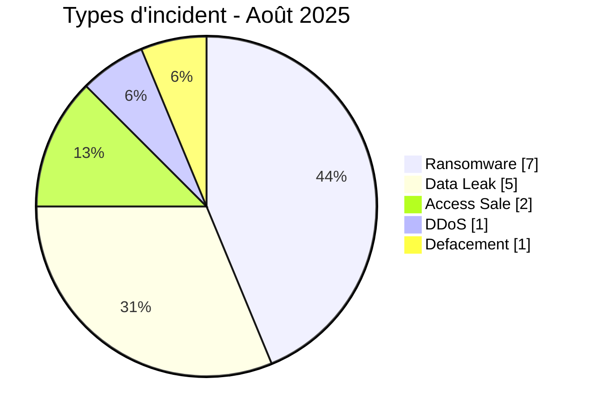
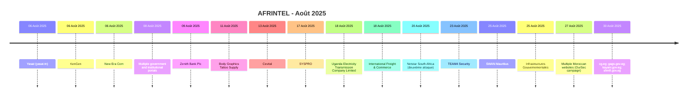

# Rapport CTI AFRINTEL - Cybermenaces en Afrique - Août 2025

👉🏾 [English version](./README.md)

   

## 1. Synthèse exécutive

En Août 2025, AFRINTEL documente **16 cyberincidents** affectant des organisations et services numériques dans **10 pays africains**.

Le paysage est dominé par **Ransomware avec 7 fiches (43,8 %)**, suivi de **Data Leak avec 5 (31,2 %)**. Les autres types observés sont Access Sale 2, DDoS 1, Defacement 1.

La concentration géographique est marquée : **Égypte (3)**, **Afrique du Sud (3)**, **Tunisie (2)** représentent ensemble **8 fiches, soit 50,0 % du mois**. Cette concentration doit être interprétée comme la visibilité du corpus AFRINTEL et non comme un taux national exhaustif de compromission.

Sur le plan sectoriel, les catégories les plus représentées sont **Technologie / IT (3)**, **Gouvernement / Administration (3)**, **Énergie / Services publics (2)**. Les labels d'acteurs les plus fréquents sont `qilin` (3), `RainbowDF` (1), `Chucky_BF` (1). `Unknown`, lorsqu'il apparaît, désigne une absence d'attribution et non un groupe cybercriminel.

La maturité des preuves reste variable : **11 fiches** relèvent de claims non vérifiés ou accompagnés d'échantillons. AFRINTEL conserve une séparation stricte entre **faits observés, revendications, corroborations, confirmations officielles et inconnues techniques**.

Par rapport à Juillet, le volume mensuel **diminue de 9 fiches**. Les variations les plus visibles concernent Data Leak 18->5 (-13), Ransomware 5->7 (+2), Access Sale 0->2 (+2).

> **Note de lecture :** les chiffres AFRINTEL décrivent les incidents documentés et la visibilité des menaces observées. Ils ne constituent pas une mesure exhaustive de toutes les cyberattaques réellement survenues en Afrique.

### 1.1 Comparaison avec le mois précédent

| Indicateur | Juillet 2025 | Août 2025 | Évolution |
|---|---:|---:|---:|
| Total incidents | 25 | 16 | **-9 (-36,0 %)** |
| Ransomware | 5 | 7 | **+2 (+40,0 %)** |
| Data Leak | 18 | 5 | **-13 (-72,2 %)** |
| Access Sale | 0 | 2 | **+2 (nouveau)** |
| DDoS | 0 | 1 | **+1 (nouveau)** |
| Defacement | 0 | 1 | **+1 (nouveau)** |
| Account Takeover | 0 | 0 | **Stable** |
| System Intrusion | 1 | 0 | **-1 (-100,0 %)** |
| Malware | 1 | 0 | **-1 (-100,0 %)** |
| Operational Fraud | 0 | 0 | **Stable** |

## 2. Méthodologie

- **Périmètre :** 54 pays africains ; période de référence : Août 2025.
- **Source de vérité :** couple validé `victims_FR.md` / `victims.md`.
- **Classification :** Ransomware, Data Leak, Access Sale, DDoS, Defacement, Account Takeover, System Intrusion, Malware et Operational Fraud.
- **Comptage :** une fiche canonique correspond à un cyberincident documenté ; les dossiers en investigation restent hors statistiques.
- **Chronologie :** `Date de l'incident` et `Date de publication initiale` sont séparées. Une publication ultérieure ne déplace pas artificiellement un incident vers un autre mois lorsque la chronologie est suffisamment établie.
- **Dates incertaines :** lorsqu'un jour exact n'est pas connu, le mois ou la fenêtre soutenue par les preuves est conservé.
- **Sources :** les liens publics sont conservés pour les incidents complémentaires identifiés par recherche OSINT/web ; ils ne sont pas imposés rétroactivement aux observations historiques ou Dark Web directes.
- **Preuve :** type d'incident, statut, confiance, impact et provenance restent des dimensions distinctes.
- **Secteurs :** normalisation calculée une seule fois à partir du corpus structuré, puis utilisée à l'identique en FR et EN.
- **Limite :** les fréquences reflètent la visibilité AFRINTEL et non l'ensemble des compromissions réelles sur le continent.

## 3. Vue d'ensemble et types d'incident

| Indicateur | Valeur |
|---|---:|
| Incidents documentés | **16** |
| Pays représentés | **10** |
| Régions représentées | **5** |
| Premier pays | **Égypte (3)** |
| Premier secteur | **Technologie / IT (3)** |
| Premier label acteur | **qilin (3)** |

| Type d'incident | Fiches | Part |
|---|---:|---:|
| Ransomware | 7 | 43,8 % |
| Data Leak | 5 | 31,2 % |
| Access Sale | 2 | 12,5 % |
| DDoS | 1 | 6,2 % |
| Defacement | 1 | 6,2 % |
| Account Takeover | 0 | 0,0 % |
| System Intrusion | 0 | 0,0 % |
| Malware | 0 | 0,0 % |
| Operational Fraud | 0 | 0,0 % |
| **Total** | **16** | **100 %** |

## 4. Répartition géographique

| Pays | Total | Ransomware | Data Leak | Access Sale | DDoS | Defacement | Account Takeover | System Intrusion | Malware |
|---|---:|---:|---:|---:|---:|---:|---:|---:|---:|
| Égypte | **3** | 0 | 1 | 1 | 1 | 0 | 0 | 0 | 0 |
| Afrique du Sud | **3** | 2 | 1 | 0 | 0 | 0 | 0 | 0 | 0 |
| Tunisie | **2** | 1 | 1 | 0 | 0 | 0 | 0 | 0 | 0 |
| Maroc | **2** | 0 | 1 | 0 | 0 | 1 | 0 | 0 | 0 |
| Kenya | **1** | 1 | 0 | 0 | 0 | 0 | 0 | 0 | 0 |
| Nigeria | **1** | 0 | 1 | 0 | 0 | 0 | 0 | 0 | 0 |
| Algérie | **1** | 1 | 0 | 0 | 0 | 0 | 0 | 0 | 0 |
| Ouganda | **1** | 1 | 0 | 0 | 0 | 0 | 0 | 0 | 0 |
| Maurice | **1** | 1 | 0 | 0 | 0 | 0 | 0 | 0 | 0 |
| Togo | **1** | 0 | 0 | 1 | 0 | 0 | 0 | 0 | 0 |
| **Total** | **16** | **7** | **5** | **2** | **1** | **1** | **0** | **0** | **0** |

> `Operational Fraud = 0` ce mois-ci ; la colonne est omise pour préserver la lisibilité.

## 5. Répartition régionale

| Région | Fiches | Part |
|---|---:|---:|
| Afrique du Nord | 8 | 50,0 % |
| Afrique australe | 3 | 18,8 % |
| Afrique de l'Est | 2 | 12,5 % |
| Afrique de l'Ouest | 2 | 12,5 % |
| Océan Indien | 1 | 6,2 % |
| **Total** | **16** | **100 %** |

La région la plus représentée est **Afrique du Nord avec 8 fiches (50,0 %)**.

## 6. Impact sectoriel

| Secteur | Fiches | Part | Activité |
|---|---:|---:|---|
| Technologie / IT | 3 | 18,8 % | ███ |
| Gouvernement / Administration | 3 | 18,8 % | ███ |
| Énergie / Services publics | 2 | 12,5 % | ██ |
| Finance / Banque | 2 | 12,5 % | ██ |
| Télécommunications | 1 | 6,2 % | █ |
| Commerce / E-commerce | 1 | 6,2 % | █ |
| Industrie / Fabrication | 1 | 6,2 % | █ |
| Transport / Logistique | 1 | 6,2 % | █ |
| Services professionnels / Business | 1 | 6,2 % | █ |
| Non précisé | 1 | 6,2 % | █ |
| **Total** | **16** | **100 %** | |

## 7. Acteurs / groupes

`Unknown` correspond à une absence d'attribution, pas à un acteur.

| Acteur / Groupe | Fiches | Activité |
|---|---:|---|
| qilin | 3 | ███ |
| RainbowDF | 1 | █ |
| Chucky_BF | 1 | █ |
| Hider_Nex / Keymous Plus (claim) | 1 | █ |
| KaruHunters | 1 | █ |
| N1KA | 1 | █ |
| akira | 1 | █ |
| warlock | 1 | █ |
| direwolf | 1 | █ |
| incransom | 1 | █ |
| GhostCrawl | 1 | █ |
| BIGBROTHER | 1 | █ |
| OurSec (claim) | 1 | █ |
| BIGBROTHER (claimed seller) | 1 | █ |

## 8. Maturité des preuves

| Maturité de preuve | Fiches | Part |
|---|---:|---:|
| Claim - Unverified | 6 | 37,5 % |
| Claim - Data Sample Published | 5 | 31,2 % |
| Data Fully Published | 2 | 12,5 % |
| Corroboré / preuve secondaire | 3 | 18,8 % |
| **Total** | **16** | **100 %** |

Les statuts de preuve décrivent le niveau de validation disponible ; ils ne changent pas le type technique de l'incident.

## 9. Chronologie

## 10. Analyse CTI mensuelle

### Ransomware

**7 fiches** sont classées Ransomware. Principaux pays : Afrique du Sud (2), Kenya (1), Algérie (1). Une publication sur un leak site ne prouve pas, à elle seule, le chiffrement ou l'exfiltration complète.

### Data Leak

**5 fiches** sont classées Data Leak. Principaux pays : Tunisie (1), Maroc (1), Nigeria (1). AFRINTEL distingue les données effectivement observées des volumes globaux revendiqués.

### Access Sale

**2 fiche(s)** relèvent d'Access Sale. Répartition : Togo (1), Égypte (1). Une offre d'accès ne prouve pas automatiquement une exfiltration ou une compromission de l'ensemble de l'infrastructure.

### DDoS

**1 campagne(s)** DDoS sont documentées. Répartition : Égypte (1). Le comptage porte sur les campagnes et non nécessairement sur chaque domaine ciblé.

### Defacement

**1 Defacement** sont documentés. Répartition : Maroc (1). Un défacement n'est pas reclassé en fuite de données sans preuve distincte.

## 11. Incidents notables

| Pays | Organisation | Type | Statut | Impact | Confiance |
|---|---|---|---|---|---|
| Kenya | KenGen | Ransomware | Claim - Data Sample Published | Level 4 | High |
| Égypte | Multiple government and institutional portals | DDoS | Claim - OSINT Availability Evidence | Level 4 | Medium |
| Égypte | cg.eg; gags.gov.eg; kayani.gov.eg; shmft.gov.eg | Access Sale | Claim - Marketplace Listing / Screenshots | Level 4 | Medium |
| Maroc | Multiple Moroccan websites (OurSec campaign) | Defacement | Claim - OSINT Corroborated | Level 3 | Medium |
| Nigeria | Zenith Bank Plc | Data Leak | Claim - Data Sample Published | Level 3 | Medium |

> Ce tableau met en avant jusqu'à cinq fiches selon le niveau d'impact, la confirmation et la confiance structurés. Il ne constitue pas un classement absolu de gravité.

## 12. Principaux enseignements et lacunes de renseignement

- **Concentration géographique :** Égypte représente 3 fiches (18,8 %), devant Afrique du Sud (3) et Tunisie (2).
- **Structure de menace :** Ransomware est le premier type avec 7 fiches, suivi de Data Leak (5).
- **Secteurs :** Technologie / IT (3) et Gouvernement / Administration (3) concentrent la plus forte visibilité.
- **Acteurs :** les labels les plus fréquents sont qilin (3), RainbowDF (1) et Chucky_BF (1).
- **Preuve :** 11 fiches reposent sur des claims non vérifiés ou accompagnés d'un échantillon ; ces statuts ne valent pas confirmation technique complète.

### Intelligence gaps

- vecteur d'accès initial souvent non public ;
- date technique exacte de compromission parfois inconnue ;
- volumes revendiqués rarement vérifiables intégralement ;
- attribution technique souvent limitée au pseudonyme ou label de publication ;
- informations publiques sur remédiation, cause racine et conclusions DFIR encore limitées.

Ces lacunes doivent guider la collecte sans être remplacées par des hypothèses.

## 13. Recommandations

### Organisations

- imposer MFA résistante au phishing sur les comptes privilégiés, VPN, messagerie, réseaux sociaux et consoles d'administration ;
- appliquer PAM, moindre privilège, segmentation et rotation des secrets ;
- maintenir des sauvegardes immuables et tester la restauration ;
- renforcer les applications publiques, API et interfaces administratives ;
- formaliser réponse à incident et notification des violations de données.

### SOC et détection

- surveiller les authentifications anormales, changements MFA, créations de comptes privilégiés et élévations de rôles ;
- détecter lectures massives de bases, exports inhabituels, créations d'archives et transferts sortants volumineux ;
- corréler EDR, IAM, VPN, WAF, proxy, DNS, cloud et journaux applicatifs ;
- distinguer DDoS, intrusion interne, compromission de compte et fuite de données pour éviter les conclusions non étayées.

### CTI

- conserver séparément date d'incident, publication initiale, première observation, échantillon, divulgation et confirmation ;
- suivre republications et reventes sans les compter automatiquement comme nouvelles compromissions ;
- maintenir la hiérarchie de preuve entre claim, corroboration et confirmation ;
- valider la parité FR/EN avant toute génération de statistiques.

## 14. Conclusion

Le mois de **Août 2025** compte **16 cyberincidents documentés** dans **10 pays africains**. La lecture mensuelle montre que la valeur CTI ne réside pas seulement dans le volume, mais dans la distinction entre **type d'incident, chronologie, niveau de preuve, géographie, secteur et acteur**.

Le rapport conserve ainsi une photographie structurée de la menace observable tout en maintenant les revendications, corroborations, confirmations et inconnues à leur niveau de preuve réel.

👉🏾 [Voir les victimes du mois](./victims_FR.md)

**AFRINTEL** - TLP:CLEAR
