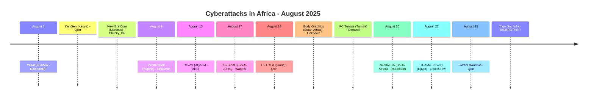
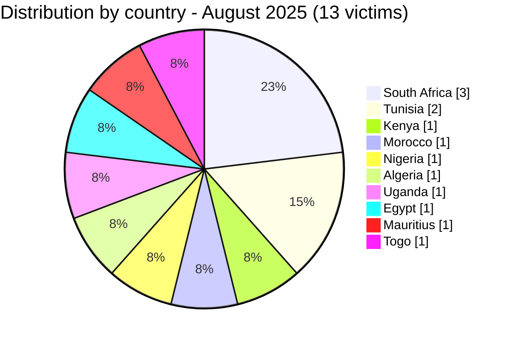

[](https://github.com/Hatchepsoute/AFRINTEL)


# CTI Report - August 2025: Energy infrastructure and financial giants under fire

👉🏾 [Version française disponible ici](./README_FR.md)

👉🏾 [Victims list](../victims.md)

### 1. Executive summary

August 2025 records **13 documented victims** across 10 countries, the broadest geographic spread of any month in 2025. The month is defined by **Qilin's triple campaign against energy and insurance infrastructure** (KenGen/Kenya, UETCL/Uganda, SWAN/Mauritius), a **major data breach at Zenith Bank Nigeria** (1.8 million records claimed), and the **sale of privileged access to Togolese government systems**. The ERP software publisher SYSPRO (South Africa) is also compromised, introducing a potential supply chain risk for its manufacturing clients.

**Key figures:**
- 🔹 **13 victims** identified
- 🔹 **10 active groups**: Qilin (3), Unknown (2), RainbowDF (1), Chucky_BF (1), Akira (1), Warlock (1), Direwolf (1), InCransom (1), GhostCrawl (1), BIGBROTHER (1)
- 🔹 **Countries affected**: South Africa (3), Tunisia (2), Kenya (1), Morocco (1), Nigeria (1), Algeria (1), Uganda (1), Egypt (1), Mauritius (1), Togo (1)
- 🔹 **Sectors**: Energy/Critical Infrastructure (2), Banking & Finance (3), Technology/Software (3), Government (2), Telecoms/IT (1), Logistics (1), Agribusiness/Industry (1)

---

### 2. Attack timeline

| Date | Victim | Country | Group |
|------|--------|---------|-------|
| August 6 | Yasat (yasat.tn) | Tunisia | RainbowDF |
| August 6 | KenGen | Kenya | Qilin |
| August 6 | New Era Com | Morocco | Chucky_BF |
| August 9 | Zenith Bank Plc | Nigeria | Unknown |
| August 13 | Cevital | Algeria | Akira |
| August 17 | SYSPRO | South Africa | Warlock |
| August 18 | Uganda Electricity Transmission Company (UETCL) | Uganda | Qilin |
| August 18 | Body Graphics Tattoo Supply | South Africa | Unknown |
| August 18 | International Freight & Commerce | Tunisia | Direwolf |
| August 20 | Netstar South Africa (second attack) | South Africa | InCransom |
| August 23 | TEAM4 Security | Egypt | GhostCrawl |
| August 25 | SWAN Mauritius | Mauritius | Qilin |
| August 25 | Government Infrastructures (gouv.tg) | Togo | BIGBROTHER |



---

### 3. Victim analysis

#### 3.1 By country

| Country | Number of attacks |
|---------|-----------------|
| South Africa | 3 |
| Tunisia | 2 |
| Kenya | 1 |
| Morocco | 1 |
| Nigeria | 1 |
| Algeria | 1 |
| Uganda | 1 |
| Egypt | 1 |
| Mauritius | 1 |
| Togo | 1 |



#### 3.2 By sector

| Sector | Count |
|--------|-------|
| Banking & Financial Services | 3 |
| Technology / Software | 3 |
| Energy / Critical Infrastructure | 2 |
| Government | 2 |
| Telecoms / IT Services | 1 |
| Agribusiness / Industry | 1 |
| Logistics | 1 |

```mermaid
xychart-beta
    title "Targeted Sectors - August 2025"
    x-axis ["Banking", "Technology", "Energy", "Government", "Telecom", "Agribusiness", "Logistics"]
    y-axis "Number of attacks" 0 to 4
    bar [3, 3, 2, 2, 1, 1, 1]
```

#### 3.3 Active groups

| Group | Attacks | Notable targets |
|-------|---------|-----------------|
| Qilin | 3 | KenGen (Kenya), UETCL (Uganda), SWAN (Mauritius) |
| Unknown | 2 | Zenith Bank (Nigeria), Body Graphics (SA) |
| RainbowDF | 1 | Yasat (Tunisia) |
| Chucky_BF | 1 | New Era Com (Morocco) |
| Akira | 1 | Cevital (Algeria) |
| Warlock | 1 | SYSPRO (South Africa) |
| Direwolf | 1 | IFC Tunisie (Tunisia) |
| InCransom | 1 | Netstar SA (second attack) |
| GhostCrawl | 1 | TEAM4 Security (Egypt) |
| BIGBROTHER | 1 | Togo government infrastructure |

---

### 4. Key observations

- **Qilin dominates August**: 3 victims in 3 distinct countries (Kenya, Uganda, Mauritius) targeting **electricity generation, electricity transmission, and insurance**, a deliberate campaign against critical financial and energy infrastructure across East and Southern Africa.
- **Zenith Bank breach**: one of Nigeria's and Anglophone Africa's largest banks faces a claimed exfiltration of **1.8 million records** including customer data and employee files; AFRINTEL reviewed a local 18-row CSV sample without reproducing raw values.
- **SYSPRO supply chain risk**: the compromise of a major ERP software publisher exposes downstream manufacturing and distribution clients potentially running SYSPRO systems. Impact assessment required across the customer base.
- **Access sale for Togo government systems**: BIGBROTHER lists admin access to `gouv.tg` for $1,000 in Monero, a direct indicator of active, privileged compromise of state digital infrastructure.
- **Netstar second attack**: InCransom claims Netstar South Africa (vehicle tracking/SVR, Altron subsidiary) for a second time, reinforcing the double-claim and data resale pattern seen in prior months.
- **Cevital (Algeria)**: Akira claims Algeria's largest private industrial group, agribusiness, electronics, steel, glass, indicating increasing interest in North African industrial conglomerates.

---

```mermaid
xychart-beta
    title "Monthly Evolution of Attacks (Jan - Aug 2025)"
    x-axis ["Jan", "Feb", "Mar", "Apr", "May", "Jun", "Jul", "Aug"]
    y-axis "Number of attacks" 0 to 20
    bar [8, 10, 9, 10, 16, 14, 13, 13]
```

### 5. Recommendations

| Domain | Recommended action |
|--------|--------------------|
| Energy / Critical infrastructure | Prioritize Qilin IOC blocking, audit OT/IT segmentation, ensure offline backup for control systems. |
| Banking (esp. Nigeria) | Conduct dark web monitoring for leaked Zenith Bank data, notify affected clients, review access audit trails. |
| ERP / Software publishers | SYSPRO customers should audit their environments for lateral movement, review vendor access, patch immediately. |
| Government (Togo and similar) | Reset all admin credentials, implement geo-blocking on management interfaces, conduct forensic review. |
| All organizations | Track Qilin as the most active ransomware group of the month, review TTPs and update detection signatures. |

---

*Report generated from AFRINTEL OSINT data. Free distribution (TLP:CLEAR)*
