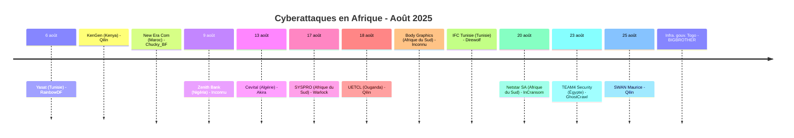
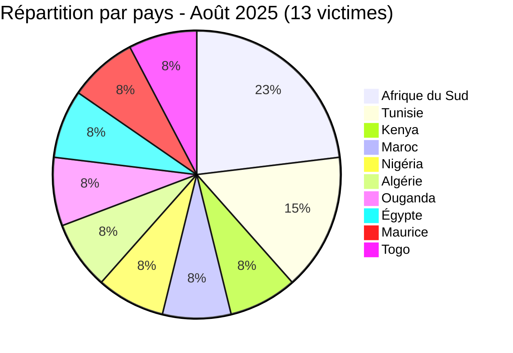

[](https://github.com/Hatchepsoute/AFRINTEL)


# Rapport CTI - Août 2025 : Infrastructures énergétiques et géants financiers dans le viseur

👉🏾 [English version available here](./README.md)

👉🏾 [Liste des victimes](../victims_FR.md)

### 1. Résumé exécutif

Août 2025 enregistre **13 victimes** documentées dans 10 pays, la dispersion géographique la plus large de tous les mois de 2025. Le mois est défini par la **triple campagne de Qilin contre les infrastructures énergétiques et d'assurance** (KenGen/Kenya, UETCL/Ouganda, SWAN/Maurice), une **violation majeure de données chez Zenith Bank Nigeria** (1,8 million de dossiers revendiqués), et la **vente d'accès privilégiés aux systèmes gouvernementaux togolais**. L'éditeur de logiciel ERP SYSPRO (Afrique du Sud) est également compromis, introduisant un risque potentiel de chaîne d'approvisionnement pour ses clients industriels.

**Chiffres clés :**
- 🔹 **13 victimes** identifiées
- 🔹 **10 groupes actifs** : Qilin (3), Inconnu (2), RainbowDF (1), Chucky_BF (1), Akira (1), Warlock (1), Direwolf (1), InCransom (1), GhostCrawl (1), BIGBROTHER (1)
- 🔹 **Pays touchés** : Afrique du Sud (3), Tunisie (2), Kenya (1), Maroc (1), Nigéria (1), Algérie (1), Ouganda (1), Égypte (1), Maurice (1), Togo (1)
- 🔹 **Secteurs** : Énergie/Infrastructures critiques (2), Banque & Finance (3), Technologie/Logiciel (3), Gouvernement (2), Télécom/IT (1), Agroalimentaire/Industrie (1), Logistique (1)

---

### 2. Chronologie des attaques

| Date | Victime | Pays | Groupe |
|------|---------|------|--------|
| 6 août | Yasat (yasat.tn) | Tunisie | RainbowDF |
| 6 août | KenGen | Kenya | Qilin |
| 6 août | New Era Com | Maroc | Chucky_BF |
| 9 août | Zenith Bank Plc | Nigéria | Inconnu |
| 13 août | Cevital | Algérie | Akira |
| 17 août | SYSPRO | Afrique du Sud | Warlock |
| 18 août | Uganda Electricity Transmission Company (UETCL) | Ouganda | Qilin |
| 18 août | Body Graphics Tattoo Supply | Afrique du Sud | Inconnu |
| 18 août | International Freight & Commerce (IFC) | Tunisie | Direwolf |
| 20 août | Netstar South Africa (deuxième attaque) | Afrique du Sud | InCransom |
| 23 août | TEAM4 Security | Égypte | GhostCrawl |
| 25 août | SWAN Mauritius | Maurice | Qilin |
| 25 août | Infrastructures gouvernementales (gouv.tg) | Togo | BIGBROTHER |



---

### 3. Analyse des victimes

#### 3.1 Par pays

| Pays | Nombre d'attaques |
|------|-----------------|
| Afrique du Sud | 3 |
| Tunisie | 2 |
| Kenya | 1 |
| Maroc | 1 |
| Nigéria | 1 |
| Algérie | 1 |
| Ouganda | 1 |
| Égypte | 1 |
| Maurice | 1 |
| Togo | 1 |



#### 3.2 Par secteur

| Secteur | Nombre |
|---------|--------|
| Banque & Services financiers | 3 |
| Technologie / Logiciel | 3 |
| Énergie / Infrastructures critiques | 2 |
| Gouvernement | 2 |
| Télécom / Services IT | 1 |
| Agroalimentaire / Industrie | 1 |
| Logistique | 1 |

```mermaid
xychart-beta
    title "Secteurs ciblés - Août 2025"
    x-axis ["Banque", "Technologie", "Énergie", "Gouvernement", "Télécom", "Agroalimentaire", "Logistique"]
    y-axis "Nombre d'attaques" 0 to 4
    bar [3, 3, 2, 2, 1, 1, 1]
```

#### 3.3 Groupes actifs

| Groupe | Attaques | Cibles notables |
|--------|---------|-----------------|
| Qilin | 3 | KenGen (Kenya), UETCL (Ouganda), SWAN (Maurice) |
| Inconnu | 2 | Zenith Bank (Nigéria), Body Graphics (Afrique du Sud) |
| RainbowDF | 1 | Yasat (Tunisie) |
| Chucky_BF | 1 | New Era Com (Maroc) |
| Akira | 1 | Cevital (Algérie) |
| Warlock | 1 | SYSPRO (Afrique du Sud) |
| Direwolf | 1 | IFC Tunisie |
| InCransom | 1 | Netstar SA (deuxième attaque) |
| GhostCrawl | 1 | TEAM4 Security (Égypte) |
| BIGBROTHER | 1 | Infrastructure gouvernementale du Togo |

---

### 4. Points d'attention

- **Qilin domine août** : 3 victimes dans 3 pays distincts (Kenya, Ouganda, Maurice) ciblant **la production d'électricité, le transport d'électricité et l'assurance**, une campagne délibérée contre les infrastructures financières et énergétiques critiques d'Afrique de l'Est et australe.
- **Brèche Zenith Bank** : l'une des plus grandes banques du Nigéria et d'Afrique anglophone fait face à une exfiltration revendiquée de **1,8 million de dossiers** incluant données clients et fichiers employés ; AFRINTEL a examiné un échantillon CSV local de 18 lignes sans reproduire de valeurs brutes.
- **Risque de chaîne d'approvisionnement SYSPRO** : la compromission d'un grand éditeur de logiciel ERP expose les clients industriels et de distribution potentiellement équipés de SYSPRO. Une évaluation d'impact est requise sur l'ensemble de la base clients.
- **Vente d'accès aux systèmes gouvernementaux togolais** : BIGBROTHER liste un accès admin à `gouv.tg` pour 1 000 $ en Monero, indicateur direct d'une compromission active et privilégiée des infrastructures numériques étatiques.
- **Deuxième attaque contre Netstar** : InCransom revendique Netstar South Africa (suivi de véhicules/SVR, filiale Altron) pour la deuxième fois, renforçant le pattern de double-claim et revente de données observé les mois précédents.
- **Cevital (Algérie)** : Akira revendique le plus grand groupe industriel privé d'Algérie, agroalimentaire, électronique, acier, verre, signalant un intérêt croissant pour les conglomérats industriels nord-africains.

---

```mermaid
xychart-beta
    title "Évolution mensuelle des attaques (Jan - Août 2025)"
    x-axis ["Jan", "Fév", "Mar", "Avr", "Mai", "Juin", "Juil", "Août"]
    y-axis "Nombre d'attaques" 0 to 20
    bar [8, 10, 9, 10, 16, 14, 13, 13]
```

### 5. Recommandations

| Domaine | Action recommandée |
|---------|--------------------|
| Énergie / Infrastructures critiques | Prioriser le blocage des IOCs Qilin, auditer la segmentation OT/IT, garantir des sauvegardes hors ligne pour les systèmes de contrôle. |
| Banque (notamment Nigéria) | Surveiller le dark web pour les données Zenith Bank divulguées, notifier les clients affectés, revoir les journaux d'audit d'accès. |
| ERP / Éditeurs de logiciels | Les clients SYSPRO doivent auditer leurs environnements pour mouvements latéraux, revoir les accès fournisseurs, corriger immédiatement. |
| Gouvernement (Togo et similaires) | Réinitialiser tous les identifiants admin, implémenter le géo-blocage sur les interfaces de gestion, mener une revue forensique. |
| Toutes organisations | Suivre Qilin comme le groupe ransomware le plus actif du mois, revoir les TTPs et mettre à jour les signatures de détection. |

---

*Rapport généré à partir des données OSINT AFRINTEL. Diffusion libre (TLP:CLEAR)*
