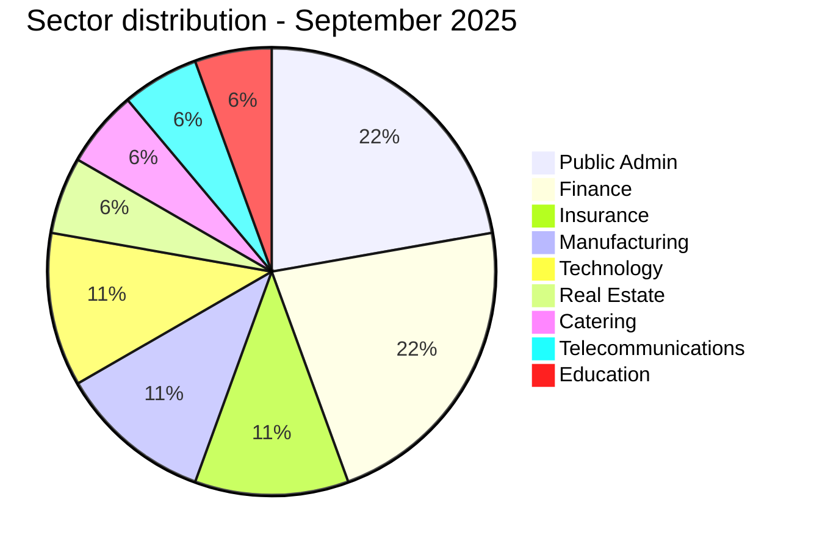
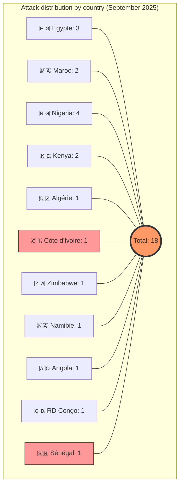
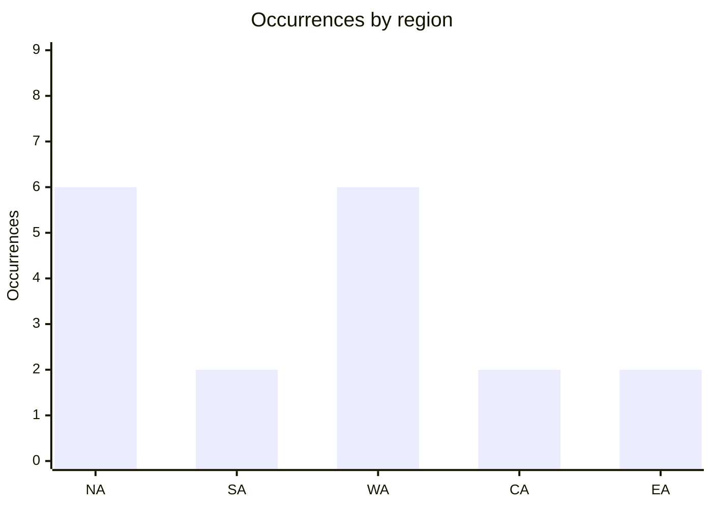
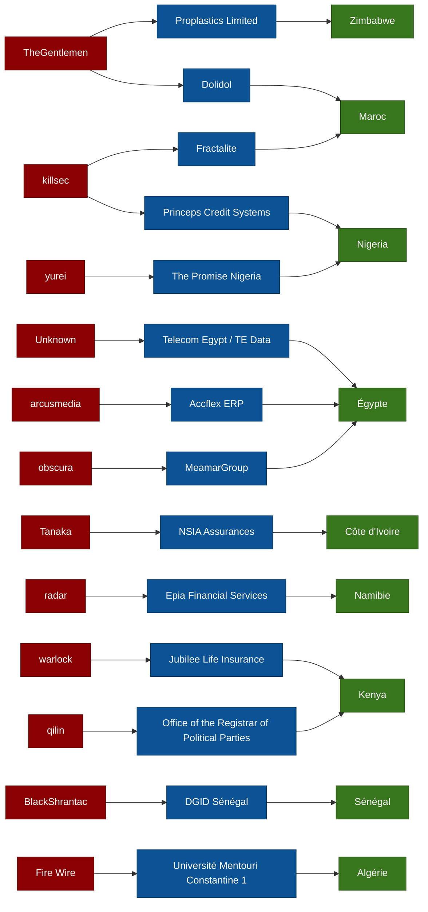

[](https://github.com/Hatchepsoute/AFRINTEL)


 

# 🛡️ AFRINTEL | CTI Report: Cyberattacks in Africa
## Period: September 2025 (18 documented victims)
👉🏾 [**French version available here**](./README_FR.md)

---

## 1. Introduction
This **Cyber Threat Intelligence (CTI)** report provides a detailed analysis of cyberattacks that occurred across Africa in September 2025. The data is compiled from **OSINT** sources and ransomware group leak sites as part of the **AFRINTEL** project. Our objective is to provide clear insights into trends, threat actors, and targeted sectors on the continent.

## 2. Executive summary
* **Total recorded attacks:** 18.
* **Most active actors:** `TheGentlemen` (2 attacks), `killsec` (2 attacks) and `privilege` (2 attacks).
* **Primary targeted sectors:** Public Administration, Finance, Insurance, Manufacturing, Technology, Telecommunications, and Education.
* **Critical data volumes:**
    * **General Directorate of Taxes and Domains (Senegal):** 1 TB of tax data exfiltrated.
    * **NSIA Assurances (Ivory Coast):** 2.5 million transactional records put up for sale.
    * **Université des Frères Mentouri Constantine 1 (Algeria):** over 10 GB of academic and personal data claimed exfiltrated.
    * **MobileSub (Nigeria):** SQL dump with 42 tables covering payment, KYC, transaction and user-account modules.
    * **Kolomoni Microfinance Bank (Nigeria):** 37,825-row account-holder CSV containing financial, contact, demographic and login metadata.

---

## 3. Key statistics

### 📊 3.1 Breakdown by group/actor
| Group / Actor | Number of Attacks |
| :--- | :---: |
| **TheGentlemen** | 2 |
| **killsec** | 2 |
| **privilege** | 2 |
| **obscura** | 1 |
| **Tanaka** | 1 |
| **yurei** | 1 |
| **radar** | 1 |
| **qilin** | 1 |
| **warlock** | 1 |
| **arcusmedia** | 1 |
| **blackshrantac** | 1 |
| **KILLUAX** | 1 |
| **Fire Wire** | 1 |
| **Not specified** | 2 |


### 🏗️ 3.2 Breakdown by industry sector
| Sector | Number of Attacks |
| :--- | :---: |
| Public Administration | 4 |
| Finance | 4 |
| Insurance | 2 |
| Manufacturing | 2 |
| Technology | 2 |
| Real Estate / Construction | 1 |
| Catering / Food Services | 1 |
| Telecommunications | 1 |
| Education | 1 |

#### 3.2.1 Top Targeted sectors visualization
- Finance/Insurance   	[████████████████████] 4
- Public Admin        	[████████████████████] 4
- Manufacturing       	[██████████] 2
- Technology          	[██████████] 2
- Telecommunications  	[█████] 1
- Education           	[█████] 1
- Real Estate / Catering              	[██████████] 2



### 🌍 3.3 Geographical distribution
| Country | Number of Attacks |
| :--- | :---: |
| 🇪🇬 Egypt | 3 |
| 🇲🇦 Morocco | 2 |
| 🇳🇬 Nigeria | 4 |
| 🇰🇪 Kenya | 2 |
| 🇩🇿 Algeria | 1 |
| 🇨🇮 Ivory Coast | 1 |
| 🇿🇼 Zimbabwe | 1 |
| 🇳🇦 Namibia | 1 |
| 🇦🇴 Angola | 1 |
| 🇨🇩 Congo (DRC) | 1 |
| 🇸🇳 Senegal | 1 |
| **Total** | **18** |


---


<!-- AFRINTEL_CURRENT_MODEL_START -->
### 3.4 Standard global overview

| Country | Ransomware | Data exposure (leaks + access) | Total | Distribution |
| :--- | ---: | ---: | ---: | :--- |
| 🇳🇬 Nigeria | 2 | 2 | 4 | 🟧🟧 🟦🟦 |
| 🇪🇬 Egypt | 2 | 1 | 3 | 🟧🟧 🟦 |
| 🇰🇪 Kenya | 2 | 0 | 2 | 🟧🟧 |
| 🇲🇦 Morocco | 2 | 0 | 2 | 🟧🟧 |
| 🇩🇿 Algeria | 0 | 1 | 1 |  🟦 |
| 🇦🇴 Angola | 0 | 1 | 1 |  🟦 |
| 🇨🇩 Congo (DRC) | 0 | 1 | 1 |  🟦 |
| 🇨🇮 Ivory Coast | 0 | 1 | 1 |  🟦 |
| 🇳🇦 Namibia | 1 | 0 | 1 | 🟧 |
| 🇸🇳 Senegal | 1 | 0 | 1 | 🟧 |
| 🇿🇼 Zimbabwe | 1 | 0 | 1 | 🟧 |

```pie
    title Incident types
    "Ransomware" : 11
    "Data leaks + access sales" : 7
```

### Monthly aggregate exposure view

The monthly CTI view combines data leaks and access sales as **data exposure**: **7 records** (38.9% of the monthly corpus). The underlying source cards remain authoritative, and an access sale does not by itself prove data exfiltration.


### Geographic distribution by region

| Region | Occurrences | Ransomware | Data exposure (leaks + access) | Distribution |
| :--- | ---: | ---: | ---: | :--- |
| North Africa | 6 | 4 | 2 | 🟧🟧🟧🟧 🟦🟦 |
| Southern Africa | 2 | 2 | 0 | 🟧🟧 |
| West Africa | 6 | 3 | 3 | 🟧🟧🟧 🟦🟦🟦 |
| Central Africa | 2 | 0 | 2 | 🟦🟦 |
| East Africa | 2 | 2 | 0 | 🟧🟧 |


Legend: NA = North Africa; SA = Southern Africa; WA = West Africa; CA = Central Africa; EA = East Africa

### Sector distribution

| Sector | Records | Share | Activity |
| :--- | ---: | ---: | :--- |
| Finance / Banking | 5 | 27.8% | ██████████ |
| Government / Administration | 5 | 27.8% | ██████████ |
| Technology / IT | 4 | 22.2% | ████████ |
| Manufacturing / Industry | 2 | 11.1% | ████ |
| Education / University | 1 | 5.6% | ██ |
| Professional / Business Services | 1 | 5.6% | ██ |

### Most visible actors

| Actor / Group | Records | Activity |
| :--- | ---: | :--- |
| Not specified | 2 | ██████████ |
| killsec | 2 | ██████████ |
| TheGentlemen | 2 | ██████████ |
| Fire Wire | 1 | █████ |
| KILLUAX | 1 | █████ |
| Tanaka | 1 | █████ |
| arcusmedia | 1 | █████ |
| blackshrantac | 1 | █████ |
| obscura | 1 | █████ |
| privilege | 1 | █████ |
<!-- AFRINTEL_CURRENT_MODEL_END -->
## 4. Detailed incidents by group/actor

#### 4.1 TheGentlemen (2 attacks)
* **09/09/2025: Dolidol (Morocco)** - Manufacturing / Bedding Industry. Claim & data leak.
* **09/09/2025: Proplastics Limited (Zimbabwe)** - Manufacturing Industry (Plastics). Claim & data leak.
> **CTI Note:** The group struck two major industrial targets in distinct geographical zones on the same day, demonstrating coordinated planning.

#### 4.2 killsec (2 attacks)
* **10/09/2025: Princeps Credit Systems Limited (Nigeria)** - Finance sector. Claim & data leak.
* **22/09/2025: Fractalite (Morocco)** - Technology / Digital Services. Claim & data leak.

#### 4.3 obscura (1 attack)
* **05/09/2025: MeamarGroup (Egypt)** - Real Estate / Construction. Claim & data leak.

#### 4.4 Tanaka (1 attack)
* **06/09/2025: NSIA Assurances (Ivory Coast)** - Insurance / Finance sector. Massive leak of **2.5 million transactional records** put up for sale.

#### 4.5 yurei (1 attack)
* **08/09/2025: The Promise Nigeria (Nigeria)** - Catering / Food Services. Claim & data leak.

#### 4.6 radar (1 attack)
* **11/09/2025: Epia Financial Services (Namibia)** - Financial Services. Claim & data leak.

#### 4.7 qilin (1 attack)
* **14/09/2025: Office of the Registrar of Political Parties (Kenya)** - Public Administration. Claim & data leak.

#### 4.8 warlock (1 attack)
* **16/09/2025: Jubilee Life Insurance (Kenya)** - Insurance / Finance. Claim & data leak.

#### 4.9 arcusmedia (1 attack)
* **17/09/2025: Accflex ERP (Egypt)** - Technology / ERP Software Publishing. Claim & data leak.

#### 4.10 BlackShrantac (1 attack)
* **29/09/2025: Direction Générale des Impôts et des Domaines (Senegal)** - Tax Administration. Massive exfiltration of **1 TB of sensitive data** (tax databases, land registries, banking info).

#### 4.11 Unknown (1 attack)
* **30/09/2025: Telecom Egypt / TE Data (Egypt)** - Telecommunications. Claim - Data Sample Published. Small sample (36 records) of RADIUS-style subscriber session/accounting data (usernames, NAS IP, MAC address, assigned IP, session times), no claiming actor identified.

#### 4.12 Fire Wire (1 attack)
* **02/09/2025: Université des Frères Mentouri Constantine 1 (Algeria)** - Education / Higher Education. Claim - Data Sample Published. Over 10 GB claimed exfiltrated: Master 2 exam schedules, 200+ detailed student records (identity + grades), a vehicle-compliance contact directory and a conference-contact template.

#### 4.13 Not specified (2 attacks)
* **04/09/2025: MobileSub (Nigeria)** - Fintech / Payment Services. Claim - Data Sample Published; SQL dump with 42 tables.
* **24/09/2025: Kolomoni Microfinance Bank (Nigeria)** - Microfinance / Banking. Claim - Data Sample Published; 37,825-row CSV.

### 4.14 Actor → victim → country


---
## 5. Observed TTPs (Tactics, Techniques & Procedures)
* **Massive Exfiltration:** Ability to collect and exfiltrate volumes exceeding 1 TB (DGID) or millions of rows of data (NSIA).
* **Double Extorsion & Monetization:** Systematic sale of data on underground forums to force payment (e.g., Tanaka).
* **State Infrastructure Targeting:** Increased attacks against regulatory bodies and financial ministries.
* **Geo-Operational Agility:** Ability of certain groups to conduct simultaneous attacks across different regions of the continent (e.g., TheGentlemen).

## 6. Recommendations
1.  **Data Governance:** For public administrations, prioritize encryption of sensitive databases and offline backups.
2.  **Network Segmentation:** Isolate payroll systems and customer registries from internet-exposed networks.
3.  **Cyber Hygiene:** Widespread implementation of Multi-Factor Authentication (MFA) and regular audits of third-party access (VPN/ERP).

---

## 7. Conclusion
September 2025 confirms that Africa is a major operational ground for ransomware groups and data-leak actors. The diversity of actors (11 named groups plus one unattributed data-leak case) and the scale of exfiltrations (DGID, NSIA, UMC1) call for increased vigilance and strengthened intelligence sharing (CTI) between the continent's nations.

---

### ✍🏿 Author
**Adama ASSIONGBON**
*SOC & Cyber Threat Intelligence Consultant*
[LinkedIn Profile](https://www.linkedin.com/in/adama-assiongbon/)

---
*Open initiative for CTI monitoring in Africa - AFRINTEL*
