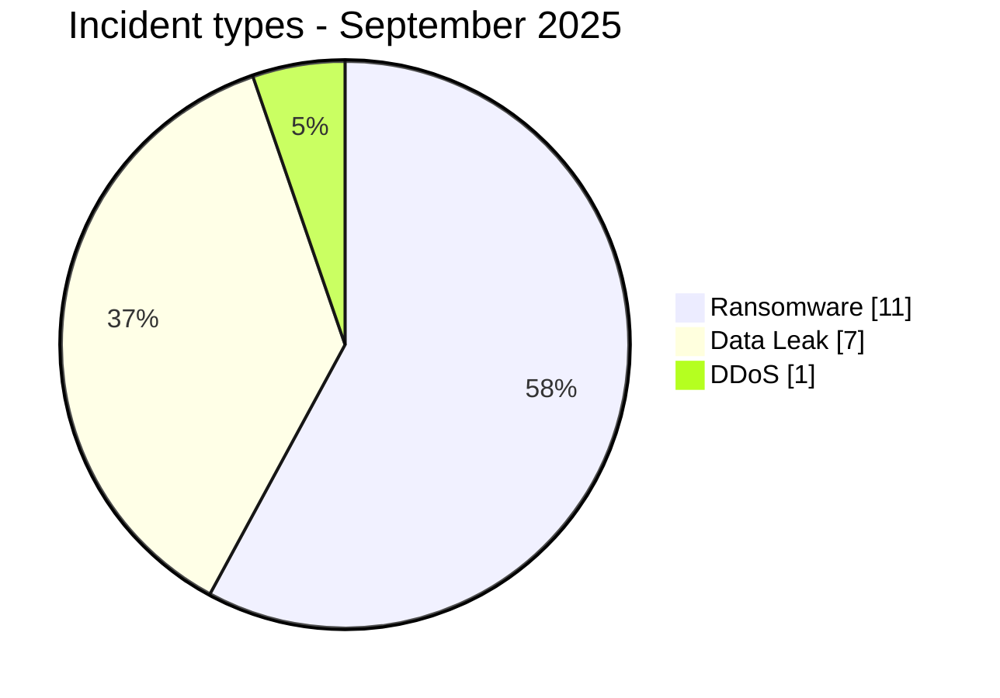
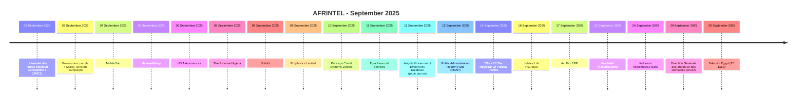

# AFRINTEL CTI Report - Cyber Threats in Africa - September 2025

👉🏾 [Version française](./README_FR.md)

   

## 1. Executive summary

In September 2025, AFRINTEL documents **19 cyber incidents** affecting organizations and digital services across **11 African countries**.

The landscape is dominated by **Ransomware with 11 records (57.9%)**, followed by **Data Leak with 7 (36.8%)**. Other observed types are DDoS 1.

Geographic concentration is significant: **Nigeria (4)**, **Morocco (3)**, **Egypt (3)** together account for **10 records, or 52.6% of the month**. This concentration reflects AFRINTEL corpus visibility rather than an exhaustive national compromise rate.

At sector level, the most represented categories are **Government / Administration (5)**, **Finance / Banking (5)**, **Not specified (2)**. The most frequent actor labels are `Not specified` (2), `TheGentlemen` (2), `killsec` (2). `Unknown`, when present, denotes missing attribution rather than a threat actor.

Evidence maturity remains variable: **17 records** are unverified claims or claims accompanied by samples. AFRINTEL maintains a strict separation between **observed facts, claims, corroboration, official confirmation, and technical unknowns**.

Compared with August, monthly volume **increases by 3 records**. The most visible changes are Ransomware 7->11 (+4), Data Leak 5->7 (+2), Access Sale 2->0 (-2).

> **Reading note:** AFRINTEL figures describe documented incidents and the visibility of observed threats. They are not an exhaustive measurement of every cyberattack that actually occurred across Africa.

### 1.1 Month-over-month comparison

| Indicator | August 2025 | September 2025 | Change |
|---|---:|---:|---:|
| Total incidents | 16 | 19 | **+3 (+18.8%)** |
| Ransomware | 7 | 11 | **+4 (+57.1%)** |
| Data Leak | 5 | 7 | **+2 (+40.0%)** |
| Access Sale | 2 | 0 | **-2 (-100.0%)** |
| DDoS | 1 | 1 | **Stable** |
| Defacement | 1 | 0 | **-1 (-100.0%)** |
| Account Takeover | 0 | 0 | **Stable** |
| System Intrusion | 0 | 0 | **Stable** |
| Malware | 0 | 0 | **Stable** |
| Operational Fraud | 0 | 0 | **Stable** |

## 2. Methodology

- **Scope:** 54 African countries; reference period: September 2025.
- **Source of truth:** validated `victims_FR.md` / `victims.md` pair.
- **Classification:** Ransomware, Data Leak, Access Sale, DDoS, Defacement, Account Takeover, System Intrusion, Malware, and Operational Fraud.
- **Counting:** one canonical record equals one documented cyber incident; cases under investigation remain outside statistics.
- **Timeline:** `Incident date` and `Initial publication date` remain separate. A later disclosure does not artificially move an incident into another month when chronology is sufficiently supported.
- **Uncertain dates:** when no exact day is known, the evidence-supported month or time window is retained.
- **Sources:** public links are retained for supplementary incidents found through OSINT/web research; they are not retroactively imposed on historical or direct Dark Web observations.
- **Evidence:** incident type, status, confidence, impact, and provenance remain separate dimensions.
- **Sectors:** normalization is calculated once from the structured corpus and used identically in FR and EN.
- **Limitation:** frequencies reflect AFRINTEL visibility rather than every real compromise on the continent.

## 3. Overview and incident types

| Indicator | Value |
|---|---:|
| Documented incidents | **19** |
| Countries represented | **11** |
| Regions represented | **5** |
| Leading country | **Nigeria (4)** |
| Leading sector | **Government / Administration (5)** |
| Leading actor label | **Not specified (2)** |

| Incident type | Records | Share |
|---|---:|---:|
| Ransomware | 11 | 57.9% |
| Data Leak | 7 | 36.8% |
| Access Sale | 0 | 0.0% |
| DDoS | 1 | 5.3% |
| Defacement | 0 | 0.0% |
| Account Takeover | 0 | 0.0% |
| System Intrusion | 0 | 0.0% |
| Malware | 0 | 0.0% |
| Operational Fraud | 0 | 0.0% |
| **Total** | **19** | **100%** |

## 4. Geographic distribution

| Country | Total | Ransomware | Data Leak | Access Sale | DDoS | Defacement | Account Takeover | System Intrusion | Malware |
|---|---:|---:|---:|---:|---:|---:|---:|---:|---:|
| Nigeria | **4** | 2 | 2 | 0 | 0 | 0 | 0 | 0 | 0 |
| Morocco | **3** | 2 | 0 | 0 | 1 | 0 | 0 | 0 | 0 |
| Egypt | **3** | 2 | 1 | 0 | 0 | 0 | 0 | 0 | 0 |
| Kenya | **2** | 2 | 0 | 0 | 0 | 0 | 0 | 0 | 0 |
| Algeria | **1** | 0 | 1 | 0 | 0 | 0 | 0 | 0 | 0 |
| Ivory Coast | **1** | 0 | 1 | 0 | 0 | 0 | 0 | 0 | 0 |
| Zimbabwe | **1** | 1 | 0 | 0 | 0 | 0 | 0 | 0 | 0 |
| Namibia | **1** | 1 | 0 | 0 | 0 | 0 | 0 | 0 | 0 |
| Angola | **1** | 0 | 1 | 0 | 0 | 0 | 0 | 0 | 0 |
| Congo (DRC) | **1** | 0 | 1 | 0 | 0 | 0 | 0 | 0 | 0 |
| Senegal | **1** | 1 | 0 | 0 | 0 | 0 | 0 | 0 | 0 |
| **Total** | **19** | **11** | **7** | **0** | **1** | **0** | **0** | **0** | **0** |

> `Operational Fraud = 0` this month; the column is omitted for readability.

## 5. Regional distribution

| Region | Records | Share |
|---|---:|---:|
| North Africa | 7 | 36.8% |
| West Africa | 6 | 31.6% |
| Southern Africa | 3 | 15.8% |
| East Africa | 2 | 10.5% |
| Central Africa | 1 | 5.3% |
| **Total** | **19** | **100%** |

The leading region is **North Africa with 7 records (36.8%)**.

## 6. Sector impact

| Sector | Records | Share | Activity |
|---|---:|---:|---|
| Government / Administration | 5 | 26.3% | █████ |
| Finance / Banking | 5 | 26.3% | █████ |
| Not specified | 2 | 10.5% | ██ |
| Manufacturing / Industry | 2 | 10.5% | ██ |
| Technology / IT | 2 | 10.5% | ██ |
| Education / University | 1 | 5.3% | █ |
| Construction / Real Estate | 1 | 5.3% | █ |
| Telecommunications | 1 | 5.3% | █ |
| **Total** | **19** | **100%** | |

## 7. Actors / groups

`Unknown` denotes missing attribution, not a threat actor.

| Actor / Group | Records | Activity |
|---|---:|---|
| Not specified | 2 | ██ |
| TheGentlemen | 2 | ██ |
| killsec | 2 | ██ |
| privilege | 2 | ██ |
| Fire Wire | 1 | █ |
| Keymous (claim) | 1 | █ |
| obscura | 1 | █ |
| Tanaka | 1 | █ |
| yurei | 1 | █ |
| radar | 1 | █ |
| qilin | 1 | █ |
| warlock | 1 | █ |
| arcusmedia | 1 | █ |
| BlackShrantac | 1 | █ |
| KILLUAX | 1 | █ |

## 8. Evidence maturity

| Evidence maturity | Records | Share |
|---|---:|---:|
| Claim - Unverified | 10 | 52.6% |
| Claim - Data Sample Published | 7 | 36.8% |
| Data Fully Published | 1 | 5.3% |
| Corroborated / Secondary evidence | 1 | 5.3% |
| **Total** | **19** | **100%** |

Evidence statuses describe the available validation level; they do not change the technical incident type.

## 9. Timeline

## 10. Monthly CTI analysis

### Ransomware

**11 records** are classified as Ransomware. Leading countries: Egypt (2), Nigeria (2), Morocco (2). A leak-site listing does not itself prove encryption or complete exfiltration.

### Data Leak

**7 records** are classified as Data Leak. Leading countries: Nigeria (2), Algeria (1), Ivory Coast (1). AFRINTEL distinguishes actually observed data from aggregate volumes claimed by actors.

### DDoS

**1 DDoS campaign(s)** are documented. Distribution: Morocco (1). Counts refer to campaigns, not necessarily every individual targeted domain.

## 11. Notable incidents

| Country | Organization | Type | Status | Impact | Confidence |
|---|---|---|---|---|---|
| Namibia | Epia Financial Services | Ransomware | Claim - Data Sample Published | Level 4 | High |
| Morocco | Government portals + Maroc Telecom (campaign) | DDoS | Claim - OSINT Availability Evidence | Level 4 | Medium |
| Egypt | MeamarGroup | Ransomware | Claim - Data Sample Published | Level 3 | Very High |
| Nigeria | MobileSub | Data Leak | Claim - Data Sample Published | Level 3 | Medium |
| Nigeria | Kolomoni Microfinance Bank | Data Leak | Claim - Data Sample Published | Level 3 | Medium |

> This table highlights up to five records using structured impact, confirmation, and confidence fields. It is not an absolute severity ranking.

## 12. Key findings and intelligence gaps

- **Geographic concentration:** Nigeria accounts for 4 records (21.1%), followed by Morocco (3) and Egypt (3).
- **Threat structure:** Ransomware is the leading type with 11 records, followed by Data Leak (7).
- **Sectors:** Government / Administration (5) and Finance / Banking (5) have the highest visibility.
- **Actors:** the most frequent labels are Not specified (2), TheGentlemen (2), and killsec (2).
- **Evidence:** 17 records rely on unverified claims or claims with a published sample; these statuses do not equal complete technical confirmation.

### Intelligence gaps

- initial-access vector often not public;
- exact technical compromise date sometimes unknown;
- claimed volumes rarely fully verifiable;
- technical attribution often limited to a publication handle or label;
- public remediation, root-cause, and DFIR conclusions remain limited.

These gaps should guide collection rather than be replaced with assumptions.

## 13. Recommendations

### Organizations

- enforce phishing-resistant MFA on privileged accounts, VPN, email, social media, and administration consoles;
- apply PAM, least privilege, segmentation, and secret rotation;
- maintain immutable backups and test restoration;
- strengthen public applications, APIs, and administration interfaces;
- formalize incident response and data-breach notification.

### SOC and detection

- monitor abnormal authentication, MFA changes, privileged-account creation, and role elevation;
- detect mass database reads, unusual exports, archive creation, and large outbound transfers;
- correlate EDR, IAM, VPN, WAF, proxy, DNS, cloud, and application logs;
- distinguish DDoS, internal intrusion, account compromise, and data exposure to avoid unsupported conclusions.

### CTI

- keep incident date, initial publication, first observation, sample, disclosure, and confirmation separate;
- track republication and resale without automatically counting them as new compromise;
- preserve the evidence hierarchy between claim, corroboration, and confirmation;
- validate FR/EN parity before generating statistics.

## 14. Conclusion

**September 2025** contains **19 documented cyber incidents** across **11 African countries**. The monthly CTI value lies not only in volume but in separating **incident type, timeline, evidence level, geography, sector, and actor**.

The report therefore preserves a structured picture of the observable threat environment while keeping claims, corroboration, confirmations, and unknowns at their actual evidence level.

👉🏾 [See monthly victims](./victims.md)

**AFRINTEL** - TLP:CLEAR
