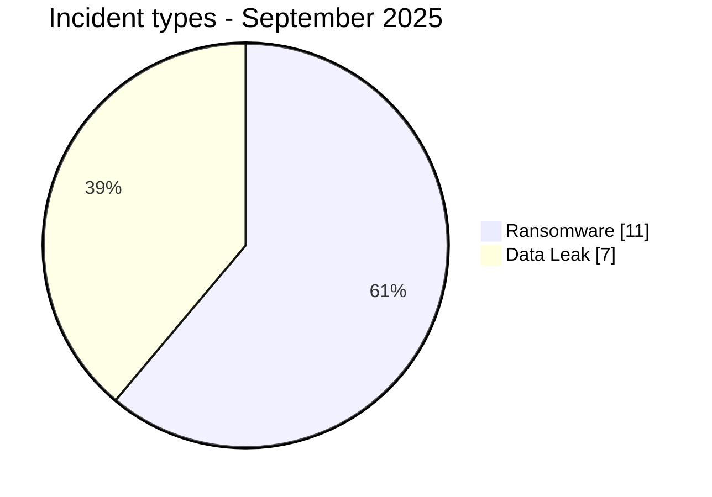
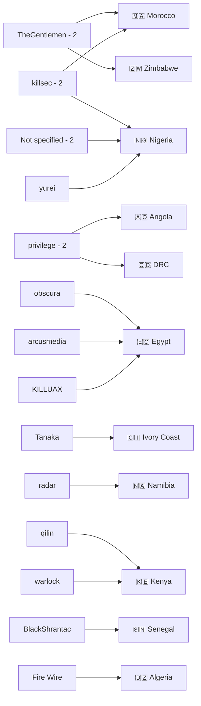
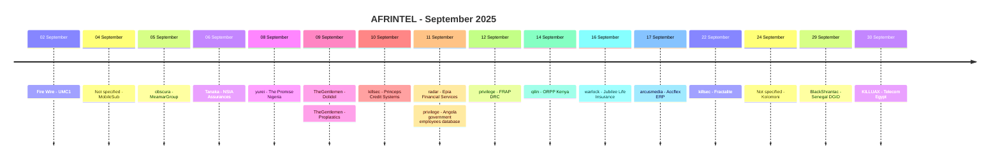

# CTI Report - Cyberattacks in Africa - September 2025

👉🏾 [**French version available here**](./README_FR.md)

## 1. Executive summary

September 2025 contains **18 documented incidents across 11 African countries**: **11 Ransomware** and **7 Data Leak**. No Access Sale, DDoS, Defacement or Operational Fraud is recorded.

- **Nigeria**: 4 incidents, including 2 Ransomware and 2 Data Leak.
- **Egypt**: 3 incidents, including 2 Ransomware and 1 Data Leak.
- **Morocco** and **Kenya**: 2 Ransomware each.
- **TheGentlemen, killsec, privilege and Not specified** each account for 2 records.
- **Finance / Banking / Insurance** is the leading harmonized sector with 6 incidents.
- UMC1: more than 10 GB claimed, not fully collected by AFRINTEL.
- MobileSub: local SQL dump of about 14.3 MB, 42 tables and 306 INSERT blocks.
- NSIA Assurances: more than 2.5 million records claimed, without collection of the full dataset.
- Epia Financial Services: 73 files totaling about 79.8 MB, including pension-fund data and email.
- Kolomoni Microfinance Bank: CSV with 37,825 rows and 12 columns.
- Senegal DGID: 1 TB claimed, without collection or validation of the underlying dataset.

### 📋 Victim list

👉🏾 [View the full victim list](./victims.md)

### 1.1 Month-over-month comparison

| Indicator | August 2025 | September 2025 | Observed change |
|---|---:|---:|---:|
| Total incidents | 13 | 18 | **+5 (+38.5%)** |
| Ransomware | 7 | 11 | **+4 (+57.1%)** |
| Data Leak | 5 | 7 | **+2 (+40.0%)** |
| Access Sale | 1 | 0 | **-1 (-100.0%)** |
| DDoS | 0 | 0 | **0 (stable)** |
| Defacement | 0 | 0 | **0 (stable)** |
| Operational Fraud | 0 | 0 | **0 (stable)** |

## 2. Methodology

- **Scope**: 54 African countries.
- **Period**: 1-30 September 2025.
- **Sources**: OSINT, leak sites, underground forums, actor publications and available samples.
- **Source of truth**: validated `victims_FR.md` / `victims.md` pair.
- **Counting**: one card equals one unique incident.
- **Taxonomy**: Ransomware, Data Leak, Access Sale, DDoS, Defacement, Operational Fraud.
- **Qualification**: actor claims, samples, full publication and technical confirmation remain distinct.

## 3. Global overview

### 3.1 Incident-type distribution

| Incident type | Count | Share |
|---|---:|---:|
| Ransomware | 11 | 61.1% |
| Data Leak | 7 | 38.9% |
| Access Sale | 0 | 0.0% |
| DDoS | 0 | 0.0% |
| Defacement | 0 | 0.0% |
| Operational Fraud | 0 | 0.0% |
| **Total** | **18** | **100%** |

### 3.2 Country distribution

| Country | Ransomware | Data Leak | Total | Distribution |
|---|---:|---:|---:|---|
| 🇳🇬 Nigeria | 2 | 2 | 4 | 🟧🟧🟦🟦 |
| 🇪🇬 Egypt | 2 | 1 | 3 | 🟧🟧🟦 |
| 🇲🇦 Morocco | 2 | 0 | 2 | 🟧🟧 |
| 🇰🇪 Kenya | 2 | 0 | 2 | 🟧🟧 |
| 🇩🇿 Algeria | 0 | 1 | 1 | 🟦 |
| 🇨🇮 Ivory Coast | 0 | 1 | 1 | 🟦 |
| 🇿🇼 Zimbabwe | 1 | 0 | 1 | 🟧 |
| 🇳🇦 Namibia | 1 | 0 | 1 | 🟧 |
| 🇦🇴 Angola | 0 | 1 | 1 | 🟦 |
| 🇨🇩 DRC | 0 | 1 | 1 | 🟦 |
| 🇸🇳 Senegal | 1 | 0 | 1 | 🟧 |
| **Total** | **11** | **7** | **18** | |

### 3.3 Regional distribution

| Region | Incidents | Share | Activity |
|---|---:|---:|---|
| North Africa | 6 | 33.3% | ██████████ |
| West Africa | 6 | 33.3% | ██████████ |
| Southern Africa | 2 | 11.1% | ███ |
| Central Africa | 2 | 11.1% | ███ |
| East Africa | 2 | 11.1% | ███ |
| **Total** | **18** | **100%** | |

### 3.4 Harmonized sector distribution

| Sector | Incidents | Share | Activity |
|---|---:|---:|---|
| Finance / Banking / Insurance | 6 | 33.3% | ██████████ |
| Government / Administration | 4 | 22.2% | ███████ |
| Technology / IT / Telecommunications | 3 | 16.7% | █████ |
| Manufacturing / Industry | 2 | 11.1% | ███ |
| Education / Higher Education | 1 | 5.6% | ██ |
| Real Estate / Construction / Engineering | 1 | 5.6% | ██ |
| Food Services / Catering | 1 | 5.6% | ██ |
| **Total** | **18** | **100%** | |

### 3.5 Actors / groups

| Actor / Group | Incidents | Activity |
|---|---:|---|
| Not specified | 2 | ██████████ |
| privilege | 2 | ██████████ |
| killsec | 2 | ██████████ |
| TheGentlemen | 2 | ██████████ |
| arcusmedia | 1 | █████ |
| BlackShrantac | 1 | █████ |
| Fire Wire | 1 | █████ |
| KILLUAX | 1 | █████ |
| obscura | 1 | █████ |
| qilin | 1 | █████ |
| radar | 1 | █████ |
| Tanaka | 1 | █████ |
| warlock | 1 | █████ |
| yurei | 1 | █████ |
| **Total** | **18** | |

### 3.6 Actor -> country mapping

## 4. Detailed analysis

### 4.1 Ransomware - 11 incidents

The Ransomware records are MeamarGroup, The Promise Nigeria, Dolidol, Proplastics Limited, Princeps Credit Systems Limited, Epia Financial Services, Office of the Registrar of Political Parties, Jubilee Life Insurance, Accflex ERP, Fractalite and Senegal DGID.

The most substantial reviewed evidence includes a 491-file/directory MeamarGroup server archive, 63 local Proplastics files and a 73-file Epia set totaling about 79.8 MB.

### 4.2 Data Leak - 7 incidents

The Data Leak records concern UMC1, MobileSub, NSIA Assurances, the Angola government-employee database, FRAP DRC, Kolomoni Microfinance Bank and Telecom Egypt.

Claimed volumes remain separate from observed evidence. UMC1 claims more than 10 GB, NSIA more than 2.5 million records, FRAP describes 1,136 accounts, Kolomoni contains 37,825 rows and Telecom Egypt has only a 36-record reviewed sample.

### 4.3 Access Sale - 0 incidents

No September 2025 card is classified as Access Sale.

## 5. Sectoral impact

**Finance / Banking / Insurance** accounts for **6 of 18 incidents (33.3%)**. **Government / Administration** accounts for 4, **Technology / IT / Telecommunications** 3 and **Manufacturing / Industry** 2. Education, real estate/construction and food services each account for 1.

## 6. Threat actor profile

TheGentlemen, killsec, privilege and Not specified each account for 2 records. `privilege` was normalized as the actor name for both Angola and FRAP. `Not specified` covers MobileSub and Kolomoni, where no actor is provided.

## 7. Trends and intelligence gaps

- Total: **13 -> 18**, +38.5%.
- Ransomware: **7 -> 11**, +57.1%.
- Data Leak: **5 -> 7**, +40.0%.
- Access Sale: **1 -> 0**.
- Nigeria leads with 4 incidents.
- North Africa and West Africa each account for 6 incidents.

Initial-access vectors remain unknown for most records. The 10 GB UMC1, 2.5 million NSIA and 1 TB DGID figures are unvalidated actor claims. The full FRAP file hosted externally was not validated by AFRINTEL.

## 8. Timeline

## 9. Contextual MITRE ATT&CK mapping

| Phase | Technique | Scope |
|---|---|---|
| Collection | T1005 - Data from Local System | Observed or described files, exports and archives. |
| Collection | T1213 - Data from Information Repositories | Structured MobileSub, Angola, FRAP, Kolomoni and Telecom Egypt datasets. |
| Email | T1114 - Email Collection | Relevant context for Epia, where exfiltrated email material was reviewed. |

## 10. Recommendations

- Strengthen phishing-resistant MFA, PAM, segmentation and export logging.
- Monitor privileged accounts, database access, outbound transfers and archive creation.
- Protect ERP systems, business applications, backups and service accounts.
- For finance and public-sector environments, prioritize bulk-export and sensitive-data access detection.

## 11. Conclusion

September 2025 contains **18 incidents across 11 countries**, split into **11 Ransomware and 7 Data Leak**. Nigeria is the most represented country with 4 incidents. Finance / Banking / Insurance is the leading harmonized sector with 6 incidents.

**AFRINTEL** - Open African CTI Monitoring Initiative
