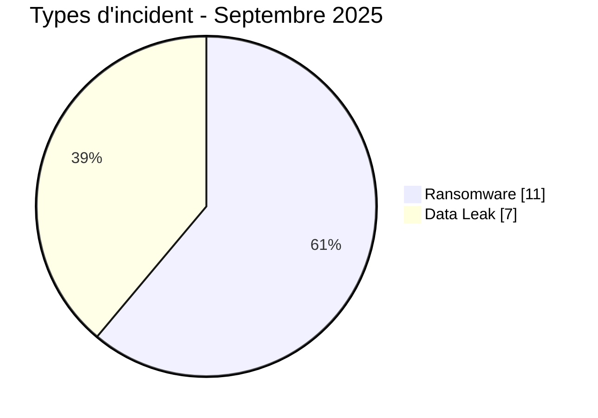
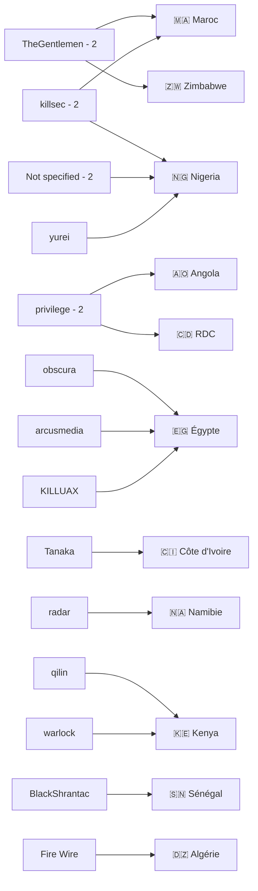
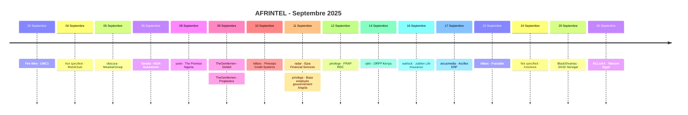

# Rapport CTI - Cyberattaques en Afrique - Septembre 2025

👉🏾 [**English version available here**](./README.md)

## 1. Synthèse exécutive

Septembre 2025 compte **18 incidents documentés dans 11 pays africains** : **11 Ransomware** et **7 Data Leak**. Aucun Access Sale, DDoS, Defacement ou Operational Fraud n'est enregistré.

- **Nigeria** : 4 incidents, dont 2 Ransomware et 2 Data Leak.
- **Égypte** : 3 incidents, dont 2 Ransomware et 1 Data Leak.
- **Maroc** et **Kenya** : 2 Ransomware chacun.
- **TheGentlemen, killsec, privilege et Not specified** comptent 2 fiches chacun.
- **Finance / Banque / Assurance** est le premier secteur harmonisé avec 6 incidents.
- UMC1 : plus de 10 Go revendiqués, non collectés intégralement par AFRINTEL.
- MobileSub : dump SQL d'environ 14,3 Mo, 42 tables et 306 blocs INSERT.
- NSIA Assurances : plus de 2,5 millions d'enregistrements revendiqués, non collectés.
- Epia Financial Services : 73 fichiers, environ 79,8 Mo, avec données de fonds de pension et messagerie.
- Kolomoni Microfinance Bank : CSV de 37 825 lignes et 12 colonnes.
- DGID Sénégal : 1 To revendiqué, sans collecte ni validation du jeu sous-jacent.

### 📋 Liste des victimes

👉🏾 [Voir la liste complète des victimes](./victims_FR.md)

### 1.1 Comparaison avec le mois précédent

| Indicateur | Août 2025 | Septembre 2025 | Évolution observée |
|---|---:|---:|---:|
| Total incidents | 13 | 18 | **+5 (+38,5 %)** |
| Ransomware | 7 | 11 | **+4 (+57,1 %)** |
| Data Leak | 5 | 7 | **+2 (+40,0 %)** |
| Access Sale | 1 | 0 | **-1 (-100,0 %)** |
| DDoS | 0 | 0 | **0 (stable)** |
| Defacement | 0 | 0 | **0 (stable)** |
| Operational Fraud | 0 | 0 | **0 (stable)** |

## 2. Méthodologie

- **Périmètre** : 54 pays africains.
- **Période** : 1er au 30 septembre 2025.
- **Sources** : OSINT, leak sites, forums underground, publications d'acteurs et échantillons disponibles.
- **Source de vérité** : couple validé `victims_FR.md` / `victims.md`.
- **Comptage** : une fiche correspond à un incident unique.
- **Taxonomie** : Ransomware, Data Leak, Access Sale, DDoS, Defacement, Operational Fraud.
- **Qualification** : revendication, échantillon, publication complète et confirmation technique restent distincts.

## 3. Vue d'ensemble

### 3.1 Répartition par type d'incident

| Type d'incident | Nombre | Part |
|---|---:|---:|
| Ransomware | 11 | 61,1 % |
| Data Leak | 7 | 38,9 % |
| Access Sale | 0 | 0,0 % |
| DDoS | 0 | 0,0 % |
| Defacement | 0 | 0,0 % |
| Operational Fraud | 0 | 0,0 % |
| **Total** | **18** | **100 %** |

### 3.2 Répartition par pays

| Pays | Ransomware | Data Leak | Total | Distribution |
|---|---:|---:|---:|---|
| 🇳🇬 Nigeria | 2 | 2 | 4 | 🟧🟧🟦🟦 |
| 🇪🇬 Égypte | 2 | 1 | 3 | 🟧🟧🟦 |
| 🇲🇦 Maroc | 2 | 0 | 2 | 🟧🟧 |
| 🇰🇪 Kenya | 2 | 0 | 2 | 🟧🟧 |
| 🇩🇿 Algérie | 0 | 1 | 1 | 🟦 |
| 🇨🇮 Côte d'Ivoire | 0 | 1 | 1 | 🟦 |
| 🇿🇼 Zimbabwe | 1 | 0 | 1 | 🟧 |
| 🇳🇦 Namibie | 1 | 0 | 1 | 🟧 |
| 🇦🇴 Angola | 0 | 1 | 1 | 🟦 |
| 🇨🇩 RDC | 0 | 1 | 1 | 🟦 |
| 🇸🇳 Sénégal | 1 | 0 | 1 | 🟧 |
| **Total** | **11** | **7** | **18** | |

### 3.3 Répartition par région

| Région | Incidents | Part | Activité |
|---|---:|---:|---|
| Afrique du Nord | 6 | 33,3 % | ██████████ |
| Afrique de l'Ouest | 6 | 33,3 % | ██████████ |
| Afrique australe | 2 | 11,1 % | ███ |
| Afrique centrale | 2 | 11,1 % | ███ |
| Afrique de l'Est | 2 | 11,1 % | ███ |
| **Total** | **18** | **100 %** | |

### 3.4 Répartition sectorielle harmonisée

| Secteur | Incidents | Part | Activité |
|---|---:|---:|---|
| Finance / Banque / Assurance | 6 | 33,3 % | ██████████ |
| Gouvernement / Administration | 4 | 22,2 % | ███████ |
| Technologie / IT / Télécommunications | 3 | 16,7 % | █████ |
| Industrie / Fabrication | 2 | 11,1 % | ███ |
| Éducation / Enseignement supérieur | 1 | 5,6 % | ██ |
| Immobilier / Construction / Ingénierie | 1 | 5,6 % | ██ |
| Restauration / Services alimentaires | 1 | 5,6 % | ██ |
| **Total** | **18** | **100 %** | |

### 3.5 Acteurs / groupes

| Acteur / Groupe | Incidents | Activité |
|---|---:|---|
| Not specified | 2 | ██████████ |
| privilege | 2 | ██████████ |
| killsec | 2 | ██████████ |
| TheGentlemen | 2 | ██████████ |
| arcusmedia | 1 | █████ |
| BlackShrantac | 1 | █████ |
| Fire Wire | 1 | █████ |
| KILLUAX | 1 | █████ |
| obscura | 1 | █████ |
| qilin | 1 | █████ |
| radar | 1 | █████ |
| Tanaka | 1 | █████ |
| warlock | 1 | █████ |
| yurei | 1 | █████ |
| **Total** | **18** | |

### 3.6 Cartographie acteurs -> pays

## 4. Analyse détaillée

### 4.1 Ransomware - 11 incidents

MeamarGroup, The Promise Nigeria, Dolidol, Proplastics Limited, Princeps Credit Systems Limited, Epia Financial Services, Office of the Registrar of Political Parties, Jubilee Life Insurance, Accflex ERP, Fractalite et DGID Sénégal constituent les 11 fiches Ransomware.

Les dossiers disposant des éléments les plus substantiels sont notamment MeamarGroup, Proplastics et Epia. Pour MeamarGroup, une archive serveur de 491 fichiers et dossiers a été examinée. Proplastics dispose de 63 fichiers locaux. Epia comprend 73 fichiers pour environ 79,8 Mo et plusieurs milliers de lignes de données de fonds de pension.

### 4.2 Data Leak - 7 incidents

Les Data Leak concernent UMC1, MobileSub, NSIA Assurances, la base des employés du gouvernement angolais, FRAP RDC, Kolomoni Microfinance Bank et Telecom Egypt.

Les volumes annoncés doivent rester distingués des volumes réellement observés. UMC1 annonce plus de 10 Go ; NSIA plus de 2,5 millions d'enregistrements ; FRAP décrit 1 136 comptes ; Kolomoni contient 37 825 lignes ; Telecom Egypt ne dispose que d'un échantillon de 36 enregistrements.

### 4.3 Access Sale - 0 incident

Aucune fiche de septembre 2025 n'est classée Access Sale.

## 5. Impact sectoriel

**Finance / Banque / Assurance** concentre **6 incidents sur 18 (33,3 %)**. **Gouvernement / Administration** en compte 4, **Technologie / IT / Télécommunications** 3 et **Industrie / Fabrication** 2. Les secteurs Éducation, Immobilier / Construction et Restauration comptent chacun 1 incident.

## 6. Profil des acteurs

TheGentlemen, killsec, privilege et Not specified comptent 2 fiches chacun. `privilege` a été normalisé comme nom d'acteur sur les deux dossiers Angola et FRAP. `Not specified` correspond aux deux dossiers où aucun acteur n'est fourni : MobileSub et Kolomoni.

## 7. Tendances et lacunes de renseignement

- Total : **13 -> 18**, soit +38,5 %.
- Ransomware : **7 -> 11**, soit +57,1 %.
- Data Leak : **5 -> 7**, soit +40,0 %.
- Access Sale : **1 -> 0**.
- Nigeria arrive en tête avec 4 incidents.
- Afrique du Nord et Afrique de l'Ouest comptent 6 incidents chacune.

Les vecteurs initiaux restent inconnus pour la majorité des dossiers. Les chiffres de 10 Go pour UMC1, 2,5 millions de lignes pour NSIA et 1 To pour DGID sont des revendications non validées intégralement. Le fichier FRAP complet proposé via hébergement externe n'a pas été validé par AFRINTEL.

## 8. Chronologie

## 9. MITRE ATT&CK contextuel

| Phase | Technique | Portée |
|---|---|---|
| Collecte | T1005 - Data from Local System | Fichiers, exports et archives observés ou décrits. |
| Collecte | T1213 - Data from Information Repositories | Bases structurées MobileSub, Angola, FRAP, Kolomoni et Telecom Egypt. |
| Messagerie | T1114 - Email Collection | Contexte pertinent pour Epia, où de la messagerie exfiltrée a été examinée. |

## 10. Recommandations

- Renforcer MFA, PAM, segmentation et journalisation des exports.
- Surveiller les comptes privilégiés, accès aux bases, transferts sortants et créations d'archives.
- Protéger les ERP, applications métiers, sauvegardes et comptes de service.
- Pour les secteurs finance et public, prioriser la détection des exports massifs et l'accès anormal aux données sensibles.

## 11. Conclusion

Septembre 2025 compte **18 incidents dans 11 pays**, répartis entre **11 Ransomware et 7 Data Leak**. Le Nigeria est le pays le plus représenté avec 4 incidents. Finance / Banque / Assurance est le premier secteur harmonisé avec 6 incidents.

**AFRINTEL** - Initiative ouverte de veille CTI sur l'Afrique
