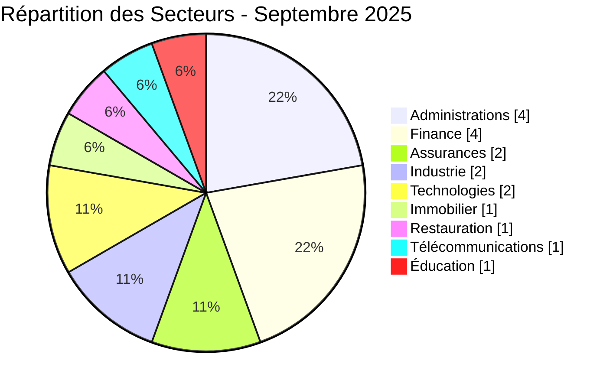
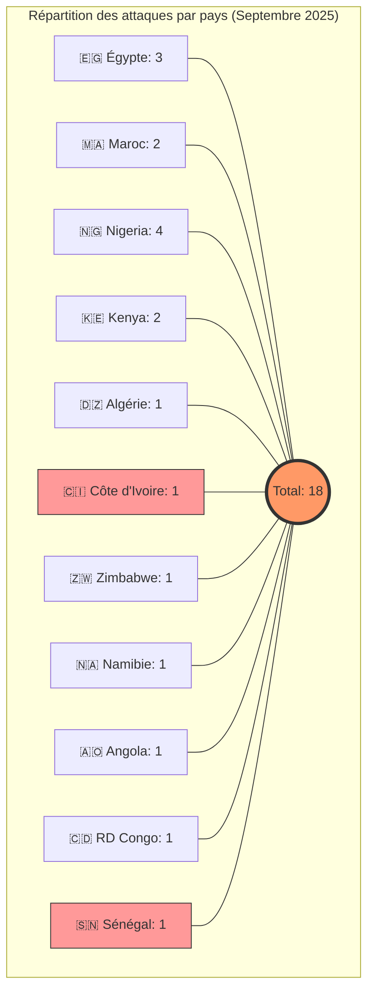
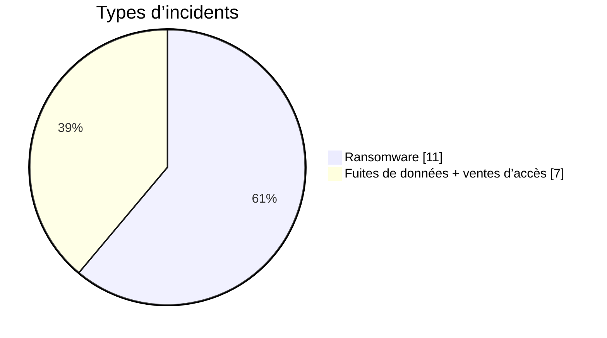
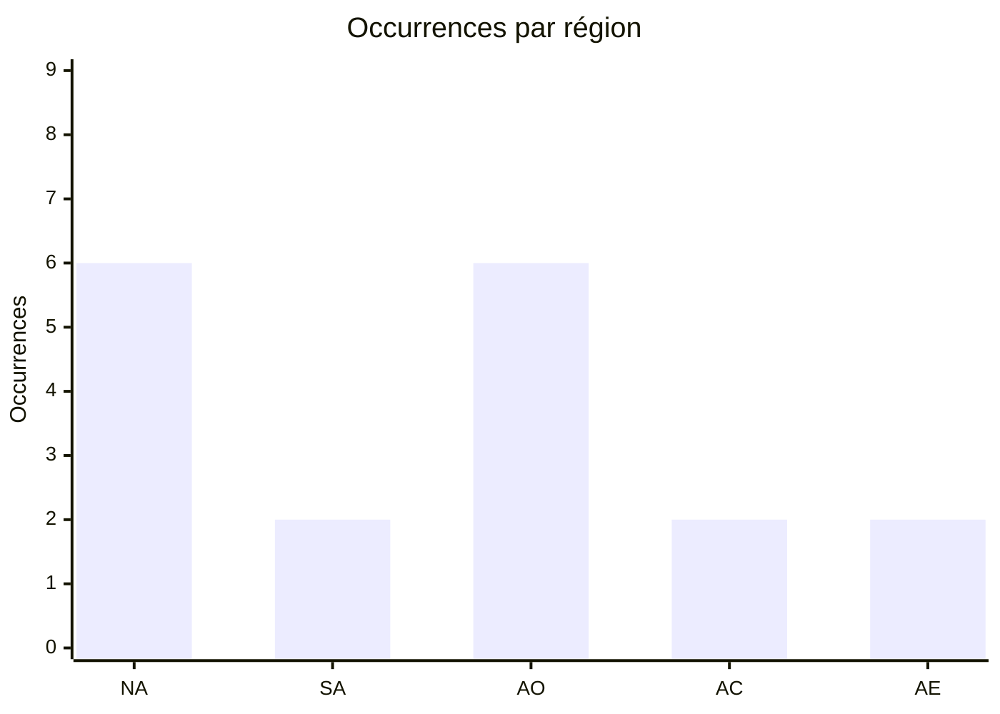

 

# 🛡️ AFRINTEL | Rapport CTI : Cyberattaques en Afrique

## 1. Résumé exécutif
* **Nombre total d'attaques recensées :** 18.
* **Acteurs les plus actifs :** `TheGentlemen` (2 attaques), `killsec` (2 attaques) et `privilege` (2 attaques).
* **Secteurs les plus ciblés :** Administrations publiques, Finance, Assurances, Industrie, Technologies, Télécommunications et Éducation.
* **Volumes de données critiques :** * **Direction Générale des Impôts et des Domaines (Sénégal) :** 1 To de données fiscales exfiltrées.
    * **NSIA Assurances (Côte d'Ivoire) :** 2,5 millions d'enregistrements transactionnels mis en vente.
    * **Université des Frères Mentouri Constantine 1 (Algérie) :** plus de 10 Go de données académiques et personnelles revendiquées exfiltrées.
    * **MobileSub (Nigeria) :** dump SQL de 42 tables couvrant les paiements, la KYC, les transactions et les comptes utilisateurs.
    * **Kolomoni Microfinance Bank (Nigeria) :** fichier CSV de 37 825 lignes contenant des données financières, de contact, démographiques et de connexion.

---

## 2. Méthodologie
Ce rapport de **Cyber Threat Intelligence (CTI)** présente une analyse détaillée des cyberattaques survenues en Afrique durant le mois de septembre 2025. Les informations sont issues de sources **OSINT** et de sites de fuites de groupes ransomware, compilées dans le cadre du projet **AFRINTEL**. L'objectif est de fournir une vision claire des tendances, des acteurs menaçants et des secteurs ciblés sur le continent.

## 3. Vue d'ensemble

### 📊 3.1 Répartition par groupe/acteur
| Groupe / Acteur | Nombre d'attaques |
| :--- | :---: |
| **TheGentlemen** | 2 |
| **killsec** | 2 |
| **privilege** | 2 |
| **obscura** | 1 |
| **Tanaka** | 1 |
| **yurei** | 1 |
| **radar** | 1 |
| **qilin** | 1 |
| **warlock** | 1 |
| **arcusmedia** | 1 |
| **blackshrantac** | 1 |
| **KILLUAX** | 1 |
| **Fire Wire** | 1 |
| **Non précisé** | 2 |

### 🏗️ 3.2 Répartition par secteur d'activité
| Secteur | Nombre d'attaques |
| :--- | :---: |
| Administrations publiques | 4 |
| Finance | 4 |
| Assurances | 2 |
| Industrie manufacturière | 2 |
| Technologies | 2 |
| Immobilier / Construction | 1 |
| Restauration / Services alimentaires | 1 |
| Télécommunications | 1 |
| Éducation | 1 |

#### 3.2.1 Top secteurs ciblés
- Finance/Assurances  	[████████████████████] 4
- Administrations     	[████████████████████] 4
- Industrie           	[██████████] 2
- Technologies        	[██████████] 2
- Télécommunications  	[█████] 1
- Éducation           	[█████] 1
- Immobilier / Restauration              	[██████████] 2

 
### 🌍 3.3 Répartition par pays
| Pays | Nombre d'attaques |
| :--- | :---: |
| 🇪🇬 Égypte | 3 |
| 🇲🇦 Maroc | 2 |
| 🇳🇬 Nigeria | 4 |
| 🇰🇪 Kenya | 2 |
| 🇩🇿 Algérie | 1 |
| 🇨🇮 Côte d'Ivoire | 1 |
| 🇿🇼 Zimbabwe | 1 |
| 🇳🇦 Namibie | 1 |
| 🇦🇴 Angola | 1 |
| 🇨🇩 RD Congo | 1 |
| 🇸🇳 Sénégal | 1 |
| **Total** | **18** |

---

<!-- AFRINTEL_CURRENT_MODEL_START -->
### 3.4 Vue globale standardisée

| Pays | Ransomware | Exposition des données (fuites + accès) | Total | Distribution |
| :--- | ---: | ---: | ---: | :--- |
| 🇳🇬 Nigeria | 2 | 2 | 4 | 🟧🟧 🟦🟦 |
| 🇪🇬 Égypte | 2 | 1 | 3 | 🟧🟧 🟦 |
| 🇰🇪 Kenya | 2 | 0 | 2 | 🟧🟧 |
| 🇲🇦 Maroc | 2 | 0 | 2 | 🟧🟧 |
| 🇩🇿 Algérie | 0 | 1 | 1 |  🟦 |
| 🇦🇴 Angola | 0 | 1 | 1 |  🟦 |
| 🇨🇩 RDC | 0 | 1 | 1 |  🟦 |
| 🇨🇮 Côte d’Ivoire | 0 | 1 | 1 |  🟦 |
| 🇳🇦 Namibie | 1 | 0 | 1 | 🟧 |
| 🇸🇳 Sénégal | 1 | 0 | 1 | 🟧 |
| 🇿🇼 Zimbabwe | 1 | 0 | 1 | 🟧 |

### Vue agrégée mensuelle de l’exposition

La vue CTI mensuelle regroupe les fuites de données et les ventes d’accès sous **exposition des données** : **7 fiches** (38,9% du corpus mensuel). Les fiches sources restent la référence ; une vente d’accès ne prouve pas à elle seule l’exfiltration de données.

### Répartition géographique par région

| Région | Occurrences | Ransomware | Exposition des données (fuites + accès) | Distribution |
| :--- | ---: | ---: | ---: | :--- |
| Afrique du Nord | 6 | 4 | 2 | 🟧🟧🟧🟧 🟦🟦 |
| Afrique australe | 2 | 2 | 0 | 🟧🟧 |
| Afrique de l’Ouest | 6 | 3 | 3 | 🟧🟧🟧 🟦🟦🟦 |
| Afrique centrale | 2 | 0 | 2 | 🟦🟦 |
| Afrique de l’Est | 2 | 2 | 0 | 🟧🟧 |

Légende : NA = Afrique du Nord ; SA = Afrique australe ; AO = Afrique de l’Ouest ; AC = Afrique centrale ; AE = Afrique de l’Est

### Répartition sectorielle

| Secteur | Fiches | Part | Activité |
| :--- | ---: | ---: | :--- |
| Finance / banque | 5 | 27,8% | ██████████ |
| Gouvernement / administration | 5 | 27,8% | ██████████ |
| Technologies / informatique | 4 | 22,2% | ████████ |
| Industrie / fabrication | 2 | 11,1% | ████ |
| Éducation / universités | 1 | 5,6% | ██ |
| Services professionnels | 1 | 5,6% | ██ |

### Acteurs / groupes les plus présents

| Acteur / Groupe | Fiches | Activité |
| :--- | ---: | :--- |
| Not specified | 2 | ██████████ |
| killsec | 2 | ██████████ |
| TheGentlemen | 2 | ██████████ |
| Fire Wire | 1 | █████ |
| KILLUAX | 1 | █████ |
| Tanaka | 1 | █████ |
| arcusmedia | 1 | █████ |
| blackshrantac | 1 | █████ |
| obscura | 1 | █████ |
| privilege | 1 | █████ |
<!-- AFRINTEL_CURRENT_MODEL_END -->

### Comparaison avec le mois précédent

À partir des fiches incidents validées comme source de comptage, septembre 2025 compte **18** incidents contre **13** le mois précédent (une hausse de **+5** ; **+38.5%**). Cette comparaison décrit les publications enregistrées par AFRINTEL et ne prouve pas à elle seule une évolution de l'activité des attaquants ni un impact confirmé sur les victimes.

| Indicateur | Mois précédent | Mois en cours | Variation |
|---|---:|---:|---:|
| Fiches incidents enregistrées | 13 | 18 | +5 (+38.5%) |

## 4. Analyse détaillée par type d'incident

## 5. Impact sectoriel

## 6. Profil des acteurs
### 6.1 Profil des acteurs

Les comptages d'acteurs et de sources restent ceux documentés en section 3 et dans les fiches victimes sources. L'attribution est conservée uniquement au niveau étayé par les éléments publics.

### 6.2 Évaluation du risque

Les pays et secteurs présentant plusieurs fiches ou des fonctions publiques, éducatives, sanitaires, financières ou critiques doivent faire l'objet d'une validation prioritaire. Il s'agit d'un signal de priorisation OSINT, et non d'une confirmation de compromission ou d'impact.

## 7. Tendances et lacunes de renseignement
### 7.1 Tendances observées

Les répartitions par pays, secteur, acteur et type d'incident présentées ci-dessus constituent les tendances traçables du mois. Elles décrivent le corpus surveillé et n'établissent pas une campagne plus large sans éléments indépendants.

### 7.2 Lacunes de renseignement

Les rapports disponibles ne permettent pas d'établir pour chaque revendication le vecteur d'accès initial, l'exfiltration complète, la confirmation par la victime, la chronologie de remédiation ou l'impact opérationnel. Aucun détail DFIR public n'est inclus dans le corpus consulté pour cette fiche mensuelle ; cette absence est limitée aux sources examinées.

## 8. Cartographie MITRE ATT&CK (contextuelle)
| Phase | ID technique | Nom | Association à l'incident |
|---|---|---|---|
| Collecte | T1005 | Data from Local System | Correspondance contextuelle pour une collecte ou exposition revendiquée ; la méthode n'est pas confirmée. |
| Collecte | T1213 | Data from Information Repositories | Correspondance contextuelle pour les dossiers ou référentiels décrits publiquement ; la méthode n'est pas confirmée. |

Ces correspondances ATT&CK sont contextuelles et défensives. Elles ne prouvent pas qu'un acteur donné a utilisé la technique.

### Contextual observations
* **Exfiltration Massive :** Capacité à collecter et exfiltrer des volumes dépassant le téraoctet (DGID) ou des millions de lignes de données (NSIA).
* **Double Extorsion & Monétisation :** Mise en vente systématique des données sur des forums clandestins pour forcer le paiement (ex: Tanaka).
* **Ciblage d'Infrastructures d'État :** Recrudescence des attaques contre les organismes de régulation et les ministères financiers.
* **Agilité Géo-Opérationnelle :** Capacité de certains groupes à mener des attaques simultanées dans différentes régions du continent (ex: TheGentlemen).

## 9. Recommandations
1.  **Gouvernance des Données :** Pour les administrations publiques, prioriser le chiffrement des bases de données sensibles et les sauvegardes hors ligne.
2.  **Segmentation Réseau :** Isoler les systèmes de gestion de paie et les registres clients des réseaux exposés à Internet.
3.  **Hygiène Cyber :** Généralisation de l'authentification multi-facteurs (MFA) et audits réguliers des accès tiers (VPN/ERP).

---

## 10. Recommandations SOC et tactiques
### Observé

Les sources publiques documentent des revendications, des publications ou du matériel exposé. Elles ne fournissent pas à elles seules une télémétrie prouvant une technique ou une compromission active.

### Hypothèses

L'abus d'identifiants, un stockage exposé, des contrôles d'accès faibles ou des privilèges d'export excessifs peuvent expliquer certaines expositions, mais chaque hypothèse doit être vérifiée par l'organisation concernée.

### Préventif

Surveiller les journaux d'identité, VPN, cloud, bases de données, messagerie et transferts sortants. Imposer une MFA résistante au phishing, le moindre privilège, la segmentation, des sauvegardes testées et la révocation rapide des jetons ou identifiants.

## 11. Recommandations stratégiques
1. **Risques observés :** prioriser la validation des organisations, secteurs et types de données documentés dans le corpus mensuel.
2. **Hypothèses :** tester les chemins possibles liés aux identifiants, au stockage cloud et aux exports excessifs sans les présenter comme des faits établis.
3. **Socle préventif :** maintenir l'inventaire des actifs, la classification des données, les exercices de réponse, les plans de reprise et les procédures coordonnées de sécurité, de droit et de protection des données.

## 12. Conclusion
Le mois de septembre 2025 confirme que l'Afrique est un terrain d'opération majeur pour les groupes ransomware et les acteurs de fuite de données. La diversité des acteurs (11 groupes nommés et un cas de fuite non attribué) et l'ampleur des exfiltrations (DGID, NSIA, UMC1) appellent à une vigilance accrue et à un partage d'intelligence (CTI) renforcé entre les pays du continent.

---

### ✍🏿 Auteur
**Adama ASSIONGBON**
*Consultant SOC & Cyber Threat Intelligence*
[LinkedIn Profile](https://www.linkedin.com/in/adama-assiongbon/)

---
*Initiative ouverte de veille CTI sur l’Afrique - AFRINTEL*
