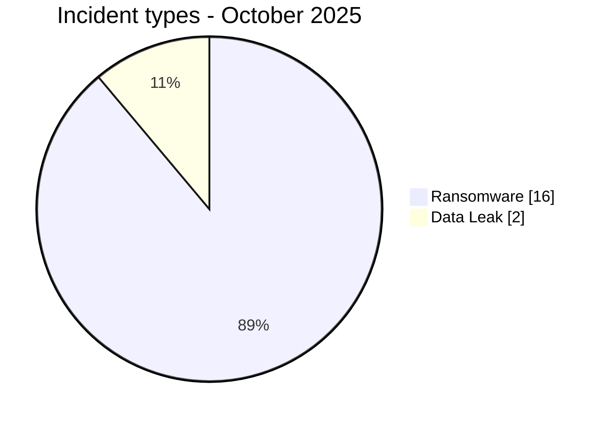
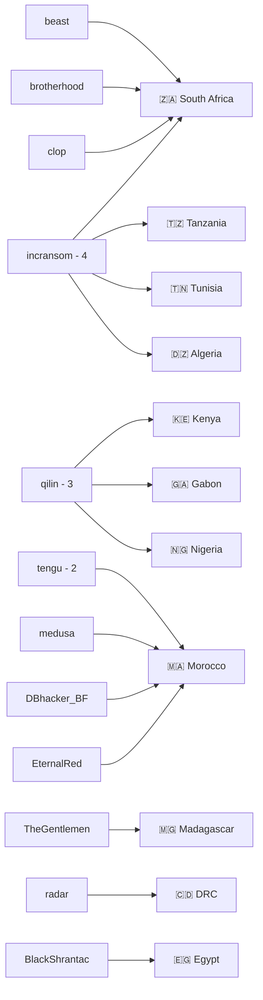
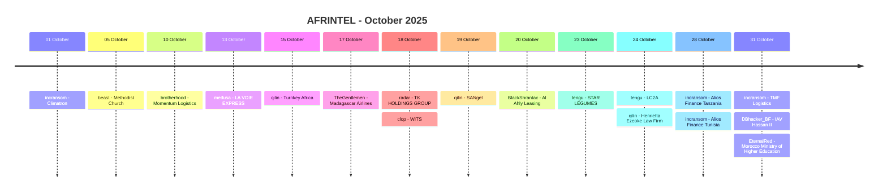

# CTI Report - Cyberattacks in Africa - October 2025

👉🏾 [**French version available here**](./README_FR.md)

## 1. Executive summary

October 2025 contains **18 unique incidents across 11 African countries**: **16 Ransomware** and **2 Data Leak**. No Access Sale, DDoS, Defacement or Operational Fraud is recorded.

- **Morocco**: 5 incidents, including 3 Ransomware and 2 Data Leak.
- **South Africa**: 4 Ransomware incidents.
- The other nine countries each record 1 incident.
- **incransom** is the most visible group with 4 records, followed by **qilin** with 3 and **tengu** with 2.
- The two Moroccan Data Leak records are attributed to **DBhacker_BF** and **EternalRed**; no `Unknown` actor is required.
- **LA VOIE EXPRESS**: accounting, logistics and commercial samples consistent with a broad compromise.
- **WITS**: Data Fully Published status based on the presence of a torrent magnet-link section, without AFRINTEL downloading the dataset.
- **TMF Logistics**: financial and operational documents consistent with the claim; 39 GB remains an actor-claimed volume.
- **IAV Hassan II**: 4,208 applicant records in the reviewed database.
- **Moroccan Ministry of Higher Education**: 942,930-line file matching the advertised volume; metadata indicates an extraction compiled around December 2022.
- **Alios Finance Group**: 100 GB claimed for each Tanzania and Tunisia operation.

### 📋 Victim list

👉🏾 [View the full victim list](./victims.md)

### 1.1 Month-over-month comparison

| Indicator | September 2025 | October 2025 | Observed change |
|---|---:|---:|---:|
| Total incidents | 18 | 18 | **0 (stable)** |
| Ransomware | 11 | 16 | **+5 (+45.5%)** |
| Data Leak | 7 | 2 | **-5 (-71.4%)** |
| Access Sale | 0 | 0 | **0 (stable)** |
| DDoS | 0 | 0 | **0 (stable)** |
| Defacement | 0 | 0 | **0 (stable)** |
| Operational Fraud | 0 | 0 | **0 (stable)** |

## 2. Methodology

- **Scope**: 54 African countries.
- **Period**: 1-31 October 2025.
- **Sources**: OSINT, leak sites, underground forums, actor publications and available samples.
- **Source of truth**: validated `victims_FR.md` / `victims.md` pair.
- **Deduplication**: a republication or relisting of the same evidence set is not counted as a new compromise without evidence supporting a distinct incident.
- **Taxonomy**: Ransomware, Data Leak, Access Sale, DDoS, Defacement, Operational Fraud.
- **Qualification**: claim, sample, full publication and technical confirmation remain distinct.

## 3. Global overview

### 3.1 Incident-type distribution

| Incident type | Count | Share |
|---|---:|---:|
| Ransomware | 16 | 88.9% |
| Data Leak | 2 | 11.1% |
| Access Sale | 0 | 0.0% |
| DDoS | 0 | 0.0% |
| Defacement | 0 | 0.0% |
| Operational Fraud | 0 | 0.0% |
| **Total** | **18** | **100%** |

### 3.2 Country distribution

| Country | Ransomware | Data Leak | Total | Distribution |
|---|---:|---:|---:|---|
| 🇲🇦 Morocco | 3 | 2 | 5 | 🟧🟧🟧🟦🟦 |
| 🇿🇦 South Africa | 4 | 0 | 4 | 🟧🟧🟧🟧 |
| 🇪🇬 Egypt | 1 | 0 | 1 | 🟧 |
| 🇩🇿 Algeria | 1 | 0 | 1 | 🟧 |
| 🇨🇩 DRC | 1 | 0 | 1 | 🟧 |
| 🇬🇦 Gabon | 1 | 0 | 1 | 🟧 |
| 🇰🇪 Kenya | 1 | 0 | 1 | 🟧 |
| 🇲🇬 Madagascar | 1 | 0 | 1 | 🟧 |
| 🇳🇬 Nigeria | 1 | 0 | 1 | 🟧 |
| 🇹🇿 Tanzania | 1 | 0 | 1 | 🟧 |
| 🇹🇳 Tunisia | 1 | 0 | 1 | 🟧 |
| **Total** | **16** | **2** | **18** | |

### 3.3 Regional distribution

| Region | Incidents | Share | Activity |
|---|---:|---:|---|
| North Africa | 8 | 44.4% | ██████████ |
| Southern Africa | 4 | 22.2% | █████ |
| East Africa | 3 | 16.7% | ████ |
| Central Africa | 2 | 11.1% | ██ |
| West Africa | 1 | 5.6% | █ |
| **Total** | **18** | **100%** | |

### 3.4 Harmonized sector distribution

| Sector | Incidents | Share | Activity |
|---|---:|---:|---|
| Transport / Logistics / Aviation | 4 | 22.2% | ██████████ |
| Finance / Banking | 3 | 16.7% | ████████ |
| Education / University | 2 | 11.1% | █████ |
| Construction / HVAC | 1 | 5.6% | ██ |
| Religion / Charitable Organization | 1 | 5.6% | ██ |
| Technology / Fintech | 1 | 5.6% | ██ |
| Mining / Conglomerate | 1 | 5.6% | ██ |
| Agribusiness | 1 | 5.6% | ██ |
| Wholesale Trade / Food Products | 1 | 5.6% | ██ |
| Pharmaceutical / Laboratory | 1 | 5.6% | ██ |
| Legal Services | 1 | 5.6% | ██ |
| Government / Higher Education | 1 | 5.6% | ██ |
| **Total** | **18** | **100%** | |

### 3.5 Actors / groups

| Actor / Group | Incidents | Activity |
|---|---:|---|
| incransom | 4 | ██████████ |
| qilin | 3 | ████████ |
| tengu | 2 | █████ |
| beast | 1 | ██ |
| brotherhood | 1 | ██ |
| medusa | 1 | ██ |
| TheGentlemen | 1 | ██ |
| radar | 1 | ██ |
| clop | 1 | ██ |
| BlackShrantac | 1 | ██ |
| DBhacker_BF | 1 | ██ |
| EternalRed | 1 | ██ |
| **Total** | **18** | |

### 3.6 Actor -> country mapping

## 4. Detailed analysis

### 4.1 Ransomware - 16 incidents

The 16 Ransomware records concern Climatron, The Methodist Church of Southern Africa, Momentum Logistics, LA VOIE EXPRESS, Turnkey Africa, Madagascar Airlines, TK HOLDINGS GROUP, WITS, SANgel, Al Ahly Leasing & Factoring, STAR LÉGUMES, Le MULTI LABORATOIRE LC2A, Henrietta Ezeoke Law Firm, Alios Finance Group in Tanzania, Alios Finance Group in Tunisia and TMF Logistics.

The strongest reviewed evidence sets include LA VOIE EXPRESS, TK HOLDINGS GROUP, WITS, STAR LÉGUMES, LC2A and TMF Logistics.

### 4.2 Data Leak - 2 incidents

Both Data Leak records concern Morocco:

- **IAV Hassan II**, attributed to DBhacker_BF, with 4,208 applicant records containing identity, contact and academic fields.
- **Ministry of Higher Education, Scientific Research and Innovation**, attributed to EternalRed, with a 942,930-line file covering a nationwide student dataset.

### 4.3 Access Sale - 0 incidents

No October 2025 card is classified as Access Sale.

## 5. Sectoral impact

The grouping remains close to the source-card sectors.

**Transport / Logistics / Aviation** is the leading category with **4 incidents**. **Finance / Banking** follows with 3. **Education / University** accounts for 2. All other categories account for 1 incident each.

## 6. Threat actor profile

**incransom** accounts for 4 records, **qilin** for 3 and **tengu** for 2. The other nine actors appear once each.

The previous README displayed two `Unknown` entries even though the two Moroccan Data Leak records are explicitly attributed to **DBhacker_BF** and **EternalRed** in the victim cards.

## 7. Trends and intelligence gaps

- Unique total: **18 -> 18**, stable.
- Ransomware: **11 -> 16**, +45.5%.
- Data Leak: **7 -> 2**, -71.4%.
- Morocco: 5 incidents, the leading country.
- incransom: 4 records, the leading actor.

Alios volumes of 100 GB per country and the TMF Logistics 39 GB figure remain actor claims. The WITS torrent was not downloaded or analyzed. Completeness and exact source of the IAV and enssup.gov.ma datasets remain independently unconfirmed.

## 8. Timeline

## 9. Contextual MITRE ATT&CK mapping

| Phase | Technique | Scope |
|---|---|---|
| Collection | T1005 - Data from Local System | Observed files, exports, internal documents and archives. |
| Collection | T1213 - Data from Information Repositories | Structured databases and exports, notably IAV and enssup.gov.ma. |

> These mappings are contextual and do not prove that every actor used each listed technique.

## 10. Recommendations

- Strengthen MFA, PAM, EDR, segmentation and privileged-account monitoring.
- Monitor bulk exports, ERP access, student databases, backups and outbound transfers.
- For logistics, protect billing systems, client portfolios and supply-chain data.
- For higher education, restrict national and local student-data exports and log access.
- For finance, strengthen controls around customer repositories, contractual documents and sensitive exchanges.

## 11. Conclusion

October 2025 contains **18 unique incidents across 11 countries**, split into **16 Ransomware and 2 Data Leak**. Monthly volume is stable compared with September, but the incident mix shifts strongly toward Ransomware.

Morocco leads with 5 incidents. incransom is the most visible group with 4 records. The corrected attribution of the two Moroccan Data Leak records resolves the main remaining inconsistencies in the previous report.

**AFRINTEL** - Open African CTI Monitoring Initiative
