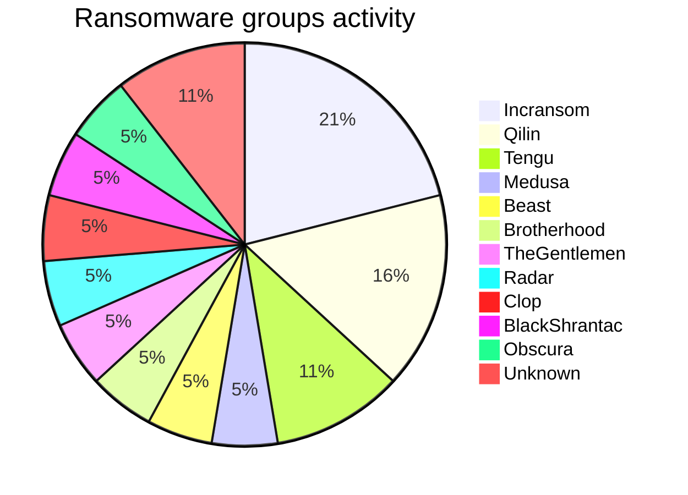
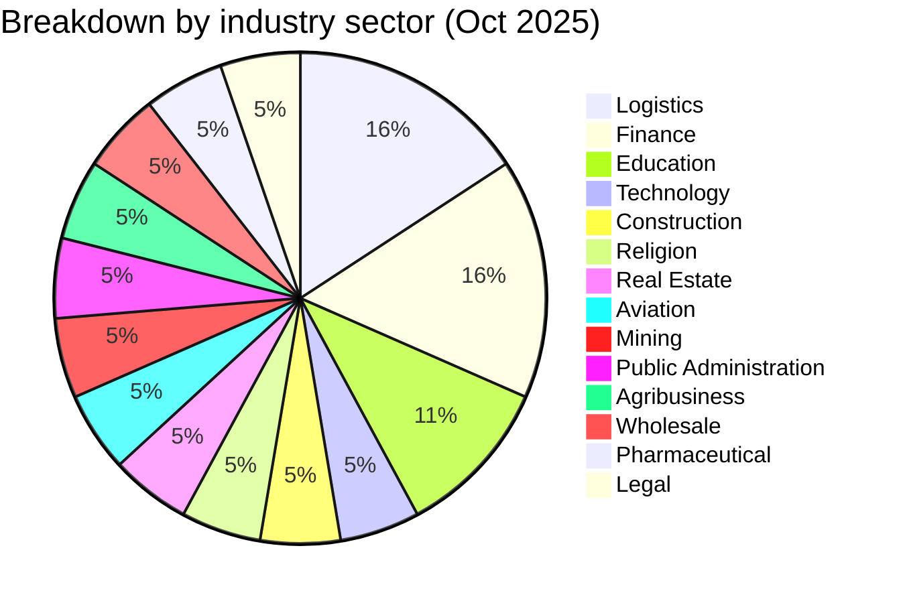
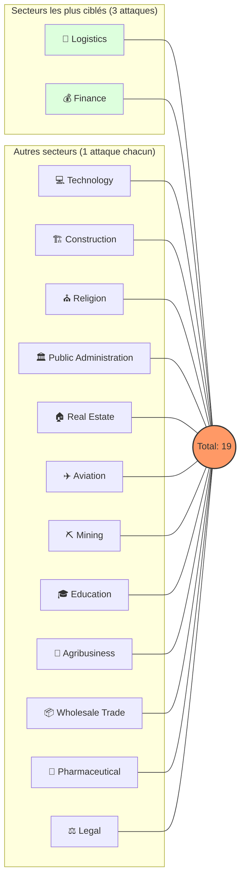
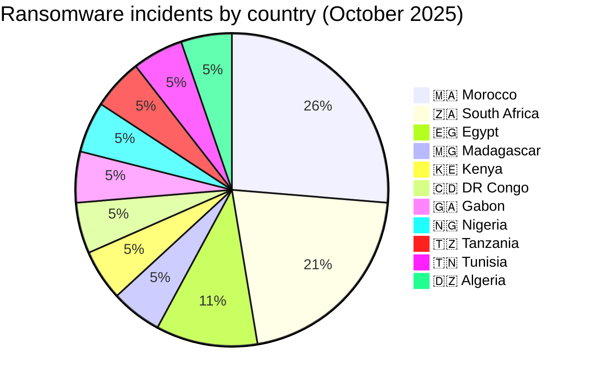
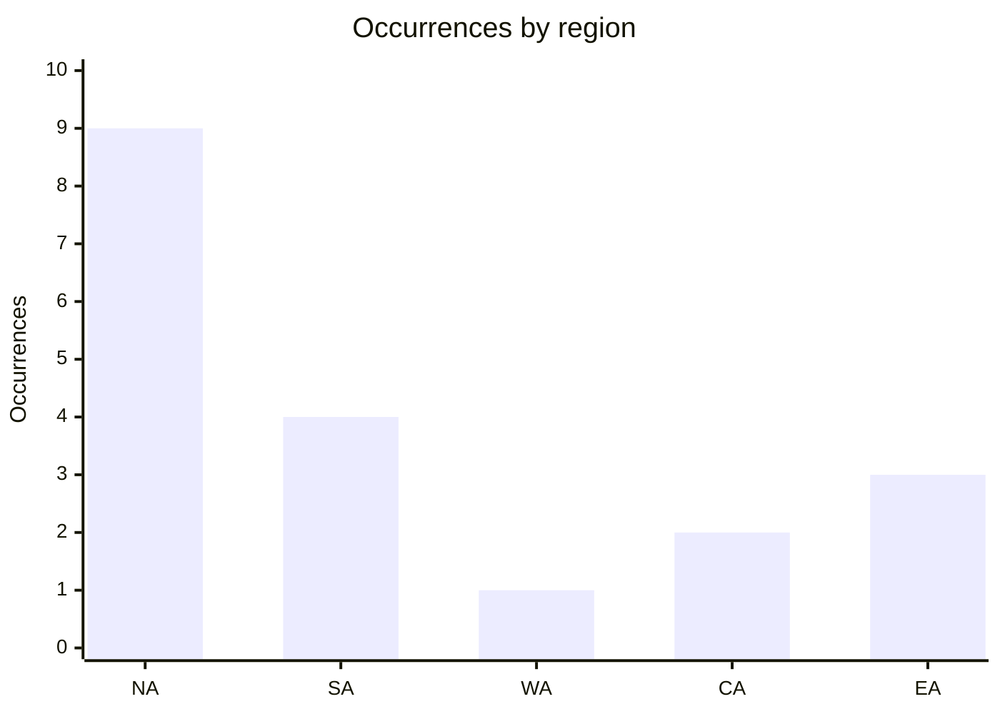
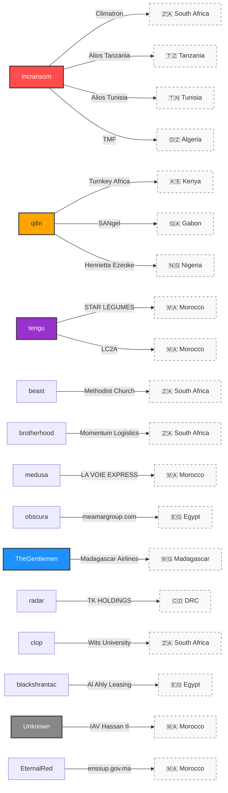

# CTI Report: Cyberattacks in Africa - October 2025 (19 victims)

👉🏾 [**French version available here**](README_FR.md)
## 1. Introduction
This **Cyber Threat Intelligence (CTI)** report provides a detailed analysis of cyberattacks recorded across Africa during October 2025. Data is gathered from **OSINT** sources and ransomware group leak sites, compiled under the **AFRINTEL** project. The goal is to provide a clear overview of trends, threat actors, targeted sectors, and associated indicators of compromise.

---

## 2. Executive summary
October 2025 shows a significant ransomware activity affecting African organizations, with multiple sectors targeted including finance, logistics, technology, education, and public administration. The month also includes two unattributed data-leak claims affecting Moroccan higher-education institutions.

A total of 17 confirmed ransomware claims and 2 data-leak claims, targeting organizations operating in 11 African countries, were identified during this period.

* **Total recorded attacks**: 19
* **Most active threat actors**: `incransom` (4 attacks), `qilin` (3 attacks), `tengu` (2 attacks).
    * *Other active groups*: beast, brotherhood, medusa, obscura, TheGentlemen, radar, clop, blackshrantac (1 attack each); 1 additional claim is unattributed, while the second data-leak claim is attributed to EternalRed.
* **Most targeted sectors**: Logistics (3), Finance (3), Education (2).
* **Most affected countries**: 🇿🇦 South Africa (4), 🇲🇦 Morocco (5), 🇪🇬 Egypt (2).
* **Notable data exfiltration volumes**: 
    * **Alios Finance Group** (Tanzania & Tunisia): 100 GB each.
    * **TMF Logistics** (Algeria): 39 GB.
    * **Ministry of Higher Education (enssup.gov.ma)** (Morocco): nationwide student extract of 942,930 records.

---

## 3. Key statistics

### 3.1 Breakdown by ransomware group
| Group / Actor | Number of attacks |
| :--- | :---: |
| **incransom** | 4 |
| **qilin** | 3 |
| **tengu** | 2 |
| **beast** | 1 |
| **brotherhood** | 1 |
| **medusa** | 1 |
| **obscura** | 1 |
| **TheGentlemen** | 1 |
| **radar** | 1 |
| **clop** | 1 |
| **blackshrantac** | 1 |
| **Unknown** | 2 |
| **Total** | **19** |



### 3.2 Breakdown by industry sector
| Sector | Number of Attacks |
| :--- | :---: |
| 🚚 Logistics | 3 |
| 💰 Finance | 3 |
| 🎓 Education | 2 |
| 💻 Technology | 1 |
| 🏗️ Construction | 1 |
| ⛪ Religion | 1 |
| 🏠 Real Estate | 1 |
| ✈️ Aviation | 1 |
| ⛏️ Mining | 1 |
| 🏛️ Public Administration | 1 |
| 🌾 Agribusiness | 1 |
| 📦 Wholesale Trade | 1 |
| 🧪 Pharmaceutical | 1 |
| ⚖️ Legal | 1 |
| **Total** | **19** |




### 3.3 Breakdown by country
| Country | Number of attacks |
| :--- | :---: |
| 🇿🇦 South Africa |4 |
| 🇲🇦 Morocco | 5 |
| 🇪🇬 Egypt | 2 |
| 🇰🇪 Kenya | 1 |
| 🇲🇬 Madagascar | 1 |
| 🇨🇩 DRC | 1 |
| 🇬🇦 Gabon | 1 |
| 🇳🇬 Nigeria | 1 |
| 🇹🇿 Tanzania | 1 |
| 🇹🇳 Tunisia | 1 |
| 🇩🇿 Algeria | 1 |
| **Total** | **19** |


---


<!-- AFRINTEL_CURRENT_MODEL_START -->
### 3.4 Standard global overview

| Country | Ransomware | Data exposure (leaks + access) | Total | Distribution |
| :--- | ---: | ---: | ---: | :--- |
| 🇲🇦 Morocco | 3 | 2 | 5 | 🟧🟧🟧 🟦🟦 |
| 🇿🇦 South Africa | 4 | 0 | 4 | 🟧🟧🟧🟧 |
| 🇪🇬 Egypt | 2 | 0 | 2 | 🟧🟧 |
| 🇩🇿 Algeria | 1 | 0 | 1 | 🟧 |
| 🇨🇩 Congo (DRC) | 1 | 0 | 1 | 🟧 |
| 🇬🇦 Gabon | 1 | 0 | 1 | 🟧 |
| 🇰🇪 Kenya | 1 | 0 | 1 | 🟧 |
| 🇲🇬 Madagascar | 1 | 0 | 1 | 🟧 |
| 🇳🇬 Nigeria | 1 | 0 | 1 | 🟧 |
| 🇹🇿 Tanzania | 1 | 0 | 1 | 🟧 |
| 🇹🇳 Tunisia | 1 | 0 | 1 | 🟧 |

```pie
    title Incident types
    "Ransomware" : 17
    "Data leaks + access sales" : 2
```

### Monthly aggregate exposure view

The monthly CTI view combines data leaks and access sales as **data exposure**: **2 records** (10.5% of the monthly corpus). The underlying source cards remain authoritative, and an access sale does not by itself prove data exfiltration.


### Geographic distribution by region

| Region | Occurrences | Ransomware | Data exposure (leaks + access) | Distribution |
| :--- | ---: | ---: | ---: | :--- |
| North Africa | 9 | 7 | 2 | 🟧🟧🟧🟧🟧🟧🟧 🟦🟦 |
| Southern Africa | 4 | 4 | 0 | 🟧🟧🟧🟧 |
| West Africa | 1 | 1 | 0 | 🟧 |
| Central Africa | 2 | 2 | 0 | 🟧🟧 |
| East Africa | 3 | 3 | 0 | 🟧🟧🟧 |


Legend: NA = North Africa; SA = Southern Africa; WA = West Africa; CA = Central Africa; EA = East Africa

### Sector distribution

| Sector | Records | Share | Activity |
| :--- | ---: | ---: | :--- |
| Finance / Banking | 4 | 21.1% | ██████████ |
| Transport / Logistics | 4 | 21.1% | ██████████ |
| Agriculture / Agribusiness | 2 | 10.5% | █████ |
| Education / University | 2 | 10.5% | █████ |
| Government / Administration | 2 | 10.5% | █████ |
| Professional / Business Services | 2 | 10.5% | █████ |
| Energy / Utilities | 1 | 5.3% | ██ |
| Healthcare / Medical | 1 | 5.3% | ██ |
| Technology / IT | 1 | 5.3% | ██ |

### Most visible actors

| Actor / Group | Records | Activity |
| :--- | ---: | :--- |
| incransom | 4 | ██████████ |
| qilin | 3 | ████████ |
| tengu | 2 | █████ |
| DBhacker_BF | 1 | ██ |
| EternalRed | 1 | ██ |
| beast | 1 | ██ |
| blackshrantac | 1 | ██ |
| brotherhood | 1 | ██ |
| clop | 1 | ██ |
| medusa | 1 | ██ |
<!-- AFRINTEL_CURRENT_MODEL_END -->
## 4. Attack Details by ransomware group

### 4.1 incransom (4 attacks)
* **2025-10-01**: Climatron (South Africa, Construction) – Claimed & Leaked.
* **2025-10-28**: Alios Finance Group (Tanzania, Finance) – **100 GB exfiltrated**.
* **2025-10-28**: Alios Finance Group (Tunisia, Finance) – **100 GB exfiltrated**.
* **2025-10-31**: TMF Logistics (Algeria, Logistics) – **39 GB exfiltrated**.
> **Note**: incransom targeted multiple entities across different sectors and countries with high data volumes.

### 4.2 qilin (3 attacks)
* **2025-10-15**: Turnkey Africa (Kenya, Tech/Fintech) – Claimed & Leaked.
* **2025-10-19**: SANgel (Gabon, Agribusiness) – Claimed & Leaked.
* **2025-10-24**: Henrietta Ezeoke Law Firm (Nigeria, Legal) – Claimed & Leaked.

### 4.3 tengu (2 attacks)
* **2025-10-23**: STAR LÉGUMES (Morocco, Wholesale) – Claimed & Leaked.
* **2025-10-24**: Le MULTI LABORATOIRE LC2A (Morocco, Pharmaceutical) – Claimed & Leaked.

### 4.4 Other Groups (1 attack each)
* **beast** (Oct 05): The Methodist Church of Southern Africa (South Africa, Religion).
* **brotherhood** (Oct 10): Momentum Logistics (South Africa, Logistics).
* **medusa** (Oct 13): LA VOIE EXPRESS (Morocco, Logistics).
* **obscura** (Oct 13): meamargroup.com (Egypt, Real Estate) – **3rd attack against this company**.
* **TheGentlemen** (Oct 17): Madagascar Airlines (Madagascar, Aviation).
* **clop** (Oct 18): University of the Witwatersrand (South Africa, Education).
* **radar** (Oct 18): TK HOLDINGS GROUP (DRC, Mining).
* **blackshrantac** (Oct 20): Al Ahly Leasing & Factoring (Egypt, Finance).

### 4.5 Moroccan higher-education data claims (2 attacks)
* **2025-10-31**: Institut Agronomique et Vétérinaire Hassan II - IAV Hassan II (Morocco, Education) – Claim - Data Sample Published. Structured applicant database, 4,208 records (CIN, contact details, academic track); actor attribution remains unknown.
* **2025-10-25**: Ministry of Higher Education, Scientific Research and Innovation - enssup.gov.ma (Morocco, Public Administration / Education) – Claim - Data Sample Published. EternalRed publication; nationwide student extract, 942,930 records.

### 4.6 Actor → Victim → Country Graph

---

## 5. Strategic observations & TTPs
* **Massive data exfiltration**: High focus on sensitive data theft (up to 100 GB) to maximize extortion pressure.
* **Persistent vulnerabilities**: The repeated targeting of *meamargroup.com* (2nd time) suggests unpatched entry points or poor remediation.
* **Geographical dispersion**: Threat distribution skewed toward North Africa (9 attacks, including the two unattributed Moroccan education-sector claims) versus Sub-Saharan Africa (10 attacks).
* **Attribution of Moroccan higher-education datasets**: Two Moroccan higher-education data leaks were recorded: IAV Hassan II remains unattributed, while enssup.gov.ma is attributed to EternalRed, unlike the rest of the month's ransomware-driven claims.

---

## 6. Recommendations
1.  **Logistics & Finance**: Implement data-at-rest encryption and monitor for anomalous outbound traffic (exfiltration).
2.  **Public Sector**: Conduct regular security audits and enforce strict Multi-Factor Authentication (MFA).
3.  **Education & Research**: Protect personal student data and research intellectual property through network segmentation.
4.  **General: Regularly test Incident Response plans:**
    * **BCP (Business Continuity Plan)**: To ensure the maintenance of critical business operations during an active cyberattack.
    * **DRP (Disaster Recovery Plan)**: To guarantee the rapid restoration of IT infrastructure and data following the incident.

---

### ✍🏿 Author
**Adama ASSIONGBON** *SOC & Cyber Threat Intelligence Consultant* [LinkedIn Profile](https://www.linkedin.com/in/adama-assiongbon-9029893a/)

**AFRINTEL** - *Open CTI Initiative for Africa*
