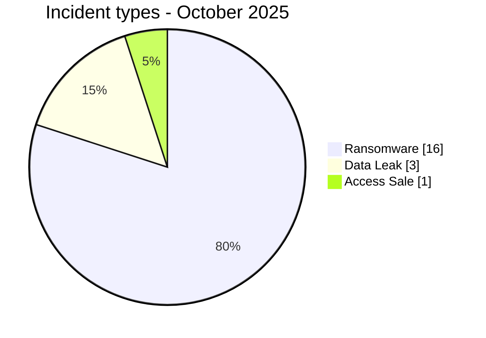
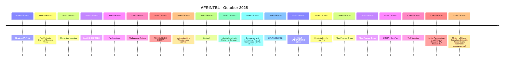

# AFRINTEL CTI Report - Cyber Threats in Africa - October 2025

👉🏾 [Version française](./README_FR.md)

   

## 1. Executive summary

In October 2025, AFRINTEL documents **20 cyber incidents** affecting organizations and digital services across **11 African countries**.

The landscape is dominated by **Ransomware with 16 records (80.0%)**, followed by **Data Leak with 3 (15.0%)**. Other observed types are Access Sale 1.

Geographic concentration is significant: **South Africa (5)**, **Morocco (5)**, **Kenya (2)** together account for **12 records, or 60.0% of the month**. This concentration reflects AFRINTEL corpus visibility rather than an exhaustive national compromise rate.

At sector level, the most represented categories are **Transport / Logistics (4)**, **Finance / Banking (4)**, **Not specified (2)**. The most frequent actor labels are `incransom` (4), `qilin` (3), `tengu` (2). `Unknown`, when present, denotes missing attribution rather than a threat actor.

Evidence maturity remains variable: **17 records** are unverified claims or claims accompanied by samples. AFRINTEL maintains a strict separation between **observed facts, claims, corroboration, official confirmation, and technical unknowns**.

Compared with September, monthly volume **increases by 1 record**. The most visible changes are Ransomware 11->16 (+5), Data Leak 7->3 (-4), Access Sale 0->1 (+1).

> **Reading note:** AFRINTEL figures describe documented incidents and the visibility of observed threats. They are not an exhaustive measurement of every cyberattack that actually occurred across Africa.

### 1.1 Month-over-month comparison

| Indicator | September 2025 | October 2025 | Change |
|---|---:|---:|---:|
| Total incidents | 19 | 20 | **+1 (+5.3%)** |
| Ransomware | 11 | 16 | **+5 (+45.5%)** |
| Data Leak | 7 | 3 | **-4 (-57.1%)** |
| Access Sale | 0 | 1 | **+1 (new)** |
| DDoS | 1 | 0 | **-1 (-100.0%)** |
| Defacement | 0 | 0 | **Stable** |
| Account Takeover | 0 | 0 | **Stable** |
| System Intrusion | 0 | 0 | **Stable** |
| Malware | 0 | 0 | **Stable** |
| Operational Fraud | 0 | 0 | **Stable** |

## 2. Methodology

- **Scope:** 54 African countries; reference period: October 2025.
- **Source of truth:** validated `victims_FR.md` / `victims.md` pair.
- **Classification:** Ransomware, Data Leak, Access Sale, DDoS, Defacement, Account Takeover, System Intrusion, Malware, and Operational Fraud.
- **Counting:** one canonical record equals one documented cyber incident; cases under investigation remain outside statistics.
- **Timeline:** `Incident date` and `Initial publication date` remain separate. A later disclosure does not artificially move an incident into another month when chronology is sufficiently supported.
- **Uncertain dates:** when no exact day is known, the evidence-supported month or time window is retained.
- **Sources:** public links are retained for supplementary incidents found through OSINT/web research; they are not retroactively imposed on historical or direct Dark Web observations.
- **Evidence:** incident type, status, confidence, impact, and provenance remain separate dimensions.
- **Sectors:** normalization is calculated once from the structured corpus and used identically in FR and EN.
- **Limitation:** frequencies reflect AFRINTEL visibility rather than every real compromise on the continent.

## 3. Overview and incident types

| Indicator | Value |
|---|---:|
| Documented incidents | **20** |
| Countries represented | **11** |
| Regions represented | **6** |
| Leading country | **South Africa (5)** |
| Leading sector | **Transport / Logistics (4)** |
| Leading actor label | **incransom (4)** |

| Incident type | Records | Share |
|---|---:|---:|
| Ransomware | 16 | 80.0% |
| Data Leak | 3 | 15.0% |
| Access Sale | 1 | 5.0% |
| DDoS | 0 | 0.0% |
| Defacement | 0 | 0.0% |
| Account Takeover | 0 | 0.0% |
| System Intrusion | 0 | 0.0% |
| Malware | 0 | 0.0% |
| Operational Fraud | 0 | 0.0% |
| **Total** | **20** | **100%** |

## 4. Geographic distribution

| Country | Total | Ransomware | Data Leak | Access Sale | DDoS | Defacement | Account Takeover | System Intrusion | Malware |
|---|---:|---:|---:|---:|---:|---:|---:|---:|---:|
| South Africa | **5** | 4 | 0 | 1 | 0 | 0 | 0 | 0 | 0 |
| Morocco | **5** | 3 | 2 | 0 | 0 | 0 | 0 | 0 | 0 |
| Kenya | **2** | 1 | 1 | 0 | 0 | 0 | 0 | 0 | 0 |
| Madagascar | **1** | 1 | 0 | 0 | 0 | 0 | 0 | 0 | 0 |
| Congo (DRC) | **1** | 1 | 0 | 0 | 0 | 0 | 0 | 0 | 0 |
| Gabon | **1** | 1 | 0 | 0 | 0 | 0 | 0 | 0 | 0 |
| Egypt | **1** | 1 | 0 | 0 | 0 | 0 | 0 | 0 | 0 |
| Nigeria | **1** | 1 | 0 | 0 | 0 | 0 | 0 | 0 | 0 |
| Tanzania | **1** | 1 | 0 | 0 | 0 | 0 | 0 | 0 | 0 |
| Tunisia | **1** | 1 | 0 | 0 | 0 | 0 | 0 | 0 | 0 |
| Algeria | **1** | 1 | 0 | 0 | 0 | 0 | 0 | 0 | 0 |
| **Total** | **20** | **16** | **3** | **1** | **0** | **0** | **0** | **0** | **0** |

> `Operational Fraud = 0` this month; the column is omitted for readability.

## 5. Regional distribution

| Region | Records | Share |
|---|---:|---:|
| North Africa | 8 | 40.0% |
| Southern Africa | 5 | 25.0% |
| East Africa | 3 | 15.0% |
| Central Africa | 2 | 10.0% |
| Indian Ocean | 1 | 5.0% |
| West Africa | 1 | 5.0% |
| **Total** | **20** | **100%** |

The leading region is **North Africa with 8 records (40.0%)**.

## 6. Sector impact

| Sector | Records | Share | Activity |
|---|---:|---:|---|
| Transport / Logistics | 4 | 20.0% | ████ |
| Finance / Banking | 4 | 20.0% | ████ |
| Not specified | 2 | 10.0% | ██ |
| Education / University | 2 | 10.0% | ██ |
| Government / Administration | 2 | 10.0% | ██ |
| Healthcare / Medical | 2 | 10.0% | ██ |
| Construction / Real Estate | 1 | 5.0% | █ |
| Mining | 1 | 5.0% | █ |
| Agriculture / Agribusiness | 1 | 5.0% | █ |
| Legal | 1 | 5.0% | █ |
| **Total** | **20** | **100%** | |

## 7. Actors / groups

`Unknown` denotes missing attribution, not a threat actor.

| Actor / Group | Records | Activity |
|---|---:|---|
| incransom | 4 | ████ |
| qilin | 3 | ███ |
| tengu | 2 | ██ |
| beast | 1 | █ |
| brotherhood | 1 | █ |
| medusa | 1 | █ |
| TheGentlemen | 1 | █ |
| radar | 1 | █ |
| clop | 1 | █ |
| BlackShrantac | 1 | █ |
| fuckoverflow (claimed seller) | 1 | █ |
| Kazu | 1 | █ |
| DBhacker_BF | 1 | █ |
| EternalRed | 1 | █ |

## 8. Evidence maturity

| Evidence maturity | Records | Share |
|---|---:|---:|
| Claim - Unverified | 10 | 50.0% |
| Claim - Data Sample Published | 7 | 35.0% |
| Data Fully Published | 1 | 5.0% |
| Corroborated / Secondary evidence | 2 | 10.0% |
| **Total** | **20** | **100%** |

Evidence statuses describe the available validation level; they do not change the technical incident type.

## 9. Timeline

## 10. Monthly CTI analysis

### Ransomware

**16 records** are classified as Ransomware. Leading countries: South Africa (4), Morocco (3), Kenya (1). A leak-site listing does not itself prove encryption or complete exfiltration.

### Data Leak

**3 records** are classified as Data Leak. Leading countries: Morocco (2), Kenya (1). AFRINTEL distinguishes actually observed data from aggregate volumes claimed by actors.

### Access Sale

**1 record(s)** fall under Access Sale. Distribution: South Africa (1). An access offer does not automatically prove exfiltration or compromise of the entire internal environment.

## 11. Notable incidents

| Country | Organization | Type | Status | Impact | Confidence |
|---|---|---|---|---|---|
| Kenya | M-TIBA / CarePay | Data Leak | Corroborated - Data Sample Independently Reviewed + Regulator Investigation | Level 4 | High |
| Congo (DRC) | TK HOLDINGS GROUP | Ransomware | Claim - Data Sample Published | Level 4 | Medium |
| South Africa | Companies and Intellectual Property Commission (CIPC) eServices | Access Sale | Claim - Unverified Marketplace Listing | Level 4 | Medium |
| Morocco | LA VOIE EXPRESS | Ransomware | Claim - Data Sample Published | Level 3 | Very High |
| Morocco | STAR LÉGUMES | Ransomware | Claim - Data Sample Published | Level 3 | Very High |

> This table highlights up to five records using structured impact, confirmation, and confidence fields. It is not an absolute severity ranking.

## 12. Key findings and intelligence gaps

- **Geographic concentration:** South Africa accounts for 5 records (25.0%), followed by Morocco (5) and Kenya (2).
- **Threat structure:** Ransomware is the leading type with 16 records, followed by Data Leak (3).
- **Sectors:** Transport / Logistics (4) and Finance / Banking (4) have the highest visibility.
- **Actors:** the most frequent labels are incransom (4), qilin (3), and tengu (2).
- **Evidence:** 17 records rely on unverified claims or claims with a published sample; these statuses do not equal complete technical confirmation.

### Intelligence gaps

- initial-access vector often not public;
- exact technical compromise date sometimes unknown;
- claimed volumes rarely fully verifiable;
- technical attribution often limited to a publication handle or label;
- public remediation, root-cause, and DFIR conclusions remain limited.

These gaps should guide collection rather than be replaced with assumptions.

## 13. Recommendations

### Organizations

- enforce phishing-resistant MFA on privileged accounts, VPN, email, social media, and administration consoles;
- apply PAM, least privilege, segmentation, and secret rotation;
- maintain immutable backups and test restoration;
- strengthen public applications, APIs, and administration interfaces;
- formalize incident response and data-breach notification.

### SOC and detection

- monitor abnormal authentication, MFA changes, privileged-account creation, and role elevation;
- detect mass database reads, unusual exports, archive creation, and large outbound transfers;
- correlate EDR, IAM, VPN, WAF, proxy, DNS, cloud, and application logs;
- distinguish DDoS, internal intrusion, account compromise, and data exposure to avoid unsupported conclusions.

### CTI

- keep incident date, initial publication, first observation, sample, disclosure, and confirmation separate;
- track republication and resale without automatically counting them as new compromise;
- preserve the evidence hierarchy between claim, corroboration, and confirmation;
- validate FR/EN parity before generating statistics.

## 14. Conclusion

**October 2025** contains **20 documented cyber incidents** across **11 African countries**. The monthly CTI value lies not only in volume but in separating **incident type, timeline, evidence level, geography, sector, and actor**.

The report therefore preserves a structured picture of the observable threat environment while keeping claims, corroboration, confirmations, and unknowns at their actual evidence level.

👉🏾 [See monthly victims](./victims.md)

**AFRINTEL** - TLP:CLEAR
