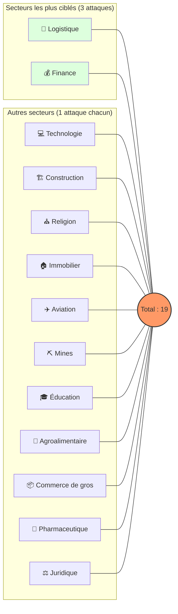
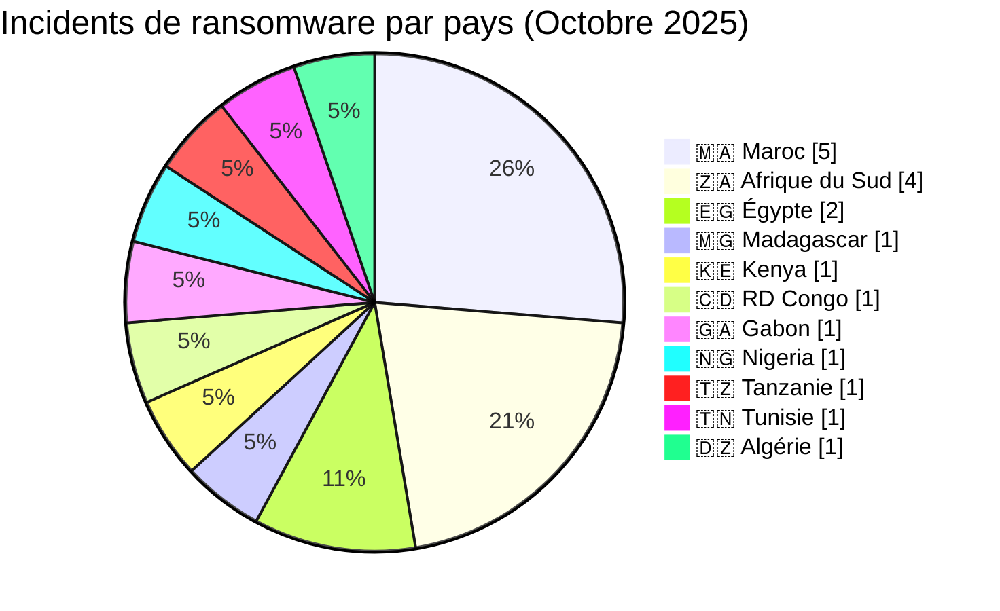
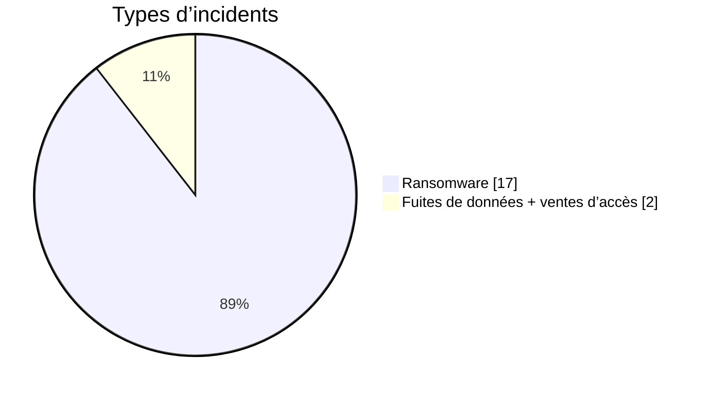
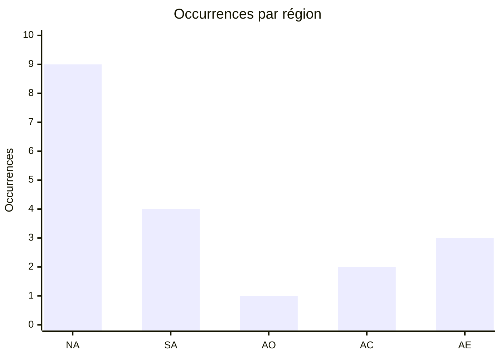

# Rapport CTI : Cyberattaques en Afrique - Octobre 2025 (19 victimes)

👉🏾 [**English version available here**](./README.md)

## 1. Résumé exécutif
Octobre 2025 affiche une activité significative de ransomwares affectant les organisations africaines, avec plusieurs secteurs ciblés, notamment la finance, la logistique, la technologie, l'éducation et l'administration publique. Le mois inclut également deux revendications de fuite de données concernant des établissements marocains de l'enseignement supérieur : IAV Hassan II reste non attribué, tandis qu'enssup.gov.ma est attribué à EternalRed.

Un total de 17 revendications de ransomwares confirmées et 2 revendications de fuite de données, ciblant des organisations opérant dans 11 pays africains, ont été identifiées au cours de cette période.

* **Nombre total d'attaques recensées** : 19
* **Acteurs les plus actifs** : `incransom` (4 attaques), `qilin` (3 attaques), `tengu` (2 attaques).
    * *Autres groupes actifs* : beast, brotherhood, medusa, obscura, TheGentlemen, radar, clop, blackshrantac (1 attaque chacun) ; 1 revendication supplémentaire est non attribuée, tandis que la seconde revendication de fuite est attribuée à EternalRed.
* **Secteurs les plus ciblés** : Logistique (3), Finance (3), Éducation (2).
* **Pays les plus touchés** : 🇿🇦 Afrique du Sud (4), 🇲🇦 Maroc (5), 🇪🇬 Égypte (2).
* **Volumes de données exfiltrés notables** : 
    * **Alios Finance Group** (Tanzanie & Tunisie) : 100 Go chacun.
    * **TMF Logistics** (Algérie) : 39 Go.
    * **Ministère de l'Enseignement Supérieur (enssup.gov.ma)** (Maroc) : extraction nationale d'étudiants, 942 930 enregistrements.

---

## 2. Méthodologie

## 3. Vue d'ensemble

### 3.1 Répartition par groupe ransomware
| Groupe / Acteur | Nombre d'attaques |
| :--- | :---: |
| **incransom** | 4 |
| **qilin** | 3 |
| **tengu** | 2 |
| Autres (beast, brotherhood, etc.) | 8 |
| Non attribué | 2 |
| **Total** | **19** |

### 3.2 Répartition par secteur d'activité
| Secteur | Nombre d'attaques |
| :--- | :---: |
| Logistique | 3 |
| Finance | 3 |
| Éducation | 2 |
| Technologies | 1 |
| Construction | 1 |
| Religion | 1 |
| Administration publique | 1 |
| Immobilier | 1 |
| Aviation | 1 |
| Mines | 1 |
| Agroalimentaire | 1 |
| Commerce de gros | 1 |
| Pharmaceutique | 1 |
| Juridique | 1 |
| **Total** | **19** |

### 3.3 Répartition par pays
| Pays | Nombre d'attaques |
| :--- | :---: |
| 🇿🇦 Afrique du Sud | 4 |
| 🇲🇦 Maroc | 5 |
| 🇪🇬 Égypte | 2 |
| 🇰🇪 Kenya | 1 |
| 🇲🇬 Madagascar | 1 |
| 🇨🇩 RDC | 1 |
| 🇬🇦 Gabon | 1 |
| 🇳🇬 Nigeria | 1 |
| 🇹🇿 Tanzanie | 1 |
| 🇹🇳 Tunisie | 1 |
| 🇩🇿 Algérie | 1 |
| **Total** | **19** |

---

<!-- AFRINTEL_CURRENT_MODEL_START -->
### 3.4 Vue globale standardisée

| Pays | Ransomware | Exposition des données (fuites + accès) | Total | Distribution |
| :--- | ---: | ---: | ---: | :--- |
| 🇲🇦 Maroc | 3 | 2 | 5 | 🟧🟧🟧 🟦🟦 |
| 🇿🇦 Afrique du Sud | 4 | 0 | 4 | 🟧🟧🟧🟧 |
| 🇪🇬 Égypte | 2 | 0 | 2 | 🟧🟧 |
| 🇩🇿 Algérie | 1 | 0 | 1 | 🟧 |
| 🇨🇩 RDC | 1 | 0 | 1 | 🟧 |
| 🇬🇦 Gabon | 1 | 0 | 1 | 🟧 |
| 🇰🇪 Kenya | 1 | 0 | 1 | 🟧 |
| 🇲🇬 Madagascar | 1 | 0 | 1 | 🟧 |
| 🇳🇬 Nigeria | 1 | 0 | 1 | 🟧 |
| 🇹🇿 Tanzanie | 1 | 0 | 1 | 🟧 |
| 🇹🇳 Tunisie | 1 | 0 | 1 | 🟧 |

### Vue agrégée mensuelle de l’exposition

La vue CTI mensuelle regroupe les fuites de données et les ventes d’accès sous **exposition des données** : **2 fiches** (10,5% du corpus mensuel). Les fiches sources restent la référence ; une vente d’accès ne prouve pas à elle seule l’exfiltration de données.

### Répartition géographique par région

| Région | Occurrences | Ransomware | Exposition des données (fuites + accès) | Distribution |
| :--- | ---: | ---: | ---: | :--- |
| Afrique du Nord | 9 | 7 | 2 | 🟧🟧🟧🟧🟧🟧🟧 🟦🟦 |
| Afrique australe | 4 | 4 | 0 | 🟧🟧🟧🟧 |
| Afrique de l’Ouest | 1 | 1 | 0 | 🟧 |
| Afrique centrale | 2 | 2 | 0 | 🟧🟧 |
| Afrique de l’Est | 3 | 3 | 0 | 🟧🟧🟧 |

Légende : NA = Afrique du Nord ; SA = Afrique australe ; AO = Afrique de l’Ouest ; AC = Afrique centrale ; AE = Afrique de l’Est

### Répartition sectorielle

| Secteur | Fiches | Part | Activité |
| :--- | ---: | ---: | :--- |
| Finance / banque | 4 | 21,1% | ██████████ |
| Transport / logistique | 4 | 21,1% | ██████████ |
| Agriculture / agro-industrie | 2 | 10,5% | █████ |
| Éducation / universités | 2 | 10,5% | █████ |
| Gouvernement / administration | 2 | 10,5% | █████ |
| Services professionnels | 2 | 10,5% | █████ |
| Énergie / services publics | 1 | 5,3% | ██ |
| Santé / médical | 1 | 5,3% | ██ |
| Technologies / informatique | 1 | 5,3% | ██ |

### Acteurs / groupes les plus présents

| Acteur / Groupe | Fiches | Activité |
| :--- | ---: | :--- |
| incransom | 4 | ██████████ |
| qilin | 3 | ████████ |
| tengu | 2 | █████ |
| DBhacker_BF | 1 | ██ |
| EternalRed | 1 | ██ |
| beast | 1 | ██ |
| blackshrantac | 1 | ██ |
| brotherhood | 1 | ██ |
| clop | 1 | ██ |
| medusa | 1 | ██ |
<!-- AFRINTEL_CURRENT_MODEL_END -->

### Comparaison avec le mois précédent

À partir des fiches incidents validées comme source de comptage, octobre 2025 compte **19** incidents contre **18** le mois précédent (une hausse de **+1** ; **+5.6%**). Cette comparaison décrit les publications enregistrées par AFRINTEL et ne prouve pas à elle seule une évolution de l'activité des attaquants ni un impact confirmé sur les victimes.

| Indicateur | Mois précédent | Mois en cours | Variation |
|---|---:|---:|---:|
| Fiches incidents enregistrées | 18 | 19 | +1 (+5.6%) |

## 4. Analyse détaillée par type d'incident

## 5. Impact sectoriel
* **Logistique (3)** : Ciblé par brotherhood, medusa et incransom. Secteur hautement vulnérable.
* **Finance (3)** : Grosses exfiltrations (Alios, Al Ahly).
* **Technologies (1)** : Turnkey Africa (Fintech panafricaine).
* **Immobilier (1)** : Cas particulier de Meamar Group, frappé pour la 2ème fois.
* **Autres** : Santé, Mines, Aviation, Éducation, tous touchés au moins une fois.

---

## 6. Profil des acteurs
### 6.1 Profil des acteurs

Les comptages d'acteurs et de sources restent ceux documentés en section 3 et dans les fiches victimes sources. L'attribution est conservée uniquement au niveau étayé par les éléments publics.

### 6.2 Évaluation du risque

Les pays et secteurs présentant plusieurs fiches ou des fonctions publiques, éducatives, sanitaires, financières ou critiques doivent faire l'objet d'une validation prioritaire. Il s'agit d'un signal de priorisation OSINT, et non d'une confirmation de compromission ou d'impact.

* **Maroc** : Pays le plus touché (5), entre logistique/commerce revendiqués et deux fuites de données dans l'enseignement supérieur ; l'une reste non attribuée et l'autre est liée à EternalRed.
* **Afrique du Sud** : Deuxième position (4). Diversité sectorielle totale.
* **Égypte** : Focus immobilier et finance (2).
* **Répartition** : Afrique du Nord (9 attaques, incluant les deux revendications marocaines de l'enseignement supérieur) vs Afrique subsaharienne (10 attaques), montrant une menace globalisée sur tout le continent.

---

## 7. Tendances et lacunes de renseignement
### 7.1 Tendances observées

Les répartitions par pays, secteur, acteur et type d'incident présentées ci-dessus constituent les tendances traçables du mois. Elles décrivent le corpus surveillé et n'établissent pas une campagne plus large sans éléments indépendants.

### 7.2 Lacunes de renseignement

Les rapports disponibles ne permettent pas d'établir pour chaque revendication le vecteur d'accès initial, l'exfiltration complète, la confirmation par la victime, la chronologie de remédiation ou l'impact opérationnel. Aucun détail DFIR public n'est inclus dans le corpus consulté pour cette fiche mensuelle ; cette absence est limitée aux sources examinées.

## 8. Cartographie MITRE ATT&CK (contextuelle)
| Phase | ID technique | Nom | Association à l'incident |
|---|---|---|---|
| Collecte | T1005 | Data from Local System | Correspondance contextuelle pour une collecte ou exposition revendiquée ; la méthode n'est pas confirmée. |
| Collecte | T1213 | Data from Information Repositories | Correspondance contextuelle pour les dossiers ou référentiels décrits publiquement ; la méthode n'est pas confirmée. |

Ces correspondances ATT&CK sont contextuelles et défensives. Elles ne prouvent pas qu'un acteur donné a utilisé la technique.

### Contextual observations
* **Exfiltration massive** : Focalisation sur le vol de données sensibles (jusqu'à 100 Go) pour maximiser l'extorsion.
* **Ciblage répété** : Exemple de *meamargroup.com*, illustrant des vulnérabilités persistantes non corrigées.
* **Fragmentation de l'écosystème** : 12 groupes différents actifs en un seul mois.

---

## 9. Recommandations
1.  **Secteurs Logistique & Finance** : Chiffrement des données au repos, segmentation réseau et surveillance des flux sortants (exfiltration).
2.  **Secteur Public** : Audits de sécurité réguliers et durcissement des accès (IAM).
3.  **Éducation & Recherche** : Protection des données personnelles et authentification multi-facteurs (MFA) obligatoire.
4.  **Général : Tester régulièrement les plans de réponse aux incidents :**
    * **BCP (Business Continuity Plan)** / **PCA (Plan de Continuité d'Activité)** : Pour assurer le maintien des opérations critiques de l'entreprise pendant l'attaque.
    * **DRP (Disaster Recovery Plan)** / **PRA (Plan de Reprise d'Activité)** : Pour garantir la restauration rapide des infrastructures informatiques et des données après l'incident.

---

## 10. Recommandations SOC et tactiques
### Observé

Les sources publiques documentent des revendications, des publications ou du matériel exposé. Elles ne fournissent pas à elles seules une télémétrie prouvant une technique ou une compromission active.

### Hypothèses

L'abus d'identifiants, un stockage exposé, des contrôles d'accès faibles ou des privilèges d'export excessifs peuvent expliquer certaines expositions, mais chaque hypothèse doit être vérifiée par l'organisation concernée.

### Préventif

Surveiller les journaux d'identité, VPN, cloud, bases de données, messagerie et transferts sortants. Imposer une MFA résistante au phishing, le moindre privilège, la segmentation, des sauvegardes testées et la révocation rapide des jetons ou identifiants.

## 11. Recommandations stratégiques
1. **Risques observés :** prioriser la validation des organisations, secteurs et types de données documentés dans le corpus mensuel.
2. **Hypothèses :** tester les chemins possibles liés aux identifiants, au stockage cloud et aux exports excessifs sans les présenter comme des faits établis.
3. **Socle préventif :** maintenir l'inventaire des actifs, la classification des données, les exercices de réponse, les plans de reprise et les procédures coordonnées de sécurité, de droit et de protection des données.

## 12. Conclusion
Octobre 2025 confirme que l'Afrique est une cible majeure pour le cyber-extorsion. La prédominance du groupe ransomware  INC Ransom (`incransom`) et la récurrence des attaques sur certaines cibles soulignent un besoin urgent de renforcement des capacités de défense et d'une meilleure hygiène informatique à l'échelle continentale.

---

### ✍🏿 Auteur
**Adama ASSIONGBON** *Consultant SOC & Cyber Threat Intelligence* [Profil LinkedIn](https://www.linkedin.com/in/adama-assiongbon-9029893a/)

**AFRINTEL** - *Initiative ouverte de veille CTI sur l’Afrique*
