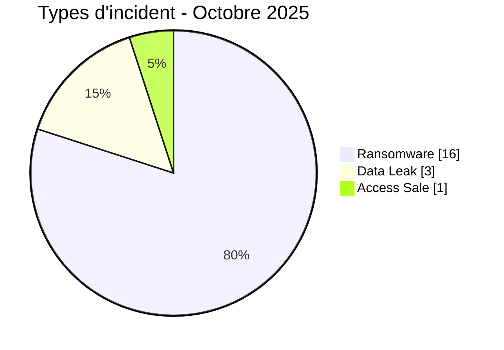
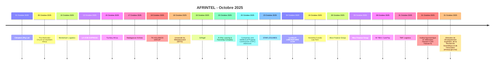

# Rapport CTI AFRINTEL - Cybermenaces en Afrique - Octobre 2025

👉🏾 [English version](./README.md)

   

## 1. Synthèse exécutive

En Octobre 2025, AFRINTEL documente **20 cyberincidents** affectant des organisations et services numériques dans **11 pays africains**.

Le paysage est dominé par **Ransomware avec 16 fiches (80,0 %)**, suivi de **Data Leak avec 3 (15,0 %)**. Les autres types observés sont Access Sale 1.

La concentration géographique est marquée : **Afrique du Sud (5)**, **Maroc (5)**, **Kenya (2)** représentent ensemble **12 fiches, soit 60,0 % du mois**. Cette concentration doit être interprétée comme la visibilité du corpus AFRINTEL et non comme un taux national exhaustif de compromission.

Sur le plan sectoriel, les catégories les plus représentées sont **Transport / Logistique (4)**, **Finance / Banque (4)**, **Non précisé (2)**. Les labels d'acteurs les plus fréquents sont `incransom` (4), `qilin` (3), `tengu` (2). `Unknown`, lorsqu'il apparaît, désigne une absence d'attribution et non un groupe cybercriminel.

La maturité des preuves reste variable : **17 fiches** relèvent de claims non vérifiés ou accompagnés d'échantillons. AFRINTEL conserve une séparation stricte entre **faits observés, revendications, corroborations, confirmations officielles et inconnues techniques**.

Par rapport à Septembre, le volume mensuel **augmente de 1 fiche**. Les variations les plus visibles concernent Ransomware 11->16 (+5), Data Leak 7->3 (-4), Access Sale 0->1 (+1).

> **Note de lecture :** les chiffres AFRINTEL décrivent les incidents documentés et la visibilité des menaces observées. Ils ne constituent pas une mesure exhaustive de toutes les cyberattaques réellement survenues en Afrique.

### 1.1 Comparaison avec le mois précédent

| Indicateur | Septembre 2025 | Octobre 2025 | Évolution |
|---|---:|---:|---:|
| Total incidents | 19 | 20 | **+1 (+5,3 %)** |
| Ransomware | 11 | 16 | **+5 (+45,5 %)** |
| Data Leak | 7 | 3 | **-4 (-57,1 %)** |
| Access Sale | 0 | 1 | **+1 (nouveau)** |
| DDoS | 1 | 0 | **-1 (-100,0 %)** |
| Defacement | 0 | 0 | **Stable** |
| Account Takeover | 0 | 0 | **Stable** |
| System Intrusion | 0 | 0 | **Stable** |
| Malware | 0 | 0 | **Stable** |
| Operational Fraud | 0 | 0 | **Stable** |

## 2. Méthodologie

- **Périmètre :** 54 pays africains ; période de référence : Octobre 2025.
- **Source de vérité :** couple validé `victims_FR.md` / `victims.md`.
- **Classification :** Ransomware, Data Leak, Access Sale, DDoS, Defacement, Account Takeover, System Intrusion, Malware et Operational Fraud.
- **Comptage :** une fiche canonique correspond à un cyberincident documenté ; les dossiers en investigation restent hors statistiques.
- **Chronologie :** `Date de l'incident` et `Date de publication initiale` sont séparées. Une publication ultérieure ne déplace pas artificiellement un incident vers un autre mois lorsque la chronologie est suffisamment établie.
- **Dates incertaines :** lorsqu'un jour exact n'est pas connu, le mois ou la fenêtre soutenue par les preuves est conservé.
- **Sources :** les liens publics sont conservés pour les incidents complémentaires identifiés par recherche OSINT/web ; ils ne sont pas imposés rétroactivement aux observations historiques ou Dark Web directes.
- **Preuve :** type d'incident, statut, confiance, impact et provenance restent des dimensions distinctes.
- **Secteurs :** normalisation calculée une seule fois à partir du corpus structuré, puis utilisée à l'identique en FR et EN.
- **Limite :** les fréquences reflètent la visibilité AFRINTEL et non l'ensemble des compromissions réelles sur le continent.

## 3. Vue d'ensemble et types d'incident

| Indicateur | Valeur |
|---|---:|
| Incidents documentés | **20** |
| Pays représentés | **11** |
| Régions représentées | **6** |
| Premier pays | **Afrique du Sud (5)** |
| Premier secteur | **Transport / Logistique (4)** |
| Premier label acteur | **incransom (4)** |

| Type d'incident | Fiches | Part |
|---|---:|---:|
| Ransomware | 16 | 80,0 % |
| Data Leak | 3 | 15,0 % |
| Access Sale | 1 | 5,0 % |
| DDoS | 0 | 0,0 % |
| Defacement | 0 | 0,0 % |
| Account Takeover | 0 | 0,0 % |
| System Intrusion | 0 | 0,0 % |
| Malware | 0 | 0,0 % |
| Operational Fraud | 0 | 0,0 % |
| **Total** | **20** | **100 %** |

## 4. Répartition géographique

| Pays | Total | Ransomware | Data Leak | Access Sale | DDoS | Defacement | Account Takeover | System Intrusion | Malware |
|---|---:|---:|---:|---:|---:|---:|---:|---:|---:|
| Afrique du Sud | **5** | 4 | 0 | 1 | 0 | 0 | 0 | 0 | 0 |
| Maroc | **5** | 3 | 2 | 0 | 0 | 0 | 0 | 0 | 0 |
| Kenya | **2** | 1 | 1 | 0 | 0 | 0 | 0 | 0 | 0 |
| Madagascar | **1** | 1 | 0 | 0 | 0 | 0 | 0 | 0 | 0 |
| Congo (RDC) | **1** | 1 | 0 | 0 | 0 | 0 | 0 | 0 | 0 |
| Gabon | **1** | 1 | 0 | 0 | 0 | 0 | 0 | 0 | 0 |
| Égypte | **1** | 1 | 0 | 0 | 0 | 0 | 0 | 0 | 0 |
| Nigeria | **1** | 1 | 0 | 0 | 0 | 0 | 0 | 0 | 0 |
| Tanzanie | **1** | 1 | 0 | 0 | 0 | 0 | 0 | 0 | 0 |
| Tunisie | **1** | 1 | 0 | 0 | 0 | 0 | 0 | 0 | 0 |
| Algérie | **1** | 1 | 0 | 0 | 0 | 0 | 0 | 0 | 0 |
| **Total** | **20** | **16** | **3** | **1** | **0** | **0** | **0** | **0** | **0** |

> `Operational Fraud = 0` ce mois-ci ; la colonne est omise pour préserver la lisibilité.

## 5. Répartition régionale

| Région | Fiches | Part |
|---|---:|---:|
| Afrique du Nord | 8 | 40,0 % |
| Afrique australe | 5 | 25,0 % |
| Afrique de l'Est | 3 | 15,0 % |
| Afrique centrale | 2 | 10,0 % |
| Océan Indien | 1 | 5,0 % |
| Afrique de l'Ouest | 1 | 5,0 % |
| **Total** | **20** | **100 %** |

La région la plus représentée est **Afrique du Nord avec 8 fiches (40,0 %)**.

## 6. Impact sectoriel

| Secteur | Fiches | Part | Activité |
|---|---:|---:|---|
| Transport / Logistique | 4 | 20,0 % | ████ |
| Finance / Banque | 4 | 20,0 % | ████ |
| Non précisé | 2 | 10,0 % | ██ |
| Éducation / Université | 2 | 10,0 % | ██ |
| Gouvernement / Administration | 2 | 10,0 % | ██ |
| Santé / Médical | 2 | 10,0 % | ██ |
| Construction / Immobilier | 1 | 5,0 % | █ |
| Mines | 1 | 5,0 % | █ |
| Agriculture / Agro-industrie | 1 | 5,0 % | █ |
| Juridique | 1 | 5,0 % | █ |
| **Total** | **20** | **100 %** | |

## 7. Acteurs / groupes

`Unknown` correspond à une absence d'attribution, pas à un acteur.

| Acteur / Groupe | Fiches | Activité |
|---|---:|---|
| incransom | 4 | ████ |
| qilin | 3 | ███ |
| tengu | 2 | ██ |
| beast | 1 | █ |
| brotherhood | 1 | █ |
| medusa | 1 | █ |
| TheGentlemen | 1 | █ |
| radar | 1 | █ |
| clop | 1 | █ |
| BlackShrantac | 1 | █ |
| fuckoverflow (claimed seller) | 1 | █ |
| Kazu | 1 | █ |
| DBhacker_BF | 1 | █ |
| EternalRed | 1 | █ |

## 8. Maturité des preuves

| Maturité de preuve | Fiches | Part |
|---|---:|---:|
| Claim - Unverified | 10 | 50,0 % |
| Claim - Data Sample Published | 7 | 35,0 % |
| Data Fully Published | 1 | 5,0 % |
| Corroboré / preuve secondaire | 2 | 10,0 % |
| **Total** | **20** | **100 %** |

Les statuts de preuve décrivent le niveau de validation disponible ; ils ne changent pas le type technique de l'incident.

## 9. Chronologie

## 10. Analyse CTI mensuelle

### Ransomware

**16 fiches** sont classées Ransomware. Principaux pays : Afrique du Sud (4), Maroc (3), Kenya (1). Une publication sur un leak site ne prouve pas, à elle seule, le chiffrement ou l'exfiltration complète.

### Data Leak

**3 fiches** sont classées Data Leak. Principaux pays : Maroc (2), Kenya (1). AFRINTEL distingue les données effectivement observées des volumes globaux revendiqués.

### Access Sale

**1 fiche(s)** relèvent d'Access Sale. Répartition : Afrique du Sud (1). Une offre d'accès ne prouve pas automatiquement une exfiltration ou une compromission de l'ensemble de l'infrastructure.

## 11. Incidents notables

| Pays | Organisation | Type | Statut | Impact | Confiance |
|---|---|---|---|---|---|
| Kenya | M-TIBA / CarePay | Data Leak | Corroborated - Data Sample Independently Reviewed + Regulator Investigation | Level 4 | High |
| Congo (RDC) | TK HOLDINGS GROUP | Ransomware | Claim - Data Sample Published | Level 4 | Medium |
| Afrique du Sud | Companies and Intellectual Property Commission (CIPC) eServices | Access Sale | Claim - Unverified Marketplace Listing | Level 4 | Medium |
| Maroc | LA VOIE EXPRESS | Ransomware | Claim - Data Sample Published | Level 3 | Very High |
| Maroc | STAR LÉGUMES | Ransomware | Claim - Data Sample Published | Level 3 | Very High |

> Ce tableau met en avant jusqu'à cinq fiches selon le niveau d'impact, la confirmation et la confiance structurés. Il ne constitue pas un classement absolu de gravité.

## 12. Principaux enseignements et lacunes de renseignement

- **Concentration géographique :** Afrique du Sud représente 5 fiches (25,0 %), devant Maroc (5) et Kenya (2).
- **Structure de menace :** Ransomware est le premier type avec 16 fiches, suivi de Data Leak (3).
- **Secteurs :** Transport / Logistique (4) et Finance / Banque (4) concentrent la plus forte visibilité.
- **Acteurs :** les labels les plus fréquents sont incransom (4), qilin (3) et tengu (2).
- **Preuve :** 17 fiches reposent sur des claims non vérifiés ou accompagnés d'un échantillon ; ces statuts ne valent pas confirmation technique complète.

### Intelligence gaps

- vecteur d'accès initial souvent non public ;
- date technique exacte de compromission parfois inconnue ;
- volumes revendiqués rarement vérifiables intégralement ;
- attribution technique souvent limitée au pseudonyme ou label de publication ;
- informations publiques sur remédiation, cause racine et conclusions DFIR encore limitées.

Ces lacunes doivent guider la collecte sans être remplacées par des hypothèses.

## 13. Recommandations

### Organisations

- imposer MFA résistante au phishing sur les comptes privilégiés, VPN, messagerie, réseaux sociaux et consoles d'administration ;
- appliquer PAM, moindre privilège, segmentation et rotation des secrets ;
- maintenir des sauvegardes immuables et tester la restauration ;
- renforcer les applications publiques, API et interfaces administratives ;
- formaliser réponse à incident et notification des violations de données.

### SOC et détection

- surveiller les authentifications anormales, changements MFA, créations de comptes privilégiés et élévations de rôles ;
- détecter lectures massives de bases, exports inhabituels, créations d'archives et transferts sortants volumineux ;
- corréler EDR, IAM, VPN, WAF, proxy, DNS, cloud et journaux applicatifs ;
- distinguer DDoS, intrusion interne, compromission de compte et fuite de données pour éviter les conclusions non étayées.

### CTI

- conserver séparément date d'incident, publication initiale, première observation, échantillon, divulgation et confirmation ;
- suivre republications et reventes sans les compter automatiquement comme nouvelles compromissions ;
- maintenir la hiérarchie de preuve entre claim, corroboration et confirmation ;
- valider la parité FR/EN avant toute génération de statistiques.

## 14. Conclusion

Le mois de **Octobre 2025** compte **20 cyberincidents documentés** dans **11 pays africains**. La lecture mensuelle montre que la valeur CTI ne réside pas seulement dans le volume, mais dans la distinction entre **type d'incident, chronologie, niveau de preuve, géographie, secteur et acteur**.

Le rapport conserve ainsi une photographie structurée de la menace observable tout en maintenant les revendications, corroborations, confirmations et inconnues à leur niveau de preuve réel.

👉🏾 [Voir les victimes du mois](./victims_FR.md)

**AFRINTEL** - TLP:CLEAR
