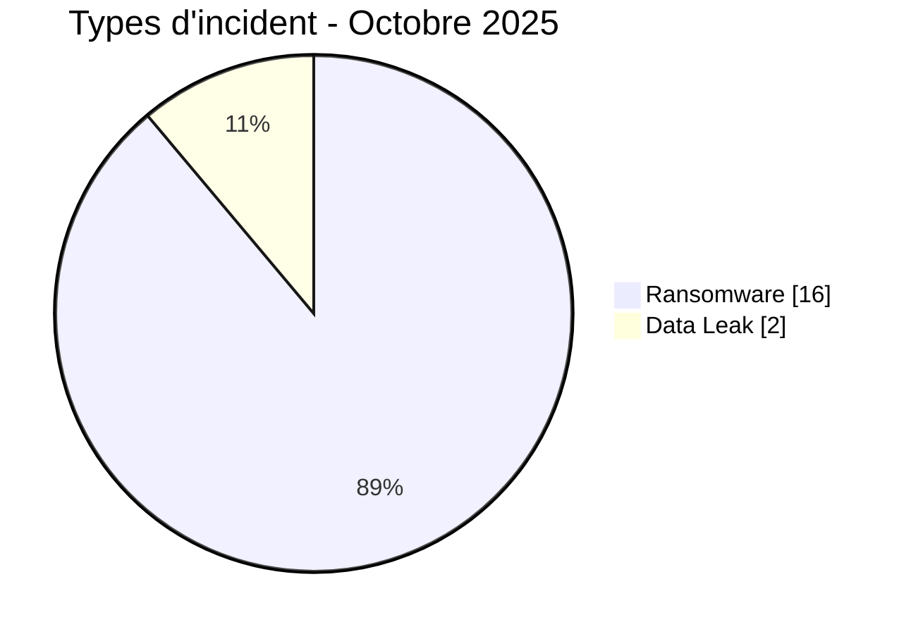
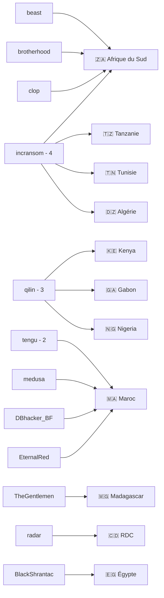
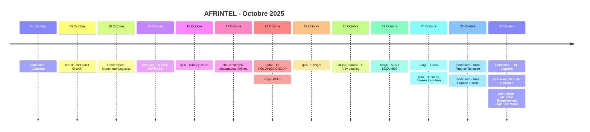

# Rapport CTI - Cyberattaques en Afrique - Octobre 2025

👉🏾 [**English version available here**](./README.md)

## 1. Synthèse exécutive

Octobre 2025 compte **18 incidents uniques dans 11 pays africains** : **16 Ransomware** et **2 Data Leak**. Aucun Access Sale, DDoS, Defacement ou Operational Fraud n'est enregistré.

Le fichier source contenait 19 fiches. La publication `meamargroup.com` du 13 octobre est toutefois reliée au même ensemble de preuves que l'incident MeamarGroup du 5 septembre et n'est donc pas comptée comme un nouvel incident dans les statistiques harmonisées.

- **Maroc** : 5 incidents, dont 3 Ransomware et 2 Data Leak.
- **Afrique du Sud** : 4 Ransomware.
- Les neuf autres pays comptent 1 incident chacun.
- **incransom** est le groupe le plus visible avec 4 fiches, devant **qilin** avec 3 et **tengu** avec 2.
- Les deux Data Leak marocains sont attribués à **DBhacker_BF** et **EternalRed** ; aucun acteur `Unknown` n'est nécessaire.
- **LA VOIE EXPRESS** : échantillons comptables, logistiques et commerciaux cohérents avec une compromission étendue.
- **WITS** : statut Data Fully Published fondé sur la présence d'une section de téléchargement par magnet link, sans téléchargement du contenu par AFRINTEL.
- **TMF Logistics** : documents financiers et opérationnels cohérents avec la revendication ; 39 Go restent un volume revendiqué.
- **IAV Hassan II** : 4 208 enregistrements de candidats dans la base examinée.
- **Ministère marocain de l'Enseignement Supérieur** : fichier de 942 930 lignes correspondant au volume annoncé ; les métadonnées indiquent une extraction compilée vers décembre 2022.
- **Alios Finance Group** : 100 Go revendiqués pour chacune des opérations Tanzanie et Tunisie.

### 📋 Liste des victimes

👉🏾 [Voir la liste complète des victimes](./victims_FR.md)

### 1.1 Comparaison avec le mois précédent

| Indicateur | Septembre 2025 | Octobre 2025 | Évolution observée |
|---|---:|---:|---:|
| Total incidents | 18 | 18 | **0 (stable)** |
| Ransomware | 11 | 16 | **+5 (+45,5 %)** |
| Data Leak | 7 | 2 | **-5 (-71,4 %)** |
| Access Sale | 0 | 0 | **0 (stable)** |
| DDoS | 0 | 0 | **0 (stable)** |
| Defacement | 0 | 0 | **0 (stable)** |
| Operational Fraud | 0 | 0 | **0 (stable)** |

## 2. Méthodologie

- **Périmètre** : 54 pays africains.
- **Période** : 1er au 31 octobre 2025.
- **Sources** : OSINT, leak sites, forums underground, publications d'acteurs et échantillons disponibles.
- **Source de vérité** : couple validé `victims_FR.md` / `victims.md`.
- **Déduplication** : une republication ou un nouvel affichage du même ensemble de preuves n'est pas compté comme une nouvelle compromission sans élément soutenant un incident distinct.
- **Taxonomie** : Ransomware, Data Leak, Access Sale, DDoS, Defacement, Operational Fraud.
- **Qualification** : revendication, échantillon, publication complète et confirmation technique restent distincts.

## 3. Vue d'ensemble

### 3.1 Répartition par type d'incident

| Type d'incident | Nombre | Part |
|---|---:|---:|
| Ransomware | 16 | 88,9 % |
| Data Leak | 2 | 11,1 % |
| Access Sale | 0 | 0,0 % |
| DDoS | 0 | 0,0 % |
| Defacement | 0 | 0,0 % |
| Operational Fraud | 0 | 0,0 % |
| **Total** | **18** | **100 %** |

### 3.2 Répartition par pays

| Pays | Ransomware | Data Leak | Total | Distribution |
|---|---:|---:|---:|---|
| 🇲🇦 Maroc | 3 | 2 | 5 | 🟧🟧🟧🟦🟦 |
| 🇿🇦 Afrique du Sud | 4 | 0 | 4 | 🟧🟧🟧🟧 |
| 🇪🇬 Égypte | 1 | 0 | 1 | 🟧 |
| 🇩🇿 Algérie | 1 | 0 | 1 | 🟧 |
| 🇨🇩 RDC | 1 | 0 | 1 | 🟧 |
| 🇬🇦 Gabon | 1 | 0 | 1 | 🟧 |
| 🇰🇪 Kenya | 1 | 0 | 1 | 🟧 |
| 🇲🇬 Madagascar | 1 | 0 | 1 | 🟧 |
| 🇳🇬 Nigeria | 1 | 0 | 1 | 🟧 |
| 🇹🇿 Tanzanie | 1 | 0 | 1 | 🟧 |
| 🇹🇳 Tunisie | 1 | 0 | 1 | 🟧 |
| **Total** | **16** | **2** | **18** | |

### 3.3 Répartition par région

| Région | Incidents | Part | Activité |
|---|---:|---:|---|
| Afrique du Nord | 8 | 44,4 % | ██████████ |
| Afrique australe | 4 | 22,2 % | █████ |
| Afrique de l'Est | 3 | 16,7 % | ████ |
| Afrique centrale | 2 | 11,1 % | ██ |
| Afrique de l'Ouest | 1 | 5,6 % | █ |
| **Total** | **18** | **100 %** | |

### 3.4 Répartition sectorielle harmonisée

| Secteur | Incidents | Part | Activité |
|---|---:|---:|---|
| Transport / Logistique / Aviation | 4 | 22,2 % | ██████████ |
| Finance / Banque | 3 | 16,7 % | ████████ |
| Éducation / Université | 2 | 11,1 % | █████ |
| Construction / CVC | 1 | 5,6 % | ██ |
| Religion / Organisation caritative | 1 | 5,6 % | ██ |
| Technologie / Fintech | 1 | 5,6 % | ██ |
| Mines / Conglomérat | 1 | 5,6 % | ██ |
| Agroalimentaire | 1 | 5,6 % | ██ |
| Commerce de gros / Agroalimentaire | 1 | 5,6 % | ██ |
| Pharmaceutique / Laboratoire | 1 | 5,6 % | ██ |
| Services juridiques | 1 | 5,6 % | ██ |
| Gouvernement / Enseignement supérieur | 1 | 5,6 % | ██ |
| **Total** | **18** | **100 %** | |

### 3.5 Acteurs / groupes

| Acteur / Groupe | Incidents | Activité |
|---|---:|---|
| incransom | 4 | ██████████ |
| qilin | 3 | ████████ |
| tengu | 2 | █████ |
| beast | 1 | ██ |
| brotherhood | 1 | ██ |
| medusa | 1 | ██ |
| TheGentlemen | 1 | ██ |
| radar | 1 | ██ |
| clop | 1 | ██ |
| BlackShrantac | 1 | ██ |
| DBhacker_BF | 1 | ██ |
| EternalRed | 1 | ██ |
| **Total** | **18** | |

### 3.6 Cartographie acteurs -> pays

## 4. Analyse détaillée

### 4.1 Ransomware - 16 incidents

Les 16 fiches Ransomware concernent Climatron, The Methodist Church of Southern Africa, Momentum Logistics, LA VOIE EXPRESS, Turnkey Africa, Madagascar Airlines, TK HOLDINGS GROUP, WITS, SANgel, Al Ahly Leasing & Factoring, STAR LÉGUMES, Le MULTI LABORATOIRE LC2A, Henrietta Ezeoke Law Firm, Alios Finance Group en Tanzanie, Alios Finance Group en Tunisie et TMF Logistics.

Les dossiers disposant des preuves les plus riches incluent LA VOIE EXPRESS, TK HOLDINGS GROUP, WITS, STAR LÉGUMES, LC2A et TMF Logistics.

La publication MeamarGroup du 13 octobre est conservée comme information de cycle de vie, mais n'est pas comptée ici car les éléments examinés correspondent au même ensemble de preuves déjà relié à l'incident de septembre.

### 4.2 Data Leak - 2 incidents

Les deux Data Leak concernent le Maroc :

- **IAV Hassan II**, attribué à DBhacker_BF, avec 4 208 enregistrements de candidats et des champs d'identité, de contact et de parcours académique.
- **Ministère de l'Enseignement Supérieur, de la Recherche Scientifique et de l'Innovation**, attribué à EternalRed, avec un fichier de 942 930 lignes couvrant un ensemble national d'étudiants.

### 4.3 Access Sale - 0 incident

Aucune fiche d'octobre 2025 n'est classée Access Sale.

## 5. Impact sectoriel

Le regroupement conserve au plus près les secteurs des fiches sources.

**Transport / Logistique / Aviation** est la catégorie la plus représentée avec **4 incidents**. **Finance / Banque** suit avec 3. **Éducation / Université** compte 2. Les autres catégories comptent chacune 1 incident.

## 6. Profil des acteurs

**incransom** compte 4 fiches, **qilin** 3 et **tengu** 2. Les neuf autres acteurs apparaissent une fois chacun.

L'ancien README affichait deux entrées `Unknown`, alors que les deux Data Leak marocains sont explicitement attribués à **DBhacker_BF** et **EternalRed** dans les fiches victimes.

## 7. Tendances et lacunes de renseignement

- Total unique : **18 -> 18**, stable.
- Ransomware : **11 -> 16**, +45,5 %.
- Data Leak : **7 -> 2**, -71,4 %.
- Maroc : 5 incidents, premier pays du mois.
- incransom : 4 fiches, premier acteur.
- La déduplication MeamarGroup réduit le total statistique d'octobre de 19 fiches sources à 18 incidents uniques.

Les volumes Alios de 100 Go par pays et TMF Logistics de 39 Go restent des volumes revendiqués. Le torrent WITS n'a pas été téléchargé ni analysé. L'exhaustivité et la source exacte des bases IAV et enssup.gov.ma ne sont pas confirmées indépendamment.

## 8. Chronologie

> Suivi non compté : publication obscura / MeamarGroup du 13 octobre, reliée au même incident sous-jacent déjà documenté en septembre.

## 9. Cartographie MITRE ATT&CK contextuelle

| Phase | Technique | Portée |
|---|---|---|
| Collecte | T1005 - Data from Local System | Fichiers, exports, documents internes et archives observés. |
| Collecte | T1213 - Data from Information Repositories | Bases et exports structurés, notamment IAV et enssup.gov.ma. |
| Impact | T1486 - Data Encrypted for Impact | Contexte applicable aux éléments MeamarGroup contenant des copies chiffrées `.obscura`, sans compter la republication d'octobre comme nouvel incident. |

> Les mappings sont contextuels et ne prouvent pas l'utilisation de chaque technique par chaque acteur.

## 10. Recommandations

- Renforcer MFA, PAM, EDR, segmentation et surveillance des comptes privilégiés.
- Surveiller les exports massifs, accès aux ERP, bases étudiantes, sauvegardes et transferts sortants.
- Pour la logistique, protéger les systèmes de facturation, portefeuilles clients et données de chaîne d'approvisionnement.
- Pour l'enseignement supérieur, limiter les exports nationaux et locaux de données étudiantes et journaliser les accès.
- Pour la finance, renforcer les contrôles sur les référentiels clients, documents contractuels et échanges sensibles.

## 11. Conclusion

Octobre 2025 compte **18 incidents uniques dans 11 pays**, répartis entre **16 Ransomware et 2 Data Leak**. Le volume mensuel reste stable par rapport à septembre, mais la structure change fortement en faveur du Ransomware.

Le Maroc arrive en tête avec 5 incidents. incransom est le groupe le plus visible avec 4 fiches. La déduplication de MeamarGroup et la réattribution correcte des deux Data Leak marocains suppriment les incohérences principales du rapport précédent.

**AFRINTEL** - Initiative ouverte de veille CTI sur l'Afrique
