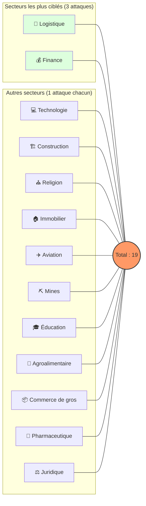
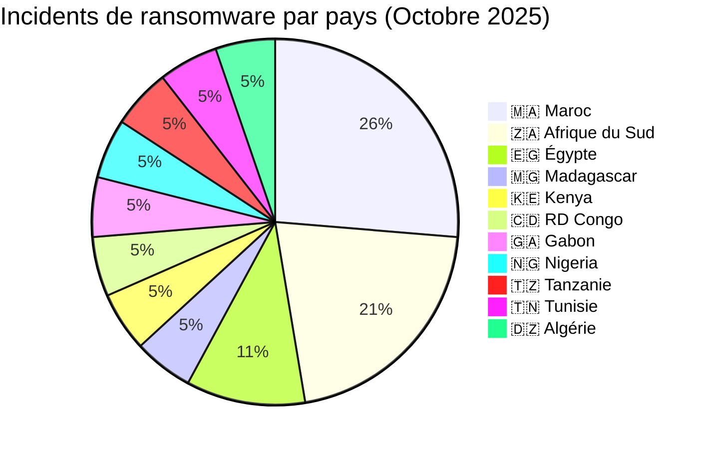
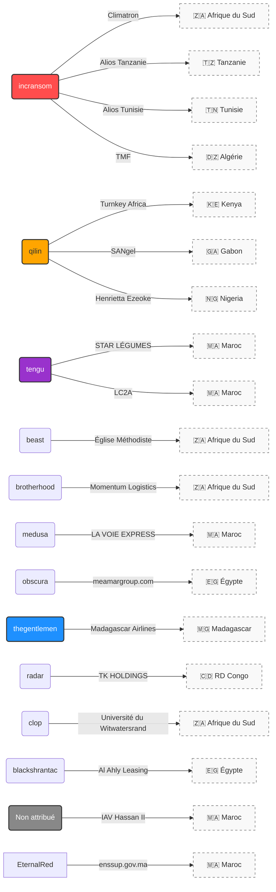

# Rapport CTI : Cyberattaques en Afrique - Octobre 2025 (19 victimes)

👉🏾 [**English version available here**](./README.md)
## 2. Résumé exécutif
Octobre 2025 affiche une activité significative de ransomwares affectant les organisations africaines, avec plusieurs secteurs ciblés, notamment la finance, la logistique, la technologie, l'éducation et l'administration publique. Le mois inclut également deux revendications de fuite de données concernant des établissements marocains de l'enseignement supérieur : IAV Hassan II reste non attribué, tandis qu'enssup.gov.ma est attribué à EternalRed.

Un total de 17 revendications de ransomwares confirmées et 2 revendications de fuite de données, ciblant des organisations opérant dans 11 pays africains, ont été identifiées au cours de cette période.

* **Nombre total d'attaques recensées** : 19
* **Acteurs les plus actifs** : `incransom` (4 attaques), `qilin` (3 attaques), `tengu` (2 attaques).
    * *Autres groupes actifs* : beast, brotherhood, medusa, obscura, thegentlemen, radar, clop, blackshrantac (1 attaque chacun) ; 1 revendication supplémentaire est non attribuée, tandis que la seconde revendication de fuite est attribuée à EternalRed.
* **Secteurs les plus ciblés** : Logistique (3), Finance (3), Éducation (2).
* **Pays les plus touchés** : 🇿🇦 Afrique du Sud (4), 🇲🇦 Maroc (5), 🇪🇬 Égypte (2).
* **Volumes de données exfiltrés notables** : 
    * **Alios Finance Group** (Tanzanie & Tunisie) : 100 Go chacun.
    * **TMF Logistics** (Algérie) : 39 Go.
    * **Ministère de l'Enseignement Supérieur (enssup.gov.ma)** (Maroc) : extraction nationale d'étudiants, 942 930 enregistrements.

---

## 3. Statistiques clés

### 3.1 Répartition par groupe ransomware
| Groupe / Acteur | Nombre d'attaques |
| :--- | :---: |
| **incransom** | 4 |
| **qilin** | 3 |
| **tengu** | 2 |
| Autres (beast, brotherhood, etc.) | 8 |
| Non attribué | 2 |
| **Total** | **19** |

### 3.2 Répartition par secteur d'activité
| Secteur | Nombre d'attaques |
| :--- | :---: |
| Logistique | 3 |
| Finance | 3 |
| Éducation | 2 |
| Technologies | 1 |
| Construction | 1 |
| Religion | 1 |
| Administration publique | 1 |
| Immobilier | 1 |
| Aviation | 1 |
| Mines | 1 |
| Agroalimentaire | 1 |
| Commerce de gros | 1 |
| Pharmaceutique | 1 |
| Juridique | 1 |
| **Total** | **19** |

### 3.3 Répartition par pays
| Pays | Nombre d'attaques |
| :--- | :---: |
| 🇿🇦 Afrique du Sud | 4 |
| 🇲🇦 Maroc | 5 |
| 🇪🇬 Égypte | 2 |
| 🇰🇪 Kenya | 1 |
| 🇲🇬 Madagascar | 1 |
| 🇨🇩 RDC | 1 |
| 🇬🇦 Gabon | 1 |
| 🇳🇬 Nigeria | 1 |
| 🇹🇿 Tanzanie | 1 |
| 🇹🇳 Tunisie | 1 |
| 🇩🇿 Algérie | 1 |
| **Total** | **19** |

---

## 4. Détail des attaques par groupe ransomware

### 4.1 incransom (4 attaques)
* **01/10/2025** : Climatron (Afrique du Sud, construction) – Revendication & divulgation.
* **28/10/2025** : Alios Finance Group (Tanzanie, finance) – **100 Go exfiltrés**.
* **28/10/2025** : Alios Finance Group (Tunisie, finance) – **100 Go exfiltrés**.
* **31/10/2025** : TMF Logistics (Algérie, logistique) – **39 Go exfiltrés**.
> **Remarque** : incransom a ciblé plusieurs entités dans différents secteurs et pays, avec des volumes d'exfiltration importants.

### 4.2 qilin (3 attaques)
* **15/10/2025** : Turnkey Africa (Kenya, technologies/fintech) – Revendication & divulgation.
* **19/10/2025** : SANgel (Gabon, agroalimentaire) – Revendication & divulgation.
* **24/10/2025** : Henrietta Ezeoke Law Firm (Nigeria, juridique) – Revendication & divulgation.
> **Remarque** : qilin a fait preuve de polyvalence en attaquant les secteurs technologique, agroalimentaire et juridique.

### 4.3 tengu (2 attaques)
* **23/10/2025** : STAR LÉGUMES (Maroc, commerce de gros) – Revendication & divulgation.
* **24/10/2025** : Le MULTI LABORATOIRE LC2A (Maroc, pharmaceutique) – Revendication & divulgation.
> **Remarque** : tengu a concentré ses attaques sur des entreprises marocaines.

### 4.4 Autres groupes (1 attaque chacun)
* **beast** (05/10) : The Methodist Church of Southern Africa (Afrique du Sud, religion).
* **brotherhood** (10/10) : Momentum Logistics (Afrique du Sud, logistique).
* **medusa** (13/10) : LA VOIE EXPRESS (Maroc, logistique).
* **obscura** (13/10) : meamargroup.com (Égypte, immobilier) – **3ème attaque contre cette entreprise**.
* **thegentlemen** (17/10) : Madagascar Airlines (Madagascar, aviation).
* **radar** (18/10) : TK HOLDINGS GROUP (RDC, mines/conglomérat).
* **clop** (18/10) : Université du Witwatersrand (Afrique du Sud, éducation).
* **blackshrantac** (20/10) : Al Ahly Leasing & Factoring (Égypte, finance).

### 4.5 Revendications et attributions des jeux de données marocains (2 attaques)
* **31/10/2025** : Institut Agronomique et Vétérinaire Hassan II - IAV Hassan II (Maroc, Éducation) – Claim - Data Sample Published. Base de données de candidats structurée, 4 208 enregistrements (CIN, coordonnées, filière).
* **25/10/2025** : Ministère de l'Enseignement Supérieur, de la Recherche Scientifique et de l'Innovation - enssup.gov.ma (Maroc, Administration publique / Éducation) – Claim - Data Sample Published. Publication attribuée à EternalRed ; extraction nationale d'étudiants, 942 930 enregistrements.

### 4.6 Graphe acteur → victim → pays

---

## 5. Analyse sectorielle
* **Logistique (3)** : Ciblé par brotherhood, medusa et incransom. Secteur hautement vulnérable.
* **Finance (3)** : Grosses exfiltrations (Alios, Al Ahly).
* **Technologies (1)** : Turnkey Africa (Fintech panafricaine).
* **Immobilier (1)** : Cas particulier de Meamar Group, frappé pour la 2ème fois.
* **Autres** : Santé, Mines, Aviation, Éducation, tous touchés au moins une fois.

---

## 6. Analyse géographique
* **Maroc** : Pays le plus touché (5), entre logistique/commerce revendiqués et deux fuites de données dans l'enseignement supérieur ; l'une reste non attribuée et l'autre est liée à EternalRed.
* **Afrique du Sud** : Deuxième position (4). Diversité sectorielle totale.
* **Égypte** : Focus immobilier et finance (2).
* **Répartition** : Afrique du Nord (9 attaques, incluant les deux revendications marocaines de l'enseignement supérieur) vs Afrique subsaharienne (10 attaques), montrant une menace globalisée sur tout le continent.

---

## 7. TTPs observées (Tactics, Techniques & Procedures)
* **Exfiltration massive** : Focalisation sur le vol de données sensibles (jusqu'à 100 Go) pour maximiser l'extorsion.
* **Ciblage répété** : Exemple de *meamargroup.com*, illustrant des vulnérabilités persistantes non corrigées.
* **Fragmentation de l'écosystème** : 12 groupes différents actifs en un seul mois.

---

## 8. Recommandations
1.  **Secteurs Logistique & Finance** : Chiffrement des données au repos, segmentation réseau et surveillance des flux sortants (exfiltration).
2.  **Secteur Public** : Audits de sécurité réguliers et durcissement des accès (IAM).
3.  **Éducation & Recherche** : Protection des données personnelles et authentification multi-facteurs (MFA) obligatoire.
4.  **Général : Tester régulièrement les plans de réponse aux incidents :**
    * **BCP (Business Continuity Plan)** / **PCA (Plan de Continuité d'Activité)** : Pour assurer le maintien des opérations critiques de l'entreprise pendant l'attaque.
    * **DRP (Disaster Recovery Plan)** / **PRA (Plan de Reprise d'Activité)** : Pour garantir la restauration rapide des infrastructures informatiques et des données après l'incident.

---

## 9. Conclusion
Octobre 2025 confirme que l'Afrique est une cible majeure pour le cyber-extorsion. La prédominance du groupe ransomware  INC Ransom (`incransom`) et la récurrence des attaques sur certaines cibles soulignent un besoin urgent de renforcement des capacités de défense et d'une meilleure hygiène informatique à l'échelle continentale.

---

### ✍🏿 Auteur
**Adama ASSIONGBON** *Consultant SOC & Cyber Threat Intelligence* [Profil LinkedIn](https://www.linkedin.com/in/adama-assiongbon-9029893a/)

**AFRINTEL** - *Initiative ouverte de veille CTI sur l’Afrique*
