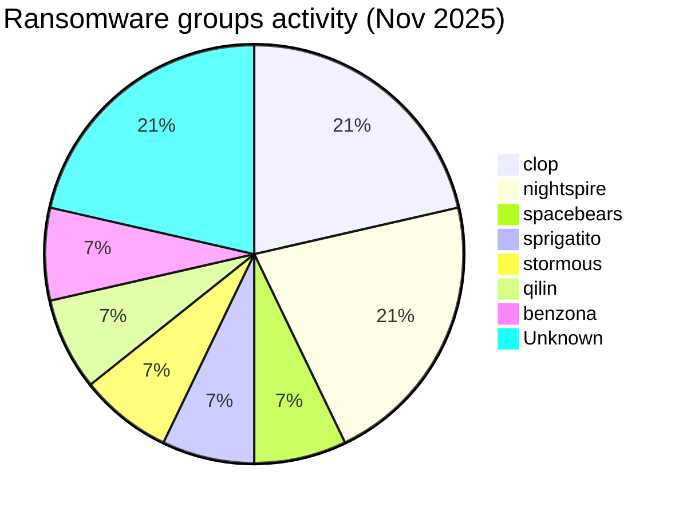
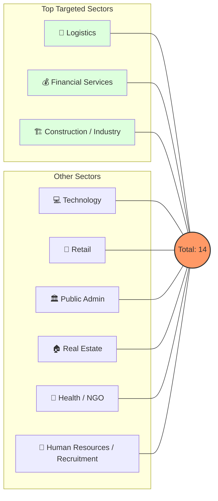
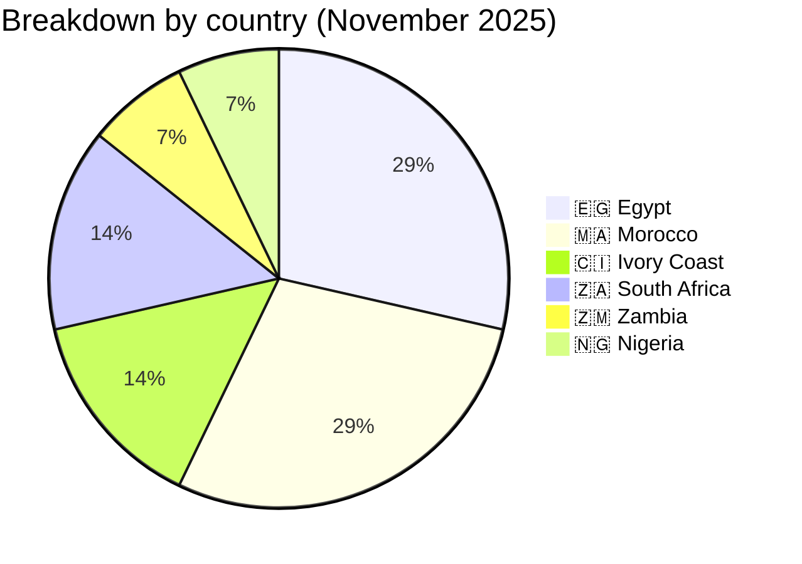
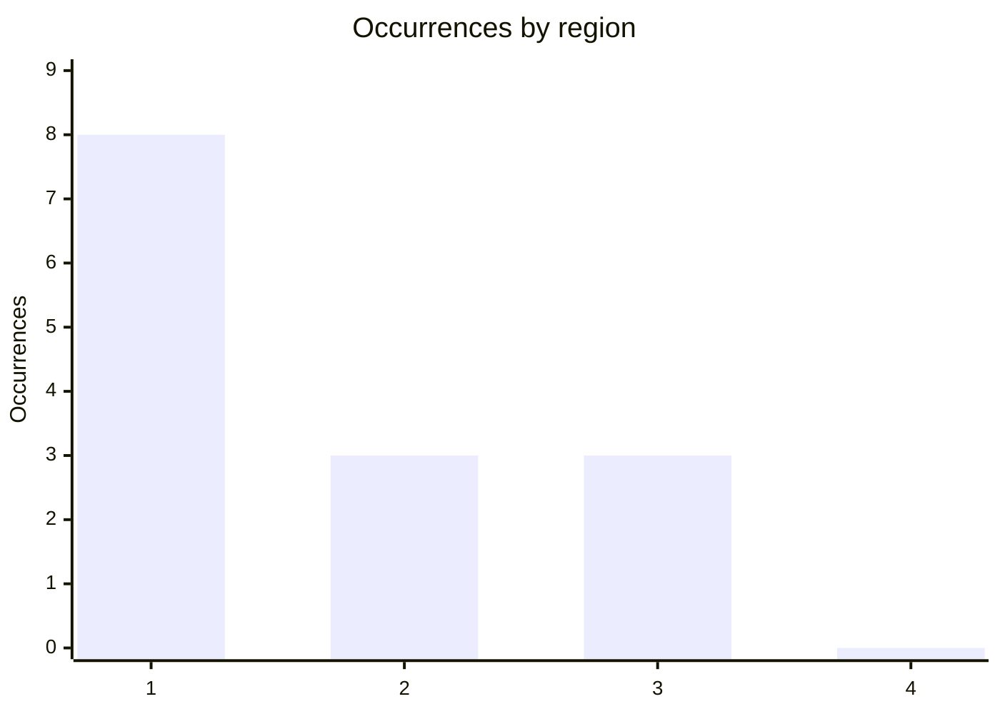
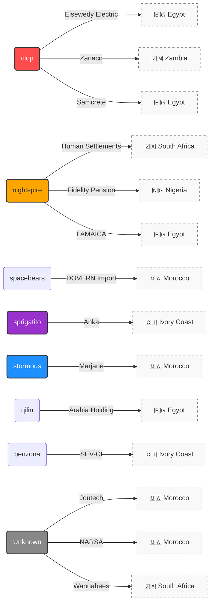

# CTI Report: Cyberattacks in Africa - November 2025 (14 victims)

👉🏾 [**French version available here**](./README_FR.md)

## 1. Introduction
This **Cyber Threat Intelligence (CTI)** report provides a detailed analysis of cyberattacks recorded across Africa during November 2025. Data is gathered from **OSINT** sources and ransomware group leak sites, compiled under the **AFRINTEL** project. The goal is to provide a clear overview of trends, threat actors, targeted sectors, and associated indicators of compromise.

---

## 2. Executive summary
November 2025 shows persistent ransomware activity affecting African organizations, with a notable focus on Egypt and Morocco. A total of 10 ransomware claims and 4 data-leak claims, targeting organizations in 6 African countries, were identified.

* **Total recorded attacks**: 14
* **Most active threat actors**: `clop` (3 attacks), `nightspire` (3 attacks).
    * *Other active groups*: spacebears, sprigatito, stormous, qilin, benzona (1 attack each); 3 additional claims are unattributed.
* **Most targeted sectors**: Logistics (2), Financial Services (2), Construction/Industry (2), Technology (2), Public Administration (2).
* **Most affected countries**: 🇪🇬 Egypt (4), 🇲🇦 Morocco (4), 🇨🇮 Ivory Coast (2), 🇿🇦 South Africa (2).
* **Notable data leak**: **Anka** (Ivory Coast) with a 12.1 GB database affecting over 537,000 users.

---

## 3. Key statistics

### 3.1 Breakdown by ransomware group
| Group / Actor | Number of attacks |
| :--- | :---: |
| **clop** | 3 |
| **nightspire** | 3 |
| **spacebears** | 1 |
| **sprigatito** | 1 |
| **stormous** | 1 |
| **qilin** | 1 |
| **benzona** | 1 |
| **Unknown** | 3 |
| **Total** | **14** |


### 3.2 Breakdown by industry sector
| Sector | Number of Attacks |
| :--- | :---: |
| 🚚 Logistics | 2 |
| 💰 Financial Services | 2 |
| 🏗️ Construction / Industry | 2 |
| 💻 Technology | 2 |
| 🏛️ Public Administration | 2 |
| 🛒 Retail / E-commerce | 1 |
| 🏠 Real Estate / Investment | 1 |
| 🏥 Health / NGO | 1 |
| 👥 Human Resources / Recruitment | 1 |
| **Total** | **14** |


### 3.3 Breakdown by country
| Country | Number of Attacks |
| :--- | :---: |
| 🇪🇬 Egypt | 4 |
| 🇲🇦 Morocco | 4 |
| 🇨🇮 Ivory Coast | 2 |
| 🇿🇦 South Africa | 2 |
| 🇿🇲 Zambia | 1 |
| 🇳🇬 Nigeria | 1 |
| **Total** | **14** |


---


<!-- AFRINTEL_CURRENT_MODEL_START -->
### 3.4 Standard global overview

| Country | Ransomware | Leaks / access | Total | Distribution |
| :--- | ---: | ---: | ---: | :--- |
| 🇪🇬 Egypt | 4 | 0 | 4 | 🟧🟧🟧🟧 |
| 🇲🇦 Morocco | 2 | 2 | 4 | 🟧🟧 🟦🟦 |
| 🇨🇮 Ivory Coast | 1 | 1 | 2 | 🟧 🟦 |
| 🇿🇦 South Africa | 1 | 1 | 2 | 🟧 🟦 |
| 🇳🇬 Nigeria | 1 | 0 | 1 | 🟧 |
| 🇿🇲 Zambia | 1 | 0 | 1 | 🟧 |

```pie showData
    title Incident types
    "Ransomware" : 10
    "Leaks and access" : 4
```

### Geographic distribution by region

| Region | Occurrences | Ransomware | Leaks / access | Distribution |
| :--- | ---: | ---: | ---: | :--- |
| North Africa | 8 | 6 | 2 | 🟧🟧🟧🟧🟧🟧 🟦🟦 |
| Southern Africa | 3 | 2 | 1 | 🟧🟧 🟦 |
| West and Central Africa | 3 | 2 | 1 | 🟧🟧 🟦 |
| East Africa | 0 | 0 | 0 |  |


Legend: 1 = North Africa; 2 = Southern Africa; 3 = West and Central Africa; 4 = East Africa

### Sector distribution

| Sector | Records | Share | Activity |
| :--- | ---: | ---: | :--- |
| Government / Administration | 3 | 21.4% | ██████████ |
| Technology / IT | 3 | 21.4% | ██████████ |
| Finance / Banking | 2 | 14.3% | ███████ |
| Transport / Logistics | 2 | 14.3% | ███████ |
| Healthcare / Medical | 1 | 7.1% | ███ |
| Manufacturing / Industry | 1 | 7.1% | ███ |
| Professional / Business Services | 1 | 7.1% | ███ |
| Retail / E-commerce | 1 | 7.1% | ███ |

### Most visible actors

| Actor / Group | Records | Activity |
| :--- | ---: | :--- |
| clop | 3 | ██████████ |
| nightspire | 3 | ██████████ |
| RL000 | 1 | ███ |
| Spirigatito, post published on a cybercriminal forum | 1 | ███ |
| Unknown | 1 | ███ |
| anisanas2 | 1 | ███ |
| benzona | 1 | ███ |
| qilin | 1 | ███ |
| spacebears | 1 | ███ |
| stormous | 1 | ███ |
<!-- AFRINTEL_CURRENT_MODEL_END -->
## 4. Attack details by ransomware group
### 4.1 clop (3 attacks)
* **2025-11-06**: ELSEWEDYELECTRIC.COM (Egypt, Tech/Industry) - Claimed & Leaked.
* **2025-11-06**: ZANACO.CO.ZM (Zambia, Banking) - Claimed & Leaked.
* **2025-11-11**: Samcrete Holding (Egypt, Construction) - Claimed & Leaked.

### 4.2 nightspire (3 attacks)
* **2025-11-09**: Eastern Cape Dept. of Human Settlements (South Africa, Public Admin) - Claimed & Leaked.
* **2025-11-09**: Fidelity Pension Managers (Nigeria, Finance) - Claimed & Leaked.
* **2025-11-25**: LAMAICA (Egypt, Manufacturing) - Claimed & Leaked.

### 4.3 Other groups (1 attack each)
* **spacebears** (Nov 04): DOVERN Import (Morocco, Logistics) - Claimed & Threat.
* **sprigatito** (Nov 05): Anka (Ivory Coast, Logistics) - 12.1 GB data leak.
* **stormous** (Nov 06): Marjane (Morocco, Retail) - Claimed & Leaked.
* **qilin** (Nov 26): Arabia Holding (Egypt, Real Estate) - Claimed & Leaked.
* **benzona** (Nov 26): SEV-CI (Ivory Coast, Health/NGO) - Claimed & Leaked.

### 4.4 Unattributed claims (3 attacks)
* **2025-11-08**: NARSA - Agence Nationale de la Sécurité Routière (Morocco, Public Administration / Transportation) - Claim - Data Sample Published. Vehicle-registration CSV export (~150,000 rows claimed) with owner, vehicle and registration-centre fields.
* **2025-11-30**: Joutech (Morocco, Technology) - Claim - Data Sample Published. Newsletter/contact export of 1,350 records; exact business activity not independently confirmed.
* **2025-11-04**: Wannabees (South Africa, Human Resources / Recruitment) - Claim - Data Sample Published. Five-record applicant export reviewed; actor not identified.

### 4.5 Actor → victim → country graph

---

## 5. Industry analysis
* **Logistics (2)**: Targeting of strategic platforms (Dovern Import in Morocco and Anka in Ivory Coast), confirming the vulnerability of regional supply chains.
* **Financial services (2)**: Attacks against a major banking institution (Zanaco in Zambia) and a pension fund manager (Fidelity in Nigeria).
* **Construction / Industry (2)**: Focus on Egyptian industrial leaders (Elsewedy Electric and Samcrete), prime targets for industrial espionage and extortion.
* **Public administration (2)**: Notable incidents in South Africa (Eastern Cape) and Morocco (NARSA vehicle-registration data), a reminder that citizen services remain a preferred target.
* **Human Resources / Recruitment (1)**: Wannabees shows the exposure risk of recruitment databases containing identity, employment and remuneration data.

---

## 6. Geographical analysis
* **🇪🇬 Egypt**: Epicenter of activity this month with **4 victims**. The targeting is exclusively industrial and technological.
* **🇲🇦 Morocco**: Activity with **4 victims** (Logistics, Retail, a public-sector road-safety agency and an unattributed Technology data-leak claim), affecting major players in the local market.
* **🇨🇮 Ivory Coast**: Emergence of high-impact attacks (2 victims), notably with the massive user data leak from the Anka platform.
* **Global Distribution**: **North Africa (8 attacks)** vs **Sub-Saharan Africa (6 attacks)**. The threat is particularly concentrated on the continent's economic powerhouses (Egypt, Morocco, South Africa, Nigeria).

---

## 7. Observed TTPs (Tactics, Techniques & Procedures)
* **Large-scale B2C Data Leaks**: The Anka incident (537,000 users) demonstrates a intent to damage reputation and monetize personal data on cybercrime forums.
* **Critical Infrastructure Targeting**: The attack on Elsewedy Electric highlights the risks facing the energy sector and industrial systems.

---

## 8. Recommendations
1.  **Logistics & Retail Sectors**: Harden customer database security and increase monitoring of API access and SQL dump attempts.
2.  **Financial Sector**: Enhance end-to-end encryption and implement proactive monitoring of transactions and account registry access.
3.  **Health & NGOs**: Protect sensitive data through strict network segmentation to prevent the lateral spread of ransomware.
4.  **General: Regularly test Incident Response plans:**
    * **BCP (Business Continuity Plan)**: To ensure the maintenance of critical business operations during an active cyberattack.
    * **DRP (Disaster Recovery Plan)**: To guarantee the rapid and secure restoration of IT infrastructure and data following the incident.

---

## 9. Conclusion
November 2025 shows a diversification of threat actors (7 named groups plus three unattributed data-leak cases, for 14 victims). The concentration of attacks on Egypt and the targeting of massive user data in West Africa indicate an evolution of extortion strategies toward more varied sectors than traditional finance.

---

### ✍🏿 Author
**Adama ASSIONGBON** *SOC & Cyber Threat Intelligence Consultant* [LinkedIn Profile](https://www.linkedin.com/in/adama-assiongbon-9029893a/)

**AFRINTEL** - *Open CTI Initiative for Africa*
