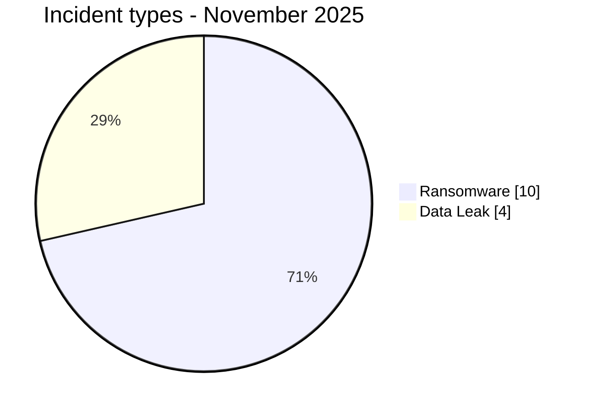
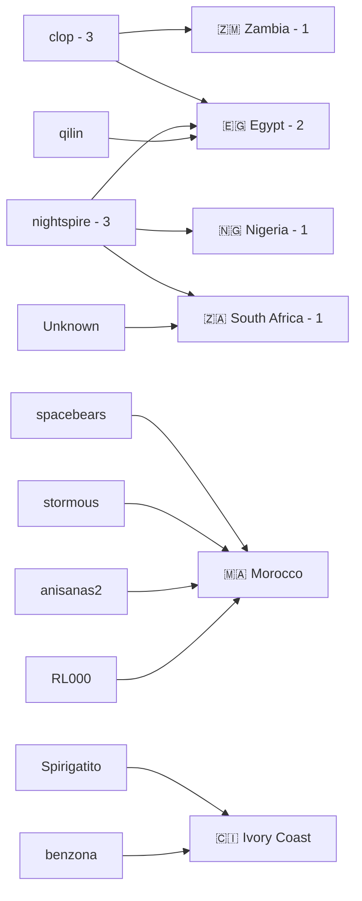
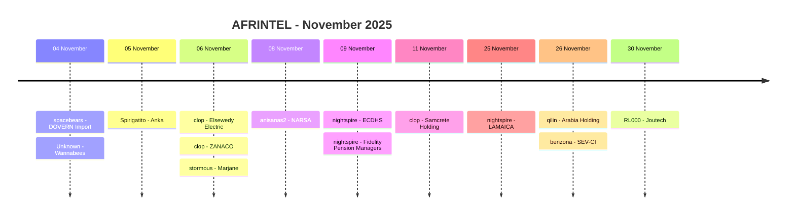

# CTI Report - Cyberattacks in Africa - November 2025

👉🏾 [**French version available here**](./README_FR.md)

## 1. Executive summary

November 2025 contains **14 documented incidents across 6 African countries**: **10 Ransomware** and **4 Data Leak**. No Access Sale, DDoS, Defacement or Operational Fraud is recorded.

- **Egypt**: 4 Ransomware incidents.
- **Morocco**: 4 incidents, including 2 Ransomware and 2 Data Leak.
- **Ivory Coast** and **South Africa**: 2 incidents each, with 1 Ransomware and 1 Data Leak.
- **Zambia** and **Nigeria**: 1 Ransomware each.
- **clop** and **nightspire** are the most visible actors with 3 records each.
- The corpus contains only one unidentified actor: **Wannabees**. Anka is attributed to **Spirigatito**, NARSA to **anisanas2** and Joutech to **RL000**.
- **Anka**: 537,877 users and 12.1 GB are claimed; AFRINTEL reviewed fewer than 30 sample records.
- **Marjane**: a Fortinet SSL-VPN session and internal SSH access are visible in the evidence; AFRINTEL could not collect the later full publication.
- **NARSA**: vehicle-registration export consistent with a claimed dataset of approximately 150,000 rows.
- **Wannabees**: five-record applicant export containing sensitive personal and employment data.
- **Joutech**: 1,350-contact export, with no password or financial data observed.
- **Elsewedy Electric** and **ZANACO** are linked to Clop publications with matching company profiles, without review of underlying exfiltrated files.

### 📋 Victim list

👉🏾 [View the full victim list](./victims.md)

### 1.1 Month-over-month comparison

> The comparison uses the harmonized October 2025 total of **18 unique incidents**, after deduplication of the MeamarGroup lifecycle follow-up.

| Indicator | October 2025 | November 2025 | Observed change |
|---|---:|---:|---:|
| Total incidents | 18 | 14 | **-4 (-22.2%)** |
| Ransomware | 16 | 10 | **-6 (-37.5%)** |
| Data Leak | 2 | 4 | **+2 (+100.0%)** |
| Access Sale | 0 | 0 | **0 (stable)** |
| DDoS | 0 | 0 | **0 (stable)** |
| Defacement | 0 | 0 | **0 (stable)** |
| Operational Fraud | 0 | 0 | **0 (stable)** |

## 2. Methodology

- **Scope**: 54 African countries.
- **Period**: 1-30 November 2025.
- **Sources**: OSINT, leak sites, underground forums, actor publications and available samples.
- **Source of truth**: validated `victims_FR.md` / `victims.md` pair.
- **Counting**: one card equals one unique incident.
- **Taxonomy**: Ransomware, Data Leak, Access Sale, DDoS, Defacement, Operational Fraud.
- **Qualification**: claim, sample, full publication and technical confirmation remain distinct.
- **Visualization**: tables, text bars, simple Mermaid diagrams and a timeline.

## 3. Global overview

### 3.1 Incident-type distribution

| Incident type | Count | Share |
|---|---:|---:|
| Ransomware | 10 | 71.4% |
| Data Leak | 4 | 28.6% |
| Access Sale | 0 | 0.0% |
| DDoS | 0 | 0.0% |
| Defacement | 0 | 0.0% |
| Operational Fraud | 0 | 0.0% |
| **Total** | **14** | **100%** |

### 3.2 Country distribution

| Country | Ransomware | Data Leak | Total | Distribution |
|---|---:|---:|---:|---|
| 🇪🇬 Egypt | 4 | 0 | 4 | 🟧🟧🟧🟧 |
| 🇲🇦 Morocco | 2 | 2 | 4 | 🟧🟧🟦🟦 |
| 🇨🇮 Ivory Coast | 1 | 1 | 2 | 🟧🟦 |
| 🇿🇦 South Africa | 1 | 1 | 2 | 🟧🟦 |
| 🇿🇲 Zambia | 1 | 0 | 1 | 🟧 |
| 🇳🇬 Nigeria | 1 | 0 | 1 | 🟧 |
| **Total** | **10** | **4** | **14** | |

### 3.3 Regional distribution

| Region | Incidents | Share | Activity |
|---|---:|---:|---|
| North Africa | 8 | 57.1% | ██████████ |
| Southern Africa | 3 | 21.4% | ████ |
| West Africa | 3 | 21.4% | ████ |
| Central Africa | 0 | 0.0% |  |
| East Africa | 0 | 0.0% |  |
| **Total** | **14** | **100%** | |

### 3.4 Harmonized sector distribution

| Sector | Incidents | Share | Activity |
|---|---:|---:|---|
| Transport / Logistics | 2 | 14.3% | ██████████ |
| Finance / Banking | 2 | 14.3% | ██████████ |
| Government / Administration | 2 | 14.3% | ██████████ |
| Manufacturing / Industry | 2 | 14.3% | ██████████ |
| Technology / Digital Services | 1 | 7.1% | █████ |
| Human Resources / Recruitment | 1 | 7.1% | █████ |
| Retail / E-commerce | 1 | 7.1% | █████ |
| Construction / Engineering | 1 | 7.1% | █████ |
| Real Estate / Investment | 1 | 7.1% | █████ |
| Healthcare / NGO | 1 | 7.1% | █████ |
| **Total** | **14** | **100%** | |

### 3.5 Actors / groups

| Actor / Group | Incidents | Activity |
|---|---:|---|
| clop | 3 | ██████████ |
| nightspire | 3 | ██████████ |
| spacebears | 1 | ███ |
| Unknown | 1 | ███ |
| Spirigatito | 1 | ███ |
| stormous | 1 | ███ |
| anisanas2 | 1 | ███ |
| qilin | 1 | ███ |
| benzona | 1 | ███ |
| RL000 | 1 | ███ |
| **Total** | **14** | |

### 3.6 Actor -> country mapping

## 4. Detailed analysis

### 4.1 Ransomware - 10 incidents

The 10 Ransomware records concern DOVERN Import, Elsewedy Electric, ZANACO, Marjane, Eastern Cape Department of Human Settlements, Fidelity Pension Managers, Samcrete Holding, LAMAICA, Arabia Holding and SEV-CI.

The most documented cases include:

- **Elsewedy Electric**: Clop claim page matching the company's public profile; no underlying exfiltrated file was reviewed.
- **ZANACO**: Clop page consistent with the bank's public profile; no underlying dataset was collected.
- **Marjane**: internal-access evidence through a Fortinet SSL-VPN session and an SSH access point; later full publication not collected.
- The other cases remain primarily unverified claims in the available cards.

### 4.2 Data Leak - 4 incidents

- **Wannabees**, South Africa: `Unknown` actor, five-record applicant sample.
- **Anka**, Ivory Coast: `Spirigatito`, structured sample consistent with the publication; 537,877 users and 12.1 GB remain actor-claimed.
- **NARSA**, Morocco: `anisanas2`, vehicle-registration export, approximately 150,000 rows claimed.
- **Joutech**, Morocco: `RL000`, 1,350-contact export.

### 4.3 Access Sale - 0 incidents

No November 2025 card is classified as Access Sale.

## 5. Sectoral impact

The leading harmonized groups are **Transport / Logistics**, **Finance / Banking**, **Government / Administration** and **Manufacturing / Industry**, with 2 incidents each.

All other categories contain one record: Technology / Digital Services, Human Resources / Recruitment, Retail / E-commerce, Construction / Engineering, Real Estate / Investment and Healthcare / NGO.

## 6. Threat actor profile

**clop** and **nightspire** lead with **3 records each**.

The other structured values each account for one record: spacebears, Unknown, Spirigatito, stormous, anisanas2, qilin, benzona and RL000.

The previous README described three unattributed claims. Review of the victim cards shows that only Wannabees remains genuinely unattributed. The other three Data Leak records are attributed to Spirigatito, anisanas2 and RL000.

## 7. Trends and intelligence gaps

- Total: **18 -> 14**, down **22.2%**.
- Ransomware: **16 -> 10**, down **37.5%**.
- Data Leak: **2 -> 4**, up **100.0%**.
- Egypt and Morocco each record 4 incidents.
- North Africa accounts for 8 of 14 incidents.
- clop and nightspire each account for 3 records.

Initial-access vectors remain unknown for most incidents. The claimed 537,877 users and 12.1 GB for Anka are not fully validated. Marjane's complete publication was not collected. The Clop cases for Elsewedy Electric and ZANACO were not reviewed beyond the claim pages.

## 8. Timeline

## 9. Contextual MITRE ATT&CK mapping

| Phase | Technique | Scope |
|---|---|---|
| Valid accounts | T1078 - Valid Accounts | Relevant context for the internal SSL-VPN access observed in the Marjane case. |
| Collection | T1005 - Data from Local System | Relevant to reviewed local files and exports. |
| Collection | T1213 - Data from Information Repositories | Relevant to the structured Wannabees, Anka, NARSA and Joutech datasets. |

> These mappings are contextual and do not prove that every actor used each listed technique.

## 10. Recommendations

- **Finance / Banking**: phishing-resistant MFA, privileged-account monitoring, export controls and anomalous-access detection.
- **Public sector**: PAM, segmentation, logging of administrative database queries and exports.
- **Retail / E-commerce**: monitor VPN, SSH, administrator accounts, store systems and outbound flows.
- **HR / Recruitment**: minimize retained data, encrypt identity information and monitor applicant-data exports.
- **SOC / CTI**: consistently separate claimed volume, observed sample, full publication and independent confirmation.

## 11. Conclusion

November 2025 contains **14 incidents across 6 countries**, split into **10 Ransomware and 4 Data Leak**.

The volume falls by 22.2% compared with the 18 unique incidents in harmonized October. Egypt and Morocco lead with 4 incidents each. clop and nightspire are the most visible actors with 3 records each. The recalculation mainly corrects the number of unattributed actors: **1, not 3**.

**AFRINTEL** - Open African CTI Monitoring Initiative
