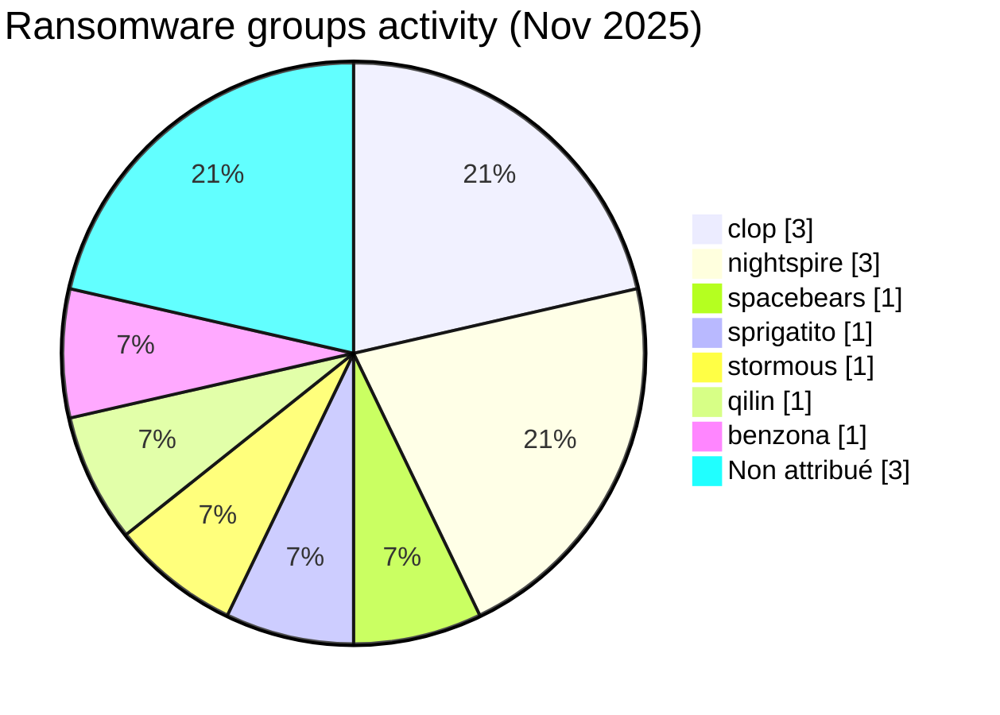
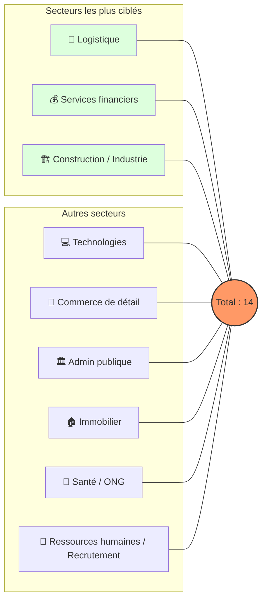
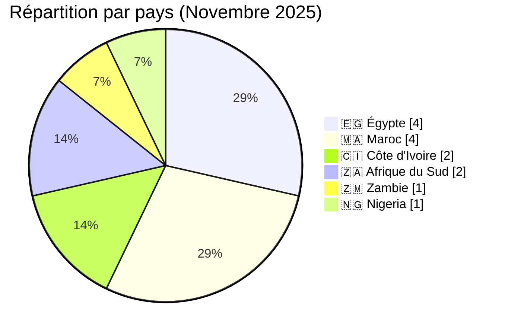
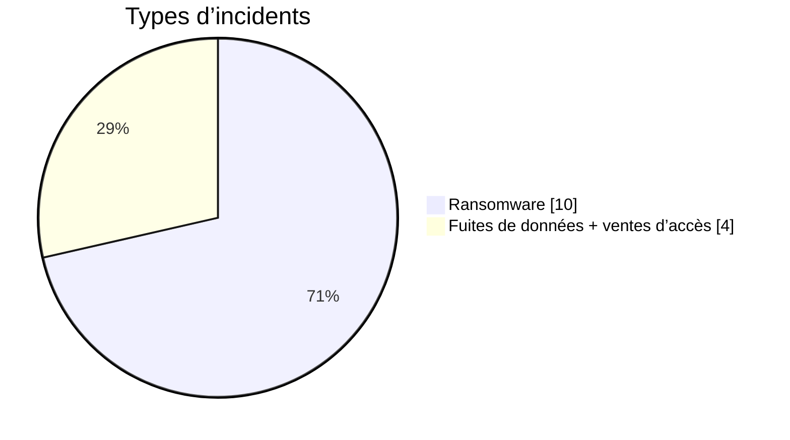
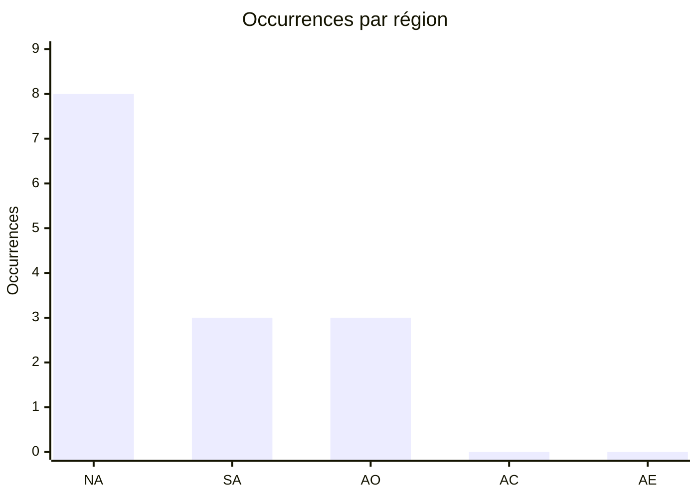

# Rapport CTI : Cyberattaques en Afrique - Novembre 2025 (14 victimes)

👉🏾 [**English version available here**](./README.md)

## 1. Résumé exécutif
Novembre 2025 montre une activité persistante de ransomwares ciblant les organisations africaines, avec un focus marqué sur l'Égypte et le Maroc. Un total de 10 revendications ransomware et 4 revendications de fuite de données, ciblant des organisations opérant dans 6 pays africains, ont été identifiées.

* **Nombre total d'attaques recensées** : 14
* **Acteurs les plus actifs** : `clop` (3 attaques), `nightspire` (3 attaques).
    * *Autres groupes actifs* : spacebears, sprigatito, stormous, qilin, benzona (1 attaque chacun) ; 2 revendications supplémentaires sont non attribuées.
* **Secteurs les plus ciblés** : Logistique (2), Services financiers (2), Construction/Industrie (2), Technologies (2), Administration publique (2).
* **Pays les plus touchés** : 🇪🇬 Égypte (4), 🇲🇦 Maroc (4), 🇨🇮 Côte d'Ivoire (2), 🇿🇦 Afrique du Sud (2).
* **Fuite de données notable** : **Anka** (Côte d'Ivoire) avec une base de données de 12,1 Go affectant plus de 537 000 utilisateurs.

---

## 2. Méthodologie
Ce rapport de **Cyber Threat Intelligence (CTI)** présente une analyse détaillée des cyberattaques survenues en Afrique durant le mois de novembre 2025. Les informations sont issues de sources **OSINT** et de sites de fuites de groupes ransomware, compilées dans le cadre du projet **AFRINTEL**. L'objectif est de fournir une vision claire des tendances, des acteurs menaçants, des secteurs ciblés et des indicateurs de compromission associés.

---

## 3. Vue d'ensemble

### 3.1 Répartition par groupe ransomware
| Groupe / Acteur | Nombre d'attaques |
| :--- | :---: |
| **clop** | 3 |
| **nightspire** | 3 |
| **spacebears** | 1 |
| **sprigatito** | 1 |
| **stormous** | 1 |
| **qilin** | 1 |
| **benzona** | 1 |
| **Non attribué** | 3 |
| **Total** | **14** |

### 3.2 Répartition par secteur d'activité
| Secteur | Nombre d'attaques |
| :--- | :---: |
| Logistique | 2 |
| Services financiers | 2 |
| Construction / Industrie | 2 |
| Technologies | 2 |
| Administration publique | 2 |
| Commerce / E-commerce | 1 |
| Immobilier / Investissement | 1 |
| Santé / ONG | 1 |
| Ressources humaines / Recrutement | 1 |
| **Total** | **14** |

### 3.3 Répartition par pays
| Pays | Nombre d'attaques |
| :--- | :---: |
| 🇪🇬 Égypte | 4 |
| 🇲🇦 Maroc | 4 |
| 🇨🇮 Côte d'Ivoire | 2 |
| 🇿🇦 Afrique du Sud | 2 |
| 🇿🇲 Zambie | 1 |
| 🇳🇬 Nigeria | 1 |
| **Total** | **14** |

---

<!-- AFRINTEL_CURRENT_MODEL_START -->
### 3.4 Vue globale standardisée

| Pays | Ransomware | Exposition des données (fuites + accès) | Total | Distribution |
| :--- | ---: | ---: | ---: | :--- |
| 🇪🇬 Égypte | 4 | 0 | 4 | 🟧🟧🟧🟧 |
| 🇲🇦 Maroc | 2 | 2 | 4 | 🟧🟧 🟦🟦 |
| 🇨🇮 Côte d’Ivoire | 1 | 1 | 2 | 🟧 🟦 |
| 🇿🇦 Afrique du Sud | 1 | 1 | 2 | 🟧 🟦 |
| 🇳🇬 Nigeria | 1 | 0 | 1 | 🟧 |
| 🇿🇲 Zambie | 1 | 0 | 1 | 🟧 |

### Vue agrégée mensuelle de l’exposition

La vue CTI mensuelle regroupe les fuites de données et les ventes d’accès sous **exposition des données** : **4 fiches** (28,6% du corpus mensuel). Les fiches sources restent la référence ; une vente d’accès ne prouve pas à elle seule l’exfiltration de données.

### Répartition géographique par région

| Région | Occurrences | Ransomware | Exposition des données (fuites + accès) | Distribution |
| :--- | ---: | ---: | ---: | :--- |
| Afrique du Nord | 8 | 6 | 2 | 🟧🟧🟧🟧🟧🟧 🟦🟦 |
| Afrique australe | 3 | 2 | 1 | 🟧🟧 🟦 |
| Afrique de l’Ouest | 3 | 2 | 1 | 🟧🟧 🟦 |
| Afrique centrale | 0 | 0 | 0 |  |
| Afrique de l’Est | 0 | 0 | 0 |  |

Légende : NA = Afrique du Nord ; SA = Afrique australe ; AO = Afrique de l’Ouest ; AC = Afrique centrale ; AE = Afrique de l’Est

### Répartition sectorielle

| Secteur | Fiches | Part | Activité |
| :--- | ---: | ---: | :--- |
| Gouvernement / administration | 3 | 21,4% | ██████████ |
| Technologies / informatique | 3 | 21,4% | ██████████ |
| Finance / banque | 2 | 14,3% | ███████ |
| Transport / logistique | 2 | 14,3% | ███████ |
| Santé / médical | 1 | 7,1% | ███ |
| Industrie / fabrication | 1 | 7,1% | ███ |
| Services professionnels | 1 | 7,1% | ███ |
| Commerce / e-commerce | 1 | 7,1% | ███ |

### Acteurs / groupes les plus présents

| Acteur / Groupe | Fiches | Activité |
| :--- | ---: | :--- |
| clop | 3 | ██████████ |
| nightspire | 3 | ██████████ |
| RL000 | 1 | ███ |
| Spirigatito, post published on a cybercriminal forum | 1 | ███ |
| Unknown | 1 | ███ |
| anisanas2 | 1 | ███ |
| benzona | 1 | ███ |
| qilin | 1 | ███ |
| spacebears | 1 | ███ |
| stormous | 1 | ███ |
<!-- AFRINTEL_CURRENT_MODEL_END -->

### Comparaison avec le mois précédent

À partir des fiches incidents validées comme source de comptage, novembre 2025 compte **14** incidents contre **19** le mois précédent (une baisse de **-5** ; **-26.3%**). Cette comparaison décrit les publications enregistrées par AFRINTEL et ne prouve pas à elle seule une évolution de l'activité des attaquants ni un impact confirmé sur les victimes.

| Indicateur | Mois précédent | Mois en cours | Variation |
|---|---:|---:|---:|
| Fiches incidents enregistrées | 19 | 14 | -5 (-26.3%) |

## 4. Analyse détaillée par type d'incident

## 5. Impact sectoriel
* **Logistique (2)** : Ciblage de plateformes stratégiques (Dovern Import au Maroc et Anka en Côte d'Ivoire), confirmant la vulnérabilité des chaînes d'approvisionnement régionales.
* **Services Financiers (2)** : Attaques contre une institution bancaire majeure (Zanaco en Zambie) et un gestionnaire de fonds de pension (Fidelity au Nigeria).
* **Construction / Industrie (2)** : Focus sur des fleurons industriels égyptiens (Elsewedy Electric et Samcrete), cibles de choix pour l'espionnage industriel et l'extorsion.
* **Administration Publique (2)** : Incidents notables en Afrique du Sud (Eastern Cape) et au Maroc (données d'immatriculation NARSA), rappelant que les services aux citoyens restent une cible privilégiée.
* **Ressources humaines / Recrutement (1)** : Wannabees illustre le risque lié aux bases de recrutement contenant des données d'identité, d'emploi et de rémunération.

---

## 6. Profil des acteurs
### 6.1 Profil des acteurs

Les comptages d'acteurs et de sources restent ceux documentés en section 3 et dans les fiches victimes sources. L'attribution est conservée uniquement au niveau étayé par les éléments publics.

### 6.2 Évaluation du risque

Les pays et secteurs présentant plusieurs fiches ou des fonctions publiques, éducatives, sanitaires, financières ou critiques doivent faire l'objet d'une validation prioritaire. Il s'agit d'un signal de priorisation OSINT, et non d'une confirmation de compromission ou d'impact.

* **🇪🇬 Égypte** : Épicentre de l'activité ce mois-ci avec **4 victimes**. Le ciblage est exclusivement industriel et technologique.
* **🇲🇦 Maroc** : Activité avec **4 victimes** (Logistique, Commerce de détail, une agence publique de sécurité routière et une revendication non attribuée de fuite de données dans les Technologies), touchant des acteurs majeurs du marché local.
* **🇨🇮 Côte d'Ivoire** : Émergence d'attaques à fort impact (2 victimes), notamment avec la fuite massive de données utilisateurs de la plateforme Anka.
* **Répartition Globale** : **Afrique du Nord (8 attaques)** vs **Afrique subsaharienne (6 attaques)**. La menace est particulièrement concentrée sur les puissances économiques du continent (Égypte, Maroc, Afrique du Sud, Nigeria).

---

## 7. Tendances et lacunes de renseignement
### 7.1 Tendances observées

Les répartitions par pays, secteur, acteur et type d'incident présentées ci-dessus constituent les tendances traçables du mois. Elles décrivent le corpus surveillé et n'établissent pas une campagne plus large sans éléments indépendants.

### 7.2 Lacunes de renseignement

Les rapports disponibles ne permettent pas d'établir pour chaque revendication le vecteur d'accès initial, l'exfiltration complète, la confirmation par la victime, la chronologie de remédiation ou l'impact opérationnel. Aucun détail DFIR public n'est inclus dans le corpus consulté pour cette fiche mensuelle ; cette absence est limitée aux sources examinées.

## 8. Cartographie MITRE ATT&CK (contextuelle)
| Phase | ID technique | Nom | Association à l'incident |
|---|---|---|---|
| Collecte | T1005 | Data from Local System | Correspondance contextuelle pour une collecte ou exposition revendiquée ; la méthode n'est pas confirmée. |
| Collecte | T1213 | Data from Information Repositories | Correspondance contextuelle pour les dossiers ou référentiels décrits publiquement ; la méthode n'est pas confirmée. |

Ces correspondances ATT&CK sont contextuelles et défensives. Elles ne prouvent pas qu'un acteur donné a utilisé la technique.

### Contextual observations
* **Fuites de données B2C à grande échelle** : L'incident Anka (537 000 utilisateurs) montre une volonté de nuire à la réputation et de monétiser les données personnelles sur les forums de cybercriminalité.
* **Ciblage d'Infrastructures Critiques** : L'attaque contre Elsewedy Electric souligne les risques pesant sur le secteur de l'énergie et des systèmes industriels.

---

## 9. Recommandations
1.  **Secteurs Logistique & Commerce** : Durcissement de la sécurité des bases de données clients et surveillance accrue des accès API et des tentatives de dumps SQL.
2.  **Secteur Financier** : Renforcement du chiffrement de bout en bout et mise en place d'une surveillance proactive des transactions et des accès aux registres de comptes.
3.  **Santé & ONG** : Protection des données sensibles via une segmentation réseau stricte pour éviter la propagation latérale des ransomwares.
4.  **Général : Tester régulièrement les plans de réponse aux incidents :**
    * **BCP (Business Continuity Plan)** / **PCA (Plan de Continuité d'Activité)** : Pour assurer le maintien des opérations critiques de l'entreprise pendant la durée de l'attaque.
    * **DRP (Disaster Recovery Plan)** / **PRA (Plan de Reprise d'Activité)** : Pour garantir la restauration rapide et sécurisée des infrastructures informatiques et des données.

---

## 10. Recommandations SOC et tactiques
### Observé

Les sources publiques documentent des revendications, des publications ou du matériel exposé. Elles ne fournissent pas à elles seules une télémétrie prouvant une technique ou une compromission active.

### Hypothèses

L'abus d'identifiants, un stockage exposé, des contrôles d'accès faibles ou des privilèges d'export excessifs peuvent expliquer certaines expositions, mais chaque hypothèse doit être vérifiée par l'organisation concernée.

### Préventif

Surveiller les journaux d'identité, VPN, cloud, bases de données, messagerie et transferts sortants. Imposer une MFA résistante au phishing, le moindre privilège, la segmentation, des sauvegardes testées et la révocation rapide des jetons ou identifiants.

## 11. Recommandations stratégiques
1. **Risques observés :** prioriser la validation des organisations, secteurs et types de données documentés dans le corpus mensuel.
2. **Hypothèses :** tester les chemins possibles liés aux identifiants, au stockage cloud et aux exports excessifs sans les présenter comme des faits établis.
3. **Socle préventif :** maintenir l'inventaire des actifs, la classification des données, les exercices de réponse, les plans de reprise et les procédures coordonnées de sécurité, de droit et de protection des données.

## 12. Conclusion
Novembre 2025 témoigne d'une diversification des acteurs de menace (7 groupes nommés et trois cas de fuite de données non attribués, pour 14 victimes). La concentration des attaques sur l'Égypte et le ciblage de données utilisateurs massives en Afrique de l'Ouest indiquent une évolution des stratégies d'extorsion vers des secteurs plus variés que la simple finance traditionnelle.
---

### ✍🏿 Auteur
**Adama ASSIONGBON** *Consultant SOC & Cyber Threat Intelligence* [Profil LinkedIn](https://www.linkedin.com/in/adama-assiongbon-9029893a/)

**AFRINTEL** - *Initiative ouverte de veille CTI sur l’Afrique*
