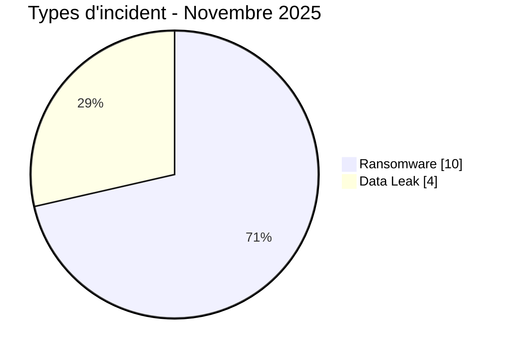
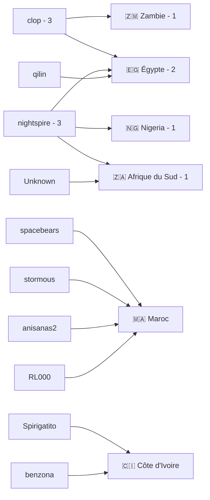
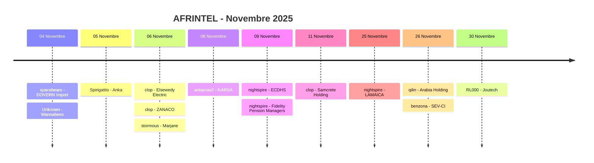

# Rapport CTI - Cyberattaques en Afrique - Novembre 2025

👉🏾 [**English version available here**](./README.md)

## 1. Synthèse exécutive

Novembre 2025 compte **14 incidents documentés dans 6 pays africains** : **10 Ransomware** et **4 Data Leak**. Aucun Access Sale, DDoS, Defacement ou Operational Fraud n'est enregistré.

- **Égypte** : 4 Ransomware.
- **Maroc** : 4 incidents, dont 2 Ransomware et 2 Data Leak.
- **Côte d'Ivoire** et **Afrique du Sud** : 2 incidents chacune, avec 1 Ransomware et 1 Data Leak.
- **Zambie** et **Nigeria** : 1 Ransomware chacun.
- **clop** et **nightspire** sont les acteurs les plus visibles avec 3 fiches chacun.
- Le corpus ne contient qu'un seul acteur non identifié : **Wannabees**. Anka est attribué à **Spirigatito**, NARSA à **anisanas2** et Joutech à **RL000**.
- **Anka** : 537 877 utilisateurs et 12,1 Go sont revendiqués ; AFRINTEL a examiné moins de 30 enregistrements d'échantillon.
- **Marjane** : une session SSL-VPN Fortinet et un accès SSH interne sont observés dans la preuve ; la publication complète ultérieure n'a pas pu être collectée par AFRINTEL.
- **NARSA** : export d'immatriculation cohérent avec un jeu revendiqué d'environ 150 000 lignes.
- **Wannabees** : export de cinq dossiers candidats contenant des données personnelles et professionnelles sensibles.
- **Joutech** : export de 1 350 contacts, sans mot de passe ni donnée financière observée.
- **Elsewedy Electric** et **ZANACO** sont reliés à des publications Clop, avec des profils cohérents, sans examen de fichiers exfiltrés sous-jacents.

### 📋 Liste des victimes

👉🏾 [Voir la liste complète des victimes](./victims_FR.md)

### 1.1 Comparaison avec le mois précédent

> La comparaison utilise le corpus corrigé d'octobre 2025 à **18 incidents**. La fiche MeamarGroup d'octobre a été supprimée du corpus d'octobre car elle reprenait le même incident Obscura déjà documenté en septembre.

| Indicateur | Octobre 2025 | Novembre 2025 | Évolution observée |
|---|---:|---:|---:|
| Total incidents | 18 | 14 | **-4 (-22,2 %)** |
| Ransomware | 16 | 10 | **-6 (-37,5 %)** |
| Data Leak | 2 | 4 | **+2 (+100,0 %)** |
| Access Sale | 0 | 0 | **0 (stable)** |
| DDoS | 0 | 0 | **0 (stable)** |
| Defacement | 0 | 0 | **0 (stable)** |
| Operational Fraud | 0 | 0 | **0 (stable)** |

## 2. Méthodologie

- **Périmètre** : 54 pays africains.
- **Période** : 1er au 30 novembre 2025.
- **Sources** : OSINT, leak sites, forums underground, publications d'acteurs et échantillons disponibles.
- **Source de vérité** : couple validé `victims_FR.md` / `victims.md`.
- **Comptage** : une fiche correspond à un incident unique.
- **Taxonomie** : Ransomware, Data Leak, Access Sale, DDoS, Defacement, Operational Fraud.
- **Qualification** : revendication, échantillon, publication complète et confirmation technique restent distincts.
- **Visualisation** : tableaux, barres textuelles, diagrammes Mermaid simples et chronologie.

## 3. Vue d'ensemble

### 3.1 Répartition par type d'incident

| Type d'incident | Nombre | Part |
|---|---:|---:|
| Ransomware | 10 | 71,4 % |
| Data Leak | 4 | 28,6 % |
| Access Sale | 0 | 0,0 % |
| DDoS | 0 | 0,0 % |
| Defacement | 0 | 0,0 % |
| Operational Fraud | 0 | 0,0 % |
| **Total** | **14** | **100 %** |

### 3.2 Répartition par pays

| Pays | Ransomware | Data Leak | Total | Distribution |
|---|---:|---:|---:|---|
| 🇪🇬 Égypte | 4 | 0 | 4 | 🟧🟧🟧🟧 |
| 🇲🇦 Maroc | 2 | 2 | 4 | 🟧🟧🟦🟦 |
| 🇨🇮 Côte d'Ivoire | 1 | 1 | 2 | 🟧🟦 |
| 🇿🇦 Afrique du Sud | 1 | 1 | 2 | 🟧🟦 |
| 🇿🇲 Zambie | 1 | 0 | 1 | 🟧 |
| 🇳🇬 Nigeria | 1 | 0 | 1 | 🟧 |
| **Total** | **10** | **4** | **14** | |

### 3.3 Répartition par région

| Région | Incidents | Part | Activité |
|---|---:|---:|---|
| Afrique du Nord | 8 | 57,1 % | ██████████ |
| Afrique australe | 3 | 21,4 % | ████ |
| Afrique de l'Ouest | 3 | 21,4 % | ████ |
| Afrique centrale | 0 | 0,0 % |  |
| Afrique de l'Est | 0 | 0,0 % |  |
| **Total** | **14** | **100 %** | |

### 3.4 Répartition sectorielle harmonisée

| Secteur | Incidents | Part | Activité |
|---|---:|---:|---|
| Transport / Logistique | 2 | 14,3 % | ██████████ |
| Finance / Banque | 2 | 14,3 % | ██████████ |
| Gouvernement / Administration | 2 | 14,3 % | ██████████ |
| Industrie / Fabrication | 2 | 14,3 % | ██████████ |
| Technologie / Services numériques | 1 | 7,1 % | █████ |
| Ressources humaines / Recrutement | 1 | 7,1 % | █████ |
| Commerce / E-commerce | 1 | 7,1 % | █████ |
| Construction / Ingénierie | 1 | 7,1 % | █████ |
| Immobilier / Investissement | 1 | 7,1 % | █████ |
| Santé / ONG | 1 | 7,1 % | █████ |
| **Total** | **14** | **100 %** | |

### 3.5 Acteurs / groupes

| Acteur / Groupe | Incidents | Activité |
|---|---:|---|
| clop | 3 | ██████████ |
| nightspire | 3 | ██████████ |
| spacebears | 1 | ███ |
| Unknown | 1 | ███ |
| Spirigatito | 1 | ███ |
| stormous | 1 | ███ |
| anisanas2 | 1 | ███ |
| qilin | 1 | ███ |
| benzona | 1 | ███ |
| RL000 | 1 | ███ |
| **Total** | **14** | |

### 3.6 Cartographie acteurs -> pays

## 4. Analyse détaillée

### 4.1 Ransomware - 10 incidents

Les 10 fiches Ransomware concernent DOVERN Import, Elsewedy Electric, ZANACO, Marjane, Eastern Cape Department of Human Settlements, Fidelity Pension Managers, Samcrete Holding, LAMAICA, Arabia Holding et SEV-CI.

Les dossiers les plus documentés sont notamment :

- **Elsewedy Electric** : page de revendication Clop cohérente avec le profil public de l'entreprise ; aucun fichier exfiltré n'a été examiné.
- **ZANACO** : page Clop cohérente avec le profil bancaire public ; aucun jeu de données sous-jacent n'a été collecté.
- **Marjane** : preuve d'accès interne via SSL-VPN Fortinet et point d'accès SSH ; publication complète ultérieure non collectée.
- Les autres dossiers restent principalement des revendications non vérifiées dans les fiches disponibles.

### 4.2 Data Leak - 4 incidents

- **Wannabees**, Afrique du Sud : acteur `Unknown`, échantillon de cinq dossiers candidats.
- **Anka**, Côte d'Ivoire : acteur `Spirigatito`, échantillon structuré cohérent avec la publication ; 537 877 utilisateurs et 12,1 Go restent revendiqués.
- **NARSA**, Maroc : acteur `anisanas2`, export de données d'immatriculation, environ 150 000 lignes revendiquées.
- **Joutech**, Maroc : acteur `RL000`, export de 1 350 contacts.

### 4.3 Access Sale - 0 incident

Aucune fiche de novembre 2025 n'est classée Access Sale.

## 5. Impact sectoriel

Les principaux regroupements sectoriels sont **Transport / Logistique**, **Finance / Banque**, **Gouvernement / Administration** et **Industrie / Fabrication**, avec 2 incidents chacun.

Les autres catégories comptent une fiche chacune : Technologie / Services numériques, Ressources humaines / Recrutement, Commerce / E-commerce, Construction / Ingénierie, Immobilier / Investissement et Santé / ONG.

## 6. Profil des acteurs

**clop** et **nightspire** dominent avec **3 fiches chacun**.

Les autres valeurs structurées comptent une fiche chacune : spacebears, Unknown, Spirigatito, stormous, anisanas2, qilin, benzona et RL000.

L'ancien README indiquait trois revendications non attribuées. Le contrôle des fiches montre qu'une seule reste réellement sans acteur, Wannabees. Les trois autres Data Leak sont attribués à Spirigatito, anisanas2 et RL000.

## 7. Tendances et lacunes de renseignement

- Total : **18 -> 14**, soit **-22,2 %**.
- Ransomware : **16 -> 10**, soit **-37,5 %**.
- Data Leak : **2 -> 4**, soit **+100,0 %**.
- Égypte et Maroc comptent 4 incidents chacun.
- Afrique du Nord concentre 8 incidents sur 14.
- clop et nightspire comptent chacun 3 fiches.

Les vecteurs d'accès initiaux restent inconnus pour la majorité des incidents. Les 537 877 utilisateurs et 12,1 Go revendiqués pour Anka ne sont pas validés intégralement. La publication complète Marjane n'a pas été collectée. Les données Clop pour Elsewedy Electric et ZANACO ne sont pas examinées au-delà des pages de revendication.

## 8. Chronologie

## 9. Cartographie MITRE ATT&CK contextuelle

| Phase | Technique | Portée |
|---|---|---|
| Comptes valides | T1078 - Valid Accounts | Contexte pertinent pour l'accès SSL-VPN interne observé dans le cas Marjane. |
| Collecte | T1005 - Data from Local System | Pertinent pour les fichiers et exports locaux examinés. |
| Collecte | T1213 - Data from Information Repositories | Pertinent pour les bases structurées Wannabees, Anka, NARSA et Joutech. |

> Les mappings sont contextuels et ne prouvent pas l'utilisation de chaque technique par chaque acteur.

## 10. Recommandations

- **Finance / Banque** : MFA résistant au phishing, surveillance des comptes privilégiés, contrôle des exports et détection des accès anormaux.
- **Secteur public** : PAM, segmentation, journalisation des consultations et exports de bases administratives.
- **Commerce / E-commerce** : surveiller VPN, SSH, comptes administrateurs, systèmes de magasin et flux sortants.
- **RH / Recrutement** : minimiser les données conservées, chiffrer les informations d'identité et surveiller les exports de candidatures.
- **SOC / CTI** : distinguer systématiquement volume revendiqué, échantillon observé, publication complète et confirmation indépendante.

## 11. Conclusion

Novembre 2025 compte **14 incidents dans 6 pays**, répartis entre **10 Ransomware et 4 Data Leak**.

Le volume baisse de 22,2 % par rapport au corpus corrigé d'octobre, qui compte 18 incidents. L'Égypte et le Maroc arrivent en tête avec 4 incidents chacun. clop et nightspire sont les acteurs les plus visibles avec 3 fiches chacun. Le recalcul corrige surtout le nombre d'acteurs non attribués : **1 et non 3**.

**AFRINTEL** - Initiative ouverte de veille CTI sur l'Afrique
