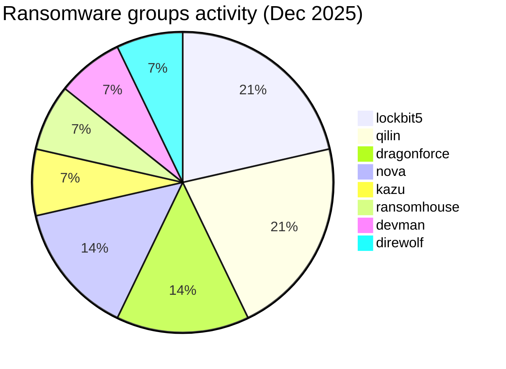
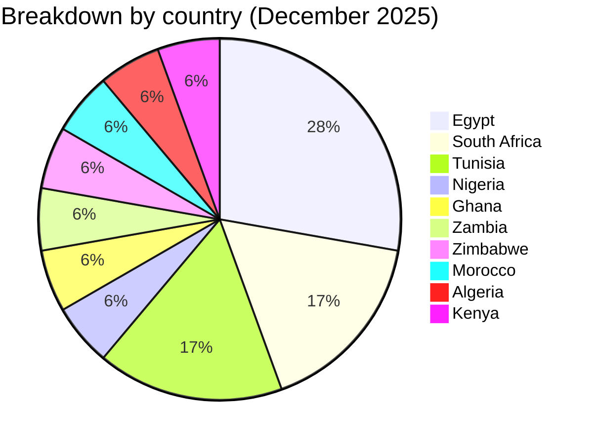
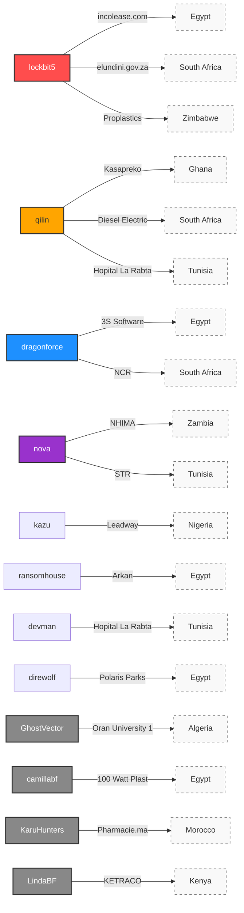

# CTI Report: Cyberattacks in Africa - December 2025 (18 victims)

👉🏾 [**French version available here**](./README_FR.md)

## 1. Introduction
This **Cyber Threat Intelligence (CTI)** report provides a detailed analysis of cyberattacks recorded across Africa during December 2025. Data is gathered from **OSINT** sources and ransomware group leak sites, compiled under the **AFRINTEL** project. The goal is to provide a clear overview of trends, threat actors, and targeted sectors on the continent.

---

## 2. Executive summary
December 2025 shows an increase in ransomware activity with 14 ransomware victims plus 4 non-ransomware data-leak claims, identified across 10 African countries. The month is marked by a significant concentration of attacks in Egypt and South Africa, persistent targeting of the healthcare sector, and a new data-leak claim affecting the energy/critical-infrastructure sector in Kenya.

* **Total recorded attacks**: 18
* **Most active threat actors**: `lockbit5` (3 attacks), `qilin` (3 attacks).
    * *Other active ransomware groups*: dragonforce (2), nova (2), kazu, ransomhouse, devman, direwolf (1 attack each).
    * *Non-ransomware data-leak claims*: GhostVector, camillabf, KaruHunters, LindaBF (1 claim each, not attributed to any named ransomware group).
* **Most targeted sectors**: Healthcare (4), Finance/Leasing (2), Insurance (2), Public Administration (2), Manufacturing (2).
* **Most affected countries**: 🇪🇬 Egypt (5), 🇿🇦 South Africa (3), 🇹🇳 Tunisia (3), 🇲🇦 Morocco (1), 🇰🇪 Kenya (1).
* **Notable incident**: Double cyberattack on **Hopital La Rabta** (Tunisia) by two different groups (devman and qilin) within two weeks.

---

## 3. Key statistics

### 3.1 Breakdown by ransomware group
| Group / Actor | Number of attacks |
| :--- | :---: |
| **lockbit5** | 3 |
| **qilin** | 3 |
| **dragonforce** | 2 |
| **nova** | 2 |
| **kazu** | 1 |
| **ransomhouse** | 1 |
| **devman** | 1 |
| **direwolf** | 1 |
| **Total** | **14** |

### 3.1b Non-ransomware data-leak claims
| Actor | Victim | Country |
| :--- | :--- | :---: |
| **GhostVector** | Oran University 1 Ahmed Ben Bella | 🇩🇿 Algeria |
| **camillabf** | 100 Watt Plast | 🇪🇬 Egypt |
| **KaruHunters** | Pharmacie.ma | 🇲🇦 Morocco |
| **LindaBF** | KETRACO | 🇰🇪 Kenya |
| **Total** | | **4** |

### 3.2 Breakdown by industry sector
| Sector | Number of Attacks |
| :--- | :---: |
| 🏥 Healthcare | 4 |
| 💰 Finance / Leasing | 2 |
| 🛡️ Insurance | 2 |
| 🏛️ Public Administration | 2 |
| 🏭 Manufacturing | 2 |
| 💻 Technology | 1 |
| 🚚 Logistics / Automotive | 1 |
| 🏗️ Real Estate / Industry | 1 |
| 🌾 Agribusiness | 1 |
| 🎓 Education | 1 |
| ⚡ Energy | 1 |
| **Total** | **18** |

### 3.3 Breakdown by country
| Country | Number of Attacks |
| :--- | :---: |
| 🇪🇬 Egypt | 5 |
| 🇿🇦 South Africa | 3 |
| 🇹🇳 Tunisia | 3 |
| 🇳🇬 Nigeria | 1 |
| 🇬🇭 Ghana | 1 |
| 🇿🇲 Zambia | 1 |
| 🇿🇼 Zimbabwe | 1 |
| 🇲🇦 Morocco | 1 |
| 🇩🇿 Algeria | 1 |
| 🇰🇪 Kenya | 1 |
| **Total** | **18** |

---

## 4. Attack details by ransomware group

### 4.1 lockbit5 (3 attacks)
* **2025-12-07**: **incolease.com** (Egypt, Finance) - Claimed & Leaked.
* **2025-12-07**: **elundini.gov.za** (South Africa, Public Admin) - Claimed & Leaked.
* **2025-12-26**: **Proplastics Limited** (Zimbabwe, Manufacturing) - Claimed & Leaked.

### 4.2 qilin (3 attacks)
* **2025-12-06**: **Kasapreko Company Limited** (Ghana, Agribusiness) - Claimed & Leaked.
* **2025-12-06**: **Diesel Electric** (South Africa, Automotive/Logistics) - Claimed & Leaked.
* **2025-12-26**: **Hopital La Rabta** (Tunisia, Healthcare) - Second attack recorded.

### 4.3 dragonforce (2 attacks)
* **2025-12-05**: **3S Software** (Egypt, Technology) - Claimed & Leaked.
* **2025-12-24**: **National Credit Regulator (NCR)** (South Africa, Public Admin/Financial Regulation) - Claimed & Leaked.

### 4.4 nova (2 attacks)
* **2025-12-05**: **National Health Insurance Management Authority (NHIMA)** (Zambia, Insurance) - Claimed & Leaked.
* **2025-12-15**: **Tunisian Society of Radiology (STR)** (Tunisia, Healthcare/Education) - Claimed & Leaked.

### 4.5 Other groups (1 attack each)
* **kazu** (2025-12-11): **Leadway Assurance / Health** (Nigeria, Insurance) - Claimed & Leaked.
* **ransomhouse** (2025-12-08): **Arkan** (Egypt, Finance/Retail) - Claimed & Leaked.
* **devman** (2025-12-12): **Hopital La Rabta** (Tunisia, Healthcare) - First attack recorded.
* **direwolf** (2025-12-22): **Polaris Parks** (Egypt, Real Estate/Industrial) - Claimed & Leaked.

### 4.6 Non-ransomware data-leak claims (4 attacks)
* **2025-12-29**: **Oran University 1 Ahmed Ben Bella** (Algeria, Education) - Claim - Data Sample Published, actor GhostVector. A post advertises a database dated 2023 with approximately 58,000 records (names, birth dates, phone numbers, gender, email addresses, password hashes, nationality).
* **2025-12-29**: **100 Watt Plast** (Egypt, Industrial/Manufacturing) - Claim - Data Sample Published, actor camillabf. A claimed dataset of 180,000 records (name, email, phone, password) with roughly twenty complete records directly visible in the sample.
* **2025-12-31**: **Pharmacie.ma** (Morocco, Healthcare/Pharmacy e-commerce) - Claim - Data Sample Published, actor KaruHunters. Two full database backups reviewed, covering up to approximately 27,900 registered professional accounts (pharmacists, doctors, pharmacy staff and students).
* **2025-12-31**: **Kenya Electricity Transmission Company (KETRACO)** (Kenya, Energy/Critical Infrastructure) - Claim - Data Sample Published, actor LindaBF. A sample shows a newsletter/directory user list (names, emails, account-creation dates); a repeated password value across records lowers confidence to medium.

### 4.7 Actor → victim → country mapping

---

## 5. Industry analysis
* **Healthcare (4)**: High vulnerability in Tunisia with three major incidents affecting university hospitals and medical associations, plus a data-leak claim affecting a Moroccan pharmacy e-commerce platform.
* **Public Administration (2)**: Targeting of critical regulatory bodies (NCR in South Africa) and local municipalities (Elundini), impacting public service delivery.
* **Insurance & Finance (4)**: Continued focus on wealth-rich sectors in Nigeria, Egypt, and Zambia, including health insurance and leasing services.
* **Manufacturing (2)**: Ransomware activity against a Zimbabwean plastics manufacturer, plus a separate data-leak claim against an Egyptian electrical/plastics manufacturer (100 Watt Plast).
* **Education (1)**: A data-leak claim against an Algerian public university (Oran University 1), advertising a 2023-dated dataset of roughly 58,000 student/staff records.
* **Energy (1)**: A new data-leak claim against Kenya's national electricity transmission operator (KETRACO), the first critical-infrastructure/energy-sector case recorded this month.

---

## 6. Geographical analysis
* **🇪🇬 Egypt**: Remains the primary target for the second consecutive month with **5 victims** across ransomware (technology, finance, industrial sectors) and one additional data-leak claim (100 Watt Plast).
* **🇿🇦 South Africa**: Significant increase with **3 victims** including a major automotive partner (Bosch partner) and a national financial regulator.
* **🇹🇳 Tunisia**: Emergence as a high-risk zone for healthcare infrastructure with **3 attacks** recorded in December.
* **🇲🇦 Morocco**: One data-leak claim (Pharmacie.ma, actor KaruHunters), adding a healthcare-sector dimension distinct from the month's ransomware activity.
* **🇩🇿 Algeria**: One data-leak claim against a public university (Oran University 1, actor GhostVector).
* **🇰🇪 Kenya**: One new data-leak claim against the national electricity transmission operator (KETRACO, actor LindaBF); the sample shows internal inconsistencies (a repeated password value) that lower confidence to medium.

---

## 7. Observed TTPs (Tactics, Techniques & Procedures)

* **Multi-Staged Extortion**: Groups such as **Lockbit5** and **Qilin** consistently use "Claim & Leak" (Double Extortion) methods to maximize financial and psychological pressure on targets.
* **Re-victimization & Double Claiming**: 
    * The **Hopital La Rabta** (Tunisia) case is a major highlight: attacked by **devman** on Dec 12th, followed by **qilin** on Dec 26th. This indicates that multiple threat actors are exploiting the same unpatched vulnerabilities or purchasing access from Initial Access Brokers (IABs).
    * **Proplastics Limited** (Zimbabwe) also recorded a second attack by **lockbit5**, showing threat actor persistence when initial entry points are not fully remediated.
* **Focus on Essential Service Infrastructure**: Increased targeting of regulatory bodies (NCR in South Africa) and national health management systems (NHIMA in Zambia) to exfiltrate large volumes of Personally Identifiable Information (PII).
---

## 8. Recommendations
1.  **Healthcare Sector**: Urgent audit of Internet-facing systems and implementation of offline backups to ensure clinical continuity.
2.  **Public Sector**: Hardening of administrative portals and financial regulatory systems against credential theft.
3.  **Industrial & Manufacturing**: Protection of supply chain data, particularly for companies acting as partners for global brands (e.g., Bosch).

---

## 9. Conclusion
December 2025 shows a surge in ransomware impact across North and Southern Africa, alongside four independent, non-ransomware data-leak claims spanning education (Algeria), industrial manufacturing (Egypt), healthcare (Morocco) and, for the first time this month, energy/critical infrastructure (Kenya). The diversification of actors (8 named ransomware groups plus four separate claim actors) and the repeated targeting of healthcare institutions indicate that threat actors are prioritizing high-impact targets where downtime is not an option, while the KETRACO claim signals continued interest in African critical-infrastructure operators even when the exposed data is limited in scope.

---

### ✍🏿 Author
**Adama ASSIONGBON** *SOC & Cyber Threat Intelligence Consultant*

**AFRINTEL** - *Open CTI Initiative for Africa*
