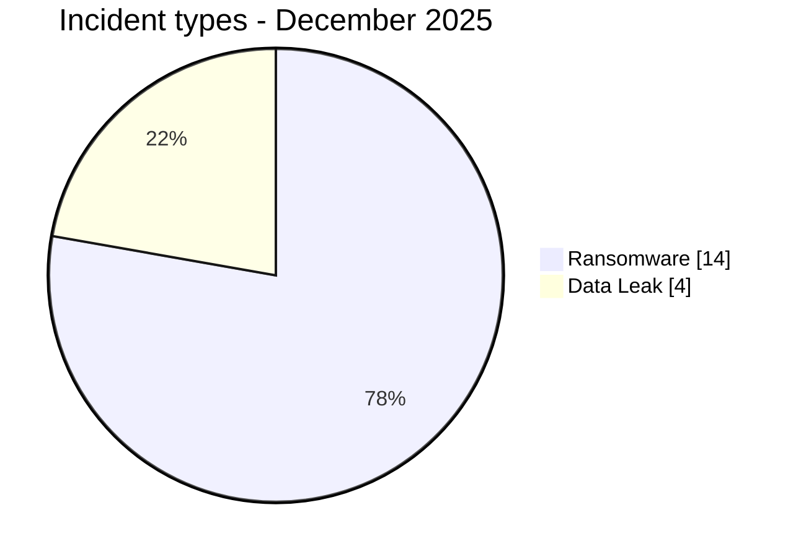
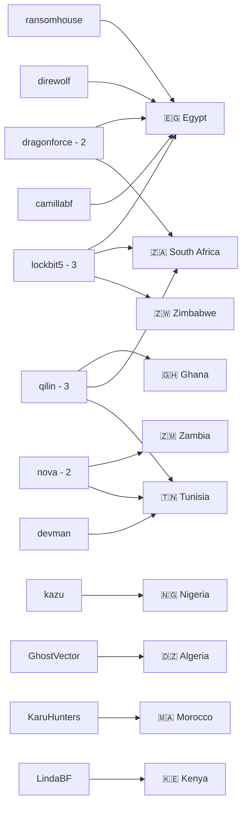
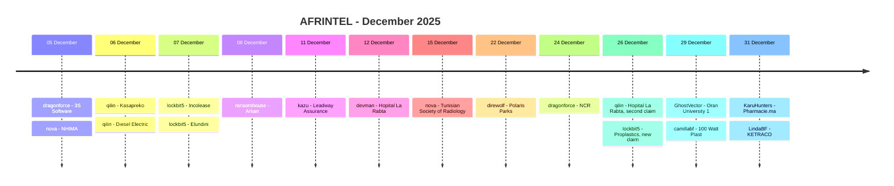

# CTI Report - Cyberattacks in Africa - December 2025

👉🏾 [**French version available here**](./README_FR.md)

## 1. Executive summary

December 2025 contains **18 incident records across 10 African countries**: **14 Ransomware** and **4 Data Leak**. No Access Sale, DDoS, Defacement or Operational Fraud is recorded.

The 18 records concern **17 distinct organisations within the month**, because Hopital La Rabta is associated with two ransomware claims, by devman on 12 December and qilin on 26 December. Available evidence does not establish whether the second claim represents a new intrusion or a republication/resale, so it remains a separate incident record with this caveat.

- **Egypt**: 5 records, including 4 Ransomware and 1 Data Leak.
- **South Africa**: 3 Ransomware records.
- **Tunisia**: 3 Ransomware records, including two claims against La Rabta.
- **lockbit5** and **qilin** are the most visible actors with 3 records each.
- **dragonforce** and **nova** account for 2 records each.
- The four Data Leak actors are **GhostVector, camillabf, KaruHunters and LindaBF**.
- **South Africa NCR**: reviewed local sample consistent with consumer files, enforcement material and multi-year operational data; Confidence High and Impact Level 4.
- **Oran University 1**: approximately 58,000 records are claimed, with a structured sample published.
- **100 Watt Plast**: 180,000 records are claimed; roughly twenty complete rows are visible in the sample.
- **Pharmacie.ma**: two full SQL backups were reviewed, covering up to approximately 27,900 professional accounts.
- **KETRACO**: the sample resembles a newsletter/directory dataset rather than an operational critical-infrastructure system; a repeated password value lowers confidence to Medium.
- **Elsewedy Electric** and **ZANACO** remain observed Clop claims; no underlying data sample was reviewed, so their status is retained as `Claim - Unverified`.

### 📋 Victim list

👉🏾 [View the full victim list](./victims.md)

### 1.1 Month-over-month comparison

| Indicator | November 2025 | December 2025 | Observed change |
|---|---:|---:|---:|
| Total incidents | 14 | 18 | **+4 (+28.6%)** |
| Ransomware | 10 | 14 | **+4 (+40.0%)** |
| Data Leak | 4 | 4 | **0 (stable)** |
| Access Sale | 0 | 0 | **0 (stable)** |
| DDoS | 0 | 0 | **0 (stable)** |
| Defacement | 0 | 0 | **0 (stable)** |
| Operational Fraud | 0 | 0 | **0 (stable)** |

## 2. Methodology

- **Scope**: 54 African countries.
- **Period**: 1-31 December 2025.
- **Sources**: OSINT, leak sites, underground forums, actor publications and available samples.
- **Source of truth**: validated `victims_FR.md` / `victims.md` pair.
- **Counting**: one card represents a distinct incident or claim record in the corpus.
- **Repeat claims**: when the same organisation is claimed again but the relationship with the earlier event remains unresolved, the new card is retained with lifecycle context. A duplicate is removed only when the evidence supports linking the publications to the same underlying incident with sufficient confidence.
- **Taxonomy**: Ransomware, Data Leak, Access Sale, DDoS, Defacement, Operational Fraud.
- **Qualification**: claim, sample, full publication and technical confirmation remain distinct.
- **Visualization**: tables, text bars, simple Mermaid diagrams and a timeline.

## 3. Global overview

### 3.1 Incident-type distribution

| Incident type | Count | Share |
|---|---:|---:|
| Ransomware | 14 | 77.8% |
| Data Leak | 4 | 22.2% |
| Access Sale | 0 | 0.0% |
| DDoS | 0 | 0.0% |
| Defacement | 0 | 0.0% |
| Operational Fraud | 0 | 0.0% |
| **Total** | **18** | **100%** |

**Color convention:** 🟧 Ransomware | 🟦 Data Leak | 🟪 Access Sale | 🟥 DDoS | 🟨 Defacement | 🟩 Operational Fraud.

### 3.2 Country distribution

| Country | Ransomware | Data Leak | Total | Distribution |
|---|---:|---:|---:|---|
| 🇪🇬 Egypt | 4 | 1 | 5 | 🟧🟧🟧🟧🟦 |
| 🇿🇦 South Africa | 3 | 0 | 3 | 🟧🟧🟧 |
| 🇹🇳 Tunisia | 3 | 0 | 3 | 🟧🟧🟧 |
| 🇩🇿 Algeria | 0 | 1 | 1 | 🟦 |
| 🇬🇭 Ghana | 1 | 0 | 1 | 🟧 |
| 🇰🇪 Kenya | 0 | 1 | 1 | 🟦 |
| 🇲🇦 Morocco | 0 | 1 | 1 | 🟦 |
| 🇳🇬 Nigeria | 1 | 0 | 1 | 🟧 |
| 🇿🇲 Zambia | 1 | 0 | 1 | 🟧 |
| 🇿🇼 Zimbabwe | 1 | 0 | 1 | 🟧 |
| **Total** | **14** | **4** | **18** | |

### 3.3 Geographic distribution by region

| Region | Incidents | Share | Activity |
|---|---:|---:|---|
| North Africa | 10 | 55.6% | ██████████ |
| Southern Africa | 5 | 27.8% | █████ |
| West Africa | 2 | 11.1% | ██ |
| East Africa | 1 | 5.6% | █ |
| Central Africa | 0 | 0.0% |  |
| **Total** | **18** | **100%** | |

### 3.4 Harmonized sector distribution

| Harmonized sector | Incidents | Share | Activity |
|---|---:|---:|---|
| Healthcare / Medical | 4 | 22.2% | ██████████ |
| Finance / Banking / Insurance | 4 | 22.2% | ██████████ |
| Government / Administration | 2 | 11.1% | █████ |
| Manufacturing / Industry | 2 | 11.1% | █████ |
| Technology / IT | 1 | 5.6% | ██ |
| Agriculture / Agribusiness | 1 | 5.6% | ██ |
| Transport / Automotive / Distribution | 1 | 5.6% | ██ |
| Real Estate / Industrial Development | 1 | 5.6% | ██ |
| Education / University | 1 | 5.6% | ██ |
| Energy / Utilities | 1 | 5.6% | ██ |
| **Total** | **18** | **100%** | |

### 3.5 Actors / groups

| Actor / Group | Incidents | Activity |
|---|---:|---|
| lockbit5 | 3 | ██████████ |
| qilin | 3 | ██████████ |
| dragonforce | 2 | ███████ |
| nova | 2 | ███████ |
| kazu | 1 | ███ |
| ransomhouse | 1 | ███ |
| devman | 1 | ███ |
| direwolf | 1 | ███ |
| GhostVector | 1 | ███ |
| camillabf | 1 | ███ |
| KaruHunters | 1 | ███ |
| LindaBF | 1 | ███ |
| **Total** | **18** | |

### 3.6 Actor -> country mapping

## 4. Detailed analysis by incident type

### 4.1 Ransomware - 14 records

The 14 Ransomware records concern 3S Software, NHIMA, Kasapreko, Diesel Electric, Incolease, Elundini Local Municipality, Arkan, Leadway Assurance / Health, Hopital La Rabta by devman, Tunisian Society of Radiology, Polaris Parks, National Credit Regulator, Hopital La Rabta by qilin and Proplastics Limited.

The most analytically substantial cases include:

- **National Credit Regulator**: reviewed local documents include debt-review cases, correspondence, enforcement records and multi-year operational tracking.
- **La Rabta**: two claims by two groups within two weeks. The corpus cannot determine whether the second reflects a new intrusion or a republication/resale.
- **Proplastics**: a new lockbit5 claim follows a TheGentlemen claim from September. A distinct compromise is not confirmed.

### 4.2 Data Leak - 4 records

- **Oran University 1 Ahmed Ben Bella**, Algeria, actor GhostVector: approximately 58,000 records claimed with a structured sample.
- **100 Watt Plast**, Egypt, actor camillabf: 180,000 rows claimed; roughly twenty complete rows are visible in the evidence.
- **Pharmacie.ma**, Morocco, actor KaruHunters: two full SQL backups reviewed, with up to approximately 27,900 registered accounts according to the observed structure.
- **KETRACO**, Kenya, actor LindaBF: newsletter/directory-style export; the repeated password anomaly requires a Medium confidence assessment.

### 4.3 Access Sale - 0 incidents

No December 2025 card is classified as Access Sale.

## 5. Sectoral impact

**Healthcare / Medical** and **Finance / Banking / Insurance** are the leading harmonized categories with **4 records each**.

**Government / Administration** and **Manufacturing / Industry** account for 2 records each.

Technology / IT, Agriculture / Agribusiness, Transport / Automotive / Distribution, Real Estate / Industrial Development, Education / University and Energy / Utilities each account for 1 record.

## 6. Threat actor profile

**lockbit5** and **qilin** lead with **3 records each**, followed by **dragonforce** and **nova** with 2.

The Data Leak actors are normalized as `GhostVector`, `camillabf`, `KaruHunters` and `LindaBF`. Descriptors such as `source account` or `post published on a cybercriminal forum` remain analytical context rather than part of the structured Actor / Group value.

## 7. Trends and intelligence gaps

### 7.1 Observed trends

1. **Volume increase**: 14 records in November versus 18 in December, +28.6%.
2. **Ransomware increase**: 10 -> 14, +40.0%.
3. **Data Leak stable**: 4 -> 4.
4. **Egypt leads**: 5 records.
5. **North Africa**: 10 of 18 records.
6. **Healthcare and finance**: 4 records each.
7. **Repeat organisations**: La Rabta appears twice within the month and Proplastics reappears after September.

### 7.2 Intelligence gaps

- The second La Rabta claim may represent a distinct intrusion or republication/resale.
- The December Proplastics claim may be independent from or related to the September claim.
- Underlying data for the Elsewedy Electric and ZANACO Clop claims was not reviewed.
- The 58,000 Oran University and 180,000 100 Watt Plast figures remain actor-claimed totals not fully validated.
- KETRACO does not establish compromise of operational electricity infrastructure.

## 8. Summary timeline

## 9. Contextual MITRE ATT&CK mapping

| Phase | Technique | Analytical scope |
|---|---|---|
| Collection | T1005 - Data from Local System | Relevant to reviewed local documents and files, notably NCR. |
| Collection | T1213 - Data from Information Repositories | Relevant to structured Oran University, 100 Watt Plast, Pharmacie.ma and KETRACO datasets. |

> These mappings are contextual and defensive. They do not prove that every actor used the listed techniques.

## 10. Recommendations

- **Healthcare**: strengthen MFA, segmentation, immutable backups, EDR and monitoring of patient/professional data access.
- **Finance / Insurance**: monitor exports, customer records, privileged accounts and unusual transfers.
- **Public sector**: protect citizen and regulatory records, apply PAM and log sensitive queries.
- **Energy / Critical Infrastructure**: strictly separate newsletter/directory services from operational systems and investigate any evidence of lateral movement.
- **SOC / CTI**: distinguish `new claim`, `confirmed new intrusion`, `republication` and `access resale` to prevent unjustified double counting.

## 11. Conclusion

December 2025 contains **18 incident records across 10 countries**, split into **14 Ransomware and 4 Data Leak**.

Volume increases by 28.6% compared with November. Egypt accounts for 5 records. lockbit5 and qilin are the most visible actors with 3 records each.

The distinction between incident record and distinct organisation matters: the 18 records involve 17 organisations within the month because La Rabta is claimed twice. La Rabta and Proplastics are retained with an explicit caveat about their potentially repetitive lifecycle.

**AFRINTEL** - Open African CTI Monitoring Initiative
