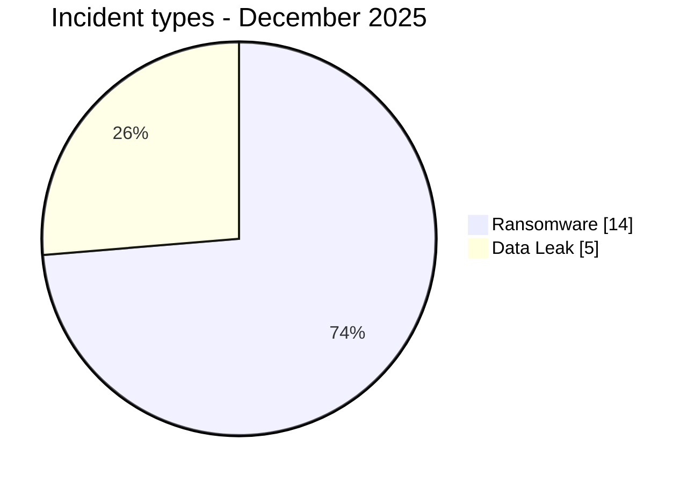
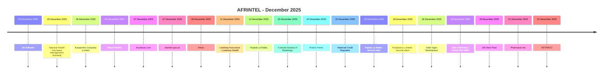

# AFRINTEL CTI Report - Cyber Threats in Africa - December 2025

👉🏾 [Version française](./README_FR.md)

   

## 1. Executive summary

In December 2025, AFRINTEL documents **19 cyber incidents** affecting organizations and digital services across **10 African countries**.

The landscape is dominated by **Ransomware with 14 records (73.7%)**, followed by **Data Leak with 5 (26.3%)**.

Geographic concentration is significant: **Egypt (6)**, **South Africa (3)**, and **Tunisia (3)** together account for **12 records, or 63.2% of the month**. This concentration reflects AFRINTEL corpus visibility rather than an exhaustive national compromise rate.

At sector level, the most represented normalized categories are **Finance / Banking (4)**, **Healthcare / Medical (3)**, **Government / Administration (2)**, **Education / University (2)** and **Manufacturing / Industry (2)**. The most frequent actor labels are `qilin` (3), `lockbit5` (3), `dragonforce` (2) and `nova` (2).

Evidence maturity remains variable: **13 records are `Claim - Unverified` and 6 are `Claim - Data Sample Published`**. AFRINTEL maintains a strict separation between observed facts, claims, corroboration, official confirmation, and technical unknowns.

Compared with November, monthly volume **increases by 4 records**. The most visible changes are Ransomware 10→14 (+4), Data Leak 4→5 (+1), and Defacement 1→0 (-1).

> **Reading note:** AFRINTEL figures describe documented incidents and the visibility of observed threats. They are not an exhaustive measurement of every cyberattack that actually occurred across Africa.

### 1.1 Month-over-month comparison

| Indicator | November 2025 | December 2025 | Change |
|---|---:|---:|---:|
| Total incidents | 15 | 19 | **+4 (+26.7%)** |
| Ransomware | 10 | 14 | **+4 (+40.0%)** |
| Data Leak | 4 | 5 | **+1 (+25.0%)** |
| Access Sale | 0 | 0 | **Stable** |
| DDoS | 0 | 0 | **Stable** |
| Defacement | 1 | 0 | **-1 (-100.0%)** |
| Account Takeover | 0 | 0 | **Stable** |
| System Intrusion | 0 | 0 | **Stable** |
| Malware | 0 | 0 | **Stable** |
| Operational Fraud | 0 | 0 | **Stable** |

## 2. Methodology

- **Scope:** 54 African countries; reference period: December 2025.
- **Source of truth:** validated `victims_FR.md` / `victims.md` pair.
- **Classification:** Ransomware, Data Leak, Access Sale, DDoS, Defacement, Account Takeover, System Intrusion, Malware, and Operational Fraud.
- **Counting:** one canonical record equals one documented cyber incident; cases under investigation remain outside statistics.
- **Timeline:** `Incident date` and `Initial publication date` remain separate.
- **Uncertain dates:** when no exact compromise day is known, the evidence-supported publication period is retained without inventing a technical intrusion date.
- **Evidence:** incident type, status, confidence, impact, and provenance remain separate dimensions.
- **Limitation:** frequencies reflect AFRINTEL visibility rather than every real compromise on the continent.

## 3. Overview and incident types

| Indicator | Value |
|---|---:|
| Documented incidents | **19** |
| Countries represented | **10** |
| Regions represented | **4** |
| Leading country | **Egypt (6)** |
| Leading normalized sector | **Finance / Banking (4)** |
| Leading actor labels | **qilin (3), lockbit5 (3)** |

| Incident type | Records | Share |
|---|---:|---:|
| Ransomware | 14 | 73.7% |
| Data Leak | 5 | 26.3% |
| Access Sale | 0 | 0.0% |
| DDoS | 0 | 0.0% |
| Defacement | 0 | 0.0% |
| Account Takeover | 0 | 0.0% |
| System Intrusion | 0 | 0.0% |
| Malware | 0 | 0.0% |
| Operational Fraud | 0 | 0.0% |
| **Total** | **19** | **100%** |

## 4. Geographic distribution

| Country | Total | Ransomware | Data Leak |
|---|---:|---:|---:|
| Egypt | **6** | 4 | 2 |
| South Africa | **3** | 3 | 0 |
| Tunisia | **3** | 3 | 0 |
| Zambia | **1** | 1 | 0 |
| Ghana | **1** | 1 | 0 |
| Nigeria | **1** | 1 | 0 |
| Zimbabwe | **1** | 1 | 0 |
| Algeria | **1** | 0 | 1 |
| Morocco | **1** | 0 | 1 |
| Kenya | **1** | 0 | 1 |
| **Total** | **19** | **14** | **5** |

## 5. Regional distribution

| Region | Records | Share |
|---|---:|---:|
| North Africa | 11 | 57.9% |
| Southern Africa | 5 | 26.3% |
| West Africa | 2 | 10.5% |
| East Africa | 1 | 5.3% |
| **Total** | **19** | **100%** |

The leading region is **North Africa with 11 records (57.9%)**.

## 6. Sector impact

| Normalized sector | Records | Share |
|---|---:|---:|
| Finance / Banking | 4 | 21.1% |
| Healthcare / Medical | 3 | 15.8% |
| Government / Administration | 2 | 10.5% |
| Education / University | 2 | 10.5% |
| Manufacturing / Industry | 2 | 10.5% |
| Technology / IT | 1 | 5.3% |
| Agriculture / Agribusiness | 1 | 5.3% |
| Not specified | 1 | 5.3% |
| Construction / Real Estate | 1 | 5.3% |
| Energy / Utilities | 1 | 5.3% |
| Retail / E-commerce | 1 | 5.3% |
| **Total** | **19** | **100%** |

## 7. Actors / groups

| Actor / Group | Records |
|---|---:|
| qilin | 3 |
| lockbit5 | 3 |
| dragonforce | 2 |
| nova | 2 |
| ransomhouse | 1 |
| kazu | 1 |
| devman | 1 |
| direwolf | 1 |
| Habibi | 1 |
| GhostVector | 1 |
| camillabf | 1 |
| KaruHunters | 1 |
| LindaBF | 1 |

## 8. Evidence maturity

| Evidence maturity | Records | Share |
|---|---:|---:|
| Claim - Unverified | 13 | 68.4% |
| Claim - Data Sample Published | 6 | 31.6% |
| **Total** | **19** | **100%** |

## 9. Timeline

## 10. Monthly CTI analysis

### Ransomware

**14 records** are classified as Ransomware. Leading countries are Egypt (4), South Africa (3), and Tunisia (3). A leak-site listing does not itself prove encryption or complete exfiltration.

### Data Leak

**5 records** are classified as Data Leak. Egypt has 2, while Algeria, Morocco, and Kenya have one each. The new Yalla Tager record is a **sample-backed claim**: the supplied material is structurally coherent with customer/merchant data, but the claimed 20,000-user volume, access vector, extraction date and full provenance remain unverified.

## 11. Notable incidents

| Country | Organization | Type | Status | Impact | Confidence |
|---|---|---|---|---|---|
| South Africa | National Credit Regulator (NCR) | Ransomware | Claim - Data Sample Published | Level 4 | High |
| Egypt | Yalla Tager Marketplace | Data Leak | Claim - Data Sample Published | Level 3 | Medium |
| Egypt | 100 Watt Plast | Data Leak | Claim - Data Sample Published | N/A | High |
| Morocco | Pharmacie.ma | Data Leak | Claim - Data Sample Published | N/A | N/A |
| Kenya | KETRACO | Data Leak | Claim - Data Sample Published | N/A | Medium |

## 12. Key findings and intelligence gaps

- **Geographic concentration:** Egypt accounts for 6 records (31.6%), followed by South Africa (3) and Tunisia (3).
- **Threat structure:** Ransomware remains the leading type with 14 records, followed by Data Leak (5).
- **Sectors:** Finance / Banking (4) and Healthcare / Medical (3) have the highest visibility; Retail / E-commerce gains one record through Yalla Tager.
- **Evidence:** 19 records remain claims, including 6 accompanied by published samples.
- **Yalla Tager:** the sample supports a customer/merchant-data exposure claim, but does not establish the date or method of compromise and does not validate the advertised 20,000-user total.

### Intelligence gaps

- initial-access vector often not public;
- exact technical compromise date sometimes unknown;
- claimed volumes rarely fully verifiable;
- technical attribution often limited to a publication handle or label;
- public remediation, root-cause, and DFIR conclusions remain limited.

## 13. Recommendations

### Organizations

- enforce phishing-resistant MFA on privileged accounts, email, administration consoles and seller/merchant back-office access;
- apply least privilege and monitor bulk exports of customer and merchant data;
- maintain tested backups and formalize data-breach response procedures;
- review exposed customer-support, marketplace, API and administrative interfaces.

### SOC and detection

- monitor abnormal authentication, role changes and privileged-account creation;
- detect mass database reads, unusual CSV exports, archive creation and large outbound transfers;
- correlate IAM, application, WAF, proxy, DNS, cloud and EDR telemetry;
- alert on abnormal access to customer/merchant datasets from new devices, locations or service accounts.

### CTI

- separate publication date, account/customer timestamps, extraction date and technical compromise date;
- keep actor-claimed volumes distinct from observed sample size;
- preserve FR/EN parity before deriving aggregate statistics.

## 14. Conclusion

**December 2025** contains **19 documented cyber incidents** across **10 African countries**: 14 Ransomware and 5 Data Leak. The addition of Yalla Tager increases Egypt to 6 records and raises the month’s sample-backed Data Leak component without changing the evidential requirement to distinguish observed data from claimed scope.

👉🏾 [See monthly victims](./victims.md)

**AFRINTEL** - TLP:CLEAR
