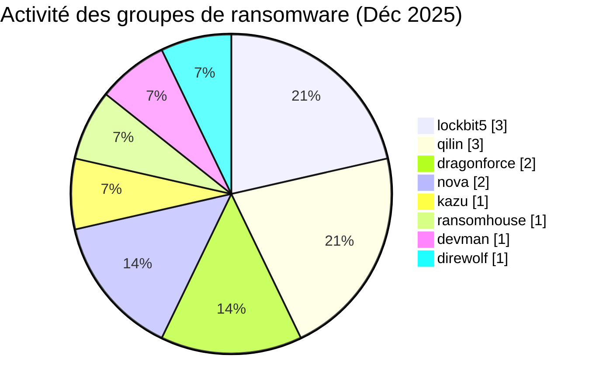
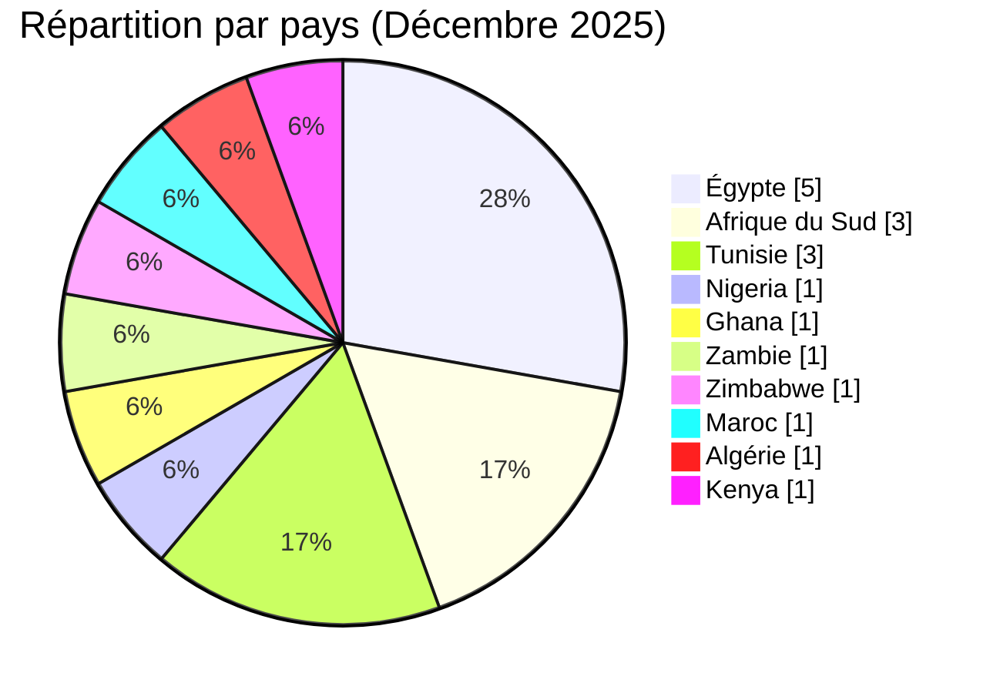
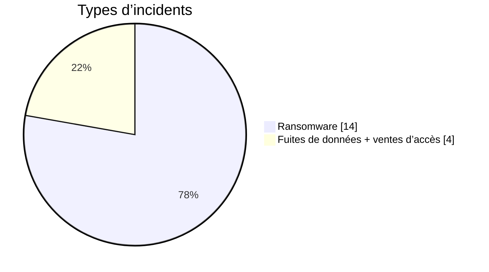
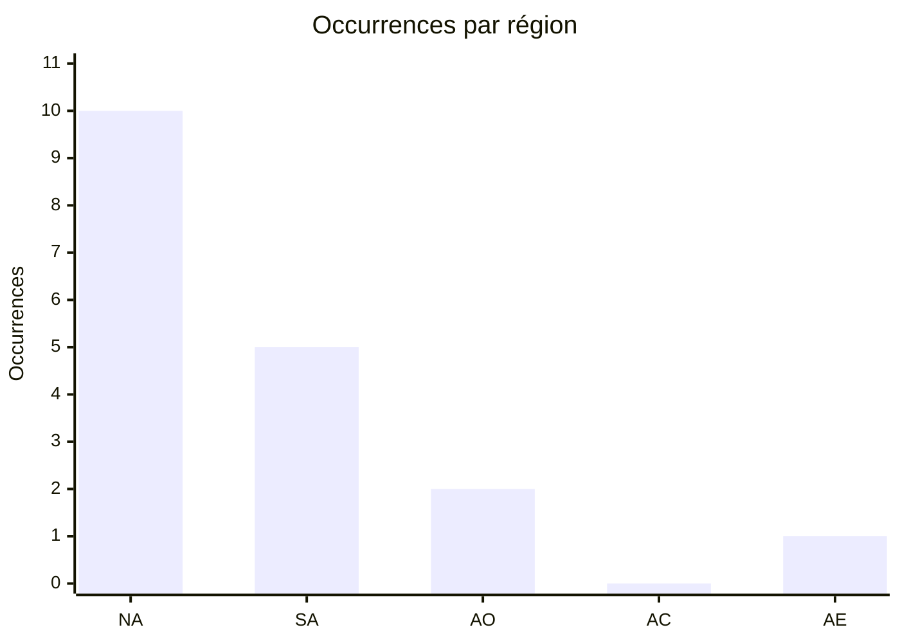

# Rapport CTI : Cyberattaques en Afrique - Décembre 2025 (18 victimes)

👉🏾 [**English version available here**](./README.md)

## 1. Résumé exécutif
Décembre 2025 marque une hausse de l'activité des ransomwares avec 14 victimes ransomware et 4 revendications de fuite de données non liées au ransomware, recensées dans 10 pays africains. Le mois est caractérisé par une concentration d'attaques en Égypte et en Afrique du Sud, un ciblage persistant du secteur de la santé, et une nouvelle revendication touchant le secteur de l'énergie/des infrastructures critiques au Kenya.

* **Nombre total d'attaques recensées** : 18
* **Acteurs les plus actifs** : `lockbit5` (3 attaques), `qilin` (3 attaques).
    * *Autres groupes ransomware actifs* : dragonforce (2), nova (2), kazu, ransomhouse, devman, direwolf (1 chacun).
    * *Revendications de fuite de données hors ransomware* : GhostVector, camillabf, KaruHunters, LindaBF (1 revendication chacun, non rattachée à un groupe ransomware nommé).
* **Secteurs les plus ciblés** : Santé (4), Finance/Leasing (2), Assurances (2), Administrations publiques (2), Industrie manufacturière (2).
* **Pays les plus touchés** : 🇪🇬 Égypte (5), 🇿🇦 Afrique du Sud (3), 🇹🇳 Tunisie (3), 🇲🇦 Maroc (1), 🇰🇪 Kenya (1).
* **Incident notable** : Double cyberattaque sur l'**Hôpital La Rabta** (Tunisie) par deux groupes différents (devman et qilin) en l'espace de deux semaines.

---

## 2. Méthodologie
Ce rapport de **Cyber Threat Intelligence (CTI)** présente une analyse détaillée des cyberattaques survenues en Afrique durant le mois de décembre 2025. Les informations sont issues de sources **OSINT** et de sites de fuites de groupes ransomware, compilées dans le cadre du projet **AFRINTEL**. L'objectif est de fournir une vision claire des tendances et des acteurs menaçants sur le continent.

---

## 3. Vue d'ensemble

### 3.1 Répartition par groupe ransomware
| Groupe / Acteur | Nombre d'attaques |
| :--- | :---: |
| **lockbit5** | 3 |
| **qilin** | 3 |
| **dragonforce** | 2 |
| **nova** | 2 |
| **kazu** | 1 |
| **ransomhouse** | 1 |
| **devman** | 1 |
| **direwolf** | 1 |
| **Total** | **14** |

### 3.1b Revendications de fuite de données hors ransomware
| Acteur | Victime | Pays |
| :--- | :--- | :---: |
| **GhostVector** | Oran University 1 Ahmed Ben Bella | 🇩🇿 Algérie |
| **camillabf** | 100 Watt Plast | 🇪🇬 Égypte |
| **KaruHunters** | Pharmacie.ma | 🇲🇦 Maroc |
| **LindaBF** | KETRACO | 🇰🇪 Kenya |
| **Total** | | **4** |

### 3.2 Répartition par secteur d'activité
| Secteur | Nombre d'attaques |
| :--- | :---: |
| 🏥 Santé | 4 |
| 💰 Finance / Leasing | 2 |
| 🛡️ Assurances | 2 |
| 🏛️ Administration publique | 2 |
| 🏭 Industrie manufacturière | 2 |
| 💻 Technologies | 1 |
| 🚚 Logistique / Automobile | 1 |
| 🏗️ Immobilier / Industrie | 1 |
| 🌾 Agroalimentaire | 1 |
| 🎓 Éducation | 1 |
| ⚡ Énergie | 1 |
| **Total** | **18** |

### 3.3 Répartition par pays
| Pays | Nombre d'attaques |
| :--- | :---: |
| 🇪🇬 Égypte | 5 |
| 🇿🇦 Afrique du Sud | 3 |
| 🇹🇳 Tunisie | 3 |
| 🇳🇬 Nigeria | 1 |
| 🇬🇭 Ghana | 1 |
| 🇿🇲 Zambie | 1 |
| 🇿🇼 Zimbabwe | 1 |
| 🇲🇦 Maroc | 1 |
| 🇩🇿 Algérie | 1 |
| 🇰🇪 Kenya | 1 |
| **Total** | **18** |

---

<!-- AFRINTEL_CURRENT_MODEL_START -->
### 3.4 Vue globale standardisée

| Pays | Ransomware | Exposition des données (fuites + accès) | Total | Distribution |
| :--- | ---: | ---: | ---: | :--- |
| 🇪🇬 Égypte | 4 | 1 | 5 | 🟧🟧🟧🟧 🟦 |
| 🇿🇦 Afrique du Sud | 3 | 0 | 3 | 🟧🟧🟧 |
| 🇹🇳 Tunisie | 3 | 0 | 3 | 🟧🟧🟧 |
| 🇩🇿 Algérie | 0 | 1 | 1 |  🟦 |
| 🇬🇭 Ghana | 1 | 0 | 1 | 🟧 |
| 🇰🇪 Kenya | 0 | 1 | 1 |  🟦 |
| 🇲🇦 Maroc | 0 | 1 | 1 |  🟦 |
| 🇳🇬 Nigeria | 1 | 0 | 1 | 🟧 |
| 🇿🇲 Zambie | 1 | 0 | 1 | 🟧 |
| 🇿🇼 Zimbabwe | 1 | 0 | 1 | 🟧 |

### Vue agrégée mensuelle de l’exposition

La vue CTI mensuelle regroupe les fuites de données et les ventes d’accès sous **exposition des données** : **4 fiches** (22,2% du corpus mensuel). Les fiches sources restent la référence ; une vente d’accès ne prouve pas à elle seule l’exfiltration de données.

### Répartition géographique par région

| Région | Occurrences | Ransomware | Exposition des données (fuites + accès) | Distribution |
| :--- | ---: | ---: | ---: | :--- |
| Afrique du Nord | 10 | 7 | 3 | 🟧🟧🟧🟧🟧🟧🟧 🟦🟦🟦 |
| Afrique australe | 5 | 5 | 0 | 🟧🟧🟧🟧🟧 |
| Afrique de l’Ouest | 2 | 2 | 0 | 🟧🟧 |
| Afrique centrale | 0 | 0 | 0 |  |
| Afrique de l’Est | 1 | 0 | 1 |  🟦 |

Légende : NA = Afrique du Nord ; SA = Afrique australe ; AO = Afrique de l’Ouest ; AC = Afrique centrale ; AE = Afrique de l’Est

### Répartition sectorielle

| Secteur | Fiches | Part | Activité |
| :--- | ---: | ---: | :--- |
| Finance / banque | 4 | 22,2% | ██████████ |
| Gouvernement / administration | 3 | 16,7% | ████████ |
| Santé / médical | 3 | 16,7% | ████████ |
| Éducation / universités | 2 | 11,1% | █████ |
| Technologies / informatique | 2 | 11,1% | █████ |
| Agriculture / agro-industrie | 1 | 5,6% | ██ |
| Énergie / services publics | 1 | 5,6% | ██ |
| Industrie / fabrication | 1 | 5,6% | ██ |
| Transport / logistique | 1 | 5,6% | ██ |

### Acteurs / groupes les plus présents

| Acteur / Groupe | Fiches | Activité |
| :--- | ---: | :--- |
| lockbit5 | 3 | ██████████ |
| qilin | 3 | ██████████ |
| dragonforce | 2 | ███████ |
| nova | 2 | ███████ |
| GhostVector (source account) | 1 | ███ |
| KaruHunters | 1 | ███ |
| LindaBF, post published on a cybercriminal forum (RaidForums) | 1 | ███ |
| camillabf, post published on a cybercriminal forum (RaidForums) | 1 | ███ |
| devman | 1 | ███ |
| direwolf | 1 | ███ |
<!-- AFRINTEL_CURRENT_MODEL_END -->

### Comparaison avec le mois précédent

À partir des fiches incidents validées comme source de comptage, décembre 2025 compte **18** incidents contre **14** le mois précédent (une hausse de **+4** ; **+28.6%**). Cette comparaison décrit les publications enregistrées par AFRINTEL et ne prouve pas à elle seule une évolution de l'activité des attaquants ni un impact confirmé sur les victimes.

| Indicateur | Mois précédent | Mois en cours | Variation |
|---|---:|---:|---:|
| Fiches incidents enregistrées | 14 | 18 | +4 (+28.6%) |

## 4. Analyse détaillée par type d'incident

## 5. Impact sectoriel
* **Santé (4)** : Forte vulnérabilité en Tunisie avec trois incidents majeurs touchant des CHU et des associations médicales, ainsi qu'une revendication de fuite de données touchant une plateforme marocaine de e-commerce pharmaceutique.
* **Administration Publique (2)** : Ciblage d'organismes de régulation critiques (NCR en Afrique du Sud) et de municipalités locales (Elundini).
* **Assurance & Finance (4)** : Focus continu sur les secteurs à forte valeur ajoutée au Nigeria, en Égypte et en Zambie.
* **Industrie manufacturière (2)** : Attaque ransomware contre un fabricant zimbabwéen de plastiques, ainsi qu'une revendication distincte de fuite de données contre un fabricant égyptien de produits électriques et plastiques (100 Watt Plast).
* **Éducation (1)** : Une revendication de fuite de données contre une université publique algérienne (Oran University 1), annonçant un jeu de données daté de 2023 d'environ 58 000 enregistrements d'étudiants/personnel.
* **Énergie (1)** : Une nouvelle revendication de fuite de données contre l'opérateur national kényan de transport d'électricité (KETRACO), premier cas lié aux infrastructures critiques/énergie recensé ce mois-ci.

---

## 6. Profil des acteurs
### 6.1 Profil des acteurs

Les comptages d'acteurs et de sources restent ceux documentés en section 3 et dans les fiches victimes sources. L'attribution est conservée uniquement au niveau étayé par les éléments publics.

### 6.2 Évaluation du risque

Les pays et secteurs présentant plusieurs fiches ou des fonctions publiques, éducatives, sanitaires, financières ou critiques doivent faire l'objet d'une validation prioritaire. Il s'agit d'un signal de priorisation OSINT, et non d'une confirmation de compromission ou d'impact.

* **🇪🇬 Égypte** : Reste la cible principale pour le deuxième mois consécutif avec **5 victimes**, entre attaques ransomware (technologie, finance, industrie) et une revendication de fuite de données supplémentaire (100 Watt Plast).
* **🇿🇦 Afrique du Sud** : Hausse significative avec **3 victimes**, incluant un régulateur financier national.
* **🇹🇳 Tunisie** : Émergence comme zone à risque pour les infrastructures de santé avec **3 attaques** en décembre.
* **🇲🇦 Maroc** : Une revendication de fuite de données (Pharmacie.ma, acteur KaruHunters), ajoutant une dimension santé distincte de l'activité ransomware du mois.
* **🇩🇿 Algérie** : Une revendication de fuite de données contre une université publique (Oran University 1, acteur GhostVector).
* **🇰🇪 Kenya** : Une nouvelle revendication de fuite de données contre l'opérateur national de transport d'électricité (KETRACO, acteur LindaBF) ; l'échantillon présente des incohérences internes (une valeur de mot de passe répétée) qui ramènent le niveau de confiance à moyen.

---

## 7. Tendances et lacunes de renseignement
### 7.1 Tendances observées

Les répartitions par pays, secteur, acteur et type d'incident présentées ci-dessus constituent les tendances traçables du mois. Elles décrivent le corpus surveillé et n'établissent pas une campagne plus large sans éléments indépendants.

### 7.2 Lacunes de renseignement

Les rapports disponibles ne permettent pas d'établir pour chaque revendication le vecteur d'accès initial, l'exfiltration complète, la confirmation par la victime, la chronologie de remédiation ou l'impact opérationnel. Aucun détail DFIR public n'est inclus dans le corpus consulté pour cette fiche mensuelle ; cette absence est limitée aux sources examinées.

## 8. Cartographie MITRE ATT&CK (contextuelle)
| Phase | ID technique | Nom | Association à l'incident |
|---|---|---|---|
| Collecte | T1005 | Data from Local System | Correspondance contextuelle pour une collecte ou exposition revendiquée ; la méthode n'est pas confirmée. |
| Collecte | T1213 | Data from Information Repositories | Correspondance contextuelle pour les dossiers ou référentiels décrits publiquement ; la méthode n'est pas confirmée. |

Ces correspondances ATT&CK sont contextuelles et défensives. Elles ne prouvent pas qu'un acteur donné a utilisé la technique.

### Contextual observations

* **Extorsion à étapes multiples** : Les groupes comme **Lockbit5** et **Qilin** maintiennent la méthode "Revendication & Divulgation" (Double Extorsion) pour maximiser la pression psychologique et financière sur les victimes.
* **Phénomène de Re-victimisation (double revendication)** : 
    * Le cas de l'**Hôpital La Rabta** (Tunisie) est critique : ciblé par le groupe **devman** le 12/12, puis par **qilin** le 26/12. Cela démontre que plusieurs acteurs peuvent exploiter les mêmes vulnérabilités non corrigées ou se revendre des accès via des *Initial Access Brokers* (IABs).
    * **Proplastics Limited** (Zimbabwe) a également subi une seconde attaque par **lockbit5**, illustrant la persistance des acteurs tant que les vecteurs d'entrée initiaux ne sont pas totalement neutralisés.
* **Ciblage des infrastructures de services essentiels** : On observe un focus marqué sur les organismes de régulation (NCR en Afrique du Sud) et les systèmes de gestion de santé (NHIMA en Zambie), visant l'exfiltration massive de données personnelles (PII).

---

## 9. Recommandations
1.  **Secteur de la santé** : Audit urgent des systèmes exposés et mise en place de sauvegardes hors-ligne.
2.  **Secteur public** : Durcissement des portails administratifs et des systèmes de régulation financière.
3.  **Industrie** : Protection des données de la chaîne d'approvisionnement, particulièrement pour les partenaires de marques mondiales.

---

## 10. Recommandations SOC et tactiques
### Observé

Les sources publiques documentent des revendications, des publications ou du matériel exposé. Elles ne fournissent pas à elles seules une télémétrie prouvant une technique ou une compromission active.

### Hypothèses

L'abus d'identifiants, un stockage exposé, des contrôles d'accès faibles ou des privilèges d'export excessifs peuvent expliquer certaines expositions, mais chaque hypothèse doit être vérifiée par l'organisation concernée.

### Préventif

Surveiller les journaux d'identité, VPN, cloud, bases de données, messagerie et transferts sortants. Imposer une MFA résistante au phishing, le moindre privilège, la segmentation, des sauvegardes testées et la révocation rapide des jetons ou identifiants.

## 11. Recommandations stratégiques
1. **Risques observés :** prioriser la validation des organisations, secteurs et types de données documentés dans le corpus mensuel.
2. **Hypothèses :** tester les chemins possibles liés aux identifiants, au stockage cloud et aux exports excessifs sans les présenter comme des faits établis.
3. **Socle préventif :** maintenir l'inventaire des actifs, la classification des données, les exercices de réponse, les plans de reprise et les procédures coordonnées de sécurité, de droit et de protection des données.

## 12. Conclusion
Décembre 2025 témoigne d'une intensification de l'impact des ransomwares en Afrique du Nord et australe, aux côtés de quatre revendications indépendantes de fuite de données hors ransomware couvrant l'éducation (Algérie), l'industrie manufacturière (Égypte), la santé (Maroc) et, pour la première fois ce mois-ci, l'énergie/les infrastructures critiques (Kenya). La diversification des acteurs (8 groupes ransomware nommés et quatre acteurs distincts de revendication) et la répétition des attaques contre des institutions de santé indiquent que les attaquants privilégient des cibles où l'arrêt d'activité est critique, tandis que la revendication KETRACO confirme un intérêt persistant pour les opérateurs africains d'infrastructures critiques, même lorsque les données exposées restent limitées.

---

### ✍🏿 Auteur
**Adama ASSIONGBON** *Consultant SOC & Cyber Threat Intelligence*

**AFRINTEL** - *Initiative ouverte de veille CTI sur l’Afrique*
