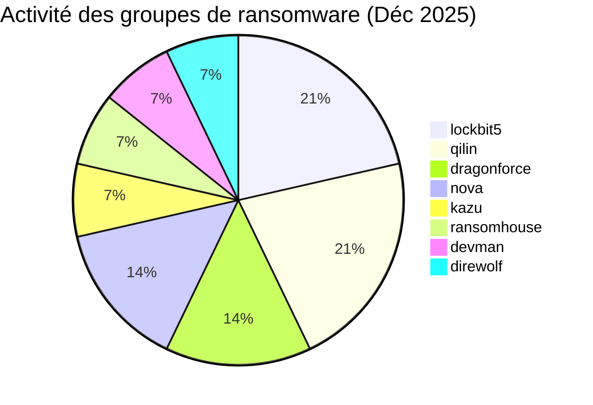
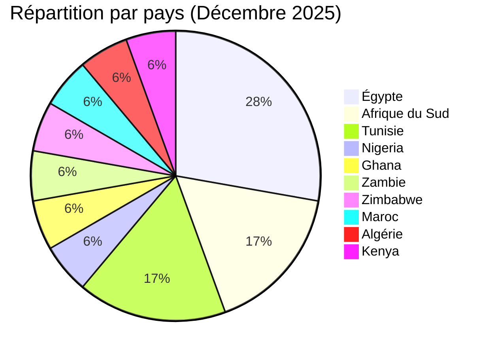
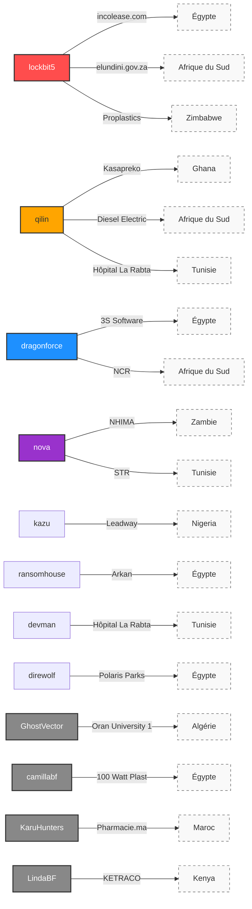

# Rapport CTI : Cyberattaques en Afrique - Décembre 2025 (18 victimes)

👉🏾 [**English version available here**](./README.md)

## 1. Introduction
Ce rapport de **Cyber Threat Intelligence (CTI)** présente une analyse détaillée des cyberattaques survenues en Afrique durant le mois de décembre 2025. Les informations sont issues de sources **OSINT** et de sites de fuites de groupes ransomware, compilées dans le cadre du projet **AFRINTEL**. L'objectif est de fournir une vision claire des tendances et des acteurs menaçants sur le continent.

---

## 2. Résumé exécutif
Décembre 2025 marque une hausse de l'activité des ransomwares avec 14 victimes ransomware et 4 revendications de fuite de données non liées au ransomware, recensées dans 10 pays africains. Le mois est caractérisé par une concentration d'attaques en Égypte et en Afrique du Sud, un ciblage persistant du secteur de la santé, et une nouvelle revendication touchant le secteur de l'énergie/des infrastructures critiques au Kenya.

* **Nombre total d'attaques recensées** : 18
* **Acteurs les plus actifs** : `lockbit5` (3 attaques), `qilin` (3 attaques).
    * *Autres groupes ransomware actifs* : dragonforce (2), nova (2), kazu, ransomhouse, devman, direwolf (1 chacun).
    * *Revendications de fuite de données hors ransomware* : GhostVector, camillabf, KaruHunters, LindaBF (1 revendication chacun, non rattachée à un groupe ransomware nommé).
* **Secteurs les plus ciblés** : Santé (4), Finance/Leasing (2), Assurances (2), Administrations publiques (2), Industrie manufacturière (2).
* **Pays les plus touchés** : 🇪🇬 Égypte (5), 🇿🇦 Afrique du Sud (3), 🇹🇳 Tunisie (3), 🇲🇦 Maroc (1), 🇰🇪 Kenya (1).
* **Incident notable** : Double cyberattaque sur l'**Hôpital La Rabta** (Tunisie) par deux groupes différents (devman et qilin) en l'espace de deux semaines.

---

## 3. Statistiques clés

### 3.1 Répartition par groupe ransomware
| Groupe / Acteur | Nombre d'attaques |
| :--- | :---: |
| **lockbit5** | 3 |
| **qilin** | 3 |
| **dragonforce** | 2 |
| **nova** | 2 |
| **kazu** | 1 |
| **ransomhouse** | 1 |
| **devman** | 1 |
| **direwolf** | 1 |
| **Total** | **14** |

### 3.1b Revendications de fuite de données hors ransomware
| Acteur | Victime | Pays |
| :--- | :--- | :---: |
| **GhostVector** | Oran University 1 Ahmed Ben Bella | 🇩🇿 Algérie |
| **camillabf** | 100 Watt Plast | 🇪🇬 Égypte |
| **KaruHunters** | Pharmacie.ma | 🇲🇦 Maroc |
| **LindaBF** | KETRACO | 🇰🇪 Kenya |
| **Total** | | **4** |

### 3.2 Répartition par secteur d'activité
| Secteur | Nombre d'attaques |
| :--- | :---: |
| 🏥 Santé | 4 |
| 💰 Finance / Leasing | 2 |
| 🛡️ Assurances | 2 |
| 🏛️ Administration publique | 2 |
| 🏭 Industrie manufacturière | 2 |
| 💻 Technologies | 1 |
| 🚚 Logistique / Automobile | 1 |
| 🏗️ Immobilier / Industrie | 1 |
| 🌾 Agroalimentaire | 1 |
| 🎓 Éducation | 1 |
| ⚡ Énergie | 1 |
| **Total** | **18** |

### 3.3 Répartition par pays
| Pays | Nombre d'attaques |
| :--- | :---: |
| 🇪🇬 Égypte | 5 |
| 🇿🇦 Afrique du Sud | 3 |
| 🇹🇳 Tunisie | 3 |
| 🇳🇬 Nigeria | 1 |
| 🇬🇭 Ghana | 1 |
| 🇿🇲 Zambie | 1 |
| 🇿🇼 Zimbabwe | 1 |
| 🇲🇦 Maroc | 1 |
| 🇩🇿 Algérie | 1 |
| 🇰🇪 Kenya | 1 |
| **Total** | **18** |

---

## 4. Détail des attaques par groupe ransomware

### 4.1 lockbit5 (3 attaques)
* **07/12/2025** : **incolease.com** (Égypte, Finance) - Revendication & divulgation.
* **07/12/2025** : **elundini.gov.za** (Afrique du Sud, Admin publique) - Revendication & divulgation.
* **26/12/2025** : **Proplastics Limited** (Zimbabwe, Industrie manufacturière) - Revendication & divulgation.

### 4.2 qilin (3 attaques)
* **06/12/2025** : **Kasapreko Company Limited** (Ghana, Agroalimentaire) - Revendication & divulgation.
* **06/12/2025** : **Diesel Electric** (Afrique du Sud, Automobile/Logistique) - Revendication & divulgation.
* **26/12/2025** : **Hôpital La Rabta** (Tunisie, Santé) - Deuxième attaque enregistrée.

### 4.3 dragonforce (2 attaques)
* **05/12/2025** : **3S Software** (Égypte, Technologies) - Revendication & divulgation.
* **24/12/2025** : **National Credit Regulator (NCR)** (Afrique du Sud, Admin publique/Régulation financière) - Revendication & divulgation.

### 4.4 nova (2 attaques)
* **05/12/2025** : **National Health Insurance Management Authority (NHIMA)** (Zambie, Assurances) - Revendication & divulgation.
* **15/12/2025** : **Société Tunisienne de Radiologie (STR)** (Tunisie, Santé/Éducation) - Revendication & divulgation.

### 4.5 Autres groupes (1 attaque chacun)
* **kazu** (11/12/2025) : **Leadway Assurance / Health** (Nigeria, Assurances) - Revendication & divulgation.
* **ransomhouse** (08/12/2025) : **Arkan** (Égypte, Finance/Commerce) - Revendication & divulgation.
* **devman** (12/12/2025) : **Hôpital La Rabta** (Tunisie, Santé) - Première attaque enregistrée.
* **direwolf** (22/12/2025) : **Polaris Parks** (Égypte, Immobilier/Industrie) - Revendication & divulgation.

### 4.6 Revendications de fuite de données hors ransomware (4 attaques)
* **29/12/2025** : **Oran University 1 Ahmed Ben Bella** (Algérie, Éducation) - Claim - Data Sample Published, acteur GhostVector. Une publication annonce une base datée de 2023 avec environ 58 000 enregistrements (noms, dates de naissance, téléphones, genre, emails, empreintes de mot de passe, nationalité).
* **29/12/2025** : **100 Watt Plast** (Égypte, Industrie/Fabrication) - Claim - Data Sample Published, acteur camillabf. Un jeu de données revendiqué de 180 000 enregistrements (nom, email, téléphone, mot de passe), avec une vingtaine d'enregistrements complets directement visibles dans l'échantillon.
* **31/12/2025** : **Pharmacie.ma** (Maroc, Santé/E-commerce pharmaceutique) - Claim - Data Sample Published, acteur KaruHunters. Deux sauvegardes complètes de base de données examinées, couvrant jusqu'à environ 27 900 comptes professionnels enregistrés (pharmaciens, médecins, personnel officinal et étudiants).
* **31/12/2025** : **Kenya Electricity Transmission Company (KETRACO)** (Kenya, Énergie/Infrastructure critique) - Claim - Data Sample Published, acteur LindaBF. L'échantillon montre une liste d'utilisateurs newsletter/annuaire (noms, emails, dates de création de compte) ; une valeur de mot de passe répétée dans plusieurs enregistrements ramène le niveau de confiance à moyen.

### 4.7 Graphe acteur → victime → pays

---

## 5. Analyse sectorielle
* **Santé (4)** : Forte vulnérabilité en Tunisie avec trois incidents majeurs touchant des CHU et des associations médicales, ainsi qu'une revendication de fuite de données touchant une plateforme marocaine de e-commerce pharmaceutique.
* **Administration Publique (2)** : Ciblage d'organismes de régulation critiques (NCR en Afrique du Sud) et de municipalités locales (Elundini).
* **Assurance & Finance (4)** : Focus continu sur les secteurs à forte valeur ajoutée au Nigeria, en Égypte et en Zambie.
* **Industrie manufacturière (2)** : Attaque ransomware contre un fabricant zimbabwéen de plastiques, ainsi qu'une revendication distincte de fuite de données contre un fabricant égyptien de produits électriques et plastiques (100 Watt Plast).
* **Éducation (1)** : Une revendication de fuite de données contre une université publique algérienne (Oran University 1), annonçant un jeu de données daté de 2023 d'environ 58 000 enregistrements d'étudiants/personnel.
* **Énergie (1)** : Une nouvelle revendication de fuite de données contre l'opérateur national kényan de transport d'électricité (KETRACO), premier cas lié aux infrastructures critiques/énergie recensé ce mois-ci.

---

## 6. Analyse géographique
* **🇪🇬 Égypte** : Reste la cible principale pour le deuxième mois consécutif avec **5 victimes**, entre attaques ransomware (technologie, finance, industrie) et une revendication de fuite de données supplémentaire (100 Watt Plast).
* **🇿🇦 Afrique du Sud** : Hausse significative avec **3 victimes**, incluant un régulateur financier national.
* **🇹🇳 Tunisie** : Émergence comme zone à risque pour les infrastructures de santé avec **3 attaques** en décembre.
* **🇲🇦 Maroc** : Une revendication de fuite de données (Pharmacie.ma, acteur KaruHunters), ajoutant une dimension santé distincte de l'activité ransomware du mois.
* **🇩🇿 Algérie** : Une revendication de fuite de données contre une université publique (Oran University 1, acteur GhostVector).
* **🇰🇪 Kenya** : Une nouvelle revendication de fuite de données contre l'opérateur national de transport d'électricité (KETRACO, acteur LindaBF) ; l'échantillon présente des incohérences internes (une valeur de mot de passe répétée) qui ramènent le niveau de confiance à moyen.

---

## 7. TTPs observées (Tactics, Techniques & Procedures)

* **Extorsion à étapes multiples** : Les groupes comme **Lockbit5** et **Qilin** maintiennent la méthode "Revendication & Divulgation" (Double Extorsion) pour maximiser la pression psychologique et financière sur les victimes.
* **Phénomène de Re-victimisation (double revendication)** : 
    * Le cas de l'**Hôpital La Rabta** (Tunisie) est critique : ciblé par le groupe **devman** le 12/12, puis par **qilin** le 26/12. Cela démontre que plusieurs acteurs peuvent exploiter les mêmes vulnérabilités non corrigées ou se revendre des accès via des *Initial Access Brokers* (IABs).
    * **Proplastics Limited** (Zimbabwe) a également subi une seconde attaque par **lockbit5**, illustrant la persistance des acteurs tant que les vecteurs d'entrée initiaux ne sont pas totalement neutralisés.
* **Ciblage des infrastructures de services essentiels** : On observe un focus marqué sur les organismes de régulation (NCR en Afrique du Sud) et les systèmes de gestion de santé (NHIMA en Zambie), visant l'exfiltration massive de données personnelles (PII).

---

## 8. Recommandations
1.  **Secteur de la santé** : Audit urgent des systèmes exposés et mise en place de sauvegardes hors-ligne.
2.  **Secteur public** : Durcissement des portails administratifs et des systèmes de régulation financière.
3.  **Industrie** : Protection des données de la chaîne d'approvisionnement, particulièrement pour les partenaires de marques mondiales.

---

## 9. Conclusion
Décembre 2025 témoigne d'une intensification de l'impact des ransomwares en Afrique du Nord et australe, aux côtés de quatre revendications indépendantes de fuite de données hors ransomware couvrant l'éducation (Algérie), l'industrie manufacturière (Égypte), la santé (Maroc) et, pour la première fois ce mois-ci, l'énergie/les infrastructures critiques (Kenya). La diversification des acteurs (8 groupes ransomware nommés et quatre acteurs distincts de revendication) et la répétition des attaques contre des institutions de santé indiquent que les attaquants privilégient des cibles où l'arrêt d'activité est critique, tandis que la revendication KETRACO confirme un intérêt persistant pour les opérateurs africains d'infrastructures critiques, même lorsque les données exposées restent limitées.

---

### ✍🏿 Auteur
**Adama ASSIONGBON** *Consultant SOC & Cyber Threat Intelligence*

**AFRINTEL** - *Initiative ouverte de veille CTI sur l’Afrique*
